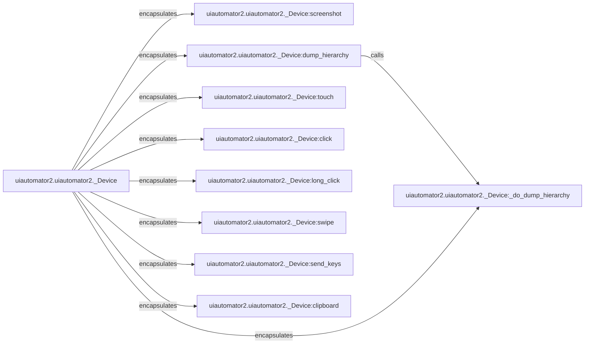

## Component Details

The Device Interaction API provides a simplified interface for interacting with an Android device, abstracting away the complexities of the underlying UI Automator service. It offers methods for performing common actions such as clicking, swiping, sending keys, and taking screenshots, enabling developers to easily create automation scripts and tests. The core component is the `_Device` class, which encapsulates all the interaction methods. These methods internally communicate with the UI Automator service to execute the desired actions on the device.

### uiautomator2.uiautomator2._Device
The central class providing an interface for interacting with the Android device. It encapsulates methods for performing various actions such as taking screenshots, dumping UI hierarchy, simulating touch events, sending keys, and managing clipboard content.
- **Related Classes/Methods**: `uiautomator2.uiautomator2._Device`

### uiautomator2.uiautomator2._Device:screenshot
Takes a screenshot of the device's current display and returns it as a PIL image.
- **Related Classes/Methods**: `uiautomator2.uiautomator2._Device:screenshot`

### uiautomator2.uiautomator2._Device:dump_hierarchy
Dumps the UI hierarchy of the current screen as an XML file. It retrieves the UI hierarchy from the device and saves it to a file or returns it as a string.
- **Related Classes/Methods**: `uiautomator2.uiautomator2._Device:dump_hierarchy`

### uiautomator2.uiautomator2._Device:_do_dump_hierarchy
Helper function for dump_hierarchy. It handles the actual communication with the UI Automator service to retrieve the UI hierarchy.
- **Related Classes/Methods**: `uiautomator2.uiautomator2._Device:_do_dump_hierarchy`

### uiautomator2.uiautomator2._Device:touch
Performs a touch event at a specific location on the screen. It simulates a single touch action at the given coordinates.
- **Related Classes/Methods**: `uiautomator2.uiautomator2._Device:touch`

### uiautomator2.uiautomator2._Device:click
Performs a click event at a specific location on the screen. It simulates a click action at the given coordinates.
- **Related Classes/Methods**: `uiautomator2.uiautomator2._Device:click`

### uiautomator2.uiautomator2._Device:long_click
Performs a long click event at a specific location on the screen. It simulates a long click action at the given coordinates.
- **Related Classes/Methods**: `uiautomator2.uiautomator2._Device:long_click`

### uiautomator2.uiautomator2._Device:swipe
Performs a swipe gesture between two points on the screen. It simulates a swipe action from one coordinate to another.
- **Related Classes/Methods**: `uiautomator2.uiautomator2._Device:swipe`

### uiautomator2.uiautomator2._Device:send_keys
Sends a sequence of key events to the device. It simulates typing text on the device.
- **Related Classes/Methods**: `uiautomator2.uiautomator2._Device:send_keys`

### uiautomator2.uiautomator2._Device:clipboard
Gets or sets the clipboard content of the device. It allows reading and writing data to the device's clipboard.
- **Related Classes/Methods**: `uiautomator2.uiautomator2._Device:clipboard`
