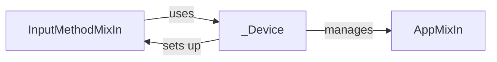

## Component Details

The Device Management & Control component in uiautomator2 provides functionalities for managing and controlling an Android device's software environment. It encompasses application management (installing, uninstalling, starting, and stopping apps) and input method management (setting the current IME and sending text input). The central flow involves the `_Device` class, which integrates `AppMixIn` and `InputMethodMixIn` to offer a unified interface for interacting with the device. Users can control the device's software configuration and behavior through this component.

### AppMixIn
Provides methods for managing applications on the Android device. This includes installing, uninstalling, starting, stopping, and listing applications. It interacts with the device to perform these operations.
- **Related Classes/Methods**: `uiautomator2.uiautomator2._AppMixIn`

### InputMethodMixIn
Provides methods for managing input methods (IMEs) on the Android device. This includes setting the current IME and sending keys. It interacts with the device to control text input.
- **Related Classes/Methods**: `uiautomator2.uiautomator2._input.InputMethodMixIn`

### _Device
Represents the Android device and integrates the functionalities of AppMixIn and InputMethodMixIn. It provides a unified interface for interacting with the device, combining application and input method management.
- **Related Classes/Methods**: `uiautomator2.uiautomator2._Device`
