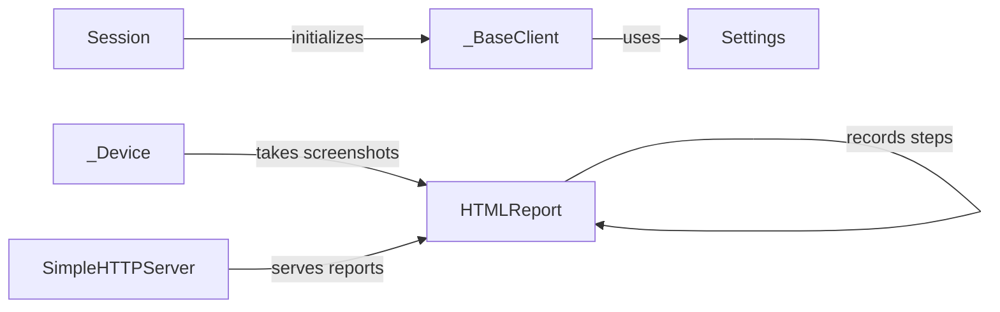

## Component Details

The Reporting & Configuration Management subsystem in uiautomator2 provides functionalities for generating HTML reports of test executions and managing the library's settings. The HTMLReport component creates detailed reports with screenshots, while the Settings component allows users to customize the library's behavior. These components interact with the device through the _Device and _BaseClient components, which handle communication and device interactions. The Session component initializes the connection and sets up the environment. The SimpleHTTPServer serves the generated reports for easy access.

### HTMLReport
The HTMLReport class is responsible for generating HTML reports of UI automation test runs. It records screenshots and adds steps to the report, and it can patch and unpatch click events to track user interactions. It uses a simple HTTP server to serve the generated report.
- **Related Classes/Methods**: `uiautomator2.uiautomator2.ext.htmlreport.HTMLReport`

### Settings
The Settings class manages settings for the uiautomator2 library. It allows setting and getting configuration options, providing a way to customize the library's behavior.
- **Related Classes/Methods**: `uiautomator2.uiautomator2.settings.Settings`

### _BaseClient
The _BaseClient class serves as a base class for client-side interactions with the uiautomator2 server. It provides access to settings and handles communication with the device.
- **Related Classes/Methods**: `uiautomator2.uiautomator2._BaseClient`

### _Device
The _Device class represents the Android device being automated. It provides methods for interacting with the device, including taking screenshots, which are used by the HTMLReport component.
- **Related Classes/Methods**: `uiautomator2.uiautomator2._Device`

### Session
The Session class manages a UI automation session. It likely initializes the connection to the device and sets up the environment for running tests. It initializes _BaseClient.
- **Related Classes/Methods**: `uiautomator2.uiautomator2.Session`

### SimpleHTTPServer
The SimpleHTTPServer module provides a simple HTTP server for serving the generated HTML report, allowing users to easily view the test results.
- **Related Classes/Methods**: `uiautomator2.ext.htmlreport.assets.simplehttpserver`
