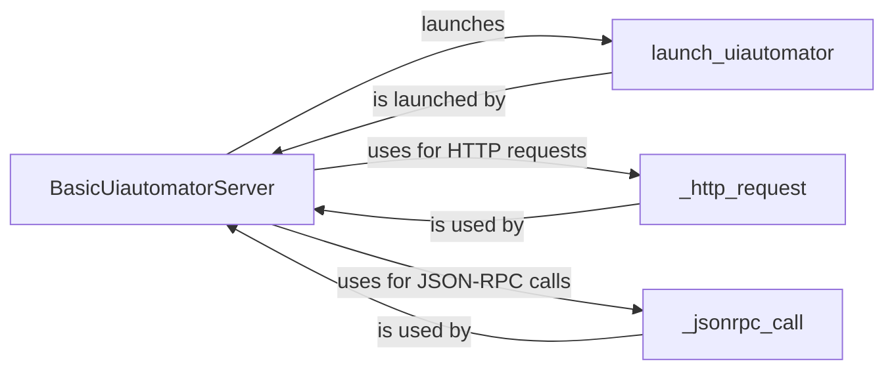

## Component Details

The UI Automation Core component is responsible for managing the UI Automator service on an Android device. It handles the lifecycle of the service, including installation, startup, and shutdown. It also provides the functionality to send commands to the UI Automator service via JSON-RPC and receive responses, enabling automated interaction with the Android UI. The core component acts as a bridge between high-level commands and the UI Automator service, abstracting away the complexities of direct communication.

### BasicUiautomatorServer
This class manages the lifecycle of the UIAutomator service. It handles starting the service, setting up the required JAR files, waiting for the service to become ready, and stopping the service when it's no longer needed. It also provides methods for making JSON-RPC calls to the UIAutomator service.
- **Related Classes/Methods**: `uiautomator2.uiautomator2.core.BasicUiautomatorServer`

### launch_uiautomator
This function is responsible for launching the UIAutomator service on the Android device. It involves executing ADB commands to start the UIAutomator process.
- **Related Classes/Methods**: `uiautomator2.uiautomator2.core:launch_uiautomator`

### _http_request
This function handles the underlying HTTP requests to communicate with the UIAutomator service. It encapsulates the details of sending HTTP requests and receiving responses.
- **Related Classes/Methods**: `uiautomator2.uiautomator2.core:_http_request`

### _jsonrpc_call
This function is responsible for constructing and sending JSON-RPC requests to the UIAutomator service. It handles the serialization of the request and the deserialization of the response.
- **Related Classes/Methods**: `uiautomator2.uiautomator2.core:_jsonrpc_call`
