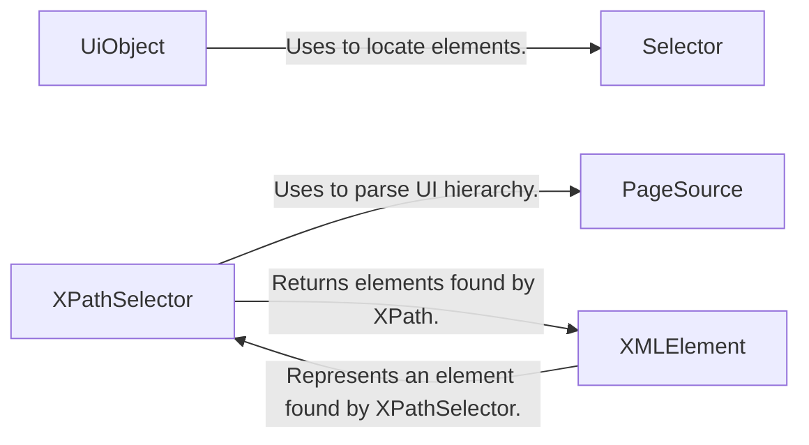

## Component Details

The UI Element Identification & Selection subsystem in uiautomator2 provides the functionality to locate and interact with UI elements on an Android device. It offers two primary mechanisms: one based on selectors that match UI element properties and another based on XPath expressions for more complex queries. The core components work together to parse the UI hierarchy, identify elements based on specified criteria, and enable actions like clicking, setting text, and retrieving text from those elements.

### UiObject
Represents a UI element on the screen and provides methods for interacting with it, such as clicking, sending keys, and waiting for its appearance or disappearance. It uses the Selector to locate the element and perform actions on it.
- **Related Classes/Methods**: `uiautomator2.uiautomator2._selector.UiObject`

### Selector
Defines the criteria for locating a UI element based on attributes like text, description, and resource ID. It is used by UiObject to construct queries for finding specific elements within the UI hierarchy.
- **Related Classes/Methods**: `uiautomator2.uiautomator2._selector.Selector`

### XPathSelector
Provides methods for selecting UI elements using XPath expressions. It handles the evaluation of XPath queries against the parsed UI hierarchy and returns the matching XMLElement instances. It relies on PageSource to parse the UI hierarchy and XPath to define the queries.
- **Related Classes/Methods**: `uiautomator2.uiautomator2.xpath.XPathSelector`

### PageSource
Parses the UI hierarchy XML and provides methods for querying elements using XPath expressions. It transforms the raw XML into a navigable structure that XPathSelector can use to locate elements.
- **Related Classes/Methods**: `uiautomator2.uiautomator2.xpath.PageSource`

### XMLElement
Represents a UI element found using XPath. It provides methods for interacting with the element, similar to UiObject. It is the result of an XPath query executed by XPathSelector.
- **Related Classes/Methods**: `uiautomator2.uiautomator2.xpath.XMLElement`
