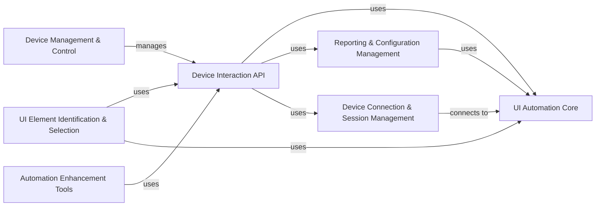

## Component Details

The uiautomator2 library provides a Python interface for automating Android devices. It allows users to connect to devices, interact with UI elements, manage applications, and collect performance data. The library is designed to simplify the process of writing automated tests and scripts for Android apps.

### Device Connection & Session Management
This component is responsible for establishing and maintaining connections with Android devices, either via USB or network. It handles device discovery, connection setup, and session management, ensuring that all subsequent interactions are properly routed and that sessions are correctly initialized, restarted, and closed. It provides the foundation for all other components to interact with the device.
- **Related Classes/Methods**: `uiautomator2.uiautomator2.connect`, `uiautomator2.uiautomator2.connect_usb`, `uiautomator2.uiautomator2._BaseClient:__init__`, `uiautomator2.uiautomator2._BaseClient:_wait_for_device`, `uiautomator2.uiautomator2.Session:__init__`, `uiautomator2.uiautomator2.Session:restart`, `uiautomator2.uiautomator2.Session:close`

### UI Automation Core
The UI Automation Core component manages the UI Automator service on the Android device. It handles the installation, startup, and shutdown of the service, and facilitates communication via JSON RPC. This component acts as a central hub, translating high-level commands into UI Automator actions and relaying them to the device, enabling seamless interaction with the Android UI.
- **Related Classes/Methods**: `uiautomator2.uiautomator2.core.BasicUiautomatorServer:__init__`, `uiautomator2.uiautomator2.core.BasicUiautomatorServer:start_uiautomator`, `uiautomator2.uiautomator2.core.BasicUiautomatorServer:stop_uiautomator`, `uiautomator2.uiautomator2.core.BasicUiautomatorServer:jsonrpc_call`, `uiautomator2.uiautomator2.core:_http_request`, `uiautomator2.uiautomator2.core:_jsonrpc_call`

### Device Interaction API
This component provides a high-level, user-friendly interface for interacting with the Android device. It offers methods for performing common actions such as clicking, swiping, sending keys, and taking screenshots. By abstracting away the complexities of direct UI Automator service interaction, it simplifies the development of automation scripts and tests.
- **Related Classes/Methods**: `uiautomator2.uiautomator2._Device:click`, `uiautomator2.uiautomator2._Device:swipe`, `uiautomator2.uiautomator2._Device:send_keys`, `uiautomator2.uiautomator2._Device:screenshot`, `uiautomator2.uiautomator2._Device:dump_hierarchy`, `uiautomator2.uiautomator2._Device:press`, `uiautomator2.uiautomator2._Device:long_click`

### UI Element Identification & Selection
This component focuses on enabling the precise selection of UI elements based on various criteria, including text, description, and resource ID. It provides methods for locating and interacting with specific UI elements, with support for XPath expressions. This allows users to target and manipulate elements within the UI hierarchy with accuracy.
- **Related Classes/Methods**: `uiautomator2.uiautomator2._selector.Selector`, `uiautomator2.uiautomator2._selector.UiObject:click`, `uiautomator2.uiautomator2._selector.UiObject:get_text`, `uiautomator2.uiautomator2._selector.UiObject:set_text`, `uiautomator2.uiautomator2._selector.UiObject:exists`, `uiautomator2.uiautomator2._selector.UiObject:wait`, `uiautomator2.uiautomator2.xpath.XPathSelector:__init__`, `uiautomator2.uiautomator2.xpath.XPathSelector:click`, `uiautomator2.uiautomator2.xpath.XPathSelector:get_text`, `uiautomator2.uiautomator2.xpath.XPathSelector:set_text`, `uiautomator2.uiautomator2.xpath.XPathSelector:exists`, `uiautomator2.uiautomator2.xpath.XPathSelector:wait`, `uiautomator2.uiautomator2.xpath.PageSource:parse`, `uiautomator2.uiautomator2.xpath.XMLElement:click`

### Device Management & Control
This component provides functionalities for managing the device's software environment, including application management (installing, uninstalling, starting, and stopping apps) and input method management (setting the current IME and sending text input). It allows users to control the device's software configuration and behavior.
- **Related Classes/Methods**: `uiautomator2.uiautomator2._AppMixIn:app_start`, `uiautomator2.uiautomator2._AppMixIn:app_stop`, `uiautomator2.uiautomator2._AppMixIn:app_install`, `uiautomator2.uiautomator2._AppMixIn:app_uninstall`, `uiautomator2.uiautomator2._AppMixIn:app_list`, `uiautomator2.uiautomator2._AppMixIn:app_current`, `uiautomator2.uiautomator2._input.InputMethodMixIn:set_input_ime`, `uiautomator2.uiautomator2._input.InputMethodMixIn:send_keys`, `uiautomator2.uiautomator2._input.InputMethodMixIn:current_ime`

### Automation Enhancement Tools
This component encompasses a suite of features designed to enhance the automation process. It includes watchers for handling unexpected events, screen recording capabilities, image recognition functionalities, and performance monitoring tools. These features contribute to creating more robust, informative, and adaptable automation scripts.
- **Related Classes/Methods**: `uiautomator2.uiautomator2.watcher.Watcher:when`, `uiautomator2.uiautomator2.watcher.Watcher:run`, `uiautomator2.uiautomator2.watcher.WatchContext:__init__`, `uiautomator2.uiautomator2.watcher.WatchContext:click`, `uiautomator2.uiautomator2.screenrecord.Screenrecord:__call__`, `uiautomator2.uiautomator2.screenrecord.Screenrecord:_run`, `uiautomator2.uiautomator2.image:compare_ssim`, `uiautomator2.uiautomator2.image.ImageX:match`, `uiautomator2.uiautomator2.image.ImageX:click`, `uiautomator2.uiautomator2.image:imread`, `uiautomator2.uiautomator2.ext.perf.Perf:cpu`, `uiautomator2.uiautomator2.ext.perf.Perf:memory`, `uiautomator2.uiautomator2.ext.perf.Perf:netstat`, `uiautomator2.uiautomator2.ext.perf.Perf:fps`

### Reporting & Configuration Management
This component is responsible for generating HTML reports that include screenshots and other relevant information about test executions. It also provides an interface for modifying uiautomator2 settings, allowing users to customize the library's behavior and receive feedback on the automation process.
- **Related Classes/Methods**: `uiautomator2.uiautomator2.ext.htmlreport.HTMLReport:__init__`, `uiautomator2.uiautomator2.ext.htmlreport.HTMLReport:_record_screenshot`, `uiautomator2.uiautomator2.ext.htmlreport.HTMLReport:patch_click`, `uiautomator2.uiautomator2.settings.Settings:__setitem__`, `uiautomator2.uiautomator2.settings.Settings:__getitem__`