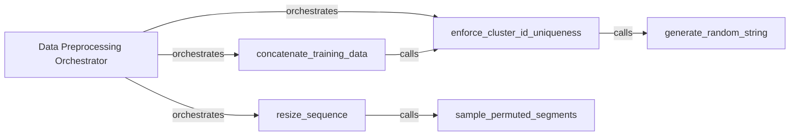

## Details

The Data Preprocessing subsystem, primarily encapsulated within the `uisrnn.utils` module, contains core utilities for preparing data for the UIS-RNN model.

### Data Preprocessing Orchestrator
This overarching component is responsible for coordinating all data manipulation tasks, ensuring data integrity, and preparing raw input into a format suitable for model consumption. It acts as the primary interface for data preparation within the `uisrnn.utils` module.

**Related Classes/Methods**:

- <a href="https://github.com/google/uis-rnn/blob/master/uisrnn/utils.py" target="_blank" rel="noopener noreferrer">`Data Preprocessing Orchestrator`</a>

### concatenate_training_data
Aggregates and combines multiple individual training data sequences (e.g., speaker embeddings and cluster IDs) into a unified dataset, ensuring proper structuring for batch processing.

**Related Classes/Methods**:

- <a href="https://github.com/google/uis-rnn/blob/master/uisrnn/utils.py#L64-L123" target="_blank" rel="noopener noreferrer">`concatenate_training_data`:64-123</a>

### enforce_cluster_id_uniqueness
Ensures that all cluster identifiers within the processed data are distinct and unique, which is critical for maintaining data integrity and correct speaker association during training and evaluation.

**Related Classes/Methods**:

- <a href="https://github.com/google/uis-rnn/blob/master/uisrnn/utils.py#L38-L61" target="_blank" rel="noopener noreferrer">`enforce_cluster_id_uniqueness`:38-61</a>

### resize_sequence
Standardizes the length of input sequences to a predefined size, a common prerequisite for sequential machine learning models like RNNs, often involving padding or truncation.

**Related Classes/Methods**:

- <a href="https://github.com/google/uis-rnn/blob/master/uisrnn/utils.py#L172-L201" target="_blank" rel="noopener noreferrer">`resize_sequence`:172-201</a>

### sample_permuted_segments
Supports intelligent selection or reordering of segments within a sequence, used for operations like resizing, data augmentation, or creating mini-batches.

**Related Classes/Methods**:

- <a href="https://github.com/google/uis-rnn/blob/master/uisrnn/utils.py#L126-L169" target="_blank" rel="noopener noreferrer">`sample_permuted_segments`:126-169</a>

### generate_random_string
A utility function to create unique string identifiers when needed, primarily used by `enforce_cluster_id_uniqueness` to generate new, distinct cluster IDs.

**Related Classes/Methods**:

- <a href="https://github.com/google/uis-rnn/blob/master/uisrnn/utils.py#L24-L35" target="_blank" rel="noopener noreferrer">`generate_random_string`:24-35</a>

### [FAQ](https://github.com/CodeBoarding/GeneratedOnBoardings/tree/main?tab=readme-ov-file#faq)