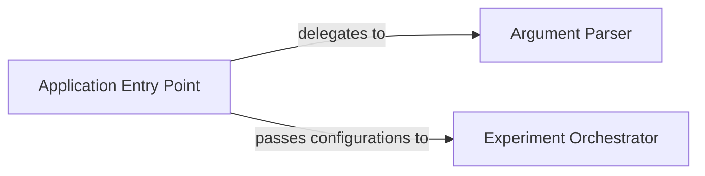

## Details

The Experiment Management subsystem is primarily defined by the demo.py file, which contains the main entry point and the experiment orchestration logic, and uisrnn/arguments.py, which handles command-line argument parsing. This subsystem manages the overall flow from configuration to execution of diarization experiments.

### Argument Parser
This component is responsible for defining, parsing, and validating command-line arguments required to configure and run diarization experiments. It ensures that the experiment receives all necessary parameters, such as paths to data, model configurations, and operational modes (e.g., training, inference).

**Related Classes/Methods**:

- <a href="https://github.com/google/uis-rnn/blob/master/uisrnn/arguments.py" target="_blank" rel="noopener noreferrer">`uisrnn.arguments`</a>

### Experiment Orchestrator
This component acts as the central control flow for the diarization experiments. It takes the parsed arguments, initializes the overall experiment workflow, and coordinates the sequential execution of various stages, including data loading, model training, inference, and evaluation. It embodies the "Workflow Orchestration" pattern.

**Related Classes/Methods**:

- <a href="https://github.com/google/uis-rnn/blob/master/demo.py#L24-L73" target="_blank" rel="noopener noreferrer">`demo.diarization_experiment`:24-73</a>

### Application Entry Point
This component serves as the primary entry point for the entire application. It initializes the argument parsing process and then invokes the Experiment Orchestrator to begin the diarization experiment based on the provided configurations.

**Related Classes/Methods**:

- <a href="https://github.com/google/uis-rnn/blob/master/demo.py#L76-L79" target="_blank" rel="noopener noreferrer">`demo.main`:76-79</a>

### [FAQ](https://github.com/CodeBoarding/GeneratedOnBoardings/tree/main?tab=readme-ov-file#faq)