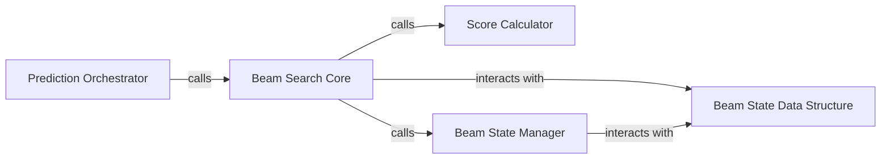

## Details

The Inference Module subsystem is primarily encapsulated within the uisrnn.uisrnn module, specifically centered around the UISRNN class and its associated methods and helper classes.

### Prediction Orchestrator
This component serves as the public API for initiating the speaker diarization inference. It orchestrates the overall prediction workflow, handling potential multiple input sequences by delegating to the core single-sequence prediction logic.

**Related Classes/Methods**:

- <a href="https://github.com/google/uis-rnn/blob/master/uisrnn/uisrnn.py" target="_blank" rel="noopener noreferrer">`uisrnn.uisrnn.UISRNN:predict`</a>

### Beam Search Core
This is the central implementation of the beam search algorithm for a single input sequence. It iteratively extends candidate paths, manages the beam, and makes decisions based on calculated scores to find the optimal speaker diarization sequence.

**Related Classes/Methods**:

- <a href="https://github.com/google/uis-rnn/blob/master/uisrnn/uisrnn.py" target="_blank" rel="noopener noreferrer">`uisrnn.uisrnn.UISRNN:predict_single`</a>

### Score Calculator
A crucial helper component responsible for computing the scores of extending existing beam search paths. This directly influences the selection of optimal sequences by providing the metric for path evaluation.

**Related Classes/Methods**:

- <a href="https://github.com/google/uis-rnn/blob/master/uisrnn/uisrnn.py" target="_blank" rel="noopener noreferrer">`uisrnn.uisrnn.UISRNN._calculate_score`</a>

### Beam State Manager
This helper component manages the internal state of the beam search. It incorporates new scores and paths, and prunes less promising options to maintain the beam's efficiency and ensure only the most relevant candidates are considered.

**Related Classes/Methods**:

- <a href="https://github.com/google/uis-rnn/blob/master/uisrnn/uisrnn.py" target="_blank" rel="noopener noreferrer">`uisrnn.uisrnn.UISRNN._update_beam_state`</a>

### Beam State Data Structure
This component acts as a dedicated data structure to encapsulate the current state of the beam search. It holds candidate sequences, their scores, and other necessary information for the algorithm's progression, ensuring efficient data management during inference.

**Related Classes/Methods**:

- <a href="https://github.com/google/uis-rnn/blob/master/uisrnn/uisrnn.py#L55-L77" target="_blank" rel="noopener noreferrer">`uisrnn.uisrnn.BeamState`:55-77</a>

### [FAQ](https://github.com/CodeBoarding/GeneratedOnBoardings/tree/main?tab=readme-ov-file#faq)