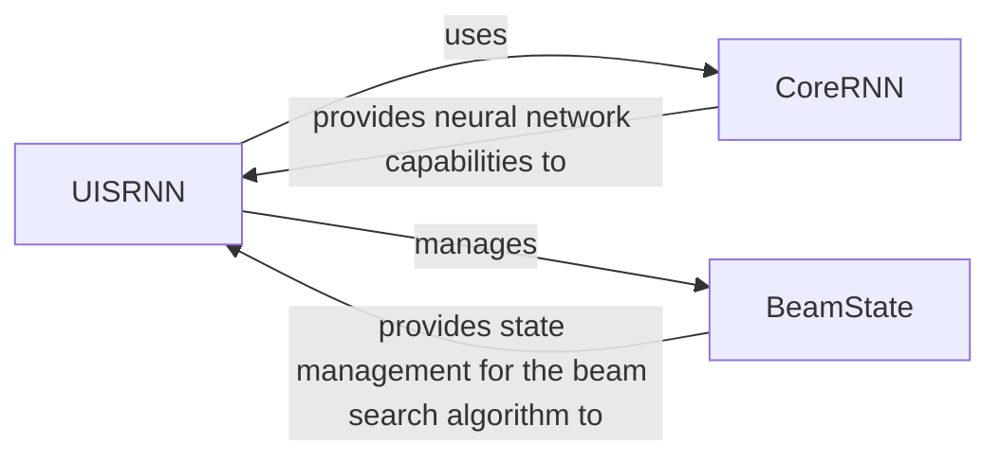

## Details

The UIS-RNN architecture is composed of three core components: `UISRNN`, `CoreRNN`, and `BeamState`. `UISRNN` serves as the central orchestrator, managing the overall training and prediction processes. It leverages `CoreRNN` for the fundamental neural network operations, specifically for generating embeddings and probabilities from input sequences. During the prediction phase, `UISRNN` interacts with `BeamState` to manage the state of the beam search algorithm, which is critical for determining the optimal diarization output. This clear separation of concerns allows for a modular and efficient system for speaker diarization.

### UISRNN
Acts as the primary API and orchestrator for the entire UIS-RNN model. It manages the lifecycle of the CoreRNN instance, implements the high-level training (fit) and prediction (predict) algorithms, and coordinates the overall diarization workflow. This component embodies the "Training Module" and "Inference/Prediction Module" patterns.

**Related Classes/Methods**:

- <a href="https://github.com/google/uis-rnn/blob/master/uisrnn/uisrnn.py#L80-L590" target="_blank" rel="noopener noreferrer">`uisrnn.uisrnn.UISRNN`:80-590</a>

### CoreRNN
Encapsulates the fundamental GRU-based neural network architecture. Its sole responsibility is to define the model's layers and perform forward passes, transforming input sequences into embeddings and probabilities. This component directly represents the "Model Definition" pattern.

**Related Classes/Methods**:

- <a href="https://github.com/google/uis-rnn/blob/master/uisrnn/uisrnn.py#L32-L52" target="_blank" rel="noopener noreferrer">`uisrnn.uisrnn.CoreRNN`:32-52</a>

### BeamState
Manages the internal state of the beam search algorithm, which is crucial for the UISRNN's prediction phase. It stores and updates candidate sequences, their associated scores, and other relevant information, facilitating the iterative search for the optimal diarization output. This component supports the "Inference/Prediction Module" by handling algorithmic state.

**Related Classes/Methods**:

- <a href="https://github.com/google/uis-rnn/blob/master/uisrnn/uisrnn.py#L55-L77" target="_blank" rel="noopener noreferrer">`uisrnn.uisrnn.BeamState`:55-77</a>

### [FAQ](https://github.com/CodeBoarding/GeneratedOnBoardings/tree/main?tab=readme-ov-file#faq)