```mermaid
graph LR
    Experiment_Management["Experiment Management"]
    Data_Preprocessing["Data Preprocessing"]
    UIS_RNN_Core_Model["UIS-RNN Core Model"]
    Training_Module["Training Module"]
    Inference_Module["Inference Module"]
    Evaluation_Module["Evaluation Module"]
    Extension_Module["Extension Module"]
    Experiment_Management -- "initiates data preparation" --> Data_Preprocessing
    Experiment_Management -- "instantiates and configures" --> UIS_RNN_Core_Model
    Experiment_Management -- "orchestrates" --> Training_Module
    Experiment_Management -- "orchestrates" --> Inference_Module
    Experiment_Management -- "orchestrates" --> Evaluation_Module
    Data_Preprocessing -- "provides prepared data to" --> Training_Module
    Data_Preprocessing -- "provides prepared data to" --> Inference_Module
    Training_Module -- "trains and updates" --> UIS_RNN_Core_Model
    UIS_RNN_Core_Model -- "is trained and updated by" --> Training_Module
    Inference_Module -- "uses" --> UIS_RNN_Core_Model
    UIS_RNN_Core_Model -- "is used by" --> Inference_Module
    Inference_Module -- "provides predictions to" --> Evaluation_Module
    Extension_Module -- "may utilize" --> Data_Preprocessing
    click Experiment_Management href "https://github.com/CodeBoarding/GeneratedOnBoardings/blob/main/uis-rnn/Experiment_Management.md" "Details"
    click Data_Preprocessing href "https://github.com/CodeBoarding/GeneratedOnBoardings/blob/main/uis-rnn/Data_Preprocessing.md" "Details"
    click UIS_RNN_Core_Model href "https://github.com/CodeBoarding/GeneratedOnBoardings/blob/main/uis-rnn/UIS_RNN_Core_Model.md" "Details"
    click Inference_Module href "https://github.com/CodeBoarding/GeneratedOnBoardings/blob/main/uis-rnn/Inference_Module.md" "Details"
```

## Details

The `uis-rnn` project is structured around a core `UIS-RNN Core Model` for unsupervised speaker diarization. The `Experiment Management` component serves as the central orchestrator, handling experiment setup, data flow, and coordinating interactions between other modules. `Data Preprocessing` prepares input features for both training and inference. The `Training Module` and `Inference Module` manage the lifecycle of the `UIS-RNN Core Model`, from optimization to prediction. The `Evaluation Module` provides performance assessment, while the `Extension Module` offers specialized algorithms. This modular design facilitates clear data flow and component responsibilities, making it suitable for both detailed documentation and high-level diagram generation.

### Experiment Management [[Expand]](./Experiment_Management.md)
The primary entry point and orchestrator for diarization experiments, handling argument parsing and coordinating the overall workflow.

**Related Classes/Methods**:

- <a href="https://github.com/google/uis-rnn/blob/master/demo.py" target="_blank" rel="noopener noreferrer">`demo.demo`</a>
- <a href="https://github.com/google/uis-rnn/blob/master/uisrnn/arguments.py" target="_blank" rel="noopener noreferrer">`uisrnn.arguments`</a>

### Data Preprocessing [[Expand]](./Data_Preprocessing.md)
Responsible for all data manipulation tasks, including feature extraction, sequence concatenation, and ensuring data integrity before model consumption.

**Related Classes/Methods**:

- <a href="https://github.com/google/uis-rnn/blob/master/uisrnn/utils.py" target="_blank" rel="noopener noreferrer">`uisrnn.utils`</a>

### UIS-RNN Core Model [[Expand]](./UIS_RNN_Core_Model.md)
Defines the fundamental neural network architecture (GRU-based) and the high-level `UISRNN` class that encapsulates the model's core logic.

**Related Classes/Methods**:

- <a href="https://github.com/google/uis-rnn/blob/master/uisrnn/uisrnn.py#L32-L52" target="_blank" rel="noopener noreferrer">`uisrnn.uisrnn.CoreRNN`:32-52</a>
- <a href="https://github.com/google/uis-rnn/blob/master/uisrnn/uisrnn.py#L80-L590" target="_blank" rel="noopener noreferrer">`uisrnn.uisrnn.UISRNN`:80-590</a>

### Training Module
Manages the training process of the `UIS-RNN Core Model`, including optimization, loss calculation, and batch processing.

**Related Classes/Methods**:

- <a href="https://github.com/google/uis-rnn/blob/master/uisrnn/uisrnn.py" target="_blank" rel="noopener noreferrer">`uisrnn.uisrnn.UISRNN:fit`</a>
- <a href="https://github.com/google/uis-rnn/blob/master/uisrnn/uisrnn.py" target="_blank" rel="noopener noreferrer">`uisrnn.uisrnn.UISRNN:fit_concatenated`</a>
- <a href="https://github.com/google/uis-rnn/blob/master/uisrnn/uisrnn.py" target="_blank" rel="noopener noreferrer">`uisrnn.uisrnn.UISRNN:_get_optimizer`</a>

### Inference Module [[Expand]](./Inference_Module.md)
Handles the prediction phase, utilizing the trained model to generate speaker diarization outputs, often employing beam search for optimal sequence prediction.

**Related Classes/Methods**:

- <a href="https://github.com/google/uis-rnn/blob/master/uisrnn/uisrnn.py" target="_blank" rel="noopener noreferrer">`uisrnn.uisrnn.UISRNN:predict`</a>
- <a href="https://github.com/google/uis-rnn/blob/master/uisrnn/uisrnn.py" target="_blank" rel="noopener noreferrer">`uisrnn.uisrnn.UISRNN:predict_single`</a>
- <a href="https://github.com/google/uis-rnn/blob/master/uisrnn/uisrnn.py" target="_blank" rel="noopener noreferrer">`uisrnn.uisrnn.UISRNN:_calculate_score`</a>
- <a href="https://github.com/google/uis-rnn/blob/master/uisrnn/uisrnn.py" target="_blank" rel="noopener noreferrer">`uisrnn.uisrnn.UISRNN:_update_beam_state`</a>
- <a href="https://github.com/google/uis-rnn/blob/master/uisrnn/uisrnn.py#L55-L77" target="_blank" rel="noopener noreferrer">`uisrnn.uisrnn.BeamState`:55-77</a>

### Evaluation Module
Provides functionalities to assess the performance of the speaker diarization system by comparing predicted outputs against ground truth labels.

**Related Classes/Methods**:

- <a href="https://github.com/google/uis-rnn/blob/master/uisrnn/evals.py" target="_blank" rel="noopener noreferrer">`uisrnn.evals`</a>

### Extension Module
Contains specialized or experimental algorithms that extend the core capabilities of the UIS-RNN library, such as advanced CRP alpha estimation.

**Related Classes/Methods**:

- <a href="https://github.com/google/uis-rnn/blob/master/uisrnn/contrib/range_search_crp_alpha.py" target="_blank" rel="noopener noreferrer">`uisrnn.contrib.range_search_crp_alpha`</a>

### [FAQ](https://github.com/CodeBoarding/GeneratedOnBoardings/tree/main?tab=readme-ov-file#faq)