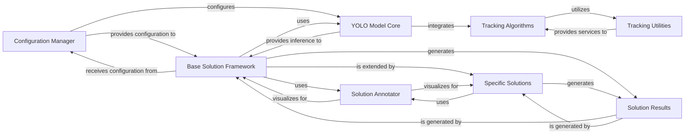

## Component Details

The 'Applied Vision Solutions' component in Ultralytics provides a comprehensive suite of higher-level, application-specific computer vision capabilities. It builds upon core functionalities like object detection and tracking, offering specialized solutions such as object tracking algorithms, queue management, heatmap generation, and various AI gym applications. This component integrates with the YOLO Model Core for inference, leverages dedicated Tracking Algorithms and Utilities for robust object tracking, and is structured around a flexible Base Solution Framework. It utilizes a Solution Annotator for visualizing results and a Solution Results data structure for managing outputs. Configuration settings are managed by the Configuration Manager to ensure proper setup and operation across diverse vision tasks.

### Configuration Manager
This component is responsible for handling the configuration settings for the Ultralytics solutions and models. It parses key-value pairs, merges arguments, and performs checks on dictionary alignment. It also interacts with solution-specific configurations and determines save directories, ensuring proper setup for various vision tasks.

**Related Classes/Methods**:

- `ultralytics.cfg.handle_yolo_solutions` (full file reference)
- `ultralytics.cfg.entrypoint` (full file reference)
- `ultralytics.cfg.merge_equals_args` (full file reference)
- `ultralytics.cfg.parse_key_value_pair` (full file reference)
- `ultralytics.cfg.check_dict_alignment` (full file reference)
- `ultralytics.cfg.get_save_dir` (full file reference)
- <a href="https://github.com/ultralytics/ultralytics/blob/master/ultralytics/solutions/config.py#L10-L106" target="_blank" rel="noopener noreferrer">`ultralytics.solutions.config.SolutionConfig` (10:106)</a>

### YOLO Model Core
This is the central component for managing and interacting with various YOLO-based models (e.g., YOLO, FastSAM, RTDETR, SAM, NAS). It provides a unified API for model operations such as prediction, tracking, validation, and export. It handles model loading, configuration, and integrates with different task-specific modules and tracking algorithms to perform core computer vision tasks.

**Related Classes/Methods**:

- <a href="https://github.com/ultralytics/ultralytics/blob/master/ultralytics/engine/model.py#L27-L1160" target="_blank" rel="noopener noreferrer">`ultralytics.engine.model.Model` (27:1160)</a>
- <a href="https://github.com/ultralytics/ultralytics/blob/master/ultralytics/engine/model.py#L557-L599" target="_blank" rel="noopener noreferrer">`ultralytics.engine.model.Model.track` (557:599)</a>
- <a href="https://github.com/ultralytics/ultralytics/blob/master/ultralytics/engine/model.py#L496-L555" target="_blank" rel="noopener noreferrer">`ultralytics.engine.model.Model.predict` (496:555)</a>
- <a href="https://github.com/ultralytics/ultralytics/blob/master/ultralytics/models/rtdetr/model.py#L20-L64" target="_blank" rel="noopener noreferrer">`ultralytics.models.rtdetr.model.RTDETR` (20:64)</a>
- <a href="https://github.com/ultralytics/ultralytics/blob/master/ultralytics/models/fastsam/model.py#L12-L79" target="_blank" rel="noopener noreferrer">`ultralytics.models.fastsam.model.FastSAM` (12:79)</a>
- <a href="https://github.com/ultralytics/ultralytics/blob/master/ultralytics/models/sam/model.py#L26-L171" target="_blank" rel="noopener noreferrer">`ultralytics.models.sam.model.SAM` (26:171)</a>
- <a href="https://github.com/ultralytics/ultralytics/blob/master/ultralytics/models/yolo/model.py#L22-L121" target="_blank" rel="noopener noreferrer">`ultralytics.models.yolo.model.YOLO` (22:121)</a>

### Tracking Algorithms
This component encompasses the core object tracking algorithms, specifically BYTETracker and BOT_SORT. It manages tracklets, performs state updates and predictions using Kalman filters, and handles data association for multi-object tracking in video sequences. It relies on a set of utility functions for efficient tracking.

**Related Classes/Methods**:

- <a href="https://github.com/ultralytics/ultralytics/blob/master/ultralytics/trackers/bot_sort.py#L19-L151" target="_blank" rel="noopener noreferrer">`ultralytics.trackers.bot_sort.BOTrack` (19:151)</a>
- <a href="https://github.com/ultralytics/ultralytics/blob/master/ultralytics/trackers/bot_sort.py#L154-L247" target="_blank" rel="noopener noreferrer">`ultralytics.trackers.bot_sort.BOTSORT` (154:247)</a>
- <a href="https://github.com/ultralytics/ultralytics/blob/master/ultralytics/trackers/bot_sort.py#L250-L272" target="_blank" rel="noopener noreferrer">`ultralytics.trackers.bot_sort.ReID` (250:272)</a>
- <a href="https://github.com/ultralytics/ultralytics/blob/master/ultralytics/trackers/track.py#L18-L69" target="_blank" rel="noopener noreferrer">`ultralytics.trackers.track.on_predict_start` (18:69)</a>
- <a href="https://github.com/ultralytics/ultralytics/blob/master/ultralytics/trackers/byte_tracker.py#L14-L235" target="_blank" rel="noopener noreferrer">`ultralytics.trackers.byte_tracker.STrack` (14:235)</a>
- <a href="https://github.com/ultralytics/ultralytics/blob/master/ultralytics/trackers/byte_tracker.py#L238-L486" target="_blank" rel="noopener noreferrer">`ultralytics.trackers.byte_tracker.BYTETracker` (238:486)</a>
- <a href="https://github.com/ultralytics/ultralytics/blob/master/ultralytics/trackers/basetrack.py#L32-L117" target="_blank" rel="noopener noreferrer">`ultralytics.trackers.basetrack.BaseTrack` (32:117)</a>
- <a href="https://github.com/ultralytics/ultralytics/blob/master/ultralytics/trackers/track.py#L105-L119" target="_blank" rel="noopener noreferrer">`ultralytics.trackers.track.register_tracker` (105:119)</a>

### Tracking Utilities
A collection of helper modules crucial for tracking algorithms, including Kalman filters for state estimation, matching functions for data association (e.g., IOU distance, embedding distance), and global motion compensation for correcting camera motion.

**Related Classes/Methods**:

- <a href="https://github.com/ultralytics/ultralytics/blob/master/ultralytics/trackers/utils/kalman_filter.py#L7-L286" target="_blank" rel="noopener noreferrer">`ultralytics.trackers.utils.kalman_filter.KalmanFilterXYAH` (7:286)</a>
- <a href="https://github.com/ultralytics/ultralytics/blob/master/ultralytics/trackers/utils/kalman_filter.py#L289-L493" target="_blank" rel="noopener noreferrer">`ultralytics.trackers.utils.kalman_filter.KalmanFilterXYWH` (289:493)</a>
- <a href="https://github.com/ultralytics/ultralytics/blob/master/ultralytics/trackers/utils/matching.py#L64-L101" target="_blank" rel="noopener noreferrer">`ultralytics.trackers.utils.matching.iou_distance` (64:101)</a>
- <a href="https://github.com/ultralytics/ultralytics/blob/master/ultralytics/trackers/utils/matching.py#L134-L157" target="_blank" rel="noopener noreferrer">`ultralytics.trackers.utils.matching.fuse_score` (134:157)</a>
- <a href="https://github.com/ultralytics/ultralytics/blob/master/ultralytics/trackers/utils/matching.py#L104-L131" target="_blank" rel="noopener noreferrer">`ultralytics.trackers.utils.matching.embedding_distance` (104:131)</a>
- <a href="https://github.com/ultralytics/ultralytics/blob/master/ultralytics/trackers/utils/matching.py#L20-L61" target="_blank" rel="noopener noreferrer">`ultralytics.trackers.utils.matching.linear_assignment` (20:61)</a>
- <a href="https://github.com/ultralytics/ultralytics/blob/master/ultralytics/trackers/utils/gmc.py#L12-L349" target="_blank" rel="noopener noreferrer">`ultralytics.trackers.utils.gmc.GMC` (12:349)</a>

### Base Solution Framework
Provides the foundational structure and common functionalities for various Ultralytics computer vision solutions. It handles model loading, object tracking integration, region initialization, and output display. Specific solutions extend this base class to implement their unique processing logic.

**Related Classes/Methods**:

- <a href="https://github.com/ultralytics/ultralytics/blob/master/ultralytics/solutions/solutions.py#L17-L259" target="_blank" rel="noopener noreferrer">`ultralytics.solutions.solutions.BaseSolution` (17:259)</a>

### Solution Annotator
This component is responsible for visualizing and annotating the results of computer vision tasks. It extends a base Annotator class and provides specialized methods for drawing regions, displaying counts, estimating pose angles, and plotting various analytical information on images, making the solution outputs interpretable.

**Related Classes/Methods**:

- <a href="https://github.com/ultralytics/ultralytics/blob/master/ultralytics/solutions/solutions.py#L262-L784" target="_blank" rel="noopener noreferrer">`ultralytics.solutions.solutions.SolutionAnnotator` (262:784)</a>

### Solution Results
This component is a data structure designed to encapsulate and manage the various outputs generated by the Ultralytics solution pipeline. It stores information such as object counts, angles, workout stages, distances, and performance metrics, providing a structured way to access and manipulate the results for further analysis or display.

**Related Classes/Methods**:

- <a href="https://github.com/ultralytics/ultralytics/blob/master/ultralytics/solutions/solutions.py#L787-L855" target="_blank" rel="noopener noreferrer">`ultralytics.solutions.solutions.SolutionResults` (787:855)</a>

### Specific Solutions
This component represents the various specialized computer vision applications built upon the Base Solution Framework. Each class within this component implements a unique `process` method to address a specific application, such as object counting, queue management, pose estimation (AI Gym), object blurring, parking management, heatmap generation, analytics, vision eye, instance segmentation, security alarms, similarity search, speed estimation, distance calculation, streamlit inference, and object cropping.

**Related Classes/Methods**:

- <a href="https://github.com/ultralytics/ultralytics/blob/master/ultralytics/solutions/trackzone.py#L10-L89" target="_blank" rel="noopener noreferrer">`ultralytics.solutions.trackzone.TrackZone` (10:89)</a>
- <a href="https://github.com/ultralytics/ultralytics/blob/master/ultralytics/solutions/region_counter.py#L9-L127" target="_blank" rel="noopener noreferrer">`ultralytics.solutions.region_counter.RegionCounter` (9:127)</a>
- <a href="https://github.com/ultralytics/ultralytics/blob/master/ultralytics/solutions/queue_management.py#L7-L93" target="_blank" rel="noopener noreferrer">`ultralytics.solutions.queue_management.QueueManager` (7:93)</a>
- <a href="https://github.com/ultralytics/ultralytics/blob/master/ultralytics/solutions/object_blurrer.py#L10-L90" target="_blank" rel="noopener noreferrer">`ultralytics.solutions.object_blurrer.ObjectBlurrer` (10:90)</a>
- <a href="https://github.com/ultralytics/ultralytics/blob/master/ultralytics/solutions/parking_management.py#L14-L175" target="_blank" rel="noopener noreferrer">`ultralytics.solutions.parking_management.ParkingPtsSelection` (14:175)</a>
- <a href="https://github.com/ultralytics/ultralytics/blob/master/ultralytics/solutions/parking_management.py#L178-L276" target="_blank" rel="noopener noreferrer">`ultralytics.solutions.parking_management.ParkingManagement` (178:276)</a>
- <a href="https://github.com/ultralytics/ultralytics/blob/master/ultralytics/solutions/object_counter.py#L10-L195" target="_blank" rel="noopener noreferrer">`ultralytics.solutions.object_counter.ObjectCounter` (10:195)</a>
- <a href="https://github.com/ultralytics/ultralytics/blob/master/ultralytics/solutions/heatmap.py#L10-L127" target="_blank" rel="noopener noreferrer">`ultralytics.solutions.heatmap.Heatmap` (10:127)</a>
- <a href="https://github.com/ultralytics/ultralytics/blob/master/ultralytics/solutions/analytics.py#L12-L263" target="_blank" rel="noopener noreferrer">`ultralytics.solutions.analytics.Analytics` (12:263)</a>
- <a href="https://github.com/ultralytics/ultralytics/blob/master/ultralytics/solutions/vision_eye.py#L7-L68" target="_blank" rel="noopener noreferrer">`ultralytics.solutions.vision_eye.VisionEye` (7:68)</a>
- <a href="https://github.com/ultralytics/ultralytics/blob/master/ultralytics/solutions/instance_segmentation.py#L7-L87" target="_blank" rel="noopener noreferrer">`ultralytics.solutions.instance_segmentation.InstanceSegmentation` (7:87)</a>
- <a href="https://github.com/ultralytics/ultralytics/blob/master/ultralytics/solutions/security_alarm.py#L8-L154" target="_blank" rel="noopener noreferrer">`ultralytics.solutions.security_alarm.SecurityAlarm` (8:154)</a>
- <a href="https://github.com/ultralytics/ultralytics/blob/master/ultralytics/solutions/similarity_search.py#L19-L172" target="_blank" rel="noopener noreferrer">`ultralytics.solutions.similarity_search.VisualAISearch` (19:172)</a>
- <a href="https://github.com/ultralytics/ultralytics/blob/master/ultralytics/solutions/similarity_search.py#L175-L230" target="_blank" rel="noopener noreferrer">`ultralytics.solutions.similarity_search.SearchApp` (175:230)</a>
- <a href="https://github.com/ultralytics/ultralytics/blob/master/ultralytics/solutions/speed_estimation.py#L10-L116" target="_blank" rel="noopener noreferrer">`ultralytics.solutions.speed_estimation.SpeedEstimator` (10:116)</a>
- <a href="https://github.com/ultralytics/ultralytics/blob/master/ultralytics/solutions/distance_calculation.py#L12-L126" target="_blank" rel="noopener noreferrer">`ultralytics.solutions.distance_calculation.DistanceCalculation` (12:126)</a>
- <a href="https://github.com/ultralytics/ultralytics/blob/master/ultralytics/solutions/streamlit_inference.py#L14-L191" target="_blank" rel="noopener noreferrer">`ultralytics.solutions.streamlit_inference.Inference` (14:191)</a>
- <a href="https://github.com/ultralytics/ultralytics/blob/master/ultralytics/solutions/ai_gym.py#L8-L114" target="_blank" rel="noopener noreferrer">`ultralytics.solutions.ai_gym.AIGym` (8:114)</a>
- <a href="https://github.com/ultralytics/ultralytics/blob/master/ultralytics/solutions/object_cropper.py#L10-L91" target="_blank" rel="noopener noreferrer">`ultralytics.solutions.object_cropper.ObjectCropper` (10:91)</a>

### [FAQ](https://github.com/CodeBoarding/GeneratedOnBoardings/tree/main?tab=readme-ov-file#faq)