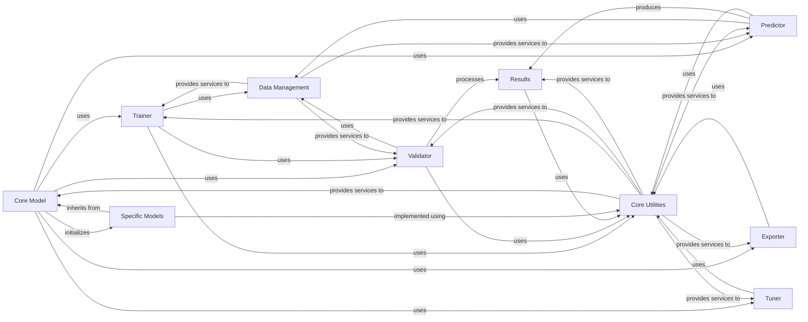

## Component Details

The Core Engine subsystem in Ultralytics manages the complete lifecycle of deep learning models, encompassing training, validation, prediction, and export. It serves as the central orchestrator, coordinating interactions between various specialized components to ensure efficient and effective model operations within the framework.

### Core Model
The foundational interface for various deep learning models within Ultralytics. It handles model initialization, loading, saving, information display, fusion, and serves as the base for training, prediction, validation, benchmarking, and export functionalities.

**Related Classes/Methods**:

- <a href="https://github.com/ultralytics/ultralytics/blob/master/ultralytics/engine/model.py#L27-L1160" target="_blank" rel="noopener noreferrer">`ultralytics.engine.model.Model` (27:1160)</a>
- <a href="https://github.com/ultralytics/ultralytics/blob/master/ultralytics/hub/session.py#L21-L432" target="_blank" rel="noopener noreferrer">`ultralytics.hub.session.HUBTrainingSession` (21:432)</a>

### Trainer
Orchestrates the entire model training process. It handles dataset loading, model setup, distributed training, optimization, scheduling, validation, checkpointing, and logging of training progress and metrics.

**Related Classes/Methods**:

- <a href="https://github.com/ultralytics/ultralytics/blob/master/ultralytics/engine/trainer.py#L59-L870" target="_blank" rel="noopener noreferrer">`ultralytics.engine.trainer.BaseTrainer` (59:870)</a>
- <a href="https://github.com/ultralytics/ultralytics/blob/master/ultralytics/models/yolo/classify/train.py#L17-L237" target="_blank" rel="noopener noreferrer">`ultralytics.models.yolo.classify.train.ClassificationTrainer` (17:237)</a>
- <a href="https://github.com/ultralytics/ultralytics/blob/master/ultralytics/models/yolo/detect/train.py#L20-L218" target="_blank" rel="noopener noreferrer">`ultralytics.models.yolo.detect.train.DetectionTrainer` (20:218)</a>
- <a href="https://github.com/ultralytics/ultralytics/blob/master/ultralytics/models/yolo/obb/train.py#L12-L89" target="_blank" rel="noopener noreferrer">`ultralytics.models.yolo.obb.train.OBBTrainer` (12:89)</a>
- <a href="https://github.com/ultralytics/ultralytics/blob/master/ultralytics/models/yolo/pose/train.py#L13-L162" target="_blank" rel="noopener noreferrer">`ultralytics.models.yolo.pose.train.PoseTrainer` (13:162)</a>
- <a href="https://github.com/ultralytics/ultralytics/blob/master/ultralytics/models/yolo/segment/train.py#L13-L127" target="_blank" rel="noopener noreferrer">`ultralytics.models.yolo.segment.train.SegmentationTrainer` (13:127)</a>
- <a href="https://github.com/ultralytics/ultralytics/blob/master/ultralytics/models/yolo/world/train.py#L24-L175" target="_blank" rel="noopener noreferrer">`ultralytics.models.yolo.world.train.WorldTrainer` (24:175)</a>
- <a href="https://github.com/ultralytics/ultralytics/blob/master/ultralytics/models/yolo/world/train_world.py#L10-L185" target="_blank" rel="noopener noreferrer">`ultralytics.models.yolo.world.train_world.WorldTrainerFromScratch` (10:185)</a>
- <a href="https://github.com/ultralytics/ultralytics/blob/master/ultralytics/models/yolo/yoloe/train.py#L21-L107" target="_blank" rel="noopener noreferrer">`ultralytics.models.yolo.yoloe.train.YOLOETrainer` (21:107)</a>
- <a href="https://github.com/ultralytics/ultralytics/blob/master/ultralytics/models/yolo/yoloe/train.py#L110-L161" target="_blank" rel="noopener noreferrer">`ultralytics.models.yolo.yoloe.train.YOLOEPETrainer` (110:161)</a>
- <a href="https://github.com/ultralytics/ultralytics/blob/master/ultralytics/models/yolo/yoloe/train.py#L231-L273" target="_blank" rel="noopener noreferrer">`ultralytics.models.yolo.yoloe.train.YOLOEPEFreeTrainer` (231:273)</a>
- <a href="https://github.com/ultralytics/ultralytics/blob/master/ultralytics/models/yolo/yoloe/train.py#L276-L321" target="_blank" rel="noopener noreferrer">`ultralytics.models.yolo.yoloe.train.YOLOEVPTrainer` (276:321)</a>
- <a href="https://github.com/ultralytics/ultralytics/blob/master/ultralytics/models/yolo/yoloe/train_seg.py#L64-L115" target="_blank" rel="noopener noreferrer">`ultralytics.models.yolo.yoloe.train_seg.YOLOEPESegTrainer` (64:115)</a>
- <a href="https://github.com/ultralytics/ultralytics/blob/master/ultralytics/models/yolo/yoloe/train_seg.py#L13-L61" target="_blank" rel="noopener noreferrer">`ultralytics.models.yolo.yoloe.train_seg.YOLOESegTrainer` (13:61)</a>
- <a href="https://github.com/ultralytics/ultralytics/blob/master/ultralytics/models/yolo/yoloe/train_seg.py#L118-L121" target="_blank" rel="noopener noreferrer">`ultralytics.models.yolo.yoloe.train_seg.YOLOESegTrainerFromScratch` (118:121)</a>
- <a href="https://github.com/ultralytics/ultralytics/blob/master/ultralytics/models/yolo/yoloe/train_seg.py#L124-L127" target="_blank" rel="noopener noreferrer">`ultralytics.models.yolo.yoloe.train_seg.YOLOESegVPTrainer` (124:127)</a>
- <a href="https://github.com/ultralytics/ultralytics/blob/master/ultralytics/models/rtdetr/train.py#L13-L91" target="_blank" rel="noopener noreferrer">`ultralytics.models.rtdetr.train.RTDETRTrainer` (13:91)</a>

### Validator
Handles the validation process of models. It sets up the validation environment, loads datasets, performs inference, processes results, updates metrics, and visualizes predictions. It also integrates with callbacks for extended functionality.

**Related Classes/Methods**:

- <a href="https://github.com/ultralytics/ultralytics/blob/master/ultralytics/engine/validator.py#L42-L372" target="_blank" rel="noopener noreferrer">`ultralytics.engine.validator.BaseValidator` (42:372)</a>
- <a href="https://github.com/ultralytics/ultralytics/blob/master/ultralytics/models/yolo/yoloe/val.py#L20-L209" target="_blank" rel="noopener noreferrer">`ultralytics.models.yolo.yoloe.val.YOLOEDetectValidator` (20:209)</a>
- <a href="https://github.com/ultralytics/ultralytics/blob/master/ultralytics/models/yolo/yoloe/val.py#L212-L215" target="_blank" rel="noopener noreferrer">`ultralytics.models.yolo.yoloe.val.YOLOESegValidator` (212:215)</a>
- <a href="https://github.com/ultralytics/ultralytics/blob/master/ultralytics/models/yolo/classify/val.py#L12-L209" target="_blank" rel="noopener noreferrer">`ultralytics.models.yolo.classify.val.ClassificationValidator` (12:209)</a>
- <a href="https://github.com/ultralytics/ultralytics/blob/master/ultralytics/models/yolo/detect/val.py#L18-L442" target="_blank" rel="noopener noreferrer">`ultralytics.models.yolo.detect.val.DetectionValidator` (18:442)</a>
- <a href="https://github.com/ultralytics/ultralytics/blob/master/ultralytics/models/yolo/obb/val.py#L14-L295" target="_blank" rel="noopener noreferrer">`ultralytics.models.yolo.obb.val.OBBValidator` (14:295)</a>
- <a href="https://github.com/ultralytics/ultralytics/blob/master/ultralytics/models/yolo/pose/val.py#L16-L416" target="_blank" rel="noopener noreferrer">`ultralytics.models.yolo.pose.val.PoseValidator` (16:416)</a>
- <a href="https://github.com/ultralytics/ultralytics/blob/master/ultralytics/models/yolo/segment/val.py#L18-L435" target="_blank" rel="noopener noreferrer">`ultralytics.models.yolo.segment.val.SegmentationValidator` (18:435)</a>
- <a href="https://github.com/ultralytics/ultralytics/blob/master/ultralytics/models/fastsam/val.py#L7-L42" target="_blank" rel="noopener noreferrer">`ultralytics.models.fastsam.val.FastSAMValidator` (7:42)</a>
- <a href="https://github.com/ultralytics/ultralytics/blob/master/ultralytics/models/nas/val.py#L11-L39" target="_blank" rel="noopener noreferrer">`ultralytics.models.nas.val.NASValidator` (11:39)</a>
- <a href="https://github.com/ultralytics/ultralytics/blob/master/ultralytics/models/rtdetr/val.py#L102-L218" target="_blank" rel="noopener noreferrer">`ultralytics.models.rtdetr.val.RTDETRValidator` (102:218)</a>

### Predictor
Manages the inference pipeline for models. It sets up the model and data source, performs preprocessing, runs the inference, post-processes the results, and handles the display or saving of predicted outputs.

**Related Classes/Methods**:

- <a href="https://github.com/ultralytics/ultralytics/blob/master/ultralytics/engine/predictor.py#L67-L511" target="_blank" rel="noopener noreferrer">`ultralytics.engine.predictor.BasePredictor` (67:511)</a>
- <a href="https://github.com/ultralytics/ultralytics/blob/master/ultralytics/models/yolo/classify/predict.py#L13-L99" target="_blank" rel="noopener noreferrer">`ultralytics.models.yolo.classify.predict.ClassificationPredictor` (13:99)</a>
- <a href="https://github.com/ultralytics/ultralytics/blob/master/ultralytics/models/yolo/detect/predict.py#L8-L125" target="_blank" rel="noopener noreferrer">`ultralytics.models.yolo.detect.predict.DetectionPredictor` (8:125)</a>
- <a href="https://github.com/ultralytics/ultralytics/blob/master/ultralytics/models/yolo/obb/predict.py#L10-L65" target="_blank" rel="noopener noreferrer">`ultralytics.models.yolo.obb.predict.OBBPredictor` (10:65)</a>
- <a href="https://github.com/ultralytics/ultralytics/blob/master/ultralytics/models/yolo/pose/predict.py#L7-L80" target="_blank" rel="noopener noreferrer">`ultralytics.models.yolo.pose.predict.PosePredictor` (7:80)</a>
- <a href="https://github.com/ultralytics/ultralytics/blob/master/ultralytics/models/yolo/segment/predict.py#L8-L113" target="_blank" rel="noopener noreferrer">`ultralytics.models.yolo.segment.predict.SegmentationPredictor` (8:113)</a>
- <a href="https://github.com/ultralytics/ultralytics/blob/master/ultralytics/models/yolo/yoloe/predict.py#L11-L163" target="_blank" rel="noopener noreferrer">`ultralytics.models.yolo.yoloe.predict.YOLOEVPDetectPredictor` (11:163)</a>
- <a href="https://github.com/ultralytics/ultralytics/blob/master/ultralytics/models/yolo/yoloe/predict.py#L166-L169" target="_blank" rel="noopener noreferrer">`ultralytics.models.yolo.yoloe.predict.YOLOEVPSegPredictor` (166:169)</a>
- <a href="https://github.com/ultralytics/ultralytics/blob/master/ultralytics/models/fastsam/predict.py#L14-L180" target="_blank" rel="noopener noreferrer">`ultralytics.models.fastsam.predict.FastSAMPredictor` (14:180)</a>
- <a href="https://github.com/ultralytics/ultralytics/blob/master/ultralytics/models/nas/predict.py#L9-L58" target="_blank" rel="noopener noreferrer">`ultralytics.models.nas.predict.NASPredictor` (9:58)</a>
- <a href="https://github.com/ultralytics/ultralytics/blob/master/ultralytics/models/rtdetr/predict.py#L11-L91" target="_blank" rel="noopener noreferrer">`ultralytics.models.rtdetr.predict.RTDETRPredictor` (11:91)</a>
- <a href="https://github.com/ultralytics/ultralytics/blob/master/ultralytics/models/sam/predict.py#L36-L621" target="_blank" rel="noopener noreferrer">`ultralytics.models.sam.predict.Predictor` (36:621)</a>
- <a href="https://github.com/ultralytics/ultralytics/blob/master/ultralytics/models/sam/predict.py#L624-L814" target="_blank" rel="noopener noreferrer">`ultralytics.models.sam.predict.SAM2Predictor` (624:814)</a>
- <a href="https://github.com/ultralytics/ultralytics/blob/master/ultralytics/models/sam/predict.py#L817-L1618" target="_blank" rel="noopener noreferrer">`ultralytics.models.sam.predict.SAM2VideoPredictor` (817:1618)</a>

### Exporter
Responsible for converting trained models into various deployment formats such as TorchScript, ONNX, OpenVINO, CoreML, TensorFlow SavedModel, TFLite, EdgeTPU, TFJS, PaddlePaddle, MNN, NCNN, IMX, and RKNN. It manages the conversion process, including argument validation, model optimization, and handling format-specific requirements.

**Related Classes/Methods**:

- <a href="https://github.com/ultralytics/ultralytics/blob/master/ultralytics/engine/exporter.py#L223-L1449" target="_blank" rel="noopener noreferrer">`ultralytics.engine.exporter.Exporter` (223:1449)</a>
- <a href="https://github.com/ultralytics/ultralytics/blob/master/ultralytics/engine/exporter.py#L150-L170" target="_blank" rel="noopener noreferrer">`ultralytics.engine.exporter:validate_args` (150:170)</a>
- <a href="https://github.com/ultralytics/ultralytics/blob/master/ultralytics/engine/exporter.py#L182-L199" target="_blank" rel="noopener noreferrer">`ultralytics.engine.exporter:try_export` (182:199)</a>
- <a href="https://github.com/ultralytics/ultralytics/blob/master/ultralytics/engine/exporter.py#L709-L809" target="_blank" rel="noopener noreferrer">`ultralytics.engine.exporter:_pipeline_coreml` (709:809)</a>

### Tuner
The Tuner component is responsible for hyperparameter optimization of models. It initializes with configuration settings, manages saving directories, integrates with callbacks, and utilizes plotting and YAML utilities to mutate and evaluate model configurations.

**Related Classes/Methods**:

- <a href="https://github.com/ultralytics/ultralytics/blob/master/ultralytics/engine/tuner.py#L31-L246" target="_blank" rel="noopener noreferrer">`ultralytics.engine.tuner.Tuner` (31:246)</a>

### Results
The Results component encapsulates the output of model predictions, such as bounding boxes, masks, keypoints, and probabilities. It provides methods for manipulating these results (e.g., CPU/CUDA transfer, numpy conversion, slicing) and for plotting and saving visualizations.

**Related Classes/Methods**:

- <a href="https://github.com/ultralytics/ultralytics/blob/master/ultralytics/engine/results.py#L22-L188" target="_blank" rel="noopener noreferrer">`ultralytics.engine.results.BaseTensor` (22:188)</a>
- <a href="https://github.com/ultralytics/ultralytics/blob/master/ultralytics/engine/results.py#L191-L854" target="_blank" rel="noopener noreferrer">`ultralytics.engine.results.Results` (191:854)</a>
- <a href="https://github.com/ultralytics/ultralytics/blob/master/ultralytics/engine/results.py#L857-L1073" target="_blank" rel="noopener noreferrer">`ultralytics.engine.results.Boxes` (857:1073)</a>
- <a href="https://github.com/ultralytics/ultralytics/blob/master/ultralytics/engine/results.py#L1076-L1171" target="_blank" rel="noopener noreferrer">`ultralytics.engine.results.Masks` (1076:1171)</a>
- <a href="https://github.com/ultralytics/ultralytics/blob/master/ultralytics/engine/results.py#L1174-L1296" target="_blank" rel="noopener noreferrer">`ultralytics.engine.results.Keypoints` (1174:1296)</a>
- <a href="https://github.com/ultralytics/ultralytics/blob/master/ultralytics/engine/results.py#L1299-L1437" target="_blank" rel="noopener noreferrer">`ultralytics.engine.results.Probs` (1299:1437)</a>
- <a href="https://github.com/ultralytics/ultralytics/blob/master/ultralytics/engine/results.py#L1440-L1662" target="_blank" rel="noopener noreferrer">`ultralytics.engine.results.OBB` (1440:1662)</a>

### Specific Models
This component represents the various specialized deep learning models built upon the Core Model, including different YOLO variants (YOLO, YOLOWorld, YOLOE), RTDETR, SAM, FastSAM, and NAS models. These models inherit core functionalities and implement specific architectures and behaviors.

**Related Classes/Methods**:

- <a href="https://github.com/ultralytics/ultralytics/blob/master/ultralytics/nn/tasks.py#L96-L341" target="_blank" rel="noopener noreferrer">`ultralytics.nn.tasks.BaseModel` (96:341)</a>
- <a href="https://github.com/ultralytics/ultralytics/blob/master/ultralytics/nn/tasks.py#L344-L498" target="_blank" rel="noopener noreferrer">`ultralytics.nn.tasks.DetectionModel` (344:498)</a>
- <a href="https://github.com/ultralytics/ultralytics/blob/master/ultralytics/nn/tasks.py#L501-L532" target="_blank" rel="noopener noreferrer">`ultralytics.nn.tasks.OBBModel` (501:532)</a>
- <a href="https://github.com/ultralytics/ultralytics/blob/master/ultralytics/nn/tasks.py#L535-L566" target="_blank" rel="noopener noreferrer">`ultralytics.nn.tasks.SegmentationModel` (535:566)</a>
- <a href="https://github.com/ultralytics/ultralytics/blob/master/ultralytics/nn/tasks.py#L569-L609" target="_blank" rel="noopener noreferrer">`ultralytics.nn.tasks.PoseModel` (569:609)</a>
- <a href="https://github.com/ultralytics/ultralytics/blob/master/ultralytics/nn/tasks.py#L612-L705" target="_blank" rel="noopener noreferrer">`ultralytics.nn.tasks.ClassificationModel` (612:705)</a>
- <a href="https://github.com/ultralytics/ultralytics/blob/master/ultralytics/nn/tasks.py#L708-L829" target="_blank" rel="noopener noreferrer">`ultralytics.nn.tasks.RTDETRDetectionModel` (708:829)</a>
- <a href="https://github.com/ultralytics/ultralytics/blob/master/ultralytics/nn/tasks.py#L832-L966" target="_blank" rel="noopener noreferrer">`ultralytics.nn.tasks.WorldModel` (832:966)</a>
- <a href="https://github.com/ultralytics/ultralytics/blob/master/ultralytics/nn/tasks.py#L969-L1216" target="_blank" rel="noopener noreferrer">`ultralytics.nn.tasks.YOLOEModel` (969:1216)</a>
- <a href="https://github.com/ultralytics/ultralytics/blob/master/ultralytics/nn/tasks.py#L1219-L1264" target="_blank" rel="noopener noreferrer">`ultralytics.nn.tasks.YOLOESegModel` (1219:1264)</a>
- <a href="https://github.com/ultralytics/ultralytics/blob/master/ultralytics/nn/tasks.py#L1267-L1308" target="_blank" rel="noopener noreferrer">`ultralytics.nn.tasks.Ensemble` (1267:1308)</a>
- <a href="https://github.com/ultralytics/ultralytics/blob/master/ultralytics/models/yolo/model.py#L22-L121" target="_blank" rel="noopener noreferrer">`ultralytics.models.yolo.model.YOLO` (22:121)</a>
- <a href="https://github.com/ultralytics/ultralytics/blob/master/ultralytics/models/yolo/model.py#L124-L195" target="_blank" rel="noopener noreferrer">`ultralytics.models.yolo.model.YOLOWorld` (124:195)</a>
- <a href="https://github.com/ultralytics/ultralytics/blob/master/ultralytics/models/yolo/model.py#L198-L443" target="_blank" rel="noopener noreferrer">`ultralytics.models.yolo.model.YOLOE` (198:443)</a>
- <a href="https://github.com/ultralytics/ultralytics/blob/master/ultralytics/models/rtdetr/model.py#L20-L64" target="_blank" rel="noopener noreferrer">`ultralytics.models.rtdetr.model.RTDETR` (20:64)</a>
- <a href="https://github.com/ultralytics/ultralytics/blob/master/ultralytics/models/sam/model.py#L26-L171" target="_blank" rel="noopener noreferrer">`ultralytics.models.sam.model.SAM` (26:171)</a>
- <a href="https://github.com/ultralytics/ultralytics/blob/master/ultralytics/models/fastsam/model.py#L12-L79" target="_blank" rel="noopener noreferrer">`ultralytics.models.fastsam.model.FastSAM` (12:79)</a>
- <a href="https://github.com/ultralytics/ultralytics/blob/master/ultralytics/models/nas/model.py#L17-L98" target="_blank" rel="noopener noreferrer">`ultralytics.models.nas.model.NAS` (17:98)</a>

### Data Management
This component is responsible for loading, preprocessing, and augmenting data for various tasks. It handles different data sources (images, videos, streams, numpy arrays, tensors) and provides dataset abstractions for training and validation.

**Related Classes/Methods**:

- <a href="https://github.com/ultralytics/ultralytics/blob/master/ultralytics/data/loaders.py#L52-L224" target="_blank" rel="noopener noreferrer">`ultralytics.data.loaders.LoadStreams` (52:224)</a>
- <a href="https://github.com/ultralytics/ultralytics/blob/master/ultralytics/data/loaders.py#L227-L304" target="_blank" rel="noopener noreferrer">`ultralytics.data.loaders.LoadScreenshots` (227:304)</a>
- <a href="https://github.com/ultralytics/ultralytics/blob/master/ultralytics/data/loaders.py#L307-L486" target="_blank" rel="noopener noreferrer">`ultralytics.data.loaders.LoadImagesAndVideos` (307:486)</a>
- <a href="https://github.com/ultralytics/ultralytics/blob/master/ultralytics/data/loaders.py#L489-L560" target="_blank" rel="noopener noreferrer">`ultralytics.data.loaders.LoadPilAndNumpy` (489:560)</a>
- <a href="https://github.com/ultralytics/ultralytics/blob/master/ultralytics/data/loaders.py#L563-L635" target="_blank" rel="noopener noreferrer">`ultralytics.data.loaders.LoadTensor` (563:635)</a>
- <a href="https://github.com/ultralytics/ultralytics/blob/master/ultralytics/data/dataset.py#L47-L314" target="_blank" rel="noopener noreferrer">`ultralytics.data.dataset.YOLODataset` (47:314)</a>
- <a href="https://github.com/ultralytics/ultralytics/blob/master/ultralytics/data/dataset.py#L317-L414" target="_blank" rel="noopener noreferrer">`ultralytics.data.dataset.YOLOMultiModalDataset` (317:414)</a>
- <a href="https://github.com/ultralytics/ultralytics/blob/master/ultralytics/data/dataset.py#L417-L633" target="_blank" rel="noopener noreferrer">`ultralytics.data.dataset.GroundingDataset` (417:633)</a>
- <a href="https://github.com/ultralytics/ultralytics/blob/master/ultralytics/data/dataset.py#L636-L675" target="_blank" rel="noopener noreferrer">`ultralytics.data.dataset.YOLOConcatDataset` (636:675)</a>
- <a href="https://github.com/ultralytics/ultralytics/blob/master/ultralytics/data/dataset.py#L687-L835" target="_blank" rel="noopener noreferrer">`ultralytics.data.dataset.ClassificationDataset` (687:835)</a>
- <a href="https://github.com/ultralytics/ultralytics/blob/master/ultralytics/data/augment.py#L146-L316" target="_blank" rel="noopener noreferrer">`ultralytics.data.augment.Compose` (146:316)</a>
- <a href="https://github.com/ultralytics/ultralytics/blob/master/ultralytics/data/augment.py#L491-L862" target="_blank" rel="noopener noreferrer">`ultralytics.data.augment.Mosaic` (491:862)</a>
- <a href="https://github.com/ultralytics/ultralytics/blob/master/ultralytics/data/augment.py#L865-L928" target="_blank" rel="noopener noreferrer">`ultralytics.data.augment.MixUp` (865:928)</a>
- <a href="https://github.com/ultralytics/ultralytics/blob/master/ultralytics/data/augment.py#L931-L1046" target="_blank" rel="noopener noreferrer">`ultralytics.data.augment.CutMix` (931:1046)</a>
- <a href="https://github.com/ultralytics/ultralytics/blob/master/ultralytics/data/augment.py#L1049-L1397" target="_blank" rel="noopener noreferrer">`ultralytics.data.augment.RandomPerspective` (1049:1397)</a>
- <a href="https://github.com/ultralytics/ultralytics/blob/master/ultralytics/data/augment.py#L1400-L1481" target="_blank" rel="noopener noreferrer">`ultralytics.data.augment.RandomHSV` (1400:1481)</a>
- <a href="https://github.com/ultralytics/ultralytics/blob/master/ultralytics/data/augment.py#L1484-L1575" target="_blank" rel="noopener noreferrer">`ultralytics.data.augment.RandomFlip` (1484:1575)</a>
- <a href="https://github.com/ultralytics/ultralytics/blob/master/ultralytics/data/augment.py#L1841-L2035" target="_blank" rel="noopener noreferrer">`ultralytics.data.augment.Albumentations` (1841:2035)</a>
- <a href="https://github.com/ultralytics/ultralytics/blob/master/ultralytics/data/augment.py#L2038-L2250" target="_blank" rel="noopener noreferrer">`ultralytics.data.augment.Format` (2038:2250)</a>
- <a href="https://github.com/ultralytics/ultralytics/blob/master/ultralytics/data/augment.py#L2253-L2343" target="_blank" rel="noopener noreferrer">`ultralytics.data.augment.LoadVisualPrompt` (2253:2343)</a>
- <a href="https://github.com/ultralytics/ultralytics/blob/master/ultralytics/data/augment.py#L2346-L2482" target="_blank" rel="noopener noreferrer">`ultralytics.data.augment.RandomLoadText` (2346:2482)</a>

### Core Utilities
This comprehensive component encompasses various utility functions and configuration management tools essential for the entire Ultralytics framework. It includes functionalities for device management, model EMA, early stopping, performance metrics calculation, loss function definitions, model backend handling, and general PyTorch-related helpers.

**Related Classes/Methods**:

- <a href="https://github.com/ultralytics/ultralytics/blob/master/ultralytics/utils/torch_utils.py#L130-L241" target="_blank" rel="noopener noreferrer">`ultralytics.utils.torch_utils.select_device` (130:241)</a>
- <a href="https://github.com/ultralytics/ultralytics/blob/master/ultralytics/utils/torch_utils.py#L639-L704" target="_blank" rel="noopener noreferrer">`ultralytics.utils.torch_utils.ModelEMA` (639:704)</a>
- <a href="https://github.com/ultralytics/ultralytics/blob/master/ultralytics/utils/torch_utils.py#L898-L949" target="_blank" rel="noopener noreferrer">`ultralytics.utils.torch_utils.EarlyStopping` (898:949)</a>
- <a href="https://github.com/ultralytics/ultralytics/blob/master/ultralytics/utils/metrics.py#L946-L1072" target="_blank" rel="noopener noreferrer">`ultralytics.utils.metrics.DetMetrics` (946:1072)</a>
- <a href="https://github.com/ultralytics/ultralytics/blob/master/ultralytics/utils/metrics.py#L1075-L1250" target="_blank" rel="noopener noreferrer">`ultralytics.utils.metrics.SegmentMetrics` (1075:1250)</a>
- <a href="https://github.com/ultralytics/ultralytics/blob/master/ultralytics/utils/metrics.py#L1253-L1428" target="_blank" rel="noopener noreferrer">`ultralytics.utils.metrics.PoseMetrics` (1253:1428)</a>
- <a href="https://github.com/ultralytics/ultralytics/blob/master/ultralytics/utils/metrics.py#L1431-L1503" target="_blank" rel="noopener noreferrer">`ultralytics.utils.metrics.ClassifyMetrics` (1431:1503)</a>
- <a href="https://github.com/ultralytics/ultralytics/blob/master/ultralytics/utils/metrics.py#L1506-L1631" target="_blank" rel="noopener noreferrer">`ultralytics.utils.metrics.OBBMetrics` (1506:1631)</a>
- <a href="https://github.com/ultralytics/ultralytics/blob/master/ultralytics/utils/loss.py#L194-L297" target="_blank" rel="noopener noreferrer">`ultralytics.utils.loss.v8DetectionLoss` (194:297)</a>
- <a href="https://github.com/ultralytics/ultralytics/blob/master/ultralytics/utils/loss.py#L300-L480" target="_blank" rel="noopener noreferrer">`ultralytics.utils.loss.v8SegmentationLoss` (300:480)</a>
- <a href="https://github.com/ultralytics/ultralytics/blob/master/ultralytics/utils/loss.py#L483-L642" target="_blank" rel="noopener noreferrer">`ultralytics.utils.loss.v8PoseLoss` (483:642)</a>
- <a href="https://github.com/ultralytics/ultralytics/blob/master/ultralytics/utils/loss.py#L645-L652" target="_blank" rel="noopener noreferrer">`ultralytics.utils.loss.v8ClassificationLoss` (645:652)</a>
- <a href="https://github.com/ultralytics/ultralytics/blob/master/ultralytics/utils/loss.py#L655-L770" target="_blank" rel="noopener noreferrer">`ultralytics.utils.loss.v8OBBLoss` (655:770)</a>
- <a href="https://github.com/ultralytics/ultralytics/blob/master/ultralytics/utils/loss.py#L773-L788" target="_blank" rel="noopener noreferrer">`ultralytics.utils.loss.E2EDetectLoss` (773:788)</a>
- <a href="https://github.com/ultralytics/ultralytics/blob/master/ultralytics/utils/loss.py#L791-L827" target="_blank" rel="noopener noreferrer">`ultralytics.utils.loss.TVPDetectLoss` (791:827)</a>
- <a href="https://github.com/ultralytics/ultralytics/blob/master/ultralytics/utils/loss.py#L830-L850" target="_blank" rel="noopener noreferrer">`ultralytics.utils.loss.TVPSegmentLoss` (830:850)</a>
- <a href="https://github.com/ultralytics/ultralytics/blob/master/ultralytics/nn/autobackend.py#L70-L886" target="_blank" rel="noopener noreferrer">`ultralytics.nn.autobackend.AutoBackend` (70:886)</a>

### [FAQ](https://github.com/CodeBoarding/GeneratedOnBoardings/tree/main?tab=readme-ov-file#faq)