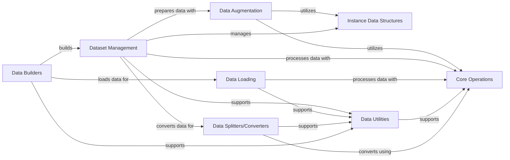

## Component Details

The Data Management & Primitives subsystem is responsible for handling all aspects of data processing within the Ultralytics framework. This includes the creation, loading, and augmentation of datasets, as well as providing fundamental operations for manipulating core data types like images, bounding boxes, masks, and keypoints. It defines the necessary data structures and utilities to support the entire data pipeline, from raw input to model-ready tensors, ensuring efficient and robust data handling for various machine learning tasks.

### Core Operations
Provides fundamental utility functions for image and bounding box manipulations, including scaling, clipping, format conversions (xywh, xyxy, xywhr), Non-Maximum Suppression (NMS), mask processing, and profiling. These operations are crucial for pre-processing, post-processing, and data augmentation across various tasks.

**Related Classes/Methods**:

- <a href="https://github.com/ultralytics/ultralytics/blob/master/ultralytics/utils/ops.py#L18-L72" target="_blank" rel="noopener noreferrer">`ultralytics.utils.ops.Profile` (18:72)</a>
- <a href="https://github.com/ultralytics/ultralytics/blob/master/ultralytics/utils/ops.py#L105-L140" target="_blank" rel="noopener noreferrer">`ultralytics.utils.ops.scale_boxes` (105:140)</a>
- <a href="https://github.com/ultralytics/ultralytics/blob/master/ultralytics/utils/ops.py#L159-L189" target="_blank" rel="noopener noreferrer">`ultralytics.utils.ops.nms_rotated` (159:189)</a>
- <a href="https://github.com/ultralytics/ultralytics/blob/master/ultralytics/utils/ops.py#L192-L338" target="_blank" rel="noopener noreferrer">`ultralytics.utils.ops.non_max_suppression` (192:338)</a>
- <a href="https://github.com/ultralytics/ultralytics/blob/master/ultralytics/utils/ops.py#L420-L437" target="_blank" rel="noopener noreferrer">`ultralytics.utils.ops.xyxy2xywh` (420:437)</a>
- <a href="https://github.com/ultralytics/ultralytics/blob/master/ultralytics/utils/ops.py#L440-L457" target="_blank" rel="noopener noreferrer">`ultralytics.utils.ops.xywh2xyxy` (440:457)</a>
- <a href="https://github.com/ultralytics/ultralytics/blob/master/ultralytics/utils/ops.py#L460-L481" target="_blank" rel="noopener noreferrer">`ultralytics.utils.ops.xywhn2xyxy` (460:481)</a>
- <a href="https://github.com/ultralytics/ultralytics/blob/master/ultralytics/utils/ops.py#L484-L507" target="_blank" rel="noopener noreferrer">`ultralytics.utils.ops.xyxy2xywhn` (484:507)</a>
- <a href="https://github.com/ultralytics/ultralytics/blob/master/ultralytics/utils/ops.py#L628-L642" target="_blank" rel="noopener noreferrer">`ultralytics.utils.ops.segments2boxes` (628:642)</a>
- <a href="https://github.com/ultralytics/ultralytics/blob/master/ultralytics/utils/ops.py#L688-L718" target="_blank" rel="noopener noreferrer">`ultralytics.utils.ops.process_mask` (688:718)</a>
- <a href="https://github.com/ultralytics/ultralytics/blob/master/ultralytics/utils/ops.py#L721-L738" target="_blank" rel="noopener noreferrer">`ultralytics.utils.ops.process_mask_native` (721:738)</a>
- <a href="https://github.com/ultralytics/ultralytics/blob/master/ultralytics/utils/ops.py#L767-L798" target="_blank" rel="noopener noreferrer">`ultralytics.utils.ops.scale_coords` (767:798)</a>
- <a href="https://github.com/ultralytics/ultralytics/blob/master/ultralytics/utils/ops.py#L820-L848" target="_blank" rel="noopener noreferrer">`ultralytics.utils.ops.masks2segments` (820:848)</a>
- <a href="https://github.com/ultralytics/ultralytics/blob/master/ultralytics/utils/ops.py#L341-L360" target="_blank" rel="noopener noreferrer">`ultralytics.utils.ops.clip_boxes` (341:360)</a>
- <a href="https://github.com/ultralytics/ultralytics/blob/master/ultralytics/utils/ops.py#L877-L881" target="_blank" rel="noopener noreferrer">`ultralytics.utils.ops.empty_like` (877:881)</a>
- <a href="https://github.com/ultralytics/ultralytics/blob/master/ultralytics/utils/ops.py#L143-L156" target="_blank" rel="noopener noreferrer">`ultralytics.utils.ops.make_divisible` (143:156)</a>
- <a href="https://github.com/ultralytics/ultralytics/blob/master/ultralytics/utils/ops.py#L510-L523" target="_blank" rel="noopener noreferrer">`ultralytics.utils.ops.xywh2ltwh` (510:523)</a>
- <a href="https://github.com/ultralytics/ultralytics/blob/master/ultralytics/utils/ops.py#L581-L609" target="_blank" rel="noopener noreferrer">`ultralytics.utils.ops.xywhr2xyxyxyxy` (581:609)</a>
- <a href="https://github.com/ultralytics/ultralytics/blob/master/ultralytics/utils/ops.py#L75-L102" target="_blank" rel="noopener noreferrer">`ultralytics.utils.ops.segment2box` (75:102)</a>
- <a href="https://github.com/ultralytics/ultralytics/blob/master/ultralytics/utils/ops.py#L669-L685" target="_blank" rel="noopener noreferrer">`ultralytics.utils.ops.crop_mask` (669:685)</a>
- <a href="https://github.com/ultralytics/ultralytics/blob/master/ultralytics/utils/ops.py#L741-L764" target="_blank" rel="noopener noreferrer">`ultralytics.utils.ops.scale_masks` (741:764)</a>
- <a href="https://github.com/ultralytics/ultralytics/blob/master/ultralytics/utils/ops.py#L851-L861" target="_blank" rel="noopener noreferrer">`ultralytics.utils.ops.convert_torch2numpy_batch` (851:861)</a>
- <a href="https://github.com/ultralytics/ultralytics/blob/master/ultralytics/utils/ops.py#L801-L817" target="_blank" rel="noopener noreferrer">`ultralytics.utils.ops.regularize_rboxes` (801:817)</a>
- <a href="https://github.com/ultralytics/ultralytics/blob/master/ultralytics/utils/ops.py#L645-L666" target="_blank" rel="noopener noreferrer">`ultralytics.utils.ops.resample_segments` (645:666)</a>

### Instance Data Structures
Defines and manages data structures for bounding boxes (Bboxes) and instances (Instances), providing methods for conversion, scaling, concatenation, and clipping. These classes are fundamental for representing and manipulating detection and segmentation results throughout the Ultralytics framework.

**Related Classes/Methods**:

- <a href="https://github.com/ultralytics/ultralytics/blob/master/ultralytics/utils/instance.py#L34-L184" target="_blank" rel="noopener noreferrer">`ultralytics.utils.instance.Bboxes` (34:184)</a>
- <a href="https://github.com/ultralytics/ultralytics/blob/master/ultralytics/utils/instance.py#L187-L495" target="_blank" rel="noopener noreferrer">`ultralytics.utils.instance.Instances` (187:495)</a>
- <a href="https://github.com/ultralytics/ultralytics/blob/master/ultralytics/utils/instance.py#L16-L18" target="_blank" rel="noopener noreferrer">`ultralytics.utils.instance._ntuple.parse` (16:18)</a>

### Data Augmentation
Implements a wide range of data augmentation techniques such as Mosaic, MixUp, CutMix, RandomPerspective, LetterBox, CopyPaste, and format conversions. These transformations are applied to input data during training and sometimes during inference to improve model robustness and performance.

**Related Classes/Methods**:

- <a href="https://github.com/ultralytics/ultralytics/blob/master/ultralytics/data/augment.py#L26-L143" target="_blank" rel="noopener noreferrer">`ultralytics.data.augment.BaseTransform` (26:143)</a>
- <a href="https://github.com/ultralytics/ultralytics/blob/master/ultralytics/data/augment.py#L146-L316" target="_blank" rel="noopener noreferrer">`ultralytics.data.augment.Compose` (146:316)</a>
- <a href="https://github.com/ultralytics/ultralytics/blob/master/ultralytics/data/augment.py#L319-L488" target="_blank" rel="noopener noreferrer">`ultralytics.data.augment.BaseMixTransform` (319:488)</a>
- <a href="https://github.com/ultralytics/ultralytics/blob/master/ultralytics/data/augment.py#L491-L862" target="_blank" rel="noopener noreferrer">`ultralytics.data.augment.Mosaic` (491:862)</a>
- <a href="https://github.com/ultralytics/ultralytics/blob/master/ultralytics/data/augment.py#L865-L928" target="_blank" rel="noopener noreferrer">`ultralytics.data.augment.MixUp` (865:928)</a>
- <a href="https://github.com/ultralytics/ultralytics/blob/master/ultralytics/data/augment.py#L931-L1046" target="_blank" rel="noopener noreferrer">`ultralytics.data.augment.CutMix` (931:1046)</a>
- <a href="https://github.com/ultralytics/ultralytics/blob/master/ultralytics/data/augment.py#L1049-L1397" target="_blank" rel="noopener noreferrer">`ultralytics.data.augment.RandomPerspective` (1049:1397)</a>
- <a href="https://github.com/ultralytics/ultralytics/blob/master/ultralytics/data/augment.py#L1578-L1740" target="_blank" rel="noopener noreferrer">`ultralytics.data.augment.LetterBox` (1578:1740)</a>
- <a href="https://github.com/ultralytics/ultralytics/blob/master/ultralytics/data/augment.py#L1743-L1838" target="_blank" rel="noopener noreferrer">`ultralytics.data.augment.CopyPaste` (1743:1838)</a>
- <a href="https://github.com/ultralytics/ultralytics/blob/master/ultralytics/data/augment.py#L1841-L2035" target="_blank" rel="noopener noreferrer">`ultralytics.data.augment.Albumentations` (1841:2035)</a>
- <a href="https://github.com/ultralytics/ultralytics/blob/master/ultralytics/data/augment.py#L2038-L2250" target="_blank" rel="noopener noreferrer">`ultralytics.data.augment.Format` (2038:2250)</a>
- <a href="https://github.com/ultralytics/ultralytics/blob/master/ultralytics/data/augment.py#L2253-L2343" target="_blank" rel="noopener noreferrer">`ultralytics.data.augment.LoadVisualPrompt` (2253:2343)</a>
- <a href="https://github.com/ultralytics/ultralytics/blob/master/ultralytics/data/augment.py#L2485-L2550" target="_blank" rel="noopener noreferrer">`ultralytics.data.augment.v8_transforms` (2485:2550)</a>
- <a href="https://github.com/ultralytics/ultralytics/blob/master/ultralytics/data/augment.py#L2605-L2705" target="_blank" rel="noopener noreferrer">`ultralytics.data.augment.classify_augmentations` (2605:2705)</a>
- <a href="https://github.com/ultralytics/ultralytics/blob/master/ultralytics/data/augment.py#L2554-L2601" target="_blank" rel="noopener noreferrer">`ultralytics.data.augment.classify_transforms` (2554:2601)</a>

### Dataset Management
Provides base and specialized dataset classes (e.g., YOLODataset, GroundingDataset, ClassificationDataset) responsible for loading, caching, and managing image and label data for various tasks. It integrates with data augmentation and utility functions to prepare data for model consumption.

**Related Classes/Methods**:

- <a href="https://github.com/ultralytics/ultralytics/blob/master/ultralytics/data/base.py#L21-L441" target="_blank" rel="noopener noreferrer">`ultralytics.data.base.BaseDataset` (21:441)</a>
- <a href="https://github.com/ultralytics/ultralytics/blob/master/ultralytics/data/dataset.py#L47-L314" target="_blank" rel="noopener noreferrer">`ultralytics.data.dataset.YOLODataset` (47:314)</a>
- <a href="https://github.com/ultralytics/ultralytics/blob/master/ultralytics/data/dataset.py#L317-L414" target="_blank" rel="noopener noreferrer">`ultralytics.data.dataset.YOLOMultiModalDataset` (317:414)</a>
- <a href="https://github.com/ultralytics/ultralytics/blob/master/ultralytics/data/dataset.py#L417-L633" target="_blank" rel="noopener noreferrer">`ultralytics.data.dataset.GroundingDataset` (417:633)</a>
- <a href="https://github.com/ultralytics/ultralytics/blob/master/ultralytics/data/dataset.py#L636-L675" target="_blank" rel="noopener noreferrer">`ultralytics.data.dataset.YOLOConcatDataset` (636:675)</a>
- <a href="https://github.com/ultralytics/ultralytics/blob/master/ultralytics/data/dataset.py#L679-L684" target="_blank" rel="noopener noreferrer">`ultralytics.data.dataset.SemanticDataset` (679:684)</a>
- <a href="https://github.com/ultralytics/ultralytics/blob/master/ultralytics/data/dataset.py#L687-L835" target="_blank" rel="noopener noreferrer">`ultralytics.data.dataset.ClassificationDataset` (687:835)</a>
- <a href="https://github.com/ultralytics/ultralytics/blob/master/ultralytics/models/rtdetr/val.py#L13-L99" target="_blank" rel="noopener noreferrer">`ultralytics.models.rtdetr.val.RTDETRDataset` (13:99)</a>

### Data Loading
Handles the loading of input data from diverse sources such as image files, video streams, screenshots, PIL images, NumPy arrays, and tensors, preparing them for further processing by the model. It abstracts the complexities of data input.

**Related Classes/Methods**:

- <a href="https://github.com/ultralytics/ultralytics/blob/master/ultralytics/data/loaders.py#L52-L224" target="_blank" rel="noopener noreferrer">`ultralytics.data.loaders.LoadStreams` (52:224)</a>
- <a href="https://github.com/ultralytics/ultralytics/blob/master/ultralytics/data/loaders.py#L227-L304" target="_blank" rel="noopener noreferrer">`ultralytics.data.loaders.LoadScreenshots` (227:304)</a>
- <a href="https://github.com/ultralytics/ultralytics/blob/master/ultralytics/data/loaders.py#L307-L486" target="_blank" rel="noopener noreferrer">`ultralytics.data.loaders.LoadImagesAndVideos` (307:486)</a>
- <a href="https://github.com/ultralytics/ultralytics/blob/master/ultralytics/data/loaders.py#L489-L560" target="_blank" rel="noopener noreferrer">`ultralytics.data.loaders.LoadPilAndNumpy` (489:560)</a>
- <a href="https://github.com/ultralytics/ultralytics/blob/master/ultralytics/data/loaders.py#L563-L635" target="_blank" rel="noopener noreferrer">`ultralytics.data.loaders.LoadTensor` (563:635)</a>
- <a href="https://github.com/ultralytics/ultralytics/blob/master/ultralytics/data/loaders.py#L655-L704" target="_blank" rel="noopener noreferrer">`ultralytics.data.loaders.get_best_youtube_url` (655:704)</a>

### Data Utilities
Offers a collection of utility functions for data-related tasks, including image and label path management, cache handling, image verification, polygon-to-mask conversions, and dataset integrity checks. These functions support the overall data pipeline.

**Related Classes/Methods**:

- <a href="https://github.com/ultralytics/ultralytics/blob/master/ultralytics/data/utils.py#L155-L177" target="_blank" rel="noopener noreferrer">`ultralytics.data.utils.verify_image` (155:177)</a>
- <a href="https://github.com/ultralytics/ultralytics/blob/master/ultralytics/data/utils.py#L180-L250" target="_blank" rel="noopener noreferrer">`ultralytics.data.utils.verify_image_label` (180:250)</a>
- <a href="https://github.com/ultralytics/ultralytics/blob/master/ultralytics/data/utils.py#L253-L294" target="_blank" rel="noopener noreferrer">`ultralytics.data.utils.visualize_image_annotations` (253:294)</a>
- <a href="https://github.com/ultralytics/ultralytics/blob/master/ultralytics/data/utils.py#L322-L338" target="_blank" rel="noopener noreferrer">`ultralytics.data.utils.polygons2masks` (322:338)</a>
- <a href="https://github.com/ultralytics/ultralytics/blob/master/ultralytics/data/utils.py#L341-L362" target="_blank" rel="noopener noreferrer">`ultralytics.data.utils.polygons2masks_overlap` (341:362)</a>
- <a href="https://github.com/ultralytics/ultralytics/blob/master/ultralytics/data/utils.py#L386-L478" target="_blank" rel="noopener noreferrer">`ultralytics.data.utils.check_det_dataset` (386:478)</a>
- <a href="https://github.com/ultralytics/ultralytics/blob/master/ultralytics/data/utils.py#L481-L570" target="_blank" rel="noopener noreferrer">`ultralytics.data.utils.check_cls_dataset` (481:570)</a>
- <a href="https://github.com/ultralytics/ultralytics/blob/master/ultralytics/data/utils.py#L573-L737" target="_blank" rel="noopener noreferrer">`ultralytics.data.utils.HUBDatasetStats` (573:737)</a>
- <a href="https://github.com/ultralytics/ultralytics/blob/master/ultralytics/data/utils.py#L787-L797" target="_blank" rel="noopener noreferrer">`ultralytics.data.utils.save_dataset_cache_file` (787:797)</a>
- <a href="https://github.com/ultralytics/ultralytics/blob/master/ultralytics/data/utils.py#L44-L47" target="_blank" rel="noopener noreferrer">`ultralytics.data.utils.img2label_paths` (44:47)</a>
- <a href="https://github.com/ultralytics/ultralytics/blob/master/ultralytics/data/utils.py#L141-L152" target="_blank" rel="noopener noreferrer">`ultralytics.data.utils.exif_size` (141:152)</a>
- <a href="https://github.com/ultralytics/ultralytics/blob/master/ultralytics/data/utils.py#L50-L125" target="_blank" rel="noopener noreferrer">`ultralytics.data.utils.check_file_speeds` (50:125)</a>
- <a href="https://github.com/ultralytics/ultralytics/blob/master/ultralytics/data/utils.py#L777-L784" target="_blank" rel="noopener noreferrer">`ultralytics.data.utils.load_dataset_cache_file` (777:784)</a>
- <a href="https://github.com/ultralytics/ultralytics/blob/master/ultralytics/data/utils.py#L128-L138" target="_blank" rel="noopener noreferrer">`ultralytics.data.utils.get_hash` (128:138)</a>
- <a href="https://github.com/ultralytics/ultralytics/blob/master/ultralytics/data/utils.py#L365-L383" target="_blank" rel="noopener noreferrer">`ultralytics.data.utils.find_dataset_yaml` (365:383)</a>
- <a href="https://github.com/ultralytics/ultralytics/blob/master/ultralytics/data/utils.py#L740-L774" target="_blank" rel="noopener noreferrer">`ultralytics.data.utils.compress_one_image` (740:774)</a>

### Data Splitters/Converters
These modules provide functionalities for splitting datasets (e.g., DOTA dataset), converting data formats (e.g., YOLO bbox to segment), and general dataset splitting utilities. They ensure data is in the correct format and organized for training and evaluation.

**Related Classes/Methods**:

- `ultralytics.data.split_dota` (full file reference)
- `ultralytics.data.converter` (full file reference)
- <a href="https://github.com/ultralytics/ultralytics/blob/master/ultralytics/data/converter.py#L585-L648" target="_blank" rel="noopener noreferrer">`ultralytics.data.converter.yolo_bbox2segment` (585:648)</a>
- <a href="https://github.com/ultralytics/ultralytics/blob/master/ultralytics/data/converter.py#L534-L582" target="_blank" rel="noopener noreferrer">`ultralytics.data.converter.merge_multi_segment` (534:582)</a>
- <a href="https://github.com/ultralytics/ultralytics/blob/master/ultralytics/data/split.py#L98-L134" target="_blank" rel="noopener noreferrer">`ultralytics.data.split.autosplit` (98:134)</a>
- <a href="https://github.com/ultralytics/ultralytics/blob/master/ultralytics/data/split_dota.py#L65-L98" target="_blank" rel="noopener noreferrer">`ultralytics.data.split_dota.load_yolo_dota` (65:98)</a>
- <a href="https://github.com/ultralytics/ultralytics/blob/master/ultralytics/data/split_dota.py#L220-L260" target="_blank" rel="noopener noreferrer">`ultralytics.data.split_dota.split_images_and_labels` (220:260)</a>
- <a href="https://github.com/ultralytics/ultralytics/blob/master/ultralytics/data/split_dota.py#L302-L344" target="_blank" rel="noopener noreferrer">`ultralytics.data.split_dota.split_test` (302:344)</a>

### Data Builders
This module is responsible for constructing various types of datasets and inference data loaders based on configuration. It acts as an orchestrator for setting up the data pipeline for training, validation, and inference.

**Related Classes/Methods**:

- `ultralytics.data.build` (full file reference)
- <a href="https://github.com/ultralytics/ultralytics/blob/master/ultralytics/data/build.py#L114-L133" target="_blank" rel="noopener noreferrer">`ultralytics.data.build.build_yolo_dataset` (114:133)</a>
- <a href="https://github.com/ultralytics/ultralytics/blob/master/ultralytics/data/build.py#L136-L154" target="_blank" rel="noopener noreferrer">`ultralytics.data.build.build_grounding` (136:154)</a>
- <a href="https://github.com/ultralytics/ultralytics/blob/master/ultralytics/data/build.py#L242-L283" target="_blank" rel="noopener noreferrer">`ultralytics.data.build.load_inference_source` (242:283)</a>

### [FAQ](https://github.com/CodeBoarding/GeneratedOnBoardings/tree/main?tab=readme-ov-file#faq)