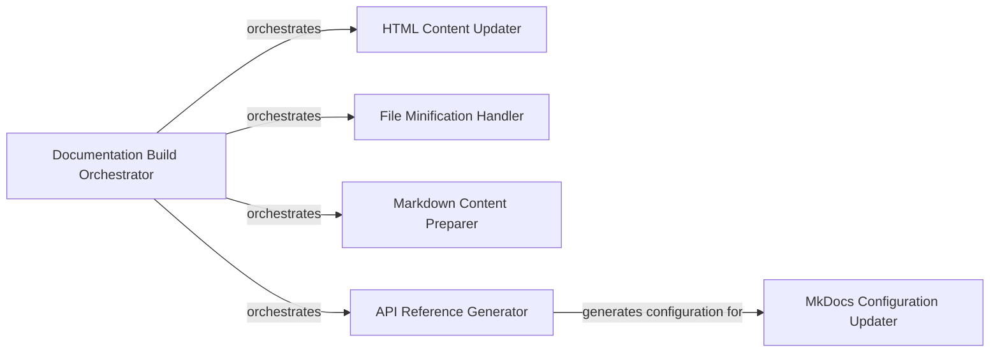

## Component Details

This graph represents the architecture of the Documentation Tools component, which is responsible for building and updating the project's documentation. The main flow involves the Documentation Build Orchestrator initiating the process, coordinating the preparation of markdown content, generating API reference documentation, building the MkDocs site, and then post-processing and minifying the generated HTML and other assets. Its purpose is to automate the comprehensive documentation generation workflow for the Ultralytics framework.

### Documentation Build Orchestrator
This component is the primary entry point for building and post-processing the MkDocs documentation. It coordinates the entire documentation generation workflow, including preparing markdown files, building the site with MkDocs, updating HTML content, and minifying assets.

**Related Classes/Methods**:

- <a href="https://github.com/ultralytics/ultralytics/blob/master/docs/build_docs.py#L350-L375" target="_blank" rel="noopener noreferrer">`ultralytics.docs.build_docs.main` (350:375)</a>
- <a href="https://github.com/ultralytics/ultralytics/blob/master/docs/build_docs.py#L38-L65" target="_blank" rel="noopener noreferrer">`ultralytics.docs.build_docs.prepare_docs_markdown` (38:65)</a>
- <a href="https://github.com/ultralytics/ultralytics/blob/master/docs/build_docs.py#L230-L253" target="_blank" rel="noopener noreferrer">`ultralytics.docs.build_docs.remove_macros` (230:253)</a>

### HTML Content Updater
This component is responsible for post-processing the generated HTML files. It updates page titles, modifies edit links for subdirectories, converts plaintext links to hyperlinks, and can inject custom scripts into the HTML head.

**Related Classes/Methods**:

- <a href="https://github.com/ultralytics/ultralytics/blob/master/docs/build_docs.py#L155-L188" target="_blank" rel="noopener noreferrer">`ultralytics.docs.build_docs.update_docs_html` (155:188)</a>
- <a href="https://github.com/ultralytics/ultralytics/blob/master/docs/build_docs.py#L68-L78" target="_blank" rel="noopener noreferrer">`ultralytics.docs.build_docs.update_page_title` (68:78)</a>
- <a href="https://github.com/ultralytics/ultralytics/blob/master/docs/build_docs.py#L99-L115" target="_blank" rel="noopener noreferrer">`ultralytics.docs.build_docs.update_subdir_edit_links` (99:115)</a>
- <a href="https://github.com/ultralytics/ultralytics/blob/master/docs/build_docs.py#L191-L227" target="_blank" rel="noopener noreferrer">`ultralytics.docs.build_docs.update_docs_soup` (191:227)</a>
- <a href="https://github.com/ultralytics/ultralytics/blob/master/docs/build_docs.py#L81-L96" target="_blank" rel="noopener noreferrer">`ultralytics.docs.build_docs.update_html_head` (81:96)</a>

### File Minification Handler
This component handles the optimization of generated documentation files by minifying HTML, CSS, and JavaScript content. It removes comments and unnecessary whitespace to reduce file sizes.

**Related Classes/Methods**:

- <a href="https://github.com/ultralytics/ultralytics/blob/master/docs/build_docs.py#L315-L347" target="_blank" rel="noopener noreferrer">`ultralytics.docs.build_docs.minify_files` (315:347)</a>
- <a href="https://github.com/ultralytics/ultralytics/blob/master/docs/build_docs.py#L256-L312" target="_blank" rel="noopener noreferrer">`ultralytics.docs.build_docs.remove_comments_and_empty_lines` (256:312)</a>

### Markdown Content Preparer
This component is responsible for preparing and updating individual Markdown files, including adding or updating frontmatter, before the MkDocs build process.

**Related Classes/Methods**:

- <a href="https://github.com/ultralytics/ultralytics/blob/master/docs/build_docs.py#L118-L152" target="_blank" rel="noopener noreferrer">`ultralytics.docs.build_docs.update_markdown_files` (118:152)</a>

### API Reference Generator
This component is dedicated to generating the API reference section of the documentation. It scans Python source code to extract class and function definitions and then creates corresponding Markdown files for the API documentation.

**Related Classes/Methods**:

- <a href="https://github.com/ultralytics/ultralytics/blob/master/docs/build_reference.py#L184-L198" target="_blank" rel="noopener noreferrer">`ultralytics.docs.build_reference.main` (184:198)</a>
- <a href="https://github.com/ultralytics/ultralytics/blob/master/docs/build_reference.py#L31-L34" target="_blank" rel="noopener noreferrer">`ultralytics.docs.build_reference.extract_classes_and_functions` (31:34)</a>
- <a href="https://github.com/ultralytics/ultralytics/blob/master/docs/build_reference.py#L37-L80" target="_blank" rel="noopener noreferrer">`ultralytics.docs.build_reference.create_markdown` (37:80)</a>
- <a href="https://github.com/ultralytics/ultralytics/blob/master/docs/build_reference.py#L83-L85" target="_blank" rel="noopener noreferrer">`ultralytics.docs.build_reference.nested_dict` (83:85)</a>

### MkDocs Configuration Updater
This component manages the mkdocs.yml configuration file, specifically for the navigation menu. It generates a YAML structure for the API reference navigation and updates the main mkdocs.yml file if changes are detected.

**Related Classes/Methods**:

- <a href="https://github.com/ultralytics/ultralytics/blob/master/docs/build_reference.py#L93-L118" target="_blank" rel="noopener noreferrer">`ultralytics.docs.build_reference.create_nav_menu_yaml` (93:118)</a>
- <a href="https://github.com/ultralytics/ultralytics/blob/master/docs/build_reference.py#L88-L90" target="_blank" rel="noopener noreferrer">`ultralytics.docs.build_reference.sort_nested_dict` (88:90)</a>
- <a href="https://github.com/ultralytics/ultralytics/blob/master/docs/build_reference.py#L134-L181" target="_blank" rel="noopener noreferrer">`ultralytics.docs.build_reference.update_mkdocs_file` (134:181)</a>
- <a href="https://github.com/ultralytics/ultralytics/blob/master/docs/build_reference.py#L121-L131" target="_blank" rel="noopener noreferrer">`ultralytics.docs.build_reference.extract_document_paths` (121:131)</a>
- <a href="https://github.com/ultralytics/ultralytics/blob/master/docs/build_reference.py#L105-L114" target="_blank" rel="noopener noreferrer">`ultralytics.docs.build_reference.create_nav_menu_yaml._dict_to_yaml` (105:114)</a>

### [FAQ](https://github.com/CodeBoarding/GeneratedOnBoardings/tree/main?tab=readme-ov-file#faq)