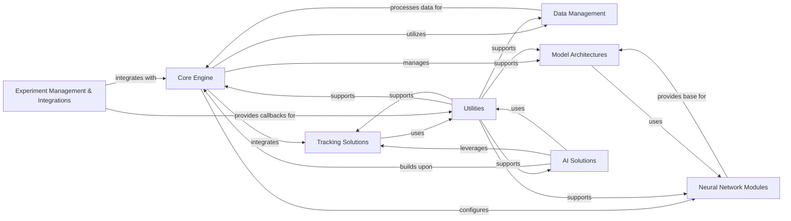

## Component Details

The Experiment Management & Integrations component provides a flexible callback system for integrating with various logging and experiment tracking platforms (e.g., Weights & Biases, TensorBoard, YOLO Hub) to monitor, manage, and deploy training processes and models. It facilitates seamless interaction with external services for experiment tracking, model deployment, and data visualization.

### Experiment Management & Integrations
Provides a flexible callback system for integrating with various logging and experiment tracking platforms (e.g., Weights & Biases, TensorBoard, YOLO Hub) to monitor, manage, and deploy training processes and models.

**Related Classes/Methods**:

- <a href="https://github.com/ultralytics/ultralytics/blob/master/ultralytics/utils/callbacks/wb.py#L47-L98" target="_blank" rel="noopener noreferrer">`ultralytics.utils.callbacks.wb._plot_curve` (47:98)</a>
- <a href="https://github.com/ultralytics/ultralytics/blob/master/ultralytics/utils/callbacks/wb.py#L135-L141" target="_blank" rel="noopener noreferrer">`ultralytics.utils.callbacks.wb.on_fit_epoch_end` (135:141)</a>
- <a href="https://github.com/ultralytics/ultralytics/blob/master/ultralytics/utils/callbacks/wb.py#L144-L149" target="_blank" rel="noopener noreferrer">`ultralytics.utils.callbacks.wb.on_train_epoch_end` (144:149)</a>
- <a href="https://github.com/ultralytics/ultralytics/blob/master/ultralytics/utils/callbacks/wb.py#L152-L173" target="_blank" rel="noopener noreferrer">`ultralytics.utils.callbacks.wb.on_train_end` (152:173)</a>
- <a href="https://github.com/ultralytics/ultralytics/blob/master/ultralytics/utils/callbacks/wb.py#L101-L122" target="_blank" rel="noopener noreferrer">`ultralytics.utils.callbacks.wb._log_plots` (101:122)</a>
- <a href="https://github.com/ultralytics/ultralytics/blob/master/ultralytics/utils/callbacks/wb.py#L18-L44" target="_blank" rel="noopener noreferrer">`ultralytics.utils.callbacks.wb._custom_table` (18:44)</a>
- <a href="https://github.com/ultralytics/ultralytics/blob/master/ultralytics/utils/callbacks/hub.py#L10-L13" target="_blank" rel="noopener noreferrer">`ultralytics.utils.callbacks.hub.on_pretrain_routine_start` (10:13)</a>
- <a href="https://github.com/ultralytics/ultralytics/blob/master/ultralytics/utils/callbacks/hub.py#L23-L45" target="_blank" rel="noopener noreferrer">`ultralytics.utils.callbacks.hub.on_fit_epoch_end` (23:45)</a>
- <a href="https://github.com/ultralytics/ultralytics/blob/master/ultralytics/utils/callbacks/hub.py#L74-L76" target="_blank" rel="noopener noreferrer">`ultralytics.utils.callbacks.hub.on_train_start` (74:76)</a>
- <a href="https://github.com/ultralytics/ultralytics/blob/master/ultralytics/utils/callbacks/hub.py#L79-L82" target="_blank" rel="noopener noreferrer">`ultralytics.utils.callbacks.hub.on_val_start` (79:82)</a>
- <a href="https://github.com/ultralytics/ultralytics/blob/master/ultralytics/utils/callbacks/hub.py#L85-L87" target="_blank" rel="noopener noreferrer">`ultralytics.utils.callbacks.hub.on_predict_start` (85:87)</a>
- <a href="https://github.com/ultralytics/ultralytics/blob/master/ultralytics/utils/callbacks/hub.py#L90-L92" target="_blank" rel="noopener noreferrer">`ultralytics.utils.callbacks.hub.on_export_start` (90:92)</a>
- <a href="https://github.com/ultralytics/ultralytics/blob/master/ultralytics/utils/callbacks/tensorboard.py#L43-L91" target="_blank" rel="noopener noreferrer">`ultralytics.utils.callbacks.tensorboard._log_tensorboard_graph` (43:91)</a>
- <a href="https://github.com/ultralytics/ultralytics/blob/master/ultralytics/utils/callbacks/tensorboard.py#L105-L108" target="_blank" rel="noopener noreferrer">`ultralytics.utils.callbacks.tensorboard.on_train_start` (105:108)</a>
- <a href="https://github.com/ultralytics/ultralytics/blob/master/ultralytics/utils/callbacks/tensorboard.py#L111-L114" target="_blank" rel="noopener noreferrer">`ultralytics.utils.callbacks.tensorboard.on_train_epoch_end` (111:114)</a>
- <a href="https://github.com/ultralytics/ultralytics/blob/master/ultralytics/utils/callbacks/tensorboard.py#L117-L119" target="_blank" rel="noopener noreferrer">`ultralytics.utils.callbacks.tensorboard.on_fit_epoch_end` (117:119)</a>
- <a href="https://github.com/ultralytics/ultralytics/blob/master/ultralytics/utils/callbacks/tensorboard.py#L24-L40" target="_blank" rel="noopener noreferrer">`ultralytics.utils.callbacks.tensorboard._log_scalars` (24:40)</a>
- <a href="https://github.com/ultralytics/ultralytics/blob/master/ultralytics/utils/callbacks/comet.py#L85-L118" target="_blank" rel="noopener noreferrer">`ultralytics.utils.callbacks.comet._resume_or_create_experiment` (85:118)</a>
- <a href="https://github.com/ultralytics/ultralytics/blob/master/ultralytics/utils/callbacks/comet.py#L145-L175" target="_blank" rel="noopener noreferrer">`ultralytics.utils.callbacks.comet._scale_bounding_box_to_original_image_shape` (145:175)</a>
- <a href="https://github.com/ultralytics/ultralytics/blob/master/ultralytics/utils/callbacks/comet.py#L178-L230" target="_blank" rel="noopener noreferrer">`ultralytics.utils.callbacks.comet._format_ground_truth_annotations_for_detection` (178:230)</a>
- <a href="https://github.com/ultralytics/ultralytics/blob/master/ultralytics/utils/callbacks/comet.py#L233-L283" target="_blank" rel="noopener noreferrer">`ultralytics.utils.callbacks.comet._format_prediction_annotations` (233:283)</a>
- <a href="https://github.com/ultralytics/ultralytics/blob/master/ultralytics/utils/callbacks/comet.py#L307-L334" target="_blank" rel="noopener noreferrer">`ultralytics.utils.callbacks.comet._fetch_annotations` (307:334)</a>
- <a href="https://github.com/ultralytics/ultralytics/blob/master/ultralytics/utils/callbacks/comet.py#L379-L439" target="_blank" rel="noopener noreferrer">`ultralytics.utils.callbacks.comet._log_image_predictions` (379:439)</a>
- <a href="https://github.com/ultralytics/ultralytics/blob/master/ultralytics/utils/callbacks/comet.py#L442-L483" target="_blank" rel="noopener noreferrer">`ultralytics.utils.callbacks.comet._log_plots` (442:483)</a>
- <a href="https://github.com/ultralytics/ultralytics/blob/master/ultralytics/utils/callbacks/comet.py#L486-L489" target="_blank" rel="noopener noreferrer">`ultralytics.utils.callbacks.comet._log_model` (486:489)</a>
- <a href="https://github.com/ultralytics/ultralytics/blob/master/ultralytics/utils/callbacks/comet.py#L492-L495" target="_blank" rel="noopener noreferrer">`ultralytics.utils.callbacks.comet._log_image_batches` (492:495)</a>
- <a href="https://github.com/ultralytics/ultralytics/blob/master/ultralytics/utils/callbacks/comet.py#L498-L500" target="_blank" rel="noopener noreferrer">`ultralytics.utils.callbacks.comet.on_pretrain_routine_start` (498:500)</a>
- <a href="https://github.com/ultralytics/ultralytics/blob/master/ultralytics/utils/callbacks/comet.py#L503-L513" target="_blank" rel="noopener noreferrer">`ultralytics.utils.callbacks.comet.on_train_epoch_end` (503:513)</a>
- <a href="https://github.com/ultralytics/ultralytics/blob/master/ultralytics/utils/callbacks/comet.py#L516-L558" target="_blank" rel="noopener noreferrer">`ultralytics.utils.callbacks.comet.on_fit_epoch_end` (516:558)</a>
- <a href="https://github.com/ultralytics/ultralytics/blob/master/ultralytics/utils/callbacks/comet.py#L561-L582" target="_blank" rel="noopener noreferrer">`ultralytics.utils.callbacks.comet.on_train_end` (561:582)</a>
- <a href="https://github.com/ultralytics/ultralytics/blob/master/ultralytics/utils/callbacks/comet.py#L39-L51" target="_blank" rel="noopener noreferrer">`ultralytics.utils.callbacks.comet._get_comet_mode` (39:51)</a>
- <a href="https://github.com/ultralytics/ultralytics/blob/master/ultralytics/utils/callbacks/comet.py#L59-L61" target="_blank" rel="noopener noreferrer">`ultralytics.utils.callbacks.comet._get_eval_batch_logging_interval` (59:61)</a>
- <a href="https://github.com/ultralytics/ultralytics/blob/master/ultralytics/utils/callbacks/comet.py#L75-L77" target="_blank" rel="noopener noreferrer">`ultralytics.utils.callbacks.comet._should_log_confusion_matrix` (75:77)</a>
- <a href="https://github.com/ultralytics/ultralytics/blob/master/ultralytics/utils/callbacks/comet.py#L80-L82" target="_blank" rel="noopener noreferrer">`ultralytics.utils.callbacks.comet._should_log_image_predictions` (80:82)</a>
- <a href="https://github.com/ultralytics/ultralytics/blob/master/ultralytics/utils/callbacks/comet.py#L64-L66" target="_blank" rel="noopener noreferrer">`ultralytics.utils.callbacks.comet._get_max_image_predictions_to_log` (64:66)</a>
- <a href="https://github.com/ultralytics/ultralytics/blob/master/ultralytics/utils/callbacks/comet.py#L69-L72" target="_blank" rel="noopener noreferrer">`ultralytics.utils.callbacks.comet._scale_confidence_score` (69:72)</a>
- <a href="https://github.com/ultralytics/ultralytics/blob/master/ultralytics/utils/callbacks/comet.py#L286-L304" target="_blank" rel="noopener noreferrer">`ultralytics.utils.callbacks.comet._extract_segmentation_annotation` (286:304)</a>
- <a href="https://github.com/ultralytics/ultralytics/blob/master/ultralytics/utils/callbacks/comet.py#L337-L344" target="_blank" rel="noopener noreferrer">`ultralytics.utils.callbacks.comet._create_prediction_metadata_map` (337:344)</a>
- <a href="https://github.com/ultralytics/ultralytics/blob/master/ultralytics/utils/callbacks/comet.py#L356-L376" target="_blank" rel="noopener noreferrer">`ultralytics.utils.callbacks.comet._log_images` (356:376)</a>
- <a href="https://github.com/ultralytics/ultralytics/blob/master/ultralytics/utils/callbacks/comet.py#L54-L56" target="_blank" rel="noopener noreferrer">`ultralytics.utils.callbacks.comet._get_comet_model_name` (54:56)</a>
- <a href="https://github.com/ultralytics/ultralytics/blob/master/ultralytics/utils/callbacks/comet.py#L347-L353" target="_blank" rel="noopener noreferrer">`ultralytics.utils.callbacks.comet._log_confusion_matrix` (347:353)</a>
- <a href="https://github.com/ultralytics/ultralytics/blob/master/ultralytics/utils/callbacks/mlflow.py#L88-L97" target="_blank" rel="noopener noreferrer">`ultralytics.utils.callbacks.mlflow.on_train_epoch_end` (88:97)</a>
- <a href="https://github.com/ultralytics/ultralytics/blob/master/ultralytics/utils/callbacks/mlflow.py#L100-L103" target="_blank" rel="noopener noreferrer">`ultralytics.utils.callbacks.mlflow.on_fit_epoch_end` (100:103)</a>
- <a href="https://github.com/ultralytics/ultralytics/blob/master/ultralytics/utils/callbacks/mlflow.py#L42-L44" target="_blank" rel="noopener noreferrer">`ultralytics.utils.callbacks.mlflow.sanitize_dict` (42:44)</a>
- <a href="https://github.com/ultralytics/ultralytics/blob/master/ultralytics/utils/callbacks/clearml.py#L87-L97" target="_blank" rel="noopener noreferrer">`ultralytics.utils.callbacks.clearml.on_train_epoch_end` (87:97)</a>
- <a href="https://github.com/ultralytics/ultralytics/blob/master/ultralytics/utils/callbacks/clearml.py#L100-L113" target="_blank" rel="noopener noreferrer">`ultralytics.utils.callbacks.clearml.on_fit_epoch_end` (100:113)</a>
- <a href="https://github.com/ultralytics/ultralytics/blob/master/ultralytics/utils/callbacks/clearml.py#L116-L120" target="_blank" rel="noopener noreferrer">`ultralytics.utils.callbacks.clearml.on_val_end` (116:120)</a>
- <a href="https://github.com/ultralytics/ultralytics/blob/master/ultralytics/utils/callbacks/clearml.py#L123-L140" target="_blank" rel="noopener noreferrer">`ultralytics.utils.callbacks.clearml.on_train_end` (123:140)</a>
- <a href="https://github.com/ultralytics/ultralytics/blob/master/ultralytics/utils/callbacks/clearml.py#L17-L34" target="_blank" rel="noopener noreferrer">`ultralytics.utils.callbacks.clearml._log_debug_samples` (17:34)</a>
- <a href="https://github.com/ultralytics/ultralytics/blob/master/ultralytics/utils/callbacks/clearml.py#L37-L55" target="_blank" rel="noopener noreferrer">`ultralytics.utils.callbacks.clearml._log_plot` (37:55)</a>
- <a href="https://github.com/ultralytics/ultralytics/blob/master/ultralytics/utils/callbacks/dvc.py#L57-L69" target="_blank" rel="noopener noreferrer">`ultralytics.utils.callbacks.dvc._log_plots` (57:69)</a>
- <a href="https://github.com/ultralytics/ultralytics/blob/master/ultralytics/utils/callbacks/dvc.py#L108-L110" target="_blank" rel="noopener noreferrer">`ultralytics.utils.callbacks.dvc.on_pretrain_routine_end` (108:110)</a>
- <a href="https://github.com/ultralytics/ultralytics/blob/master/ultralytics/utils/callbacks/dvc.py#L125-L156" target="_blank" rel="noopener noreferrer">`ultralytics.utils.callbacks.dvc.on_fit_epoch_end` (125:156)</a>
- <a href="https://github.com/ultralytics/ultralytics/blob/master/ultralytics/utils/callbacks/dvc.py#L159-L188" target="_blank" rel="noopener noreferrer">`ultralytics.utils.callbacks.dvc.on_train_end` (159:188)</a>
- <a href="https://github.com/ultralytics/ultralytics/blob/master/ultralytics/utils/callbacks/dvc.py#L29-L54" target="_blank" rel="noopener noreferrer">`ultralytics.utils.callbacks.dvc._log_images` (29:54)</a>
- <a href="https://github.com/ultralytics/ultralytics/blob/master/ultralytics/utils/callbacks/dvc.py#L72-L95" target="_blank" rel="noopener noreferrer">`ultralytics.utils.callbacks.dvc._log_confusion_matrix` (72:95)</a>
- <a href="https://github.com/ultralytics/ultralytics/blob/master/ultralytics/utils/callbacks/neptune.py#L83-L88" target="_blank" rel="noopener noreferrer">`ultralytics.utils.callbacks.neptune.on_train_epoch_end` (83:88)</a>
- <a href="https://github.com/ultralytics/ultralytics/blob/master/ultralytics/utils/callbacks/neptune.py#L91-L97" target="_blank" rel="noopener noreferrer">`ultralytics.utils.callbacks.neptune.on_fit_epoch_end` (91:97)</a>
- <a href="https://github.com/ultralytics/ultralytics/blob/master/ultralytics/utils/callbacks/neptune.py#L100-L104" target="_blank" rel="noopener noreferrer">`ultralytics.utils.callbacks.neptune.on_val_end` (100:104)</a>
- <a href="https://github.com/ultralytics/ultralytics/blob/master/ultralytics/utils/callbacks/neptune.py#L107-L121" target="_blank" rel="noopener noreferrer">`ultralytics.utils.callbacks.neptune.on_train_end` (107:121)</a>
- <a href="https://github.com/ultralytics/ultralytics/blob/master/ultralytics/utils/callbacks/neptune.py#L20-L34" target="_blank" rel="noopener noreferrer">`ultralytics.utils.callbacks.neptune._log_scalars` (20:34)</a>
- <a href="https://github.com/ultralytics/ultralytics/blob/master/ultralytics/utils/callbacks/neptune.py#L37-L54" target="_blank" rel="noopener noreferrer">`ultralytics.utils.callbacks.neptune._log_images` (37:54)</a>
- <a href="https://github.com/ultralytics/ultralytics/blob/master/ultralytics/utils/callbacks/neptune.py#L57-L66" target="_blank" rel="noopener noreferrer">`ultralytics.utils.callbacks.neptune._log_plot` (57:66)</a>
- <a href="https://github.com/ultralytics/ultralytics/blob/master/ultralytics/utils/callbacks/base.py#L177-L191" target="_blank" rel="noopener noreferrer">`ultralytics.utils.callbacks.base.get_default_callbacks` (177:191)</a>
- <a href="https://github.com/ultralytics/ultralytics/blob/master/ultralytics/utils/callbacks/base.py#L194-L234" target="_blank" rel="noopener noreferrer">`ultralytics.utils.callbacks.base.add_integration_callbacks` (194:234)</a>
- <a href="https://github.com/ultralytics/ultralytics/blob/master/ultralytics/hub/session.py#L21-L432" target="_blank" rel="noopener noreferrer">`ultralytics.hub.session.HUBTrainingSession` (21:432)</a>
- <a href="https://github.com/ultralytics/ultralytics/blob/master/ultralytics/hub/auth.py#L11-L157" target="_blank" rel="noopener noreferrer">`ultralytics.hub.auth.Auth` (11:157)</a>
- `ultralytics.hub.login` (full file reference)
- `ultralytics.hub.logout` (full file reference)
- `ultralytics.hub.reset_model` (full file reference)
- `ultralytics.hub.export_fmts_hub` (full file reference)
- `ultralytics.hub.export_model` (full file reference)
- `ultralytics.hub.get_export` (full file reference)
- `ultralytics.hub.check_dataset` (full file reference)
- <a href="https://github.com/ultralytics/ultralytics/blob/master/ultralytics/hub/utils.py#L81-L110" target="_blank" rel="noopener noreferrer">`ultralytics.hub.utils.requests_with_progress` (81:110)</a>
- <a href="https://github.com/ultralytics/ultralytics/blob/master/ultralytics/hub/utils.py#L113-L180" target="_blank" rel="noopener noreferrer">`ultralytics.hub.utils.smart_request` (113:180)</a>
- <a href="https://github.com/ultralytics/ultralytics/blob/master/ultralytics/hub/utils.py#L183-L263" target="_blank" rel="noopener noreferrer">`ultralytics.hub.utils.Events` (183:263)</a>
- `ultralytics.hub.google.GCPRegions` (full file reference)
- <a href="https://github.com/ultralytics/ultralytics/blob/master/ultralytics/hub/utils.py#L40-L78" target="_blank" rel="noopener noreferrer">`ultralytics.hub.utils.request_with_credentials` (40:78)</a>

### Core Engine
The Core Engine component provides the fundamental functionalities for model management, training, prediction, validation, and export. It acts as the central orchestrator for various machine learning tasks within the Ultralytics framework.

**Related Classes/Methods**:

- <a href="https://github.com/ultralytics/ultralytics/blob/master/ultralytics/engine/model.py#L27-L1160" target="_blank" rel="noopener noreferrer">`ultralytics.engine.model.Model` (27:1160)</a>
- <a href="https://github.com/ultralytics/ultralytics/blob/master/ultralytics/engine/trainer.py#L59-L870" target="_blank" rel="noopener noreferrer">`ultralytics.engine.trainer.BaseTrainer` (59:870)</a>
- <a href="https://github.com/ultralytics/ultralytics/blob/master/ultralytics/engine/predictor.py#L67-L511" target="_blank" rel="noopener noreferrer">`ultralytics.engine.predictor.BasePredictor` (67:511)</a>
- <a href="https://github.com/ultralytics/ultralytics/blob/master/ultralytics/engine/validator.py#L42-L372" target="_blank" rel="noopener noreferrer">`ultralytics.engine.validator.BaseValidator` (42:372)</a>
- <a href="https://github.com/ultralytics/ultralytics/blob/master/ultralytics/engine/exporter.py#L223-L1449" target="_blank" rel="noopener noreferrer">`ultralytics.engine.exporter.Exporter` (223:1449)</a>
- <a href="https://github.com/ultralytics/ultralytics/blob/master/ultralytics/engine/results.py#L191-L854" target="_blank" rel="noopener noreferrer">`ultralytics.engine.results.Results` (191:854)</a>
- <a href="https://github.com/ultralytics/ultralytics/blob/master/ultralytics/engine/tuner.py#L31-L246" target="_blank" rel="noopener noreferrer">`ultralytics.engine.tuner.Tuner` (31:246)</a>

### Data Management
The Data Management component is responsible for handling datasets, including loading, augmentation, and preprocessing. It provides various dataset classes and utility functions to prepare data for model training and inference.

**Related Classes/Methods**:

- <a href="https://github.com/ultralytics/ultralytics/blob/master/ultralytics/data/dataset.py#L47-L314" target="_blank" rel="noopener noreferrer">`ultralytics.data.dataset.YOLODataset` (47:314)</a>
- <a href="https://github.com/ultralytics/ultralytics/blob/master/ultralytics/data/base.py#L21-L441" target="_blank" rel="noopener noreferrer">`ultralytics.data.base.BaseDataset` (21:441)</a>
- <a href="https://github.com/ultralytics/ultralytics/blob/master/ultralytics/data/augment.py#L146-L316" target="_blank" rel="noopener noreferrer">`ultralytics.data.augment.Compose` (146:316)</a>
- <a href="https://github.com/ultralytics/ultralytics/blob/master/ultralytics/data/loaders.py#L563-L635" target="_blank" rel="noopener noreferrer">`ultralytics.data.loaders.LoadTensor` (563:635)</a>
- `ultralytics.data.utils.get_dataloader` (full file reference)

### Neural Network Modules
This component encompasses the building blocks of neural networks, including various convolutional layers, attention mechanisms, and transformer modules. It also defines the base classes for different task-specific models like detection, segmentation, and classification.

**Related Classes/Methods**:

- <a href="https://github.com/ultralytics/ultralytics/blob/master/ultralytics/nn/tasks.py#L96-L341" target="_blank" rel="noopener noreferrer">`ultralytics.nn.tasks.BaseModel` (96:341)</a>
- <a href="https://github.com/ultralytics/ultralytics/blob/master/ultralytics/nn/modules/conv.py#L38-L92" target="_blank" rel="noopener noreferrer">`ultralytics.nn.modules.conv.Conv` (38:92)</a>
- <a href="https://github.com/ultralytics/ultralytics/blob/master/ultralytics/nn/modules/block.py#L294-L326" target="_blank" rel="noopener noreferrer">`ultralytics.nn.modules.block.C2f` (294:326)</a>
- <a href="https://github.com/ultralytics/ultralytics/blob/master/ultralytics/nn/modules/head.py#L24-L230" target="_blank" rel="noopener noreferrer">`ultralytics.nn.modules.head.Detect` (24:230)</a>
- <a href="https://github.com/ultralytics/ultralytics/blob/master/ultralytics/nn/autobackend.py#L70-L886" target="_blank" rel="noopener noreferrer">`ultralytics.nn.autobackend.AutoBackend` (70:886)</a>
- <a href="https://github.com/ultralytics/ultralytics/blob/master/ultralytics/nn/text_model.py#L20-L44" target="_blank" rel="noopener noreferrer">`ultralytics.nn.text_model.TextModel` (20:44)</a>

### Model Architectures
The Model Architectures component provides implementations of various deep learning models, including different versions of YOLO, FastSAM, NAS, RTDETR, and SAM. These models are built using the neural network modules and are designed for specific computer vision tasks.

**Related Classes/Methods**:

- <a href="https://github.com/ultralytics/ultralytics/blob/master/ultralytics/models/yolo/model.py#L22-L121" target="_blank" rel="noopener noreferrer">`ultralytics.models.yolo.model.YOLO` (22:121)</a>
- <a href="https://github.com/ultralytics/ultralytics/blob/master/ultralytics/models/fastsam/model.py#L12-L79" target="_blank" rel="noopener noreferrer">`ultralytics.models.fastsam.model.FastSAM` (12:79)</a>
- <a href="https://github.com/ultralytics/ultralytics/blob/master/ultralytics/models/nas/model.py#L17-L98" target="_blank" rel="noopener noreferrer">`ultralytics.models.nas.model.NAS` (17:98)</a>
- <a href="https://github.com/ultralytics/ultralytics/blob/master/ultralytics/models/rtdetr/model.py#L20-L64" target="_blank" rel="noopener noreferrer">`ultralytics.models.rtdetr.model.RTDETR` (20:64)</a>
- <a href="https://github.com/ultralytics/ultralytics/blob/master/ultralytics/models/sam/model.py#L26-L171" target="_blank" rel="noopener noreferrer">`ultralytics.models.sam.model.SAM` (26:171)</a>

### Tracking Solutions
The Tracking Solutions component provides algorithms and utilities for object tracking in video streams. It includes implementations of trackers like BOT-SORT and ByteTrack, along with associated utilities for motion modeling and data association.

**Related Classes/Methods**:

- `ultralytics.trackers.track.Tracker` (full file reference)
- <a href="https://github.com/ultralytics/ultralytics/blob/master/ultralytics/trackers/bot_sort.py#L154-L247" target="_blank" rel="noopener noreferrer">`ultralytics.trackers.bot_sort.BOTSORT` (154:247)</a>
- <a href="https://github.com/ultralytics/ultralytics/blob/master/ultralytics/trackers/byte_tracker.py#L238-L486" target="_blank" rel="noopener noreferrer">`ultralytics.trackers.byte_tracker.BYTETracker` (238:486)</a>
- <a href="https://github.com/ultralytics/ultralytics/blob/master/ultralytics/trackers/utils/kalman_filter.py#L7-L286" target="_blank" rel="noopener noreferrer">`ultralytics.trackers.utils.kalman_filter.KalmanFilterXYAH` (7:286)</a>

### AI Solutions
The AI Solutions component offers a collection of higher-level applications and functionalities built upon the core detection and tracking capabilities. These solutions address various real-world use cases such as object counting, heatmap generation, and distance calculation.

**Related Classes/Methods**:

- <a href="https://github.com/ultralytics/ultralytics/blob/master/ultralytics/solutions/solutions.py#L17-L259" target="_blank" rel="noopener noreferrer">`ultralytics.solutions.solutions.BaseSolution` (17:259)</a>
- <a href="https://github.com/ultralytics/ultralytics/blob/master/ultralytics/solutions/object_counter.py#L10-L195" target="_blank" rel="noopener noreferrer">`ultralytics.solutions.object_counter.ObjectCounter` (10:195)</a>
- <a href="https://github.com/ultralytics/ultralytics/blob/master/ultralytics/solutions/heatmap.py#L10-L127" target="_blank" rel="noopener noreferrer">`ultralytics.solutions.heatmap.Heatmap` (10:127)</a>
- <a href="https://github.com/ultralytics/ultralytics/blob/master/ultralytics/solutions/distance_calculation.py#L12-L126" target="_blank" rel="noopener noreferrer">`ultralytics.solutions.distance_calculation.DistanceCalculation` (12:126)</a>
- <a href="https://github.com/ultralytics/ultralytics/blob/master/ultralytics/solutions/security_alarm.py#L8-L154" target="_blank" rel="noopener noreferrer">`ultralytics.solutions.security_alarm.SecurityAlarm` (8:154)</a>

### Utilities
The Utilities component provides a wide range of helper functions and classes used across the entire Ultralytics framework. This includes functionalities for checks, downloads, file operations, plotting, metrics calculation, and PyTorch-related utilities.

**Related Classes/Methods**:

- <a href="https://github.com/ultralytics/ultralytics/blob/master/ultralytics/utils/checks.py#L179-L264" target="_blank" rel="noopener noreferrer">`ultralytics.utils.checks.check_version` (179:264)</a>
- <a href="https://github.com/ultralytics/ultralytics/blob/master/ultralytics/utils/downloads.py#L480-L529" target="_blank" rel="noopener noreferrer">`ultralytics.utils.downloads.download` (480:529)</a>
- <a href="https://github.com/ultralytics/ultralytics/blob/master/ultralytics/utils/files.py#L108-L153" target="_blank" rel="noopener noreferrer">`ultralytics.utils.files.increment_path` (108:153)</a>
- <a href="https://github.com/ultralytics/ultralytics/blob/master/ultralytics/utils/plotting.py#L680-L847" target="_blank" rel="noopener noreferrer">`ultralytics.utils.plotting.plot_images` (680:847)</a>
- <a href="https://github.com/ultralytics/ultralytics/blob/master/ultralytics/utils/metrics.py#L312-L542" target="_blank" rel="noopener noreferrer">`ultralytics.utils.metrics.ConfusionMatrix` (312:542)</a>
- <a href="https://github.com/ultralytics/ultralytics/blob/master/ultralytics/utils/torch_utils.py#L130-L241" target="_blank" rel="noopener noreferrer">`ultralytics.utils.torch_utils.select_device` (130:241)</a>
- `ultralytics.utils.callbacks.base.BaseCallback` (full file reference)

### [FAQ](https://github.com/CodeBoarding/GeneratedOnBoardings/tree/main?tab=readme-ov-file#faq)