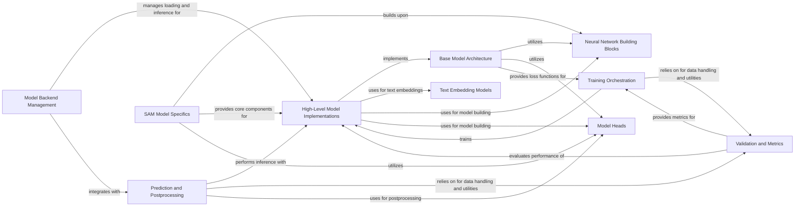

## Component Details

This graph provides an overview of the 'Model Architecture & Implementations' subsystem within the project. It encompasses the foundational neural network building blocks and the specific implementations of various computer vision models (e.g., YOLO, SAM, RTDETR) for tasks like detection, segmentation, and pose estimation. The main flow involves defining base model structures, assembling them from neural network building blocks and task-specific heads, managing model loading and inference, orchestrating training processes, and performing validation and prediction tasks. The purpose is to provide a modular and extensible framework for developing and deploying diverse computer vision models.

### Model Backend Management
This component is responsible for dynamically selecting and loading various model formats (e.g., PyTorch, ONNX, OpenVINO, TensorRT) for efficient inference. It handles model initialization, device placement, precision settings (FP16), and manages metadata associated with the loaded models. It also includes utility functions for checking and formatting class names.

**Related Classes/Methods**:

- <a href="https://github.com/ultralytics/ultralytics/blob/master/ultralytics/nn/autobackend.py#L70-L886" target="_blank" rel="noopener noreferrer">`ultralytics.nn.autobackend.AutoBackend` (70:886)</a>
- <a href="https://github.com/ultralytics/ultralytics/blob/master/ultralytics/nn/autobackend.py#L22-L49" target="_blank" rel="noopener noreferrer">`ultralytics.nn.autobackend.check_class_names` (22:49)</a>
- <a href="https://github.com/ultralytics/ultralytics/blob/master/ultralytics/nn/autobackend.py#L52-L67" target="_blank" rel="noopener noreferrer">`ultralytics.nn.autobackend.default_class_names` (52:67)</a>

### Base Model Architecture
This component defines the foundational structure for various neural network models, including common functionalities like forward pass, prediction logic, loss calculation, and model information retrieval. It serves as a base for specialized task-specific models. It also includes utilities for loading model weights and parsing model configurations.

**Related Classes/Methods**:

- <a href="https://github.com/ultralytics/ultralytics/blob/master/ultralytics/nn/tasks.py#L96-L341" target="_blank" rel="noopener noreferrer">`ultralytics.nn.tasks.BaseModel` (96:341)</a>
- <a href="https://github.com/ultralytics/ultralytics/blob/master/ultralytics/nn/tasks.py#L344-L498" target="_blank" rel="noopener noreferrer">`ultralytics.nn.tasks.DetectionModel` (344:498)</a>
- <a href="https://github.com/ultralytics/ultralytics/blob/master/ultralytics/nn/tasks.py#L535-L566" target="_blank" rel="noopener noreferrer">`ultralytics.nn.tasks.SegmentationModel` (535:566)</a>
- <a href="https://github.com/ultralytics/ultralytics/blob/master/ultralytics/nn/tasks.py#L569-L609" target="_blank" rel="noopener noreferrer">`ultralytics.nn.tasks.PoseModel` (569:609)</a>
- <a href="https://github.com/ultralytics/ultralytics/blob/master/ultralytics/nn/tasks.py#L612-L705" target="_blank" rel="noopener noreferrer">`ultralytics.nn.tasks.ClassificationModel` (612:705)</a>
- <a href="https://github.com/ultralytics/ultralytics/blob/master/ultralytics/nn/tasks.py#L708-L829" target="_blank" rel="noopener noreferrer">`ultralytics.nn.tasks.RTDETRDetectionModel` (708:829)</a>
- <a href="https://github.com/ultralytics/ultralytics/blob/master/ultralytics/nn/tasks.py#L832-L966" target="_blank" rel="noopener noreferrer">`ultralytics.nn.tasks.WorldModel` (832:966)</a>
- <a href="https://github.com/ultralytics/ultralytics/blob/master/ultralytics/nn/tasks.py#L969-L1216" target="_blank" rel="noopener noreferrer">`ultralytics.nn.tasks.YOLOEModel` (969:1216)</a>
- <a href="https://github.com/ultralytics/ultralytics/blob/master/ultralytics/nn/tasks.py#L1219-L1264" target="_blank" rel="noopener noreferrer">`ultralytics.nn.tasks.YOLOESegModel` (1219:1264)</a>
- <a href="https://github.com/ultralytics/ultralytics/blob/master/ultralytics/nn/tasks.py#L1486-L1532" target="_blank" rel="noopener noreferrer">`ultralytics.nn.tasks.attempt_load_weights` (1486:1532)</a>
- <a href="https://github.com/ultralytics/ultralytics/blob/master/ultralytics/nn/tasks.py#L1573-L1749" target="_blank" rel="noopener noreferrer">`ultralytics.nn.tasks.parse_model` (1573:1749)</a>
- <a href="https://github.com/ultralytics/ultralytics/blob/master/ultralytics/nn/tasks.py#L1752-L1773" target="_blank" rel="noopener noreferrer">`ultralytics.nn.tasks.yaml_model_load` (1752:1773)</a>
- <a href="https://github.com/ultralytics/ultralytics/blob/master/ultralytics/nn/tasks.py#L1404-L1483" target="_blank" rel="noopener noreferrer">`ultralytics.nn.tasks.torch_safe_load` (1404:1483)</a>
- <a href="https://github.com/ultralytics/ultralytics/blob/master/ultralytics/nn/tasks.py#L1792-L1860" target="_blank" rel="noopener noreferrer">`ultralytics.nn.tasks.guess_model_task` (1792:1860)</a>

### Neural Network Building Blocks
This component comprises the fundamental building blocks used to construct the neural networks. It includes various types of convolution layers (e.g., standard, depthwise, ghost, re-parameterized), attention mechanisms (e.g., CBAM, Transformer layers), and specialized architectural blocks (e.g., SPP, C1, C2, C2f, C3, Bottleneck, attention blocks). These modules are combined to form the backbone and neck of the models.

**Related Classes/Methods**:

- <a href="https://github.com/ultralytics/ultralytics/blob/master/ultralytics/nn/modules/conv.py#L38-L92" target="_blank" rel="noopener noreferrer">`ultralytics.nn.modules.conv.Conv` (38:92)</a>
- <a href="https://github.com/ultralytics/ultralytics/blob/master/ultralytics/nn/modules/conv.py#L95-L154" target="_blank" rel="noopener noreferrer">`ultralytics.nn.modules.conv.Conv2` (95:154)</a>
- <a href="https://github.com/ultralytics/ultralytics/blob/master/ultralytics/nn/modules/conv.py#L157-L192" target="_blank" rel="noopener noreferrer">`ultralytics.nn.modules.conv.LightConv` (157:192)</a>
- <a href="https://github.com/ultralytics/ultralytics/blob/master/ultralytics/nn/modules/conv.py#L195-L210" target="_blank" rel="noopener noreferrer">`ultralytics.nn.modules.conv.DWConv` (195:210)</a>
- <a href="https://github.com/ultralytics/ultralytics/blob/master/ultralytics/nn/modules/conv.py#L287-L326" target="_blank" rel="noopener noreferrer">`ultralytics.nn.modules.conv.Focus` (287:326)</a>
- <a href="https://github.com/ultralytics/ultralytics/blob/master/ultralytics/nn/modules/conv.py#L330-L372" target="_blank" rel="noopener noreferrer">`ultralytics.nn.modules.conv.GhostConv` (330:372)</a>
- <a href="https://github.com/ultralytics/ultralytics/blob/master/ultralytics/nn/modules/conv.py#L375-L538" target="_blank" rel="noopener noreferrer">`ultralytics.nn.modules.conv.RepConv` (375:538)</a>
- <a href="https://github.com/ultralytics/ultralytics/blob/master/ultralytics/nn/modules/conv.py#L618-L651" target="_blank" rel="noopener noreferrer">`ultralytics.nn.modules.conv.CBAM` (618:651)</a>
- <a href="https://github.com/ultralytics/ultralytics/blob/master/ultralytics/nn/modules/conv.py#L541-L578" target="_blank" rel="noopener noreferrer">`ultralytics.nn.modules.conv.ChannelAttention` (541:578)</a>
- <a href="https://github.com/ultralytics/ultralytics/blob/master/ultralytics/nn/modules/conv.py#L581-L615" target="_blank" rel="noopener noreferrer">`ultralytics.nn.modules.conv.SpatialAttention` (581:615)</a>
- <a href="https://github.com/ultralytics/ultralytics/blob/master/ultralytics/nn/modules/transformer.py#L29-L170" target="_blank" rel="noopener noreferrer">`ultralytics.nn.modules.transformer.TransformerEncoderLayer` (29:170)</a>
- <a href="https://github.com/ultralytics/ultralytics/blob/master/ultralytics/nn/modules/transformer.py#L173-L246" target="_blank" rel="noopener noreferrer">`ultralytics.nn.modules.transformer.AIFI` (173:246)</a>
- <a href="https://github.com/ultralytics/ultralytics/blob/master/ultralytics/nn/modules/transformer.py#L282-L328" target="_blank" rel="noopener noreferrer">`ultralytics.nn.modules.transformer.TransformerBlock` (282:328)</a>
- <a href="https://github.com/ultralytics/ultralytics/blob/master/ultralytics/nn/modules/transformer.py#L457-L580" target="_blank" rel="noopener noreferrer">`ultralytics.nn.modules.transformer.MSDeformAttn` (457:580)</a>
- <a href="https://github.com/ultralytics/ultralytics/blob/master/ultralytics/nn/modules/transformer.py#L583-L711" target="_blank" rel="noopener noreferrer">`ultralytics.nn.modules.transformer.DeformableTransformerDecoderLayer` (583:711)</a>
- <a href="https://github.com/ultralytics/ultralytics/blob/master/ultralytics/nn/modules/transformer.py#L714-L802" target="_blank" rel="noopener noreferrer">`ultralytics.nn.modules.transformer.DeformableTransformerDecoder` (714:802)</a>
- <a href="https://github.com/ultralytics/ultralytics/blob/master/ultralytics/nn/modules/transformer.py#L411-L454" target="_blank" rel="noopener noreferrer">`ultralytics.nn.modules.transformer.LayerNorm2d` (411:454)</a>
- <a href="https://github.com/ultralytics/ultralytics/blob/master/ultralytics/nn/modules/transformer.py#L361-L408" target="_blank" rel="noopener noreferrer">`ultralytics.nn.modules.transformer.MLP` (361:408)</a>
- <a href="https://github.com/ultralytics/ultralytics/blob/master/ultralytics/nn/modules/transformer.py#L331-L358" target="_blank" rel="noopener noreferrer">`ultralytics.nn.modules.transformer.MLPBlock` (331:358)</a>
- <a href="https://github.com/ultralytics/ultralytics/blob/master/ultralytics/nn/modules/block.py#L85-L105" target="_blank" rel="noopener noreferrer">`ultralytics.nn.modules.block.Proto` (85:105)</a>
- <a href="https://github.com/ultralytics/ultralytics/blob/master/ultralytics/nn/modules/block.py#L108-L143" target="_blank" rel="noopener noreferrer">`ultralytics.nn.modules.block.HGStem` (108:143)</a>
- <a href="https://github.com/ultralytics/ultralytics/blob/master/ultralytics/nn/modules/block.py#L146-L189" target="_blank" rel="noopener noreferrer">`ultralytics.nn.modules.block.HGBlock` (146:189)</a>
- <a href="https://github.com/ultralytics/ultralytics/blob/master/ultralytics/nn/modules/block.py#L192-L213" target="_blank" rel="noopener noreferrer">`ultralytics.nn.modules.block.SPP` (192:213)</a>
- <a href="https://github.com/ultralytics/ultralytics/blob/master/ultralytics/nn/modules/block.py#L216-L241" target="_blank" rel="noopener noreferrer">`ultralytics.nn.modules.block.SPPF` (216:241)</a>
- <a href="https://github.com/ultralytics/ultralytics/blob/master/ultralytics/nn/modules/block.py#L244-L263" target="_blank" rel="noopener noreferrer">`ultralytics.nn.modules.block.C1` (244:263)</a>
- <a href="https://github.com/ultralytics/ultralytics/blob/master/ultralytics/nn/modules/block.py#L266-L291" target="_blank" rel="noopener noreferrer">`ultralytics.nn.modules.block.C2` (266:291)</a>
- <a href="https://github.com/ultralytics/ultralytics/blob/master/ultralytics/nn/modules/block.py#L294-L326" target="_blank" rel="noopener noreferrer">`ultralytics.nn.modules.block.C2f` (294:326)</a>
- <a href="https://github.com/ultralytics/ultralytics/blob/master/ultralytics/nn/modules/block.py#L329-L353" target="_blank" rel="noopener noreferrer">`ultralytics.nn.modules.block.C3` (329:353)</a>
- <a href="https://github.com/ultralytics/ultralytics/blob/master/ultralytics/nn/modules/block.py#L356-L373" target="_blank" rel="noopener noreferrer">`ultralytics.nn.modules.block.C3x` (356:373)</a>
- <a href="https://github.com/ultralytics/ultralytics/blob/master/ultralytics/nn/modules/block.py#L376-L398" target="_blank" rel="noopener noreferrer">`ultralytics.nn.modules.block.RepC3` (376:398)</a>
- <a href="https://github.com/ultralytics/ultralytics/blob/master/ultralytics/nn/modules/block.py#L401-L418" target="_blank" rel="noopener noreferrer">`ultralytics.nn.modules.block.C3TR` (401:418)</a>
- <a href="https://github.com/ultralytics/ultralytics/blob/master/ultralytics/nn/modules/block.py#L421-L438" target="_blank" rel="noopener noreferrer">`ultralytics.nn.modules.block.C3Ghost` (421:438)</a>
- <a href="https://github.com/ultralytics/ultralytics/blob/master/ultralytics/nn/modules/block.py#L441-L467" target="_blank" rel="noopener noreferrer">`ultralytics.nn.modules.block.GhostBottleneck` (441:467)</a>
- <a href="https://github.com/ultralytics/ultralytics/blob/master/ultralytics/nn/modules/block.py#L470-L495" target="_blank" rel="noopener noreferrer">`ultralytics.nn.modules.block.Bottleneck` (470:495)</a>
- <a href="https://github.com/ultralytics/ultralytics/blob/master/ultralytics/nn/modules/block.py#L498-L527" target="_blank" rel="noopener noreferrer">`ultralytics.nn.modules.block.BottleneckCSP` (498:527)</a>
- <a href="https://github.com/ultralytics/ultralytics/blob/master/ultralytics/nn/modules/block.py#L530-L552" target="_blank" rel="noopener noreferrer">`ultralytics.nn.modules.block.ResNetBlock` (530:552)</a>
- <a href="https://github.com/ultralytics/ultralytics/blob/master/ultralytics/nn/modules/block.py#L555-L584" target="_blank" rel="noopener noreferrer">`ultralytics.nn.modules.block.ResNetLayer` (555:584)</a>
- <a href="https://github.com/ultralytics/ultralytics/blob/master/ultralytics/nn/modules/block.py#L587-L638" target="_blank" rel="noopener noreferrer">`ultralytics.nn.modules.block.MaxSigmoidAttnBlock` (587:638)</a>
- <a href="https://github.com/ultralytics/ultralytics/blob/master/ultralytics/nn/modules/block.py#L641-L707" target="_blank" rel="noopener noreferrer">`ultralytics.nn.modules.block.C2fAttn` (641:707)</a>
- <a href="https://github.com/ultralytics/ultralytics/blob/master/ultralytics/nn/modules/block.py#L855-L874" target="_blank" rel="noopener noreferrer">`ultralytics.nn.modules.block.RepBottleneck` (855:874)</a>
- <a href="https://github.com/ultralytics/ultralytics/blob/master/ultralytics/nn/modules/block.py#L877-L894" target="_blank" rel="noopener noreferrer">`ultralytics.nn.modules.block.RepCSP` (877:894)</a>
- <a href="https://github.com/ultralytics/ultralytics/blob/master/ultralytics/nn/modules/block.py#L897-L928" target="_blank" rel="noopener noreferrer">`ultralytics.nn.modules.block.RepNCSPELAN4` (897:928)</a>
- <a href="https://github.com/ultralytics/ultralytics/blob/master/ultralytics/nn/modules/block.py#L931-L949" target="_blank" rel="noopener noreferrer">`ultralytics.nn.modules.block.ELAN1` (931:949)</a>
- <a href="https://github.com/ultralytics/ultralytics/blob/master/ultralytics/nn/modules/block.py#L952-L969" target="_blank" rel="noopener noreferrer">`ultralytics.nn.modules.block.AConv` (952:969)</a>
- <a href="https://github.com/ultralytics/ultralytics/blob/master/ultralytics/nn/modules/block.py#L972-L995" target="_blank" rel="noopener noreferrer">`ultralytics.nn.modules.block.ADown` (972:995)</a>
- <a href="https://github.com/ultralytics/ultralytics/blob/master/ultralytics/nn/modules/block.py#L998-L1023" target="_blank" rel="noopener noreferrer">`ultralytics.nn.modules.block.SPPELAN` (998:1023)</a>
- <a href="https://github.com/ultralytics/ultralytics/blob/master/ultralytics/nn/modules/block.py#L1026-L1047" target="_blank" rel="noopener noreferrer">`ultralytics.nn.modules.block.CBLinear` (1026:1047)</a>
- <a href="https://github.com/ultralytics/ultralytics/blob/master/ultralytics/nn/modules/block.py#L1078-L1104" target="_blank" rel="noopener noreferrer">`ultralytics.nn.modules.block.C3f` (1078:1104)</a>
- <a href="https://github.com/ultralytics/ultralytics/blob/master/ultralytics/nn/modules/block.py#L1107-L1128" target="_blank" rel="noopener noreferrer">`ultralytics.nn.modules.block.C3k2` (1107:1128)</a>
- <a href="https://github.com/ultralytics/ultralytics/blob/master/ultralytics/nn/modules/block.py#L1131-L1150" target="_blank" rel="noopener noreferrer">`ultralytics.nn.modules.block.C3k` (1131:1150)</a>
- <a href="https://github.com/ultralytics/ultralytics/blob/master/ultralytics/nn/modules/block.py#L1153-L1217" target="_blank" rel="noopener noreferrer">`ultralytics.nn.modules.block.RepVGGDW` (1153:1217)</a>
- <a href="https://github.com/ultralytics/ultralytics/blob/master/ultralytics/nn/modules/block.py#L1220-L1265" target="_blank" rel="noopener noreferrer">`ultralytics.nn.modules.block.CIB` (1220:1265)</a>
- <a href="https://github.com/ultralytics/ultralytics/blob/master/ultralytics/nn/modules/block.py#L1268-L1298" target="_blank" rel="noopener noreferrer">`ultralytics.nn.modules.block.C2fCIB` (1268:1298)</a>
- <a href="https://github.com/ultralytics/ultralytics/blob/master/ultralytics/nn/modules/block.py#L1301-L1361" target="_blank" rel="noopener noreferrer">`ultralytics.nn.modules.block.Attention` (1301:1361)</a>
- <a href="https://github.com/ultralytics/ultralytics/blob/master/ultralytics/nn/modules/block.py#L1364-L1414" target="_blank" rel="noopener noreferrer">`ultralytics.nn.modules.block.PSABlock` (1364:1414)</a>
- <a href="https://github.com/ultralytics/ultralytics/blob/master/ultralytics/nn/modules/block.py#L1417-L1472" target="_blank" rel="noopener noreferrer">`ultralytics.nn.modules.block.PSA` (1417:1472)</a>
- <a href="https://github.com/ultralytics/ultralytics/blob/master/ultralytics/nn/modules/block.py#L1475-L1530" target="_blank" rel="noopener noreferrer">`ultralytics.nn.modules.block.C2PSA` (1475:1530)</a>
- <a href="https://github.com/ultralytics/ultralytics/blob/master/ultralytics/nn/modules/block.py#L1533-L1570" target="_blank" rel="noopener noreferrer">`ultralytics.nn.modules.block.C2fPSA` (1533:1570)</a>
- <a href="https://github.com/ultralytics/ultralytics/blob/master/ultralytics/nn/modules/block.py#L1573-L1621" target="_blank" rel="noopener noreferrer">`ultralytics.nn.modules.block.SCDown` (1573:1621)</a>
- <a href="https://github.com/ultralytics/ultralytics/blob/master/ultralytics/nn/modules/block.py#L1689-L1772" target="_blank" rel="noopener noreferrer">`ultralytics.nn.modules.block.AAttn` (1689:1772)</a>
- <a href="https://github.com/ultralytics/ultralytics/blob/master/ultralytics/nn/modules/block.py#L1775-L1840" target="_blank" rel="noopener noreferrer">`ultralytics.nn.modules.block.ABlock` (1775:1840)</a>
- <a href="https://github.com/ultralytics/ultralytics/blob/master/ultralytics/nn/modules/block.py#L1843-L1925" target="_blank" rel="noopener noreferrer">`ultralytics.nn.modules.block.A2C2f` (1843:1925)</a>
- <a href="https://github.com/ultralytics/ultralytics/blob/master/ultralytics/nn/modules/block.py#L1974-L2033" target="_blank" rel="noopener noreferrer">`ultralytics.nn.modules.block.SAVPE` (1974:2033)</a>
- <a href="https://github.com/ultralytics/ultralytics/blob/master/ultralytics/nn/modules/block.py#L58-L81" target="_blank" rel="noopener noreferrer">`ultralytics.nn.modules.block.DFL` (58:81)</a>
- <a href="https://github.com/ultralytics/ultralytics/blob/master/ultralytics/nn/modules/block.py#L1952-L1971" target="_blank" rel="noopener noreferrer">`ultralytics.nn.modules.block.Residual` (1952:1971)</a>

### Model Heads
This component provides the output layers (heads) for various computer vision tasks. These heads are responsible for processing the features extracted by the neural network backbone and predicting bounding boxes, class probabilities, segmentation masks, oriented bounding boxes, or keypoints, depending on the specific task. They often incorporate specialized layers and post-processing logic.

**Related Classes/Methods**:

- <a href="https://github.com/ultralytics/ultralytics/blob/master/ultralytics/nn/modules/head.py#L24-L230" target="_blank" rel="noopener noreferrer">`ultralytics.nn.modules.head.Detect` (24:230)</a>
- <a href="https://github.com/ultralytics/ultralytics/blob/master/ultralytics/nn/modules/head.py#L233-L282" target="_blank" rel="noopener noreferrer">`ultralytics.nn.modules.head.Segment` (233:282)</a>
- <a href="https://github.com/ultralytics/ultralytics/blob/master/ultralytics/nn/modules/head.py#L285-L338" target="_blank" rel="noopener noreferrer">`ultralytics.nn.modules.head.OBB` (285:338)</a>
- <a href="https://github.com/ultralytics/ultralytics/blob/master/ultralytics/nn/modules/head.py#L341-L416" target="_blank" rel="noopener noreferrer">`ultralytics.nn.modules.head.Pose` (341:416)</a>
- <a href="https://github.com/ultralytics/ultralytics/blob/master/ultralytics/nn/modules/head.py#L419-L471" target="_blank" rel="noopener noreferrer">`ultralytics.nn.modules.head.Classify` (419:471)</a>
- <a href="https://github.com/ultralytics/ultralytics/blob/master/ultralytics/nn/modules/head.py#L474-L528" target="_blank" rel="noopener noreferrer">`ultralytics.nn.modules.head.WorldDetect` (474:528)</a>
- <a href="https://github.com/ultralytics/ultralytics/blob/master/ultralytics/nn/modules/head.py#L532-L594" target="_blank" rel="noopener noreferrer">`ultralytics.nn.modules.head.LRPCHead` (532:594)</a>
- <a href="https://github.com/ultralytics/ultralytics/blob/master/ultralytics/nn/modules/head.py#L597-L784" target="_blank" rel="noopener noreferrer">`ultralytics.nn.modules.head.YOLOEDetect` (597:784)</a>
- <a href="https://github.com/ultralytics/ultralytics/blob/master/ultralytics/nn/modules/head.py#L787-L852" target="_blank" rel="noopener noreferrer">`ultralytics.nn.modules.head.YOLOESegment` (787:852)</a>
- <a href="https://github.com/ultralytics/ultralytics/blob/master/ultralytics/nn/modules/head.py#L855-L1174" target="_blank" rel="noopener noreferrer">`ultralytics.nn.modules.head.RTDETRDecoder` (855:1174)</a>
- <a href="https://github.com/ultralytics/ultralytics/blob/master/ultralytics/nn/modules/head.py#L1177-L1228" target="_blank" rel="noopener noreferrer">`ultralytics.nn.modules.head.v10Detect` (1177:1228)</a>

### Text Embedding Models
This component focuses on models and functionalities related to processing and encoding text. It includes implementations of CLIP and MobileCLIP for generating text embeddings, which are crucial for tasks like zero-shot object detection in models like YOLO-World.

**Related Classes/Methods**:

- <a href="https://github.com/ultralytics/ultralytics/blob/master/ultralytics/nn/text_model.py#L47-L134" target="_blank" rel="noopener noreferrer">`ultralytics.nn.text_model.CLIP` (47:134)</a>
- <a href="https://github.com/ultralytics/ultralytics/blob/master/ultralytics/nn/text_model.py#L137-L241" target="_blank" rel="noopener noreferrer">`ultralytics.nn.text_model.MobileCLIP` (137:241)</a>
- <a href="https://github.com/ultralytics/ultralytics/blob/master/ultralytics/nn/text_model.py#L244-L325" target="_blank" rel="noopener noreferrer">`ultralytics.nn.text_model.MobileCLIPTS` (244:325)</a>
- <a href="https://github.com/ultralytics/ultralytics/blob/master/ultralytics/nn/text_model.py#L328-L349" target="_blank" rel="noopener noreferrer">`ultralytics.nn.text_model.build_text_model` (328:349)</a>
- <a href="https://github.com/ultralytics/ultralytics/blob/master/ultralytics/nn/text_model.py#L20-L44" target="_blank" rel="noopener noreferrer">`ultralytics.nn.text_model.TextModel` (20:44)</a>

### High-Level Model Implementations
This component provides the high-level definitions and initializations for various model variants, including standard YOLO, YOLO-World, YOLOE, RTDETR, FastSAM, and NAS models. These classes typically inherit from a base model and integrate the specific neural network architectures and task heads required for their respective functionalities.

**Related Classes/Methods**:

- <a href="https://github.com/ultralytics/ultralytics/blob/master/ultralytics/models/yolo/model.py#L22-L121" target="_blank" rel="noopener noreferrer">`ultralytics.models.yolo.model.YOLO` (22:121)</a>
- <a href="https://github.com/ultralytics/ultralytics/blob/master/ultralytics/models/yolo/model.py#L124-L195" target="_blank" rel="noopener noreferrer">`ultralytics.models.yolo.model.YOLOWorld` (124:195)</a>
- <a href="https://github.com/ultralytics/ultralytics/blob/master/ultralytics/models/yolo/model.py#L198-L443" target="_blank" rel="noopener noreferrer">`ultralytics.models.yolo.model.YOLOE` (198:443)</a>
- <a href="https://github.com/ultralytics/ultralytics/blob/master/ultralytics/models/rtdetr/model.py#L20-L64" target="_blank" rel="noopener noreferrer">`ultralytics.models.rtdetr.model.RTDETR` (20:64)</a>
- <a href="https://github.com/ultralytics/ultralytics/blob/master/ultralytics/models/fastsam/model.py#L12-L79" target="_blank" rel="noopener noreferrer">`ultralytics.models.fastsam.model.FastSAM` (12:79)</a>
- <a href="https://github.com/ultralytics/ultralytics/blob/master/ultralytics/models/nas/model.py#L17-L98" target="_blank" rel="noopener noreferrer">`ultralytics.models.nas.model.NAS` (17:98)</a>

### Training Orchestration
This component manages the end-to-end training process for different computer vision tasks. It handles model setup, dataset loading, data augmentation, optimization, logging, and metric plotting. Specific trainers are implemented for classification, pose estimation, object detection, segmentation, and specialized YOLO-E and YOLO-World training regimes.

**Related Classes/Methods**:

- <a href="https://github.com/ultralytics/ultralytics/blob/master/ultralytics/models/yolo/classify/train.py#L17-L237" target="_blank" rel="noopener noreferrer">`ultralytics.models.yolo.classify.train.ClassificationTrainer` (17:237)</a>
- <a href="https://github.com/ultralytics/ultralytics/blob/master/ultralytics/models/yolo/pose/train.py#L13-L162" target="_blank" rel="noopener noreferrer">`ultralytics.models.yolo.pose.train.PoseTrainer` (13:162)</a>
- <a href="https://github.com/ultralytics/ultralytics/blob/master/ultralytics/models/yolo/yoloe/train.py#L21-L107" target="_blank" rel="noopener noreferrer">`ultralytics.models.yolo.yoloe.train.YOLOETrainer` (21:107)</a>
- <a href="https://github.com/ultralytics/ultralytics/blob/master/ultralytics/models/yolo/yoloe/train.py#L110-L161" target="_blank" rel="noopener noreferrer">`ultralytics.models.yolo.yoloe.train.YOLOEPETrainer` (110:161)</a>
- <a href="https://github.com/ultralytics/ultralytics/blob/master/ultralytics/models/yolo/yoloe/train.py#L164-L228" target="_blank" rel="noopener noreferrer">`ultralytics.models.yolo.yoloe.train.YOLOETrainerFromScratch` (164:228)</a>
- <a href="https://github.com/ultralytics/ultralytics/blob/master/ultralytics/models/yolo/yoloe/train.py#L231-L273" target="_blank" rel="noopener noreferrer">`ultralytics.models.yolo.yoloe.train.YOLOEPEFreeTrainer` (231:273)</a>
- <a href="https://github.com/ultralytics/ultralytics/blob/master/ultralytics/models/yolo/yoloe/train.py#L276-L321" target="_blank" rel="noopener noreferrer">`ultralytics.models.yolo.yoloe.train.YOLOEVPTrainer` (276:321)</a>
- <a href="https://github.com/ultralytics/ultralytics/blob/master/ultralytics/models/yolo/yoloe/train_seg.py#L13-L61" target="_blank" rel="noopener noreferrer">`ultralytics.models.yolo.yoloe.train_seg.YOLOESegTrainer` (13:61)</a>
- <a href="https://github.com/ultralytics/ultralytics/blob/master/ultralytics/models/yolo/yoloe/train_seg.py#L64-L115" target="_blank" rel="noopener noreferrer">`ultralytics.models.yolo.yoloe.train_seg.YOLOEPESegTrainer` (64:115)</a>
- <a href="https://github.com/ultralytics/ultralytics/blob/master/ultralytics/models/yolo/obb/train.py#L12-L89" target="_blank" rel="noopener noreferrer">`ultralytics.models.yolo.obb.train.OBBTrainer` (12:89)</a>
- <a href="https://github.com/ultralytics/ultralytics/blob/master/ultralytics/models/yolo/detect/train.py#L20-L218" target="_blank" rel="noopener noreferrer">`ultralytics.models.yolo.detect.train.DetectionTrainer` (20:218)</a>
- <a href="https://github.com/ultralytics/ultralytics/blob/master/ultralytics/models/yolo/world/train.py#L24-L175" target="_blank" rel="noopener noreferrer">`ultralytics.models.yolo.world.train.WorldTrainer` (24:175)</a>
- <a href="https://github.com/ultralytics/ultralytics/blob/master/ultralytics/models/yolo/world/train_world.py#L10-L185" target="_blank" rel="noopener noreferrer">`ultralytics.models.yolo.world.train_world.WorldTrainerFromScratch` (10:185)</a>
- <a href="https://github.com/ultralytics/ultralytics/blob/master/ultralytics/models/yolo/segment/train.py#L13-L127" target="_blank" rel="noopener noreferrer">`ultralytics.models.yolo.segment.train.SegmentationTrainer` (13:127)</a>
- <a href="https://github.com/ultralytics/ultralytics/blob/master/ultralytics/models/rtdetr/train.py#L13-L91" target="_blank" rel="noopener noreferrer">`ultralytics.models.rtdetr.train.RTDETRTrainer` (13:91)</a>
- <a href="https://github.com/ultralytics/ultralytics/blob/master/ultralytics/engine/trainer.py#L59-L870" target="_blank" rel="noopener noreferrer">`ultralytics.engine.trainer.BaseTrainer` (59:870)</a>

### Validation and Metrics
This component is responsible for evaluating the performance of trained models across various tasks. It handles data preprocessing for validation, initializes and updates task-specific metrics (e.g., mAP, Confusion Matrix, PoseMetrics, OBBMetrics, SegmentMetrics), and provides functionalities for plotting validation samples and prediction results. It also includes methods for saving results and evaluating JSON outputs.

**Related Classes/Methods**:

- <a href="https://github.com/ultralytics/ultralytics/blob/master/ultralytics/models/yolo/classify/val.py#L12-L209" target="_blank" rel="noopener noreferrer">`ultralytics.models.yolo.classify.val.ClassificationValidator` (12:209)</a>
- <a href="https://github.com/ultralytics/ultralytics/blob/master/ultralytics/models/yolo/pose/val.py#L16-L416" target="_blank" rel="noopener noreferrer">`ultralytics.models.yolo.pose.val.PoseValidator` (16:416)</a>
- <a href="https://github.com/ultralytics/ultralytics/blob/master/ultralytics/models/yolo/yoloe/val.py#L20-L209" target="_blank" rel="noopener noreferrer">`ultralytics.models.yolo.yoloe.val.YOLOEDetectValidator` (20:209)</a>
- <a href="https://github.com/ultralytics/ultralytics/blob/master/ultralytics/models/yolo/yoloe/val.py#L212-L215" target="_blank" rel="noopener noreferrer">`ultralytics.models.yolo.yoloe.val.YOLOESegValidator` (212:215)</a>
- <a href="https://github.com/ultralytics/ultralytics/blob/master/ultralytics/models/yolo/obb/val.py#L14-L295" target="_blank" rel="noopener noreferrer">`ultralytics.models.yolo.obb.val.OBBValidator` (14:295)</a>
- <a href="https://github.com/ultralytics/ultralytics/blob/master/ultralytics/models/yolo/detect/val.py#L18-L442" target="_blank" rel="noopener noreferrer">`ultralytics.models.yolo.detect.val.DetectionValidator` (18:442)</a>
- <a href="https://github.com/ultralytics/ultralytics/blob/master/ultralytics/models/yolo/segment/val.py#L18-L435" target="_blank" rel="noopener noreferrer">`ultralytics.models.yolo.segment.val.SegmentationValidator` (18:435)</a>
- <a href="https://github.com/ultralytics/ultralytics/blob/master/ultralytics/models/rtdetr/val.py#L13-L99" target="_blank" rel="noopener noreferrer">`ultralytics.models.rtdetr.val.RTDETRDataset` (13:99)</a>
- <a href="https://github.com/ultralytics/ultralytics/blob/master/ultralytics/models/rtdetr/val.py#L102-L218" target="_blank" rel="noopener noreferrer">`ultralytics.models.rtdetr.val.RTDETRValidator` (102:218)</a>
- <a href="https://github.com/ultralytics/ultralytics/blob/master/ultralytics/models/fastsam/val.py#L7-L42" target="_blank" rel="noopener noreferrer">`ultralytics.models.fastsam.val.FastSAMValidator` (7:42)</a>
- <a href="https://github.com/ultralytics/ultralytics/blob/master/ultralytics/models/nas/val.py#L11-L39" target="_blank" rel="noopener noreferrer">`ultralytics.models.nas.val.NASValidator` (11:39)</a>
- <a href="https://github.com/ultralytics/ultralytics/blob/master/ultralytics/engine/validator.py#L42-L372" target="_blank" rel="noopener noreferrer">`ultralytics.engine.validator.BaseValidator` (42:372)</a>
- <a href="https://github.com/ultralytics/ultralytics/blob/master/ultralytics/utils/metrics.py#L1431-L1503" target="_blank" rel="noopener noreferrer">`ultralytics.utils.metrics.ClassifyMetrics` (1431:1503)</a>
- <a href="https://github.com/ultralytics/ultralytics/blob/master/ultralytics/utils/metrics.py#L312-L542" target="_blank" rel="noopener noreferrer">`ultralytics.utils.metrics.ConfusionMatrix` (312:542)</a>
- <a href="https://github.com/ultralytics/ultralytics/blob/master/ultralytics/utils/metrics.py#L946-L1072" target="_blank" rel="noopener noreferrer">`ultralytics.utils.metrics.DetMetrics` (946:1072)</a>
- <a href="https://github.com/ultralytics/ultralytics/blob/master/ultralytics/utils/metrics.py#L773-L943" target="_blank" rel="noopener noreferrer">`ultralytics.utils.metrics.Metric` (773:943)</a>
- <a href="https://github.com/ultralytics/ultralytics/blob/master/ultralytics/utils/metrics.py#L1506-L1631" target="_blank" rel="noopener noreferrer">`ultralytics.utils.metrics.OBBMetrics` (1506:1631)</a>
- <a href="https://github.com/ultralytics/ultralytics/blob/master/ultralytics/utils/metrics.py#L1253-L1428" target="_blank" rel="noopener noreferrer">`ultralytics.utils.metrics.PoseMetrics` (1253:1428)</a>
- <a href="https://github.com/ultralytics/ultralytics/blob/master/ultralytics/utils/metrics.py#L1075-L1250" target="_blank" rel="noopener noreferrer">`ultralytics.utils.metrics.SegmentMetrics` (1075:1250)</a>

### Prediction and Postprocessing
This component manages the inference pipeline for deployed models. It handles source setup, image preprocessing, model execution, and crucial post-processing steps such as Non-Maximum Suppression (NMS), converting tensor outputs to numpy arrays, scaling bounding boxes/masks, and constructing final prediction results. It provides specialized predictors for classification, pose, object detection, segmentation, and YOLO-E, RTDETR, FastSAM, and NAS models.

**Related Classes/Methods**:

- <a href="https://github.com/ultralytics/ultralytics/blob/master/ultralytics/models/yolo/classify/predict.py#L13-L99" target="_blank" rel="noopener noreferrer">`ultralytics.models.yolo.classify.predict.ClassificationPredictor` (13:99)</a>
- <a href="https://github.com/ultralytics/ultralytics/blob/master/ultralytics/models/yolo/pose/predict.py#L7-L80" target="_blank" rel="noopener noreferrer">`ultralytics.models.yolo.pose.predict.PosePredictor` (7:80)</a>
- <a href="https://github.com/ultralytics/ultralytics/blob/master/ultralytics/models/yolo/yoloe/predict.py#L11-L163" target="_blank" rel="noopener noreferrer">`ultralytics.models.yolo.yoloe.predict.YOLOEVPDetectPredictor` (11:163)</a>
- <a href="https://github.com/ultralytics/ultralytics/blob/master/ultralytics/models/yolo/obb/predict.py#L10-L65" target="_blank" rel="noopener noreferrer">`ultralytics.models.yolo.obb.predict.OBBPredictor` (10:65)</a>
- <a href="https://github.com/ultralytics/ultralytics/blob/master/ultralytics/models/yolo/detect/predict.py#L8-L125" target="_blank" rel="noopener noreferrer">`ultralytics.models.yolo.detect.predict.DetectionPredictor` (8:125)</a>
- <a href="https://github.com/ultralytics/ultralytics/blob/master/ultralytics/models/yolo/segment/predict.py#L8-L113" target="_blank" rel="noopener noreferrer">`ultralytics.models.yolo.segment.predict.SegmentationPredictor` (8:113)</a>
- <a href="https://github.com/ultralytics/ultralytics/blob/master/ultralytics/models/rtdetr/predict.py#L11-L91" target="_blank" rel="noopener noreferrer">`ultralytics.models.rtdetr.predict.RTDETRPredictor` (11:91)</a>
- <a href="https://github.com/ultralytics/ultralytics/blob/master/ultralytics/models/fastsam/predict.py#L14-L180" target="_blank" rel="noopener noreferrer">`ultralytics.models.fastsam.predict.FastSAMPredictor` (14:180)</a>
- <a href="https://github.com/ultralytics/ultralytics/blob/master/ultralytics/models/nas/predict.py#L9-L58" target="_blank" rel="noopener noreferrer">`ultralytics.models.nas.predict.NASPredictor` (9:58)</a>
- <a href="https://github.com/ultralytics/ultralytics/blob/master/ultralytics/engine/predictor.py#L67-L511" target="_blank" rel="noopener noreferrer">`ultralytics.engine.predictor.BasePredictor` (67:511)</a>
- <a href="https://github.com/ultralytics/ultralytics/blob/master/ultralytics/engine/results.py#L857-L1073" target="_blank" rel="noopener noreferrer">`ultralytics.engine.results.Boxes` (857:1073)</a>
- <a href="https://github.com/ultralytics/ultralytics/blob/master/ultralytics/engine/results.py#L1174-L1296" target="_blank" rel="noopener noreferrer">`ultralytics.engine.results.Keypoints` (1174:1296)</a>
- <a href="https://github.com/ultralytics/ultralytics/blob/master/ultralytics/engine/results.py#L1076-L1171" target="_blank" rel="noopener noreferrer">`ultralytics.engine.results.Masks` (1076:1171)</a>
- <a href="https://github.com/ultralytics/ultralytics/blob/master/ultralytics/engine/results.py#L1440-L1662" target="_blank" rel="noopener noreferrer">`ultralytics.engine.results.OBB` (1440:1662)</a>
- <a href="https://github.com/ultralytics/ultralytics/blob/master/ultralytics/engine/results.py#L1299-L1437" target="_blank" rel="noopener noreferrer">`ultralytics.engine.results.Probs` (1299:1437)</a>
- <a href="https://github.com/ultralytics/ultralytics/blob/master/ultralytics/engine/results.py#L191-L854" target="_blank" rel="noopener noreferrer">`ultralytics.engine.results.Results` (191:854)</a>

### SAM Model Specifics
This component encapsulates the functionalities related to the Segment Anything Model (SAM) and its variants (SAM2, MobileSAM). It includes functions for building different SAM architectures, the core SAM model class, and specialized predictors for image and video segmentation. It also contains modules for image encoding, prompt encoding, mask decoding, and attention mechanisms specific to SAM.

**Related Classes/Methods**:

- <a href="https://github.com/ultralytics/ultralytics/blob/master/ultralytics/models/sam/build.py#L23-L31" target="_blank" rel="noopener noreferrer">`ultralytics.models.sam.build.build_sam_vit_h` (23:31)</a>
- <a href="https://github.com/ultralytics/ultralytics/blob/master/ultralytics/models/sam/build.py#L34-L42" target="_blank" rel="noopener noreferrer">`ultralytics.models.sam.build.build_sam_vit_l` (34:42)</a>
- <a href="https://github.com/ultralytics/ultralytics/blob/master/ultralytics/models/sam/build.py#L45-L53" target="_blank" rel="noopener noreferrer">`ultralytics.models.sam.build.build_sam_vit_b` (45:53)</a>
- <a href="https://github.com/ultralytics/ultralytics/blob/master/ultralytics/models/sam/build.py#L56-L65" target="_blank" rel="noopener noreferrer">`ultralytics.models.sam.build.build_mobile_sam` (56:65)</a>
- <a href="https://github.com/ultralytics/ultralytics/blob/master/ultralytics/models/sam/build.py#L68-L78" target="_blank" rel="noopener noreferrer">`ultralytics.models.sam.build.build_sam2_t` (68:78)</a>
- <a href="https://github.com/ultralytics/ultralytics/blob/master/ultralytics/models/sam/build.py#L81-L91" target="_blank" rel="noopener noreferrer">`ultralytics.models.sam.build.build_sam2_s` (81:91)</a>
- <a href="https://github.com/ultralytics/ultralytics/blob/master/ultralytics/models/sam/build.py#L94-L105" target="_blank" rel="noopener noreferrer">`ultralytics.models.sam.build.build_sam2_b` (94:105)</a>
- <a href="https://github.com/ultralytics/ultralytics/blob/master/ultralytics/models/sam/build.py#L108-L118" target="_blank" rel="noopener noreferrer">`ultralytics.models.sam.build.build_sam2_l` (108:118)</a>
- <a href="https://github.com/ultralytics/ultralytics/blob/master/ultralytics/models/sam/build.py#L121-L213" target="_blank" rel="noopener noreferrer">`ultralytics.models.sam.build._build_sam` (121:213)</a>
- <a href="https://github.com/ultralytics/ultralytics/blob/master/ultralytics/models/sam/build.py#L216-L308" target="_blank" rel="noopener noreferrer">`ultralytics.models.sam.build._build_sam2` (216:308)</a>
- <a href="https://github.com/ultralytics/ultralytics/blob/master/ultralytics/models/sam/model.py#L26-L171" target="_blank" rel="noopener noreferrer">`ultralytics.models.sam.model.SAM` (26:171)</a>
- <a href="https://github.com/ultralytics/ultralytics/blob/master/ultralytics/models/sam/predict.py#L36-L621" target="_blank" rel="noopener noreferrer">`ultralytics.models.sam.predict.Predictor` (36:621)</a>
- <a href="https://github.com/ultralytics/ultralytics/blob/master/ultralytics/models/sam/predict.py#L624-L814" target="_blank" rel="noopener noreferrer">`ultralytics.models.sam.predict.SAM2Predictor` (624:814)</a>
- <a href="https://github.com/ultralytics/ultralytics/blob/master/ultralytics/models/sam/predict.py#L817-L1618" target="_blank" rel="noopener noreferrer">`ultralytics.models.sam.predict.SAM2VideoPredictor` (817:1618)</a>
- <a href="https://github.com/ultralytics/ultralytics/blob/master/ultralytics/models/sam/amg.py#L114-L163" target="_blank" rel="noopener noreferrer">`ultralytics.models.sam.amg.generate_crop_boxes` (114:163)</a>
- <a href="https://github.com/ultralytics/ultralytics/blob/master/ultralytics/models/sam/amg.py#L109-L111" target="_blank" rel="noopener noreferrer">`ultralytics.models.sam.amg.build_all_layer_point_grids` (109:111)</a>
- <a href="https://github.com/ultralytics/ultralytics/blob/master/ultralytics/models/sam/amg.py#L41-L67" target="_blank" rel="noopener noreferrer">`ultralytics.models.sam.amg.batch_iterator` (41:67)</a>
- <a href="https://github.com/ultralytics/ultralytics/blob/master/ultralytics/models/sam/amg.py#L70-L97" target="_blank" rel="noopener noreferrer">`ultralytics.models.sam.amg.calculate_stability_score` (70:97)</a>
- <a href="https://github.com/ultralytics/ultralytics/blob/master/ultralytics/models/sam/amg.py#L235-L278" target="_blank" rel="noopener noreferrer">`ultralytics.models.sam.amg.batched_mask_to_box` (235:278)</a>
- <a href="https://github.com/ultralytics/ultralytics/blob/master/ultralytics/models/sam/amg.py#L11-L38" target="_blank" rel="noopener noreferrer">`ultralytics.models.sam.amg.is_box_near_crop_edge` (11:38)</a>
- <a href="https://github.com/ultralytics/ultralytics/blob/master/ultralytics/models/sam/amg.py#L166-L173" target="_blank" rel="noopener noreferrer">`ultralytics.models.sam.amg.uncrop_boxes_xyxy` (166:173)</a>
- <a href="https://github.com/ultralytics/ultralytics/blob/master/ultralytics/models/sam/amg.py#L186-L194" target="_blank" rel="noopener noreferrer">`ultralytics.models.sam.amg.uncrop_masks` (186:194)</a>
- <a href="https://github.com/ultralytics/ultralytics/blob/master/ultralytics/models/sam/amg.py#L197-L232" target="_blank" rel="noopener noreferrer">`ultralytics.models.sam.amg.remove_small_regions` (197:232)</a>
- <a href="https://github.com/ultralytics/ultralytics/blob/master/ultralytics/models/sam/modules/tiny_encoder.py#L75-L123" target="_blank" rel="noopener noreferrer">`ultralytics.models.sam.modules.tiny_encoder.PatchEmbed` (75:123)</a>
- <a href="https://github.com/ultralytics/ultralytics/blob/master/ultralytics/models/sam/modules/tiny_encoder.py#L126-L193" target="_blank" rel="noopener noreferrer">`ultralytics.models.sam.modules.tiny_encoder.MBConv` (126:193)</a>
- <a href="https://github.com/ultralytics/ultralytics/blob/master/ultralytics/models/sam/modules/tiny_encoder.py#L196-L257" target="_blank" rel="noopener noreferrer">`ultralytics.models.sam.modules.tiny_encoder.PatchMerging` (196:257)</a>
- <a href="https://github.com/ultralytics/ultralytics/blob/master/ultralytics/models/sam/modules/tiny_encoder.py#L260-L343" target="_blank" rel="noopener noreferrer">`ultralytics.models.sam.modules.tiny_encoder.ConvLayer` (260:343)</a>
- <a href="https://github.com/ultralytics/ultralytics/blob/master/ultralytics/models/sam/modules/tiny_encoder.py#L522-L663" target="_blank" rel="noopener noreferrer">`ultralytics.models.sam.modules.tiny_encoder.TinyViTBlock` (522:663)</a>
- <a href="https://github.com/ultralytics/ultralytics/blob/master/ultralytics/models/sam/modules/tiny_encoder.py#L666-L766" target="_blank" rel="noopener noreferrer">`ultralytics.models.sam.modules.tiny_encoder.BasicLayer` (666:766)</a>
- <a href="https://github.com/ultralytics/ultralytics/blob/master/ultralytics/models/sam/modules/tiny_encoder.py#L769-L997" target="_blank" rel="noopener noreferrer">`ultralytics.models.sam.modules.tiny_encoder.TinyViT` (769:997)</a>
- <a href="https://github.com/ultralytics/ultralytics/blob/master/ultralytics/models/sam/modules/encoders.py#L23-L155" target="_blank" rel="noopener noreferrer">`ultralytics.models.sam.modules.encoders.ImageEncoderViT` (23:155)</a>
- <a href="https://github.com/ultralytics/ultralytics/blob/master/ultralytics/models/sam/modules/encoders.py#L158-L353" target="_blank" rel="noopener noreferrer">`ultralytics.models.sam.modules.encoders.PromptEncoder` (158:353)</a>
- <a href="https://github.com/ultralytics/ultralytics/blob/master/ultralytics/models/sam/modules/encoders.py#L356-L438" target="_blank" rel="noopener noreferrer">`ultralytics.models.sam.modules.encoders.MemoryEncoder` (356:438)</a>
- <a href="https://github.com/ultralytics/ultralytics/blob/master/ultralytics/models/sam/modules/encoders.py#L515-L655" target="_blank" rel="noopener noreferrer">`ultralytics.models.sam.modules.encoders.FpnNeck` (515:655)</a>
- <a href="https://github.com/ultralytics/ultralytics/blob/master/ultralytics/models/sam/modules/encoders.py#L658-L851" target="_blank" rel="noopener noreferrer">`ultralytics.models.sam.modules.encoders.Hiera` (658:851)</a>
- <a href="https://github.com/ultralytics/ultralytics/blob/master/ultralytics/models/sam/modules/transformer.py#L12-L125" target="_blank" rel="noopener noreferrer">`ultralytics.models.sam.modules.transformer.TwoWayTransformer` (12:125)</a>
- <a href="https://github.com/ultralytics/ultralytics/blob/master/ultralytics/models/sam/modules/transformer.py#L128-L241" target="_blank" rel="noopener noreferrer">`ultralytics.models.sam.modules.transformer.TwoWayAttentionBlock` (128:241)</a>
- <a href="https://github.com/ultralytics/ultralytics/blob/master/ultralytics/models/sam/modules/transformer.py#L244-L351" target="_blank" rel="noopener noreferrer">`ultralytics.models.sam.modules.transformer.Attention` (244:351)</a>
- <a href="https://github.com/ultralytics/ultralytics/blob/master/ultralytics/models/sam/modules/sam.py#L103-L1037" target="_blank" rel="noopener noreferrer">`ultralytics.models.sam.modules.sam.SAM2Model` (103:1037)</a>
- <a href="https://github.com/ultralytics/ultralytics/blob/master/ultralytics/models/sam/modules/memory_attention.py#L12-L166" target="_blank" rel="noopener noreferrer">`ultralytics.models.sam.modules.memory_attention.MemoryAttentionLayer` (12:166)</a>
- <a href="https://github.com/ultralytics/ultralytics/blob/master/ultralytics/models/sam/modules/decoders.py#L11-L171" target="_blank" rel="noopener noreferrer">`ultralytics.models.sam.modules.decoders.MaskDecoder` (11:171)</a>
- <a href="https://github.com/ultralytics/ultralytics/blob/master/ultralytics/models/sam/modules/blocks.py#L54-L111" target="_blank" rel="noopener noreferrer">`ultralytics.models.sam.modules.blocks.MaskDownSampler` (54:111)</a>
- <a href="https://github.com/ultralytics/ultralytics/blob/master/ultralytics/models/sam/modules/blocks.py#L114-L205" target="_blank" rel="noopener noreferrer">`ultralytics.models.sam.modules.blocks.CXBlock` (114:205)</a>
- <a href="https://github.com/ultralytics/ultralytics/blob/master/ultralytics/models/sam/modules/blocks.py#L264-L324" target="_blank" rel="noopener noreferrer">`ultralytics.models.sam.modules.blocks.SAM2TwoWayAttentionBlock` (264:324)</a>
- <a href="https://github.com/ultralytics/ultralytics/blob/master/ultralytics/models/sam/modules/blocks.py#L327-L402" target="_blank" rel="noopener noreferrer">`ultralytics.models.sam.modules.blocks.SAM2TwoWayTransformer` (327:402)</a>
- <a href="https://github.com/ultralytics/ultralytics/blob/master/ultralytics/models/sam/modules/blocks.py#L405-L485" target="_blank" rel="noopener noreferrer">`ultralytics.models.sam.modules.blocks.RoPEAttention` (405:485)</a>
- <a href="https://github.com/ultralytics/ultralytics/blob/master/ultralytics/models/sam/modules/blocks.py#L503-L580" target="_blank" rel="noopener noreferrer">`ultralytics.models.sam.modules.blocks.MultiScaleAttention` (503:580)</a>
- <a href="https://github.com/ultralytics/ultralytics/blob/master/ultralytics/models/sam/modules/blocks.py#L583-L695" target="_blank" rel="noopener noreferrer">`ultralytics.models.sam.modules.blocks.MultiScaleBlock` (583:695)</a>
- <a href="https://github.com/ultralytics/ultralytics/blob/master/ultralytics/models/sam/modules/blocks.py#L698-L810" target="_blank" rel="noopener noreferrer">`ultralytics.models.sam.modules.blocks.PositionEmbeddingSine` (698:810)</a>
- <a href="https://github.com/ultralytics/ultralytics/blob/master/ultralytics/models/sam/modules/blocks.py#L813-L874" target="_blank" rel="noopener noreferrer">`ultralytics.models.sam.modules.blocks.PositionEmbeddingRandom` (813:874)</a>
- <a href="https://github.com/ultralytics/ultralytics/blob/master/ultralytics/models/sam/modules/blocks.py#L877-L974" target="_blank" rel="noopener noreferrer">`ultralytics.models.sam.modules.blocks.Block` (877:974)</a>
- <a href="https://github.com/ultralytics/ultralytics/blob/master/ultralytics/models/sam/modules/blocks.py#L977-L1066" target="_blank" rel="noopener noreferrer">`ultralytics.models.sam.modules.blocks.REAttention` (977:1066)</a>
- <a href="https://github.com/ultralytics/ultralytics/blob/master/ultralytics/models/sam/modules/utils.py#L117-L147" target="_blank" rel="noopener noreferrer">`ultralytics.models.sam.modules.utils.compute_axial_cis` (117:147)</a>
- <a href="https://github.com/ultralytics/ultralytics/blob/master/ultralytics/models/sam/modules/utils.py#L174-L217" target="_blank" rel="noopener noreferrer">`ultralytics.models.sam.modules.utils.apply_rotary_enc` (174:217)</a>
- <a href="https://github.com/ultralytics/ultralytics/blob/master/ultralytics/models/sam/modules/utils.py#L331-L386" target="_blank" rel="noopener noreferrer">`ultralytics.models.sam.modules.utils.add_decomposed_rel_pos` (331:386)</a>
- <a href="https://github.com/ultralytics/ultralytics/blob/master/ultralytics/models/sam/modules/sam.py#L28-L100" target="_blank" rel="noopener noreferrer">`ultralytics.models.sam.modules.sam.SAMModel` (28:100)</a>

### [FAQ](https://github.com/CodeBoarding/GeneratedOnBoardings/tree/main?tab=readme-ov-file#faq)