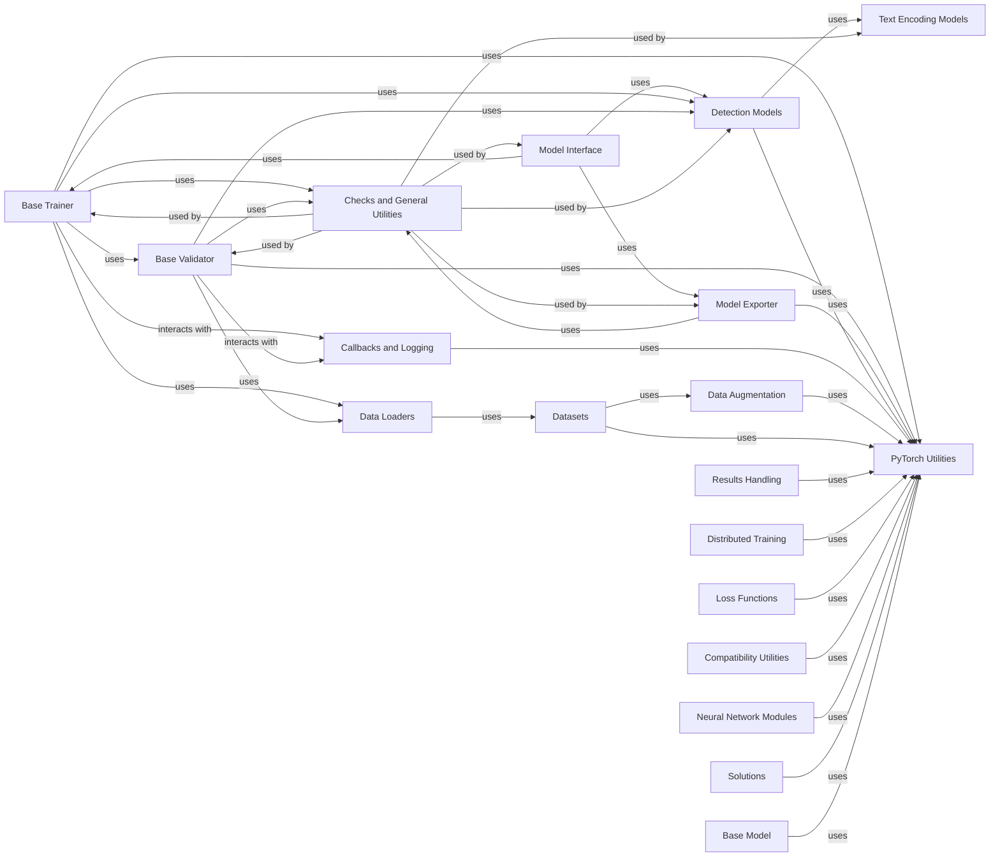

## Component Details

This graph provides an overview of the core components within the Ultralytics framework, focusing on their structure, functionality, and interdependencies. It highlights key areas such as PyTorch utilities for low-level operations, various model architectures (Base Model, Detection Models, Text Encoding Models), and the essential engine components for training, validation, and model export. Data handling, including loaders, datasets, and augmentation, is also represented, alongside general utilities, logging, and specialized solutions. The main flow involves the Model Interface orchestrating training (via Base Trainer), validation (via Base Validator), and export (via Model Exporter), all of which heavily rely on PyTorch Utilities and Checks and General Utilities. Detection Models utilize Text Encoding Models for advanced capabilities, and data components work together to prepare data for the training process. Callbacks provide extensibility and integration with logging platforms.

### PyTorch Utilities
Provides essential helper functions and classes specifically for PyTorch operations, such as device selection, model profiling, EMA, distributed training setup, and weight initialization.

**Related Classes/Methods**:

- <a href="https://github.com/ultralytics/ultralytics/blob/master/ultralytics/utils/torch_utils.py#L130-L241" target="_blank" rel="noopener noreferrer">`ultralytics.utils.torch_utils.select_device` (130:241)</a>
- <a href="https://github.com/ultralytics/ultralytics/blob/master/ultralytics/utils/torch_utils.py#L316-L358" target="_blank" rel="noopener noreferrer">`ultralytics.utils.torch_utils.model_info` (316:358)</a>
- <a href="https://github.com/ultralytics/ultralytics/blob/master/ultralytics/utils/torch_utils.py#L371-L402" target="_blank" rel="noopener noreferrer">`ultralytics.utils.torch_utils.model_info_for_loggers` (371:402)</a>
- <a href="https://github.com/ultralytics/ultralytics/blob/master/ultralytics/utils/torch_utils.py#L405-L444" target="_blank" rel="noopener noreferrer">`ultralytics.utils.torch_utils.get_flops` (405:444)</a>
- <a href="https://github.com/ultralytics/ultralytics/blob/master/ultralytics/utils/torch_utils.py#L447-L478" target="_blank" rel="noopener noreferrer">`ultralytics.utils.torch_utils.get_flops_with_torch_profiler` (447:478)</a>
- <a href="https://github.com/ultralytics/ultralytics/blob/master/ultralytics/utils/torch_utils.py#L577-L587" target="_blank" rel="noopener noreferrer">`ultralytics.utils.torch_utils.de_parallel` (577:587)</a>
- <a href="https://github.com/ultralytics/ultralytics/blob/master/ultralytics/utils/torch_utils.py#L605-L628" target="_blank" rel="noopener noreferrer">`ultralytics.utils.torch_utils.init_seeds` (605:628)</a>
- <a href="https://github.com/ultralytics/ultralytics/blob/master/ultralytics/utils/torch_utils.py#L639-L704" target="_blank" rel="noopener noreferrer">`ultralytics.utils.torch_utils.ModelEMA` (639:704)</a>
- <a href="https://github.com/ultralytics/ultralytics/blob/master/ultralytics/utils/torch_utils.py#L812-L895" target="_blank" rel="noopener noreferrer">`ultralytics.utils.torch_utils.profile_ops` (812:895)</a>
- <a href="https://github.com/ultralytics/ultralytics/blob/master/ultralytics/utils/torch_utils.py#L898-L949" target="_blank" rel="noopener noreferrer">`ultralytics.utils.torch_utils.EarlyStopping` (898:949)</a>
- <a href="https://github.com/ultralytics/ultralytics/blob/master/ultralytics/utils/torch_utils.py#L952-L996" target="_blank" rel="noopener noreferrer">`ultralytics.utils.torch_utils.FXModel` (952:996)</a>
- <a href="https://github.com/ultralytics/ultralytics/blob/master/ultralytics/utils/torch_utils.py#L76-L102" target="_blank" rel="noopener noreferrer">`ultralytics.utils.torch_utils.autocast` (76:102)</a>
- <a href="https://github.com/ultralytics/ultralytics/blob/master/ultralytics/utils/torch_utils.py#L244-L248" target="_blank" rel="noopener noreferrer">`ultralytics.utils.torch_utils.time_sync` (244:248)</a>
- <a href="https://github.com/ultralytics/ultralytics/blob/master/ultralytics/utils/torch_utils.py#L251-L282" target="_blank" rel="noopener noreferrer">`ultralytics.utils.torch_utils.fuse_conv_and_bn` (251:282)</a>
- <a href="https://github.com/ultralytics/ultralytics/blob/master/ultralytics/utils/torch_utils.py#L285-L313" target="_blank" rel="noopener noreferrer">`ultralytics.utils.torch_utils.fuse_deconv_and_bn` (285:313)</a>
- <a href="https://github.com/ultralytics/ultralytics/blob/master/ultralytics/utils/torch_utils.py#L549-L561" target="_blank" rel="noopener noreferrer">`ultralytics.utils.torch_utils.intersect_dicts` (549:561)</a>
- <a href="https://github.com/ultralytics/ultralytics/blob/master/ultralytics/utils/torch_utils.py#L481-L491" target="_blank" rel="noopener noreferrer">`ultralytics.utils.torch_utils.initialize_weights` (481:491)</a>
- <a href="https://github.com/ultralytics/ultralytics/blob/master/ultralytics/utils/torch_utils.py#L494-L514" target="_blank" rel="noopener noreferrer">`ultralytics.utils.torch_utils.scale_img` (494:514)</a>
- <a href="https://github.com/ultralytics/ultralytics/blob/master/ultralytics/utils/torch_utils.py#L106-L120" target="_blank" rel="noopener noreferrer">`ultralytics.utils.torch_utils.get_cpu_info` (106:120)</a>
- <a href="https://github.com/ultralytics/ultralytics/blob/master/ultralytics/utils/torch_utils.py#L124-L127" target="_blank" rel="noopener noreferrer">`ultralytics.utils.torch_utils.get_gpu_info` (124:127)</a>
- <a href="https://github.com/ultralytics/ultralytics/blob/master/ultralytics/utils/torch_utils.py#L361-L363" target="_blank" rel="noopener noreferrer">`ultralytics.utils.torch_utils.get_num_params` (361:363)</a>
- <a href="https://github.com/ultralytics/ultralytics/blob/master/ultralytics/utils/torch_utils.py#L366-L368" target="_blank" rel="noopener noreferrer">`ultralytics.utils.torch_utils.get_num_gradients` (366:368)</a>
- <a href="https://github.com/ultralytics/ultralytics/blob/master/ultralytics/utils/torch_utils.py#L564-L574" target="_blank" rel="noopener noreferrer">`ultralytics.utils.torch_utils.is_parallel` (564:574)</a>
- <a href="https://github.com/ultralytics/ultralytics/blob/master/ultralytics/utils/torch_utils.py#L631-L636" target="_blank" rel="noopener noreferrer">`ultralytics.utils.torch_utils.unset_deterministic` (631:636)</a>
- <a href="https://github.com/ultralytics/ultralytics/blob/master/ultralytics/utils/torch_utils.py#L517-L531" target="_blank" rel="noopener noreferrer">`ultralytics.utils.torch_utils.copy_attr` (517:531)</a>
- <a href="https://github.com/ultralytics/ultralytics/blob/master/ultralytics/utils/torch_utils.py#L787-L809" target="_blank" rel="noopener noreferrer">`ultralytics.utils.torch_utils.cuda_memory_usage` (787:809)</a>
- <a href="https://github.com/ultralytics/ultralytics/blob/master/ultralytics/utils/torch_utils.py#L51-L60" target="_blank" rel="noopener noreferrer">`ultralytics.utils.torch_utils.torch_distributed_zero_first` (51:60)</a>
- <a href="https://github.com/ultralytics/ultralytics/blob/master/ultralytics/utils/torch_utils.py#L590-L602" target="_blank" rel="noopener noreferrer">`ultralytics.utils.torch_utils.one_cycle` (590:602)</a>
- <a href="https://github.com/ultralytics/ultralytics/blob/master/ultralytics/utils/torch_utils.py#L768-L783" target="_blank" rel="noopener noreferrer">`ultralytics.utils.torch_utils.convert_optimizer_state_dict_to_fp16` (768:783)</a>
- <a href="https://github.com/ultralytics/ultralytics/blob/master/ultralytics/utils/torch_utils.py#L707-L765" target="_blank" rel="noopener noreferrer">`ultralytics.utils.torch_utils.strip_optimizer` (707:765)</a>
- <a href="https://github.com/ultralytics/ultralytics/blob/master/ultralytics/utils/torch_utils.py#L534-L546" target="_blank" rel="noopener noreferrer">`ultralytics.utils.torch_utils.get_latest_opset` (534:546)</a>

### Base Model
This is the fundamental abstract class for all YOLO models in Ultralytics. It provides a standardized interface and common functionalities such as handling the forward pass for both training and inference, methods for model fusion (combining Conv2d and BatchNorm2d layers), displaying model architecture and parameter information, and loading pre-trained weights. Subclasses extend this base with task-specific implementations.

**Related Classes/Methods**:

- <a href="https://github.com/ultralytics/ultralytics/blob/master/ultralytics/nn/tasks.py#L197-L221" target="_blank" rel="noopener noreferrer">`ultralytics.ultralytics.nn.tasks.BaseModel:_profile_one_layer` (197:221)</a>
- <a href="https://github.com/ultralytics/ultralytics/blob/master/ultralytics/nn/tasks.py#L223-L253" target="_blank" rel="noopener noreferrer">`ultralytics.ultralytics.nn.tasks.BaseModel:fuse` (223:253)</a>
- <a href="https://github.com/ultralytics/ultralytics/blob/master/ultralytics/nn/tasks.py#L268-L277" target="_blank" rel="noopener noreferrer">`ultralytics.ultralytics.nn.tasks.BaseModel:info` (268:277)</a>
- <a href="https://github.com/ultralytics/ultralytics/blob/master/ultralytics/nn/tasks.py#L299-L323" target="_blank" rel="noopener noreferrer">`ultralytics.ultralytics.nn.tasks.BaseModel:load` (299:323)</a>
- <a href="https://github.com/ultralytics/ultralytics/blob/master/ultralytics/nn/tasks.py#L122-L138" target="_blank" rel="noopener noreferrer">`ultralytics.ultralytics.nn.tasks.BaseModel:forward` (122:138)</a>
- <a href="https://github.com/ultralytics/ultralytics/blob/master/ultralytics/nn/tasks.py#L255-L266" target="_blank" rel="noopener noreferrer">`ultralytics.ultralytics.nn.tasks.BaseModel.is_fused` (255:266)</a>
- <a href="https://github.com/ultralytics/ultralytics/blob/master/ultralytics/nn/tasks.py#L140-L156" target="_blank" rel="noopener noreferrer">`ultralytics.ultralytics.nn.tasks.BaseModel.predict` (140:156)</a>
- <a href="https://github.com/ultralytics/ultralytics/blob/master/ultralytics/nn/tasks.py#L158-L187" target="_blank" rel="noopener noreferrer">`ultralytics.ultralytics.nn.tasks.BaseModel._predict_once` (158:187)</a>
- <a href="https://github.com/ultralytics/ultralytics/blob/master/ultralytics/nn/tasks.py#L189-L195" target="_blank" rel="noopener noreferrer">`ultralytics.ultralytics.nn.tasks.BaseModel._predict_augment` (189:195)</a>
- <a href="https://github.com/ultralytics/ultralytics/blob/master/ultralytics/nn/tasks.py#L325-L337" target="_blank" rel="noopener noreferrer">`ultralytics.ultralytics.nn.tasks.BaseModel.loss` (325:337)</a>
- <a href="https://github.com/ultralytics/ultralytics/blob/master/ultralytics/nn/tasks.py#L339-L341" target="_blank" rel="noopener noreferrer">`ultralytics.ultralytics.nn.tasks.BaseModel.init_criterion` (339:341)</a>

### Detection Models
This component encompasses various specialized YOLO models designed for different computer vision tasks. DetectionModel is the base for object detection, while WorldModel and YOLOEModel extend its capabilities to include open-vocabulary detection and prompt-based inference, leveraging text and visual embeddings. They handle model initialization, forward passes, and task-specific loss computations.

**Related Classes/Methods**:

- <a href="https://github.com/ultralytics/ultralytics/blob/master/ultralytics/nn/tasks.py#L373-L427" target="_blank" rel="noopener noreferrer">`ultralytics.ultralytics.nn.tasks.DetectionModel:__init__` (373:427)</a>
- <a href="https://github.com/ultralytics/ultralytics/blob/master/ultralytics/nn/tasks.py#L429-L452" target="_blank" rel="noopener noreferrer">`ultralytics.ultralytics.nn.tasks.DetectionModel:_predict_augment` (429:452)</a>
- <a href="https://github.com/ultralytics/ultralytics/blob/master/ultralytics/nn/tasks.py#L455-L475" target="_blank" rel="noopener noreferrer">`ultralytics.ultralytics.nn.tasks.DetectionModel:_descale_pred` (455:475)</a>
- <a href="https://github.com/ultralytics/ultralytics/blob/master/ultralytics/nn/tasks.py#L477-L494" target="_blank" rel="noopener noreferrer">`ultralytics.ultralytics.nn.tasks.DetectionModel:_clip_augmented` (477:494)</a>
- <a href="https://github.com/ultralytics/ultralytics/blob/master/ultralytics/nn/tasks.py#L884-L906" target="_blank" rel="noopener noreferrer">`ultralytics.ultralytics.nn.tasks.WorldModel:get_text_pe` (884:906)</a>
- <a href="https://github.com/ultralytics/ultralytics/blob/master/ultralytics/nn/tasks.py#L1010-L1041" target="_blank" rel="noopener noreferrer">`ultralytics.ultralytics.nn.tasks.YOLOEModel:get_text_pe` (1010:1041)</a>
- <a href="https://github.com/ultralytics/ultralytics/blob/master/ultralytics/nn/tasks.py#L1044-L1055" target="_blank" rel="noopener noreferrer">`ultralytics.ultralytics.nn.tasks.YOLOEModel:get_visual_pe` (1044:1055)</a>
- <a href="https://github.com/ultralytics/ultralytics/blob/master/ultralytics/nn/tasks.py#L1752-L1773" target="_blank" rel="noopener noreferrer">`ultralytics.ultralytics.nn.tasks.yaml_model_load` (1752:1773)</a>
- <a href="https://github.com/ultralytics/ultralytics/blob/master/ultralytics/nn/tasks.py#L1573-L1749" target="_blank" rel="noopener noreferrer">`ultralytics.ultralytics.nn.tasks.parse_model` (1573:1749)</a>
- <a href="https://github.com/ultralytics/ultralytics/blob/master/ultralytics/nn/tasks.py#L832-L966" target="_blank" rel="noopener noreferrer">`ultralytics.ultralytics.nn.tasks.WorldModel` (832:966)</a>
- <a href="https://github.com/ultralytics/ultralytics/blob/master/ultralytics/nn/tasks.py#L969-L1216" target="_blank" rel="noopener noreferrer">`ultralytics.ultralytics.nn.tasks.YOLOEModel` (969:1216)</a>
- <a href="https://github.com/ultralytics/ultralytics/blob/master/ultralytics/nn/tasks.py#L871-L881" target="_blank" rel="noopener noreferrer">`ultralytics.ultralytics.nn.tasks.WorldModel.set_classes` (871:881)</a>
- <a href="https://github.com/ultralytics/ultralytics/blob/master/ultralytics/nn/tasks.py#L908-L951" target="_blank" rel="noopener noreferrer">`ultralytics.ultralytics.nn.tasks.WorldModel.predict` (908:951)</a>
- <a href="https://github.com/ultralytics/ultralytics/blob/master/ultralytics/nn/tasks.py#L953-L966" target="_blank" rel="noopener noreferrer">`ultralytics.ultralytics.nn.tasks.WorldModel.loss` (953:966)</a>
- <a href="https://github.com/ultralytics/ultralytics/blob/master/ultralytics/nn/tasks.py#L1057-L1084" target="_blank" rel="noopener noreferrer">`ultralytics.ultralytics.nn.tasks.YOLOEModel.set_vocab` (1057:1084)</a>
- <a href="https://github.com/ultralytics/ultralytics/blob/master/ultralytics/nn/tasks.py#L1086-L1110" target="_blank" rel="noopener noreferrer">`ultralytics.ultralytics.nn.tasks.YOLOEModel.get_vocab` (1086:1110)</a>
- <a href="https://github.com/ultralytics/ultralytics/blob/master/ultralytics/nn/tasks.py#L1112-L1126" target="_blank" rel="noopener noreferrer">`ultralytics.ultralytics.nn.tasks.YOLOEModel.set_classes` (1112:1126)</a>
- <a href="https://github.com/ultralytics/ultralytics/blob/master/ultralytics/nn/tasks.py#L1128-L1148" target="_blank" rel="noopener noreferrer">`ultralytics.ultralytics.nn.tasks.YOLOEModel.get_cls_pe` (1128:1148)</a>
- <a href="https://github.com/ultralytics/ultralytics/blob/master/ultralytics/nn/tasks.py#L1150-L1198" target="_blank" rel="noopener noreferrer">`ultralytics.ultralytics.nn.tasks.YOLOEModel.predict` (1150:1198)</a>
- <a href="https://github.com/ultralytics/ultralytics/blob/master/ultralytics/nn/tasks.py#L1200-L1216" target="_blank" rel="noopener noreferrer">`ultralytics.ultralytics.nn.tasks.YOLOEModel.loss` (1200:1216)</a>

### Text Encoding Models
This component provides various text encoding models, including OpenAI's CLIP and Apple's MobileCLIP (both standard and TorchScript versions). These models are used to convert natural language text into numerical feature vectors, which are essential for vision-language tasks like open-vocabulary object detection. The build_text_model function acts as a factory for instantiating these models.

**Related Classes/Methods**:

- <a href="https://github.com/ultralytics/ultralytics/blob/master/ultralytics/nn/text_model.py#L111-L134" target="_blank" rel="noopener noreferrer">`ultralytics.ultralytics.nn.text_model.CLIP:encode_text` (111:134)</a>
- <a href="https://github.com/ultralytics/ultralytics/blob/master/ultralytics/nn/text_model.py#L221-L241" target="_blank" rel="noopener noreferrer">`ultralytics.ultralytics.nn.text_model.MobileCLIP:encode_text` (221:241)</a>
- <a href="https://github.com/ultralytics/ultralytics/blob/master/ultralytics/nn/text_model.py#L306-L325" target="_blank" rel="noopener noreferrer">`ultralytics.ultralytics.nn.text_model.MobileCLIPTS:encode_text` (306:325)</a>
- <a href="https://github.com/ultralytics/ultralytics/blob/master/ultralytics/nn/text_model.py#L328-L349" target="_blank" rel="noopener noreferrer">`ultralytics.nn.text_model.build_text_model` (328:349)</a>
- <a href="https://github.com/ultralytics/ultralytics/blob/master/ultralytics/nn/text_model.py#L93-L108" target="_blank" rel="noopener noreferrer">`ultralytics.nn.text_model.CLIP.tokenize` (93:108)</a>

### Base Trainer
The BaseTrainer class serves as the core component for managing the training lifecycle of Ultralytics models. It handles initialization, setting up the training environment (device, seeds, data loaders), configuring the optimizer and scheduler, executing training epochs, performing validation, and saving model checkpoints. It also integrates with a callback system for extensibility.

**Related Classes/Methods**:

- <a href="https://github.com/ultralytics/ultralytics/blob/master/ultralytics/engine/trainer.py#L110-L176" target="_blank" rel="noopener noreferrer">`ultralytics.ultralytics.engine.trainer.BaseTrainer:__init__` (110:176)</a>
- <a href="https://github.com/ultralytics/ultralytics/blob/master/ultralytics/engine/trainer.py#L229-L235" target="_blank" rel="noopener noreferrer">`ultralytics.ultralytics.engine.trainer.BaseTrainer:_setup_scheduler` (229:235)</a>
- <a href="https://github.com/ultralytics/ultralytics/blob/master/ultralytics/engine/trainer.py#L250-L342" target="_blank" rel="noopener noreferrer">`ultralytics.ultralytics.engine.trainer.BaseTrainer:_setup_train` (250:342)</a>
- <a href="https://github.com/ultralytics/ultralytics/blob/master/ultralytics/engine/trainer.py#L344-L503" target="_blank" rel="noopener noreferrer">`ultralytics.ultralytics.engine.trainer.BaseTrainer:_do_train` (344:503)</a>
- <a href="https://github.com/ultralytics/ultralytics/blob/master/ultralytics/engine/trainer.py#L552-L583" target="_blank" rel="noopener noreferrer">`ultralytics.ultralytics.engine.trainer.BaseTrainer:save_model` (552:583)</a>
- <a href="https://github.com/ultralytics/ultralytics/blob/master/ultralytics/engine/trainer.py#L634-L642" target="_blank" rel="noopener noreferrer">`ultralytics.ultralytics.engine.trainer.BaseTrainer:optimizer_step` (634:642)</a>
- <a href="https://github.com/ultralytics/ultralytics/blob/master/ultralytics/engine/trainer.py#L726-L740" target="_blank" rel="noopener noreferrer">`ultralytics.ultralytics.engine.trainer.BaseTrainer:final_eval` (726:740)</a>
- <a href="https://github.com/ultralytics/ultralytics/blob/master/ultralytics/engine/trainer.py#L742-L772" target="_blank" rel="noopener noreferrer">`ultralytics.ultralytics.engine.trainer.BaseTrainer.check_resume` (742:772)</a>
- <a href="https://github.com/ultralytics/ultralytics/blob/master/ultralytics/engine/trainer.py#L587-L612" target="_blank" rel="noopener noreferrer">`ultralytics.ultralytics.engine.trainer.BaseTrainer.get_dataset` (587:612)</a>
- <a href="https://github.com/ultralytics/ultralytics/blob/master/ultralytics/engine/trainer.py#L186-L189" target="_blank" rel="noopener noreferrer">`ultralytics.ultralytics.engine.trainer.BaseTrainer.run_callbacks` (186:189)</a>
- <a href="https://github.com/ultralytics/ultralytics/blob/master/ultralytics/engine/trainer.py#L614-L632" target="_blank" rel="noopener noreferrer">`ultralytics.ultralytics.engine.trainer.BaseTrainer.setup_model` (614:632)</a>
- <a href="https://github.com/ultralytics/ultralytics/blob/master/ultralytics/engine/trainer.py#L687-L689" target="_blank" rel="noopener noreferrer">`ultralytics.ultralytics.engine.trainer.BaseTrainer.set_model_attributes` (687:689)</a>
- <a href="https://github.com/ultralytics/ultralytics/blob/master/ultralytics/engine/trainer.py#L505-L513" target="_blank" rel="noopener noreferrer">`ultralytics.ultralytics.engine.trainer.BaseTrainer.auto_batch` (505:513)</a>
- <a href="https://github.com/ultralytics/ultralytics/blob/master/ultralytics/engine/trainer.py#L670-L672" target="_blank" rel="noopener noreferrer">`ultralytics.ultralytics.engine.trainer.BaseTrainer.get_dataloader` (670:672)</a>
- <a href="https://github.com/ultralytics/ultralytics/blob/master/ultralytics/engine/trainer.py#L666-L668" target="_blank" rel="noopener noreferrer">`ultralytics.ultralytics.engine.trainer.BaseTrainer.get_validator` (666:668)</a>
- <a href="https://github.com/ultralytics/ultralytics/blob/master/ultralytics/engine/trainer.py#L678-L685" target="_blank" rel="noopener noreferrer">`ultralytics.ultralytics.engine.trainer.BaseTrainer.label_loss_items` (678:685)</a>
- <a href="https://github.com/ultralytics/ultralytics/blob/master/ultralytics/engine/trainer.py#L704-L706" target="_blank" rel="noopener noreferrer">`ultralytics.ultralytics.engine.trainer.BaseTrainer.plot_training_labels` (704:706)</a>
- <a href="https://github.com/ultralytics/ultralytics/blob/master/ultralytics/engine/trainer.py#L809-L870" target="_blank" rel="noopener noreferrer">`ultralytics.ultralytics.engine.trainer.BaseTrainer.build_optimizer` (809:870)</a>
- <a href="https://github.com/ultralytics/ultralytics/blob/master/ultralytics/engine/trainer.py#L774-L799" target="_blank" rel="noopener noreferrer">`ultralytics.ultralytics.engine.trainer.BaseTrainer.resume_training` (774:799)</a>
- <a href="https://github.com/ultralytics/ultralytics/blob/master/ultralytics/engine/trainer.py#L237-L248" target="_blank" rel="noopener noreferrer">`ultralytics.ultralytics.engine.trainer.BaseTrainer._setup_ddp` (237:248)</a>
- <a href="https://github.com/ultralytics/ultralytics/blob/master/ultralytics/engine/trainer.py#L544-L550" target="_blank" rel="noopener noreferrer">`ultralytics.ultralytics.engine.trainer.BaseTrainer._model_train` (544:550)</a>
- <a href="https://github.com/ultralytics/ultralytics/blob/master/ultralytics/engine/trainer.py#L801-L807" target="_blank" rel="noopener noreferrer">`ultralytics.ultralytics.engine.trainer.BaseTrainer._close_dataloader_mosaic` (801:807)</a>
- <a href="https://github.com/ultralytics/ultralytics/blob/master/ultralytics/engine/trainer.py#L695-L697" target="_blank" rel="noopener noreferrer">`ultralytics.ultralytics.engine.trainer.BaseTrainer.progress_string` (695:697)</a>
- <a href="https://github.com/ultralytics/ultralytics/blob/master/ultralytics/engine/trainer.py#L644-L646" target="_blank" rel="noopener noreferrer">`ultralytics.ultralytics.engine.trainer.BaseTrainer.preprocess_batch` (644:646)</a>
- <a href="https://github.com/ultralytics/ultralytics/blob/master/ultralytics/engine/trainer.py#L515-L526" target="_blank" rel="noopener noreferrer">`ultralytics.ultralytics.engine.trainer.BaseTrainer._get_memory` (515:526)</a>
- <a href="https://github.com/ultralytics/ultralytics/blob/master/ultralytics/engine/trainer.py#L700-L702" target="_blank" rel="noopener noreferrer">`ultralytics.ultralytics.engine.trainer.BaseTrainer.plot_training_samples` (700:702)</a>
- <a href="https://github.com/ultralytics/ultralytics/blob/master/ultralytics/engine/trainer.py#L648-L660" target="_blank" rel="noopener noreferrer">`ultralytics.ultralytics.engine.trainer.BaseTrainer.validate` (648:660)</a>
- <a href="https://github.com/ultralytics/ultralytics/blob/master/ultralytics/engine/trainer.py#L708-L715" target="_blank" rel="noopener noreferrer">`ultralytics.ultralytics.engine.trainer.BaseTrainer.save_metrics` (708:715)</a>
- <a href="https://github.com/ultralytics/ultralytics/blob/master/ultralytics/engine/trainer.py#L528-L536" target="_blank" rel="noopener noreferrer">`ultralytics.ultralytics.engine.trainer.BaseTrainer._clear_memory` (528:536)</a>
- <a href="https://github.com/ultralytics/ultralytics/blob/master/ultralytics/engine/trainer.py#L717-L719" target="_blank" rel="noopener noreferrer">`ultralytics.ultralytics.engine.trainer.BaseTrainer.plot_metrics` (717:719)</a>
- <a href="https://github.com/ultralytics/ultralytics/blob/master/ultralytics/engine/trainer.py#L538-L542" target="_blank" rel="noopener noreferrer">`ultralytics.ultralytics.engine.trainer.BaseTrainer.read_results_csv` (538:542)</a>

### Base Validator
This component is responsible for evaluating the performance of trained models. It orchestrates the validation loop, including data loading, preprocessing, running inference, updating and finalizing metrics, and plotting results. It also integrates with callbacks for logging and visualization.

**Related Classes/Methods**:

- <a href="https://github.com/ultralytics/ultralytics/blob/master/ultralytics/engine/validator.py#L131-L251" target="_blank" rel="noopener noreferrer">`ultralytics.ultralytics.engine.validator.BaseValidator:__call__` (131:251)</a>
- <a href="https://github.com/ultralytics/ultralytics/blob/master/ultralytics/engine/validator.py#L305-L307" target="_blank" rel="noopener noreferrer">`ultralytics.ultralytics.engine.validator.BaseValidator.get_dataloader` (305:307)</a>
- <a href="https://github.com/ultralytics/ultralytics/blob/master/ultralytics/engine/validator.py#L300-L303" target="_blank" rel="noopener noreferrer">`ultralytics.ultralytics.engine.validator.BaseValidator.run_callbacks` (300:303)</a>
- <a href="https://github.com/ultralytics/ultralytics/blob/master/ultralytics/engine/validator.py#L345-L347" target="_blank" rel="noopener noreferrer">`ultralytics.ultralytics.engine.validator.BaseValidator.get_desc` (345:347)</a>
- <a href="https://github.com/ultralytics/ultralytics/blob/master/ultralytics/engine/validator.py#L321-L323" target="_blank" rel="noopener noreferrer">`ultralytics.ultralytics.engine.validator.BaseValidator.init_metrics` (321:323)</a>
- <a href="https://github.com/ultralytics/ultralytics/blob/master/ultralytics/engine/validator.py#L313-L315" target="_blank" rel="noopener noreferrer">`ultralytics.ultralytics.engine.validator.BaseValidator.preprocess` (313:315)</a>
- <a href="https://github.com/ultralytics/ultralytics/blob/master/ultralytics/engine/validator.py#L317-L319" target="_blank" rel="noopener noreferrer">`ultralytics.ultralytics.engine.validator.BaseValidator.postprocess` (317:319)</a>
- <a href="https://github.com/ultralytics/ultralytics/blob/master/ultralytics/engine/validator.py#L325-L327" target="_blank" rel="noopener noreferrer">`ultralytics.ultralytics.engine.validator.BaseValidator.update_metrics` (325:327)</a>
- <a href="https://github.com/ultralytics/ultralytics/blob/master/ultralytics/engine/validator.py#L358-L360" target="_blank" rel="noopener noreferrer">`ultralytics.ultralytics.engine.validator.BaseValidator.plot_val_samples` (358:360)</a>
- <a href="https://github.com/ultralytics/ultralytics/blob/master/ultralytics/engine/validator.py#L362-L364" target="_blank" rel="noopener noreferrer">`ultralytics.ultralytics.engine.validator.BaseValidator.plot_predictions` (362:364)</a>
- <a href="https://github.com/ultralytics/ultralytics/blob/master/ultralytics/engine/validator.py#L333-L335" target="_blank" rel="noopener noreferrer">`ultralytics.ultralytics.engine.validator.BaseValidator.get_stats` (333:335)</a>
- <a href="https://github.com/ultralytics/ultralytics/blob/master/ultralytics/engine/validator.py#L337-L339" target="_blank" rel="noopener noreferrer">`ultralytics.ultralytics.engine.validator.BaseValidator.check_stats` (337:339)</a>
- <a href="https://github.com/ultralytics/ultralytics/blob/master/ultralytics/engine/validator.py#L329-L331" target="_blank" rel="noopener noreferrer">`ultralytics.ultralytics.engine.validator.BaseValidator.finalize_metrics` (329:331)</a>
- <a href="https://github.com/ultralytics/ultralytics/blob/master/ultralytics/engine/validator.py#L341-L343" target="_blank" rel="noopener noreferrer">`ultralytics.ultralytics.engine.validator.BaseValidator.print_results` (341:343)</a>
- <a href="https://github.com/ultralytics/ultralytics/blob/master/ultralytics/engine/validator.py#L370-L372" target="_blank" rel="noopener noreferrer">`ultralytics.ultralytics.engine.validator.BaseValidator.eval_json` (370:372)</a>

### Model Exporter
This component facilitates the conversion of trained Ultralytics models into various deployment-ready formats, such as ONNX, TensorRT, CoreML, TensorFlow Lite, and PaddlePaddle. It handles the validation of export arguments, performs the conversion process, and reports the size of the exported files.

**Related Classes/Methods**:

- <a href="https://github.com/ultralytics/ultralytics/blob/master/ultralytics/engine/exporter.py#L287-L552" target="_blank" rel="noopener noreferrer">`ultralytics.ultralytics.engine.exporter.Exporter:__call__` (287:552)</a>
- <a href="https://github.com/ultralytics/ultralytics/blob/master/ultralytics/engine/exporter.py#L597-L653" target="_blank" rel="noopener noreferrer">`ultralytics.ultralytics.engine.exporter.Exporter:export_onnx` (597:653)</a>
- <a href="https://github.com/ultralytics/ultralytics/blob/master/ultralytics/engine/exporter.py#L920-L953" target="_blank" rel="noopener noreferrer">`ultralytics.ultralytics.engine.exporter.Exporter:export_engine` (920:953)</a>
- <a href="https://github.com/ultralytics/ultralytics/blob/master/ultralytics/engine/exporter.py#L113-L147" target="_blank" rel="noopener noreferrer">`ultralytics.ultralytics.engine.exporter.export_formats` (113:147)</a>
- <a href="https://github.com/ultralytics/ultralytics/blob/master/ultralytics/engine/exporter.py#L150-L170" target="_blank" rel="noopener noreferrer">`ultralytics.ultralytics.engine.exporter.validate_args` (150:170)</a>
- <a href="https://github.com/ultralytics/ultralytics/blob/master/ultralytics/engine/exporter.py#L1478-L1571" target="_blank" rel="noopener noreferrer">`ultralytics.ultralytics.engine.exporter.NMSModel` (1478:1571)</a>
- <a href="https://github.com/ultralytics/ultralytics/blob/master/ultralytics/engine/exporter.py#L1446-L1449" target="_blank" rel="noopener noreferrer">`ultralytics.ultralytics.engine.exporter.Exporter.run_callbacks` (1446:1449)</a>
- <a href="https://github.com/ultralytics/ultralytics/blob/master/ultralytics/engine/exporter.py#L203-L220" target="_blank" rel="noopener noreferrer">`ultralytics.ultralytics.engine.exporter.arange_patch` (203:220)</a>
- <a href="https://github.com/ultralytics/ultralytics/blob/master/ultralytics/engine/exporter.py#L554-L577" target="_blank" rel="noopener noreferrer">`ultralytics.ultralytics.engine.exporter.Exporter.get_int8_calibration_dataloader` (554:577)</a>
- <a href="https://github.com/ultralytics/ultralytics/blob/master/ultralytics/engine/exporter.py#L580-L594" target="_blank" rel="noopener noreferrer">`ultralytics.ultralytics.engine.exporter.Exporter.export_torchscript` (580:594)</a>
- <a href="https://github.com/ultralytics/ultralytics/blob/master/ultralytics/engine/exporter.py#L656-L730" target="_blank" rel="noopener noreferrer">`ultralytics.ultralytics.engine.exporter.Exporter.export_openvino` (656:730)</a>
- <a href="https://github.com/ultralytics/ultralytics/blob/master/ultralytics/engine/exporter.py#L841-L917" target="_blank" rel="noopener noreferrer">`ultralytics.ultralytics.engine.exporter.Exporter.export_coreml` (841:917)</a>
- <a href="https://github.com/ultralytics/ultralytics/blob/master/ultralytics/engine/exporter.py#L956-L1043" target="_blank" rel="noopener noreferrer">`ultralytics.ultralytics.engine.exporter.Exporter.export_saved_model` (956:1043)</a>
- <a href="https://github.com/ultralytics/ultralytics/blob/master/ultralytics/engine/exporter.py#L1046-L1059" target="_blank" rel="noopener noreferrer">`ultralytics.ultralytics.engine.exporter.Exporter.export_pb` (1046:1059)</a>
- <a href="https://github.com/ultralytics/ultralytics/blob/master/ultralytics/engine/exporter.py#L1062-L1075" target="_blank" rel="noopener noreferrer">`ultralytics.ultralytics.engine.exporter.Exporter.export_tflite` (1062:1075)</a>
- <a href="https://github.com/ultralytics/ultralytics/blob/master/ultralytics/engine/exporter.py#L1078-L1110" target="_blank" rel="noopener noreferrer">`ultralytics.ultralytics.engine.exporter.Exporter.export_edgetpu` (1078:1110)</a>
- <a href="https://github.com/ultralytics/ultralytics/blob/master/ultralytics/engine/exporter.py#L1113-L1143" target="_blank" rel="noopener noreferrer">`ultralytics.ultralytics.engine.exporter.Exporter.export_tfjs` (1113:1143)</a>
- <a href="https://github.com/ultralytics/ultralytics/blob/master/ultralytics/engine/exporter.py#L733-L745" target="_blank" rel="noopener noreferrer">`ultralytics.ultralytics.engine.exporter.Exporter.export_paddle` (733:745)</a>
- <a href="https://github.com/ultralytics/ultralytics/blob/master/ultralytics/engine/exporter.py#L748-L770" target="_blank" rel="noopener noreferrer">`ultralytics.ultralytics.engine.exporter.Exporter.export_mnn` (748:770)</a>
- <a href="https://github.com/ultralytics/ultralytics/blob/master/ultralytics/engine/exporter.py#L773-L838" target="_blank" rel="noopener noreferrer">`ultralytics.ultralytics.engine.exporter.Exporter.export_ncnn` (773:838)</a>
- <a href="https://github.com/ultralytics/ultralytics/blob/master/ultralytics/engine/exporter.py#L1173-L1327" target="_blank" rel="noopener noreferrer">`ultralytics.ultralytics.engine.exporter.Exporter.export_imx` (1173:1327)</a>
- <a href="https://github.com/ultralytics/ultralytics/blob/master/ultralytics/engine/exporter.py#L1146-L1170" target="_blank" rel="noopener noreferrer">`ultralytics.ultralytics.engine.exporter.Exporter.export_rknn` (1146:1170)</a>

### Model Interface
This component provides a high-level, user-friendly interface for interacting with various Ultralytics models. It abstracts away the complexities of model initialization, loading, training, and exporting, allowing users to easily perform common tasks like train, export, and predict on different model architectures.

**Related Classes/Methods**:

- <a href="https://github.com/ultralytics/ultralytics/blob/master/ultralytics/engine/model.py#L80-L154" target="_blank" rel="noopener noreferrer">`ultralytics.ultralytics.engine.model.Model:__init__` (80:154)</a>
- <a href="https://github.com/ultralytics/ultralytics/blob/master/ultralytics/engine/model.py#L688-L734" target="_blank" rel="noopener noreferrer">`ultralytics.ultralytics.engine.model.Model:export` (688:734)</a>
- <a href="https://github.com/ultralytics/ultralytics/blob/master/ultralytics/engine/model.py#L736-L804" target="_blank" rel="noopener noreferrer">`ultralytics.ultralytics.engine.model.Model:train` (736:804)</a>
- <a href="https://github.com/ultralytics/ultralytics/blob/master/ultralytics/engine/model.py#L213-L234" target="_blank" rel="noopener noreferrer">`ultralytics.ultralytics.engine.model.Model.is_hub_model` (213:234)</a>
- <a href="https://github.com/ultralytics/ultralytics/blob/master/ultralytics/engine/model.py#L188-L210" target="_blank" rel="noopener noreferrer">`ultralytics.ultralytics.engine.model.Model.is_triton_model` (188:210)</a>
- <a href="https://github.com/ultralytics/ultralytics/blob/master/ultralytics/engine/model.py#L236-L268" target="_blank" rel="noopener noreferrer">`ultralytics.ultralytics.engine.model.Model._new` (236:268)</a>
- <a href="https://github.com/ultralytics/ultralytics/blob/master/ultralytics/engine/model.py#L270-L306" target="_blank" rel="noopener noreferrer">`ultralytics.ultralytics.engine.model.Model._load` (270:306)</a>
- <a href="https://github.com/ultralytics/ultralytics/blob/master/ultralytics/engine/model.py#L308-L334" target="_blank" rel="noopener noreferrer">`ultralytics.ultralytics.engine.model.Model._check_is_pytorch_model` (308:334)</a>
- <a href="https://github.com/ultralytics/ultralytics/blob/master/ultralytics/engine/model.py#L1064-L1091" target="_blank" rel="noopener noreferrer">`ultralytics.ultralytics.engine.model.Model._smart_load` (1064:1091)</a>

### Data Loaders
This component is responsible for constructing efficient data loading pipelines for training and validation. It includes build_dataloader for creating PyTorch DataLoader instances and InfiniteDataLoader for continuous data iteration, ensuring that data is fed to the models effectively during training.

**Related Classes/Methods**:

- <a href="https://github.com/ultralytics/ultralytics/blob/master/ultralytics/data/build.py#L54-L58" target="_blank" rel="noopener noreferrer">`ultralytics.ultralytics.data.build.InfiniteDataLoader:__init__` (54:58)</a>
- <a href="https://github.com/ultralytics/ultralytics/blob/master/ultralytics/data/build.py#L157-L192" target="_blank" rel="noopener noreferrer">`ultralytics.ultralytics.data.build:build_dataloader` (157:192)</a>
- <a href="https://github.com/ultralytics/ultralytics/blob/master/ultralytics/data/build.py#L86-L104" target="_blank" rel="noopener noreferrer">`ultralytics.ultralytics.data.build._RepeatSampler` (86:104)</a>

### Datasets
This component defines various dataset classes, such as YOLODataset, YOLOMultiModalDataset, and GroundingDataset, which handle the loading, parsing, and initial processing of different types of data (e.g., images, labels, text). It also integrates with data augmentation pipelines to prepare data for model training.

**Related Classes/Methods**:

- <a href="https://github.com/ultralytics/ultralytics/blob/master/ultralytics/data/dataset.py#L208-L238" target="_blank" rel="noopener noreferrer">`ultralytics.ultralytics.data.dataset.YOLODataset:build_transforms` (208:238)</a>
- <a href="https://github.com/ultralytics/ultralytics/blob/master/ultralytics/data/dataset.py#L363-L385" target="_blank" rel="noopener noreferrer">`ultralytics.ultralytics.data.dataset.YOLOMultiModalDataset:build_transforms` (363:385)</a>
- <a href="https://github.com/ultralytics/ultralytics/blob/master/ultralytics/data/dataset.py#L590-L612" target="_blank" rel="noopener noreferrer">`ultralytics.ultralytics.data.dataset.GroundingDataset:build_transforms` (590:612)</a>
- <a href="https://github.com/ultralytics/ultralytics/blob/master/ultralytics/data/dataset.py#L412-L414" target="_blank" rel="noopener noreferrer">`ultralytics.ultralytics.data.dataset.YOLOMultiModalDataset._get_neg_texts` (412:414)</a>
- <a href="https://github.com/ultralytics/ultralytics/blob/master/ultralytics/data/dataset.py#L631-L633" target="_blank" rel="noopener noreferrer">`ultralytics.ultralytics.data.dataset.GroundingDataset._get_neg_texts` (631:633)</a>

### Data Augmentation
This component provides a suite of data augmentation transformations used to increase the diversity of training data and improve model robustness. It includes various image and text transformations that can be composed into pipelines for on-the-fly data manipulation.

**Related Classes/Methods**:

- <a href="https://github.com/ultralytics/ultralytics/blob/master/ultralytics/data/augment.py#L2485-L2550" target="_blank" rel="noopener noreferrer">`ultralytics.ultralytics.data.augment.v8_transforms` (2485:2550)</a>
- <a href="https://github.com/ultralytics/ultralytics/blob/master/ultralytics/data/augment.py#L146-L316" target="_blank" rel="noopener noreferrer">`ultralytics.ultralytics.data.augment.Compose` (146:316)</a>
- <a href="https://github.com/ultralytics/ultralytics/blob/master/ultralytics/data/augment.py#L1578-L1740" target="_blank" rel="noopener noreferrer">`ultralytics.ultralytics.data.augment.LetterBox` (1578:1740)</a>
- <a href="https://github.com/ultralytics/ultralytics/blob/master/ultralytics/data/augment.py#L205-L216" target="_blank" rel="noopener noreferrer">`ultralytics.ultralytics.data.augment.Compose.append` (205:216)</a>
- <a href="https://github.com/ultralytics/ultralytics/blob/master/ultralytics/data/augment.py#L2038-L2250" target="_blank" rel="noopener noreferrer">`ultralytics.ultralytics.data.augment.Format` (2038:2250)</a>
- <a href="https://github.com/ultralytics/ultralytics/blob/master/ultralytics/data/augment.py#L2346-L2482" target="_blank" rel="noopener noreferrer">`ultralytics.ultralytics.data.augment.RandomLoadText` (2346:2482)</a>
- <a href="https://github.com/ultralytics/ultralytics/blob/master/ultralytics/data/augment.py#L218-L232" target="_blank" rel="noopener noreferrer">`ultralytics.ultralytics.data.augment.Compose.insert` (218:232)</a>

### Checks and General Utilities
This is a broad component encompassing various utility functions for system checks (e.g., check_amp, check_requirements), automatic batch size adjustment (autobatch), performance benchmarking (benchmark, ProfileModels), managing application settings (SettingsManager), and retrieving GPU information (GPUInfo). These utilities support the overall stability, efficiency, and configurability of the Ultralytics framework.

**Related Classes/Methods**:

- <a href="https://github.com/ultralytics/ultralytics/blob/master/ultralytics/utils/autobatch.py#L15-L42" target="_blank" rel="noopener noreferrer">`ultralytics.ultralytics.utils.autobatch:check_train_batch_size` (15:42)</a>
- <a href="https://github.com/ultralytics/ultralytics/blob/master/ultralytics/utils/autobatch.py#L45-L119" target="_blank" rel="noopener noreferrer">`ultralytics.ultralytics.utils.autobatch:autobatch` (45:119)</a>
- <a href="https://github.com/ultralytics/ultralytics/blob/master/ultralytics/utils/benchmarks.py#L52-L211" target="_blank" rel="noopener noreferrer">`ultralytics.ultralytics.utils.benchmarks:benchmark` (52:211)</a>
- <a href="https://github.com/ultralytics/ultralytics/blob/master/ultralytics/utils/benchmarks.py#L394-L434" target="_blank" rel="noopener noreferrer">`ultralytics.ultralytics.utils.benchmarks.ProfileModels:__init__` (394:434)</a>
- <a href="https://github.com/ultralytics/ultralytics/blob/master/ultralytics/utils/benchmarks.py#L697-L720" target="_blank" rel="noopener noreferrer">`ultralytics.ultralytics.utils.benchmarks.ProfileModels:print_table` (697:720)</a>
- `ultralytics.ultralytics.utils.SettingsManager:__init__` (full file reference)
- <a href="https://github.com/ultralytics/ultralytics/blob/master/ultralytics/utils/autodevice.py#L136-L187" target="_blank" rel="noopener noreferrer">`ultralytics.ultralytics.utils.autodevice.GPUInfo:select_idle_gpu` (136:187)</a>
- <a href="https://github.com/ultralytics/ultralytics/blob/master/ultralytics/utils/checks.py#L115-L166" target="_blank" rel="noopener noreferrer">`ultralytics.utils.checks.check_imgsz` (115:166)</a>
- <a href="https://github.com/ultralytics/ultralytics/blob/master/ultralytics/utils/checks.py#L879-L896" target="_blank" rel="noopener noreferrer">`ultralytics.utils.checks.is_rockchip` (879:896)</a>
- <a href="https://github.com/ultralytics/ultralytics/blob/master/ultralytics/utils/checks.py#L632-L663" target="_blank" rel="noopener noreferrer">`ultralytics.utils.checks.check_yolo` (632:663)</a>
- <a href="https://github.com/ultralytics/ultralytics/blob/master/ultralytics/utils/checks.py#L727-L797" target="_blank" rel="noopener noreferrer">`ultralytics.utils.checks.check_amp` (727:797)</a>
- <a href="https://github.com/ultralytics/ultralytics/blob/master/ultralytics/utils/checks.py#L666-L724" target="_blank" rel="noopener noreferrer">`ultralytics.utils.checks.collect_system_info` (666:724)</a>
- <a href="https://github.com/ultralytics/ultralytics/blob/master/ultralytics/utils/checks.py#L766-L774" target="_blank" rel="noopener noreferrer">`ultralytics.utils.checks.check_amp.amp_allclose` (766:774)</a>
- <a href="https://github.com/ultralytics/ultralytics/blob/master/ultralytics/utils/checks.py#L52-L81" target="_blank" rel="noopener noreferrer">`ultralytics.utils.checks.parse_requirements` (52:81)</a>
- <a href="https://github.com/ultralytics/ultralytics/blob/master/ultralytics/utils/checks.py#L179-L264" target="_blank" rel="noopener noreferrer">`ultralytics.utils.checks.check_version` (179:264)</a>
- `ultralytics.utils.is_dir_writeable` (full file reference)
- `ultralytics.ultralytics.utils.JSONDict.__init__` (full file reference)
- `ultralytics.ultralytics.utils.SettingsManager.reset` (full file reference)
- `ultralytics.ultralytics.utils.SettingsManager._validate_settings` (full file reference)
- <a href="https://github.com/ultralytics/ultralytics/blob/master/ultralytics/utils/autodevice.py#L73-L85" target="_blank" rel="noopener noreferrer">`ultralytics.ultralytics.utils.autodevice.GPUInfo.refresh_stats` (73:85)</a>
- `ultralytics.utils.colorstr` (full file reference)
- <a href="https://github.com/ultralytics/ultralytics/blob/master/ultralytics/utils/files.py#L168-L177" target="_blank" rel="noopener noreferrer">`ultralytics.utils.files.file_size` (168:177)</a>
- `ultralytics.utils.YAML.load` (full file reference)
- `ultralytics.utils.YAML.save` (full file reference)
- <a href="https://github.com/ultralytics/ultralytics/blob/master/ultralytics/utils/checks.py#L288-L308" target="_blank" rel="noopener noreferrer">`ultralytics.utils.checks.check_pip_update_available` (288:308)</a>
- <a href="https://github.com/ultralytics/ultralytics/blob/master/ultralytics/utils/checks.py#L574-L586" target="_blank" rel="noopener noreferrer">`ultralytics.utils.checks.check_yaml` (574:586)</a>
- <a href="https://github.com/ultralytics/ultralytics/blob/master/ultralytics/utils/callbacks/base.py#L177-L191" target="_blank" rel="noopener noreferrer">`ultralytics.utils.callbacks.base.get_default_callbacks` (177:191)</a>
- <a href="https://github.com/ultralytics/ultralytics/blob/master/ultralytics/utils/callbacks/base.py#L194-L234" target="_blank" rel="noopener noreferrer">`ultralytics.utils.callbacks.base.add_integration_callbacks` (194:234)</a>
- `ultralytics.utils.emojis` (full file reference)
- <a href="https://github.com/ultralytics/ultralytics/blob/master/ultralytics/utils/ops.py#L18-L72" target="_blank" rel="noopener noreferrer">`ultralytics.utils.ops.Profile` (18:72)</a>
- `ultralytics.utils.TQDM` (full file reference)
- <a href="https://github.com/ultralytics/ultralytics/blob/master/ultralytics/utils/tal.py#L367-L379" target="_blank" rel="noopener noreferrer">`ultralytics.utils.tal.make_anchors` (367:379)</a>
- <a href="https://github.com/ultralytics/ultralytics/blob/master/ultralytics/utils/export.py#L12-L46" target="_blank" rel="noopener noreferrer">`ultralytics.utils.export.export_onnx` (12:46)</a>
- <a href="https://github.com/ultralytics/ultralytics/blob/master/ultralytics/utils/export.py#L49-L233" target="_blank" rel="noopener noreferrer">`ultralytics.utils.export.export_engine` (49:233)</a>
- <a href="https://github.com/ultralytics/ultralytics/blob/master/ultralytics/utils/torch_utils.py#L534-L546" target="_blank" rel="noopener noreferrer">`ultralytics.utils.torch_utils.get_latest_opset` (534:546)</a>
- `ultralytics.utils.get_git_origin_url` (full file reference)
- `ultralytics.cfg.get_cfg` (full file reference)
- `ultralytics.cfg.get_save_dir` (full file reference)
- <a href="https://github.com/ultralytics/ultralytics/blob/master/ultralytics/utils/checks.py#L816-L840" target="_blank" rel="noopener noreferrer">`ultralytics.utils.checks.print_args` (816:840)</a>
- <a href="https://github.com/ultralytics/ultralytics/blob/master/ultralytics/utils/checks.py#L518-L531" target="_blank" rel="noopener noreferrer">`ultralytics.utils.checks.check_model_file_from_stem` (518:531)</a>
- <a href="https://github.com/ultralytics/ultralytics/blob/master/ultralytics/nn/autobackend.py#L70-L886" target="_blank" rel="noopener noreferrer">`ultralytics.nn.autobackend.AutoBackend` (70:886)</a>
- <a href="https://github.com/ultralytics/ultralytics/blob/master/ultralytics/nn/autobackend.py#L52-L67" target="_blank" rel="noopener noreferrer">`ultralytics.nn.autobackend.default_class_names` (52:67)</a>
- <a href="https://github.com/ultralytics/ultralytics/blob/master/ultralytics/nn/autobackend.py#L22-L49" target="_blank" rel="noopener noreferrer">`ultralytics.nn.autobackend.check_class_names` (22:49)</a>
- <a href="https://github.com/ultralytics/ultralytics/blob/master/ultralytics/nn/tasks.py#L1486-L1532" target="_blank" rel="noopener noreferrer">`ultralytics.nn.tasks.attempt_load_weights` (1486:1532)</a>
- <a href="https://github.com/ultralytics/ultralytics/blob/master/ultralytics/nn/tasks.py#L1535-L1570" target="_blank" rel="noopener noreferrer">`ultralytics.nn.tasks.attempt_load_one_weight` (1535:1570)</a>

### Callbacks and Logging
This component provides a flexible callback system that allows external integrations and custom logic to be executed at various points during the training and validation processes. It supports logging metrics, plots, and model information to different platforms like Weights & Biases, TensorBoard, Comet ML, ClearML, DVC, and Neptune.

**Related Classes/Methods**:

- <a href="https://github.com/ultralytics/ultralytics/blob/master/ultralytics/utils/callbacks/wb.py#L135-L141" target="_blank" rel="noopener noreferrer">`ultralytics.ultralytics.utils.callbacks.wb:on_fit_epoch_end` (135:141)</a>
- <a href="https://github.com/ultralytics/ultralytics/blob/master/ultralytics/utils/callbacks/hub.py#L23-L45" target="_blank" rel="noopener noreferrer">`ultralytics.ultralytics.utils.callbacks.hub:on_fit_epoch_end` (23:45)</a>
- <a href="https://github.com/ultralytics/ultralytics/blob/master/ultralytics/utils/callbacks/tensorboard.py#L43-L91" target="_blank" rel="noopener noreferrer">`ultralytics.ultralytics.utils.callbacks.tensorboard:_log_tensorboard_graph` (43:91)</a>
- <a href="https://github.com/ultralytics/ultralytics/blob/master/ultralytics/utils/callbacks/comet.py#L516-L558" target="_blank" rel="noopener noreferrer">`ultralytics.ultralytics.utils.callbacks.comet:on_fit_epoch_end` (516:558)</a>
- <a href="https://github.com/ultralytics/ultralytics/blob/master/ultralytics/utils/callbacks/clearml.py#L100-L113" target="_blank" rel="noopener noreferrer">`ultralytics.ultralytics.utils.callbacks.clearml:on_fit_epoch_end` (100:113)</a>
- <a href="https://github.com/ultralytics/ultralytics/blob/master/ultralytics/utils/callbacks/dvc.py#L125-L156" target="_blank" rel="noopener noreferrer">`ultralytics.ultralytics.utils.callbacks.dvc:on_fit_epoch_end` (125:156)</a>
- <a href="https://github.com/ultralytics/ultralytics/blob/master/ultralytics/utils/callbacks/neptune.py#L91-L97" target="_blank" rel="noopener noreferrer">`ultralytics.ultralytics.utils.callbacks.neptune:on_fit_epoch_end` (91:97)</a>
- <a href="https://github.com/ultralytics/ultralytics/blob/master/ultralytics/utils/callbacks/wb.py#L101-L122" target="_blank" rel="noopener noreferrer">`ultralytics.ultralytics.utils.callbacks.wb._log_plots` (101:122)</a>
- <a href="https://github.com/ultralytics/ultralytics/blob/master/ultralytics/utils/callbacks/comet.py#L121-L142" target="_blank" rel="noopener noreferrer">`ultralytics.ultralytics.utils.callbacks.comet._fetch_trainer_metadata` (121:142)</a>
- <a href="https://github.com/ultralytics/ultralytics/blob/master/ultralytics/utils/callbacks/comet.py#L486-L489" target="_blank" rel="noopener noreferrer">`ultralytics.ultralytics.utils.callbacks.comet._log_model` (486:489)</a>
- <a href="https://github.com/ultralytics/ultralytics/blob/master/ultralytics/utils/callbacks/comet.py#L75-L77" target="_blank" rel="noopener noreferrer">`ultralytics.ultralytics.utils.callbacks.comet._should_log_confusion_matrix` (75:77)</a>
- <a href="https://github.com/ultralytics/ultralytics/blob/master/ultralytics/utils/callbacks/comet.py#L347-L353" target="_blank" rel="noopener noreferrer">`ultralytics.ultralytics.utils.callbacks.comet._log_confusion_matrix` (347:353)</a>
- <a href="https://github.com/ultralytics/ultralytics/blob/master/ultralytics/utils/callbacks/comet.py#L80-L82" target="_blank" rel="noopener noreferrer">`ultralytics.ultralytics.utils.callbacks.comet._should_log_image_predictions` (80:82)</a>
- <a href="https://github.com/ultralytics/ultralytics/blob/master/ultralytics/utils/callbacks/comet.py#L379-L439" target="_blank" rel="noopener noreferrer">`ultralytics.ultralytics.utils.callbacks.comet._log_image_predictions` (379:439)</a>
- <a href="https://github.com/ultralytics/ultralytics/blob/master/ultralytics/utils/callbacks/dvc.py#L57-L69" target="_blank" rel="noopener noreferrer">`ultralytics.ultralytics.utils.callbacks.dvc._log_plots` (57:69)</a>
- <a href="https://github.com/ultralytics/ultralytics/blob/master/ultralytics/utils/callbacks/neptune.py#L20-L34" target="_blank" rel="noopener noreferrer">`ultralytics.ultralytics.utils.callbacks.neptune._log_scalars` (20:34)</a>

### Results Handling
This component is responsible for managing and processing the output results from model inference, including bounding boxes, keypoints, masks, and probabilities. It provides functionalities for manipulating and visualizing these results.

**Related Classes/Methods**:

- <a href="https://github.com/ultralytics/ultralytics/blob/master/ultralytics/engine/results.py#L857-L1073" target="_blank" rel="noopener noreferrer">`ultralytics.engine.results.Boxes` (857:1073)</a>
- <a href="https://github.com/ultralytics/ultralytics/blob/master/ultralytics/engine/results.py#L1174-L1296" target="_blank" rel="noopener noreferrer">`ultralytics.engine.results.Keypoints` (1174:1296)</a>
- <a href="https://github.com/ultralytics/ultralytics/blob/master/ultralytics/engine/results.py#L1076-L1171" target="_blank" rel="noopener noreferrer">`ultralytics.engine.results.Masks` (1076:1171)</a>
- <a href="https://github.com/ultralytics/ultralytics/blob/master/ultralytics/engine/results.py#L1440-L1662" target="_blank" rel="noopener noreferrer">`ultralytics.engine.results.OBB` (1440:1662)</a>
- <a href="https://github.com/ultralytics/ultralytics/blob/master/ultralytics/engine/results.py#L1299-L1437" target="_blank" rel="noopener noreferrer">`ultralytics.engine.results.Probs` (1299:1437)</a>

### Distributed Training
This component provides utilities for setting up and managing distributed training environments, enabling models to be trained across multiple GPUs or machines.

**Related Classes/Methods**:

- `ultralytics.utils.dist` (full file reference)

### Loss Functions
This component defines various loss functions used in training different YOLO models, such as detection loss, segmentation loss, and keypoint loss.

**Related Classes/Methods**:

- `ultralytics.utils.loss` (full file reference)
- `ultralytics.models.utils.loss` (full file reference)

### Compatibility Utilities
This component provides utility functions and patches to ensure compatibility across different environments or PyTorch versions.

**Related Classes/Methods**:

- `ultralytics.utils.patches` (full file reference)

### Neural Network Modules
This component contains fundamental building blocks for neural networks, including various convolutional layers, attention mechanisms, and other architectural components used to construct YOLO models.

**Related Classes/Methods**:

- `ultralytics.nn.modules.block` (full file reference)
- `ultralytics.nn.modules.conv` (full file reference)
- `ultralytics.nn.modules.head` (full file reference)
- `ultralytics.nn.modules.transformer` (full file reference)

### Solutions
This component provides various end-to-end solutions built on top of Ultralytics models, such as object counting, heatmap generation, and similarity search.

**Related Classes/Methods**:

- `ultralytics.solutions.similarity_search` (full file reference)

### [FAQ](https://github.com/CodeBoarding/GeneratedOnBoardings/tree/main?tab=readme-ov-file#faq)