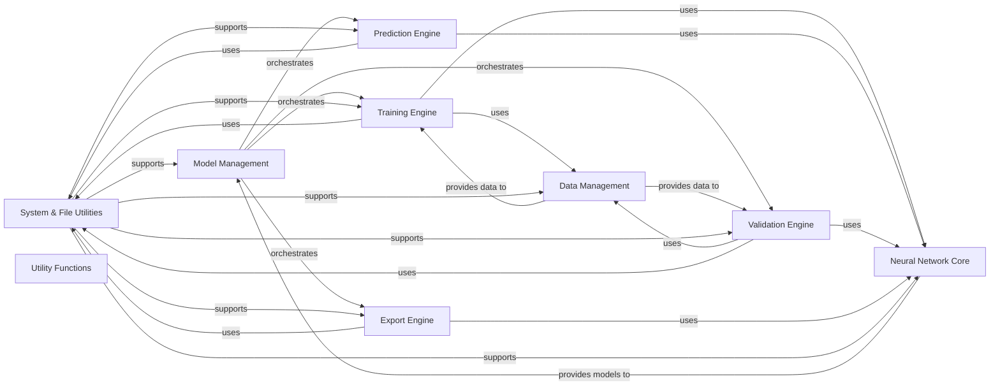

## Component Details

This graph illustrates the architecture of the Ultralytics framework, highlighting key components responsible for model management, training, prediction, validation, export, data handling, neural network core functionalities, and various utility functions. The main flow involves the Model Management component orchestrating different engines (Training, Prediction, Validation, Export) based on the user's task. These engines, in turn, interact with the Data Management component for data access and the Neural Network Core for model execution. The System & File Utilities and general Utility Functions provide foundational support across all major components for tasks like configuration, system checks, file operations, and asset downloads, ensuring the smooth and efficient operation of the framework.

### System & File Utilities
A comprehensive collection of general-purpose utility functions for configuration management, system environment checks, file operations, and asset downloading, ensuring the smooth operation of the framework.

**Related Classes/Methods**:

- `ultralytics.cfg.cfg2dict` (full file reference)
- `ultralytics.cfg.get_cfg` (full file reference)
- `ultralytics.cfg.get_save_dir` (full file reference)
- `ultralytics.cfg._handle_deprecation` (full file reference)
- `ultralytics.cfg.check_dict_alignment` (full file reference)
- `ultralytics.cfg.handle_yolo_hub` (full file reference)
- `ultralytics.cfg.handle_yolo_settings` (full file reference)
- `ultralytics.cfg.handle_yolo_solutions` (full file reference)
- `ultralytics.cfg.parse_key_value_pair` (full file reference)
- `ultralytics.cfg.entrypoint` (full file reference)
- `ultralytics.utils.SimpleClass` (full file reference)
- `ultralytics.utils.YAML` (full file reference)
- `ultralytics.utils.JSONDict` (full file reference)
- `ultralytics.utils.SettingsManager` (full file reference)
- <a href="https://github.com/ultralytics/ultralytics/blob/master/ultralytics/utils/errors.py#L6-L43" target="_blank" rel="noopener noreferrer">`ultralytics.utils.errors.HUBModelError` (6:43)</a>
- <a href="https://github.com/ultralytics/ultralytics/blob/master/ultralytics/utils/autobatch.py#L15-L42" target="_blank" rel="noopener noreferrer">`ultralytics.utils.autobatch.check_train_batch_size` (15:42)</a>
- <a href="https://github.com/ultralytics/ultralytics/blob/master/ultralytics/utils/autobatch.py#L45-L119" target="_blank" rel="noopener noreferrer">`ultralytics.utils.autobatch.autobatch` (45:119)</a>
- <a href="https://github.com/ultralytics/ultralytics/blob/master/ultralytics/utils/autodevice.py#L9-L187" target="_blank" rel="noopener noreferrer">`ultralytics.utils.autodevice.GPUInfo` (9:187)</a>
- `ultralytics.utils.autodevice.select_idle_gpu` (full file reference)
- <a href="https://github.com/ultralytics/ultralytics/blob/master/ultralytics/utils/tuner.py#L7-L159" target="_blank" rel="noopener noreferrer">`ultralytics.utils.tuner.run_ray_tune` (7:159)</a>
- <a href="https://github.com/ultralytics/ultralytics/blob/master/ultralytics/utils/benchmarks.py#L52-L211" target="_blank" rel="noopener noreferrer">`ultralytics.utils.benchmarks.benchmark` (52:211)</a>
- <a href="https://github.com/ultralytics/ultralytics/blob/master/ultralytics/utils/benchmarks.py#L214-L357" target="_blank" rel="noopener noreferrer">`ultralytics.utils.benchmarks.RF100Benchmark` (214:357)</a>
- <a href="https://github.com/ultralytics/ultralytics/blob/master/ultralytics/utils/benchmarks.py#L360-L720" target="_blank" rel="noopener noreferrer">`ultralytics.utils.benchmarks.ProfileModels` (360:720)</a>
- `ultralytics.utils.get_ubuntu_version` (full file reference)
- `ultralytics.utils.get_user_config_dir` (full file reference)
- `ultralytics.utils.set_sentry` (full file reference)
- `ultralytics.utils.url2file` (full file reference)
- `ultralytics.utils.vscode_msg` (full file reference)
- `ultralytics.utils.is_ubuntu` (full file reference)
- `ultralytics.utils.is_dir_writeable` (full file reference)
- `ultralytics.utils.is_runpod` (full file reference)
- `ultralytics.utils.clean_url` (full file reference)
- `ultralytics.utils.emojis` (full file reference)
- `ultralytics.utils.TQDM` (full file reference)
- `ultralytics.utils.is_online` (full file reference)
- `ultralytics.utils.TryExcept` (full file reference)
- `ultralytics.utils.colorstr` (full file reference)
- `ultralytics.utils.remove_colorstr` (full file reference)
- `ultralytics.utils.get_default_args` (full file reference)
- `ultralytics.utils.ThreadingLocked` (full file reference)
- `ultralytics.utils.Retry` (full file reference)
- `ultralytics.utils.is_github_action_running` (full file reference)
- <a href="https://github.com/ultralytics/ultralytics/blob/master/ultralytics/utils/checks.py#L179-L264" target="_blank" rel="noopener noreferrer">`ultralytics.utils.checks.check_version` (179:264)</a>
- <a href="https://github.com/ultralytics/ultralytics/blob/master/ultralytics/utils/checks.py#L288-L308" target="_blank" rel="noopener noreferrer">`ultralytics.utils.checks.check_pip_update_available` (288:308)</a>
- <a href="https://github.com/ultralytics/ultralytics/blob/master/ultralytics/utils/checks.py#L313-L340" target="_blank" rel="noopener noreferrer">`ultralytics.utils.checks.check_font` (313:340)</a>
- <a href="https://github.com/ultralytics/ultralytics/blob/master/ultralytics/utils/checks.py#L343-L355" target="_blank" rel="noopener noreferrer">`ultralytics.utils.checks.check_python` (343:355)</a>
- <a href="https://github.com/ultralytics/ultralytics/blob/master/ultralytics/utils/checks.py#L359-L436" target="_blank" rel="noopener noreferrer">`ultralytics.utils.checks.check_requirements` (359:436)</a>
- <a href="https://github.com/ultralytics/ultralytics/blob/master/ultralytics/utils/checks.py#L534-L571" target="_blank" rel="noopener noreferrer">`ultralytics.utils.checks.check_file` (534:571)</a>
- <a href="https://github.com/ultralytics/ultralytics/blob/master/ultralytics/utils/checks.py#L574-L586" target="_blank" rel="noopener noreferrer">`ultralytics.utils.checks.check_yaml` (574:586)</a>
- <a href="https://github.com/ultralytics/ultralytics/blob/master/ultralytics/utils/checks.py#L632-L663" target="_blank" rel="noopener noreferrer">`ultralytics.utils.checks.check_yolo` (632:663)</a>
- <a href="https://github.com/ultralytics/ultralytics/blob/master/ultralytics/utils/checks.py#L666-L724" target="_blank" rel="noopener noreferrer">`ultralytics.utils.checks.collect_system_info` (666:724)</a>
- <a href="https://github.com/ultralytics/ultralytics/blob/master/ultralytics/utils/checks.py#L727-L797" target="_blank" rel="noopener noreferrer">`ultralytics.utils.checks.check_amp` (727:797)</a>
- <a href="https://github.com/ultralytics/ultralytics/blob/master/ultralytics/utils/checks.py#L816-L840" target="_blank" rel="noopener noreferrer">`ultralytics.utils.checks.print_args` (816:840)</a>
- <a href="https://github.com/ultralytics/ultralytics/blob/master/ultralytics/utils/checks.py#L869-L876" target="_blank" rel="noopener noreferrer">`ultralytics.utils.checks.cuda_is_available` (869:876)</a>
- <a href="https://github.com/ultralytics/ultralytics/blob/master/ultralytics/utils/checks.py#L85-L99" target="_blank" rel="noopener noreferrer">`ultralytics.utils.checks.parse_version` (85:99)</a>
- <a href="https://github.com/ultralytics/ultralytics/blob/master/ultralytics/utils/checks.py#L267-L285" target="_blank" rel="noopener noreferrer">`ultralytics.utils.checks.check_latest_pypi_version` (267:285)</a>
- <a href="https://github.com/ultralytics/ultralytics/blob/master/ultralytics/utils/checks.py#L52-L81" target="_blank" rel="noopener noreferrer">`ultralytics.utils.checks.parse_requirements` (52:81)</a>
- <a href="https://github.com/ultralytics/ultralytics/blob/master/ultralytics/utils/checks.py#L170-L175" target="_blank" rel="noopener noreferrer">`ultralytics.utils.checks.check_uv` (170:175)</a>
- <a href="https://github.com/ultralytics/ultralytics/blob/master/ultralytics/utils/checks.py#L473-L487" target="_blank" rel="noopener noreferrer">`ultralytics.utils.checks.check_suffix` (473:487)</a>
- <a href="https://github.com/ultralytics/ultralytics/blob/master/ultralytics/utils/checks.py#L490-L515" target="_blank" rel="noopener noreferrer">`ultralytics.utils.checks.check_yolov5u_filename` (490:515)</a>
- <a href="https://github.com/ultralytics/ultralytics/blob/master/ultralytics/utils/checks.py#L607-L629" target="_blank" rel="noopener noreferrer">`ultralytics.utils.checks.check_imshow` (607:629)</a>
- <a href="https://github.com/ultralytics/ultralytics/blob/master/ultralytics/utils/checks.py#L518-L531" target="_blank" rel="noopener noreferrer">`ultralytics.utils.checks.check_model_file_from_stem` (518:531)</a>
- <a href="https://github.com/ultralytics/ultralytics/blob/master/ultralytics/utils/checks.py#L879-L896" target="_blank" rel="noopener noreferrer">`ultralytics.utils.checks.is_rockchip` (879:896)</a>
- <a href="https://github.com/ultralytics/ultralytics/blob/master/ultralytics/utils/checks.py#L899-L909" target="_blank" rel="noopener noreferrer">`ultralytics.utils.checks.is_sudo_available` (899:909)</a>
- <a href="https://github.com/ultralytics/ultralytics/blob/master/ultralytics/utils/checks.py#L102-L112" target="_blank" rel="noopener noreferrer">`ultralytics.utils.checks.is_ascii` (102:112)</a>
- <a href="https://github.com/ultralytics/ultralytics/blob/master/ultralytics/utils/checks.py#L115-L166" target="_blank" rel="noopener noreferrer">`ultralytics.utils.checks.check_imgsz` (115:166)</a>
- <a href="https://github.com/ultralytics/ultralytics/blob/master/ultralytics/utils/files.py#L186-L222" target="_blank" rel="noopener noreferrer">`ultralytics.utils.files.update_models` (186:222)</a>
- <a href="https://github.com/ultralytics/ultralytics/blob/master/ultralytics/utils/files.py#L108-L153" target="_blank" rel="noopener noreferrer">`ultralytics.utils.files.increment_path` (108:153)</a>
- <a href="https://github.com/ultralytics/ultralytics/blob/master/ultralytics/utils/files.py#L168-L177" target="_blank" rel="noopener noreferrer">`ultralytics.utils.files.file_size` (168:177)</a>
- <a href="https://github.com/ultralytics/ultralytics/blob/master/ultralytics/utils/files.py#L57-L105" target="_blank" rel="noopener noreferrer">`ultralytics.utils.files.spaces_in_path` (57:105)</a>
- <a href="https://github.com/ultralytics/ultralytics/blob/master/ultralytics/utils/files.py#L180-L183" target="_blank" rel="noopener noreferrer">`ultralytics.utils.files.get_latest_run` (180:183)</a>
- <a href="https://github.com/ultralytics/ultralytics/blob/master/ultralytics/utils/downloads.py#L96-L130" target="_blank" rel="noopener noreferrer">`ultralytics.utils.downloads.zip_directory` (96:130)</a>
- <a href="https://github.com/ultralytics/ultralytics/blob/master/ultralytics/utils/downloads.py#L133-L199" target="_blank" rel="noopener noreferrer">`ultralytics.utils.downloads.unzip_file` (133:199)</a>
- <a href="https://github.com/ultralytics/ultralytics/blob/master/ultralytics/utils/downloads.py#L247-L284" target="_blank" rel="noopener noreferrer">`ultralytics.utils.downloads.get_google_drive_file_info` (247:284)</a>
- <a href="https://github.com/ultralytics/ultralytics/blob/master/ultralytics/utils/downloads.py#L287-L389" target="_blank" rel="noopener noreferrer">`ultralytics.utils.downloads.safe_download` (287:389)</a>
- <a href="https://github.com/ultralytics/ultralytics/blob/master/ultralytics/utils/downloads.py#L429-L477" target="_blank" rel="noopener noreferrer">`ultralytics.utils.downloads.attempt_download_asset` (429:477)</a>
- <a href="https://github.com/ultralytics/ultralytics/blob/master/ultralytics/utils/downloads.py#L480-L529" target="_blank" rel="noopener noreferrer">`ultralytics.utils.downloads.download` (480:529)</a>
- <a href="https://github.com/ultralytics/ultralytics/blob/master/ultralytics/utils/downloads.py#L73-L93" target="_blank" rel="noopener noreferrer">`ultralytics.utils.downloads.delete_dsstore` (73:93)</a>
- <a href="https://github.com/ultralytics/ultralytics/blob/master/ultralytics/utils/downloads.py#L202-L244" target="_blank" rel="noopener noreferrer">`ultralytics.utils.downloads.check_disk_space` (202:244)</a>
- <a href="https://github.com/ultralytics/ultralytics/blob/master/ultralytics/utils/downloads.py#L392-L426" target="_blank" rel="noopener noreferrer">`ultralytics.utils.downloads.get_github_assets` (392:426)</a>
- <a href="https://github.com/ultralytics/ultralytics/blob/master/ultralytics/utils/downloads.py#L46-L70" target="_blank" rel="noopener noreferrer">`ultralytics.utils.downloads.is_url` (46:70)</a>

### Model Management
This component is responsible for the overarching management of models within the Ultralytics framework. It handles model initialization, loading pre-trained weights, switching between different operational modes (train, val, predict, export, tune), and providing a unified interface for interacting with various model types (e.g., YOLO, SAM). It acts as a central orchestrator for model-related workflows.

**Related Classes/Methods**:

- <a href="https://github.com/ultralytics/ultralytics/blob/master/ultralytics/engine/model.py#L80-L154" target="_blank" rel="noopener noreferrer">`ultralytics.engine.model.Model.__init__` (80:154)</a>
- <a href="https://github.com/ultralytics/ultralytics/blob/master/ultralytics/engine/model.py#L736-L804" target="_blank" rel="noopener noreferrer">`ultralytics.engine.model.Model.train` (736:804)</a>
- <a href="https://github.com/ultralytics/ultralytics/blob/master/ultralytics/engine/model.py#L601-L635" target="_blank" rel="noopener noreferrer">`ultralytics.engine.model.Model.val` (601:635)</a>
- <a href="https://github.com/ultralytics/ultralytics/blob/master/ultralytics/engine/model.py#L496-L555" target="_blank" rel="noopener noreferrer">`ultralytics.engine.model.Model.predict` (496:555)</a>
- <a href="https://github.com/ultralytics/ultralytics/blob/master/ultralytics/engine/model.py#L688-L734" target="_blank" rel="noopener noreferrer">`ultralytics.engine.model.Model.export` (688:734)</a>
- <a href="https://github.com/ultralytics/ultralytics/blob/master/ultralytics/engine/model.py#L806-L852" target="_blank" rel="noopener noreferrer">`ultralytics.engine.model.Model.tune` (806:852)</a>

### Training Engine
The Training Engine component encapsulates the entire training process for a model. It manages the training loop, including data loading, forward and backward passes, loss calculation, optimization, learning rate scheduling, and logging of metrics. It interacts with the Data Management component to fetch data and the Neural Network Core for model execution and loss computation. It also utilizes Utility Functions for various helper operations and Callbacks for extensible functionality.

**Related Classes/Methods**:

- `ultralytics.engine.trainer.Trainer.__init__` (full file reference)
- `ultralytics.engine.trainer.Trainer.train` (full file reference)
- `ultralytics.engine.trainer.Trainer._setup_train` (full file reference)
- `ultralytics.engine.trainer.Trainer._do_train` (full file reference)

### Prediction Engine
This component is dedicated to performing inference (prediction) using a trained model. It handles input preprocessing, model forward pass, and post-processing of model outputs to generate meaningful results (e.g., bounding boxes, masks, keypoints). It relies on the Neural Network Core for model execution and Utility Functions for image manipulation and result handling.

**Related Classes/Methods**:

- `ultralytics.engine.predictor.Predictor.__init__` (full file reference)
- `ultralytics.engine.predictor.Predictor.predict` (full file reference)
- `ultralytics.engine.predictor.Predictor.setup_source` (full file reference)
- `ultralytics.engine.predictor.Predictor.preprocess` (full file reference)
- `ultralytics.engine.predictor.Predictor.postprocess` (full file reference)

### Validation Engine
The Validation Engine component is responsible for evaluating the performance of a model on a validation dataset. It computes various metrics (e.g., mAP, accuracy) to assess the model's generalization ability. It interacts with the Data Management component to load validation data and the Neural Network Core for model inference. It also leverages Utility Functions for metric calculation and result aggregation.

**Related Classes/Methods**:

- `ultralytics.engine.validator.Validator.__init__` (full file reference)
- `ultralytics.engine.validator.Validator.eval` (full file reference)
- `ultralytics.engine.validator.Validator.get_dataloader` (full file reference)

### Export Engine
This component facilitates the conversion of trained models into various deployment-ready formats (e.g., ONNX, OpenVINO, TensorRT). It handles the tracing or scripting of the model and ensures compatibility with target inference engines. It interacts with the Neural Network Core to access the model architecture and Utility Functions for file operations and format-specific conversions.

**Related Classes/Methods**:

- <a href="https://github.com/ultralytics/ultralytics/blob/master/ultralytics/engine/exporter.py#L274-L285" target="_blank" rel="noopener noreferrer">`ultralytics.engine.exporter.Exporter.__init__` (274:285)</a>
- `ultralytics.engine.exporter.Exporter.export` (full file reference)

### Data Management
The Data Management component is responsible for handling all aspects of data loading, preprocessing, and augmentation. It provides functionalities to build data loaders for training, validation, and prediction, ensuring that data is correctly formatted and transformed for model consumption. It interacts with various utility functions for data manipulation and file handling.

**Related Classes/Methods**:

- <a href="https://github.com/ultralytics/ultralytics/blob/master/ultralytics/data/build.py#L157-L192" target="_blank" rel="noopener noreferrer">`ultralytics.data.build.build_dataloader` (157:192)</a>
- <a href="https://github.com/ultralytics/ultralytics/blob/master/ultralytics/data/build.py#L114-L133" target="_blank" rel="noopener noreferrer">`ultralytics.data.build.build_yolo_dataset` (114:133)</a>
- `ultralytics.data.dataset.YOLO_DET_Dataset` (full file reference)
- <a href="https://github.com/ultralytics/ultralytics/blob/master/ultralytics/data/augment.py#L146-L316" target="_blank" rel="noopener noreferrer">`ultralytics.data.augment.Compose` (146:316)</a>

### Neural Network Core
This component provides the fundamental building blocks and task-specific architectures for neural networks. It defines common layers, modules, and the overall structure of models like YOLO. It is responsible for the forward pass computation and often integrates with loss functions for training. It is a foundational component that other engines rely on for model execution.

**Related Classes/Methods**:

- <a href="https://github.com/ultralytics/ultralytics/blob/master/ultralytics/nn/tasks.py#L373-L427" target="_blank" rel="noopener noreferrer">`ultralytics.nn.tasks.DetectionModel.__init__` (373:427)</a>
- `ultralytics.nn.tasks.DetectionModel.forward` (full file reference)
- <a href="https://github.com/ultralytics/ultralytics/blob/master/ultralytics/nn/modules/block.py#L294-L326" target="_blank" rel="noopener noreferrer">`ultralytics.nn.modules.block.C2f` (294:326)</a>
- <a href="https://github.com/ultralytics/ultralytics/blob/master/ultralytics/nn/modules/conv.py#L38-L92" target="_blank" rel="noopener noreferrer">`ultralytics.nn.modules.conv.Conv` (38:92)</a>
- <a href="https://github.com/ultralytics/ultralytics/blob/master/ultralytics/nn/modules/head.py#L24-L230" target="_blank" rel="noopener noreferrer">`ultralytics.nn.modules.head.Detect` (24:230)</a>

### Utility Functions
This component comprises a collection of general-purpose helper functions and modules used across the entire Ultralytics framework. These utilities cover a wide range of functionalities, including system checks, file downloads, common mathematical operations, metric calculations, plotting, and PyTorch-specific helpers. They provide essential support for various components without being tied to a specific domain.

**Related Classes/Methods**:

- <a href="https://github.com/ultralytics/ultralytics/blob/master/ultralytics/utils/checks.py#L574-L586" target="_blank" rel="noopener noreferrer">`ultralytics.utils.checks.check_yaml` (574:586)</a>
- <a href="https://github.com/ultralytics/ultralytics/blob/master/ultralytics/utils/downloads.py#L480-L529" target="_blank" rel="noopener noreferrer">`ultralytics.utils.downloads.download` (480:529)</a>
- <a href="https://github.com/ultralytics/ultralytics/blob/master/ultralytics/utils/ops.py#L440-L457" target="_blank" rel="noopener noreferrer">`ultralytics.utils.ops.xywh2xyxy` (440:457)</a>
- <a href="https://github.com/ultralytics/ultralytics/blob/master/ultralytics/utils/metrics.py#L312-L542" target="_blank" rel="noopener noreferrer">`ultralytics.utils.metrics.ConfusionMatrix` (312:542)</a>
- <a href="https://github.com/ultralytics/ultralytics/blob/master/ultralytics/utils/plotting.py#L680-L847" target="_blank" rel="noopener noreferrer">`ultralytics.utils.plotting.plot_images` (680:847)</a>
- <a href="https://github.com/ultralytics/ultralytics/blob/master/ultralytics/utils/torch_utils.py#L130-L241" target="_blank" rel="noopener noreferrer">`ultralytics.utils.torch_utils.select_device` (130:241)</a>

### [FAQ](https://github.com/CodeBoarding/GeneratedOnBoardings/tree/main?tab=readme-ov-file#faq)