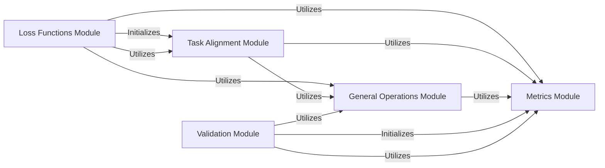

## Component Details

The Training & Evaluation Framework subsystem is responsible for the core processes of optimizing deep learning models, encompassing the calculation of performance metrics, the application of various loss functions during training, and strategic task-aligned assignment. It provides a structured approach to evaluate model performance, compute training losses, and manage the association between ground truth and predictions, ensuring efficient and accurate model development across different tasks like detection, segmentation, and pose estimation.

### Metrics Module
This module is responsible for calculating various performance metrics such as Intersection over Union (IoU), Probiou, and managing confusion matrices. It provides base classes for metrics and specialized classes for detection, segmentation, pose, and OBB metrics. It also includes utilities for plotting PR and MC curves.

**Related Classes/Methods**:

- <a href="https://github.com/ultralytics/ultralytics/blob/master/ultralytics/utils/metrics.py#L210-L253" target="_blank" rel="noopener noreferrer">`ultralytics.utils.metrics.probiou` (210:253)</a>
- <a href="https://github.com/ultralytics/ultralytics/blob/master/ultralytics/utils/metrics.py#L256-L292" target="_blank" rel="noopener noreferrer">`ultralytics.utils.metrics.batch_probiou` (256:292)</a>
- <a href="https://github.com/ultralytics/ultralytics/blob/master/ultralytics/utils/metrics.py#L312-L542" target="_blank" rel="noopener noreferrer">`ultralytics.utils.metrics.ConfusionMatrix` (312:542)</a>
- <a href="https://github.com/ultralytics/ultralytics/blob/master/ultralytics/utils/metrics.py#L554-L594" target="_blank" rel="noopener noreferrer">`ultralytics.utils.metrics.plot_pr_curve` (554:594)</a>
- <a href="https://github.com/ultralytics/ultralytics/blob/master/ultralytics/utils/metrics.py#L598-L640" target="_blank" rel="noopener noreferrer">`ultralytics.utils.metrics.plot_mc_curve` (598:640)</a>
- <a href="https://github.com/ultralytics/ultralytics/blob/master/ultralytics/utils/metrics.py#L643-L673" target="_blank" rel="noopener noreferrer">`ultralytics.utils.metrics.compute_ap` (643:673)</a>
- <a href="https://github.com/ultralytics/ultralytics/blob/master/ultralytics/utils/metrics.py#L676-L770" target="_blank" rel="noopener noreferrer">`ultralytics.utils.metrics.ap_per_class` (676:770)</a>
- <a href="https://github.com/ultralytics/ultralytics/blob/master/ultralytics/utils/metrics.py#L773-L943" target="_blank" rel="noopener noreferrer">`ultralytics.utils.metrics.Metric` (773:943)</a>
- <a href="https://github.com/ultralytics/ultralytics/blob/master/ultralytics/utils/metrics.py#L946-L1072" target="_blank" rel="noopener noreferrer">`ultralytics.utils.metrics.DetMetrics` (946:1072)</a>
- <a href="https://github.com/ultralytics/ultralytics/blob/master/ultralytics/utils/metrics.py#L1075-L1250" target="_blank" rel="noopener noreferrer">`ultralytics.utils.metrics.SegmentMetrics` (1075:1250)</a>
- <a href="https://github.com/ultralytics/ultralytics/blob/master/ultralytics/utils/metrics.py#L1253-L1428" target="_blank" rel="noopener noreferrer">`ultralytics.utils.metrics.PoseMetrics` (1253:1428)</a>
- <a href="https://github.com/ultralytics/ultralytics/blob/master/ultralytics/utils/metrics.py#L1506-L1631" target="_blank" rel="noopener noreferrer">`ultralytics.utils.metrics.OBBMetrics` (1506:1631)</a>
- <a href="https://github.com/ultralytics/ultralytics/blob/master/ultralytics/utils/metrics.py#L1431-L1503" target="_blank" rel="noopener noreferrer">`ultralytics.utils.metrics.ClassifyMetrics` (1431:1503)</a>
- <a href="https://github.com/ultralytics/ultralytics/blob/master/ultralytics/utils/metrics.py#L20-L49" target="_blank" rel="noopener noreferrer">`ultralytics.utils.metrics.bbox_ioa` (20:49)</a>
- <a href="https://github.com/ultralytics/ultralytics/blob/master/ultralytics/utils/metrics.py#L52-L73" target="_blank" rel="noopener noreferrer">`ultralytics.utils.metrics.box_iou` (52:73)</a>
- <a href="https://github.com/ultralytics/ultralytics/blob/master/ultralytics/utils/metrics.py#L166-L187" target="_blank" rel="noopener noreferrer">`ultralytics.utils.metrics.kpt_iou` (166:187)</a>
- <a href="https://github.com/ultralytics/ultralytics/blob/master/ultralytics/utils/metrics.py#L147-L163" target="_blank" rel="noopener noreferrer">`ultralytics.utils.metrics.mask_iou` (147:163)</a>
- <a href="https://github.com/ultralytics/ultralytics/blob/master/ultralytics/utils/metrics.py#L545-L550" target="_blank" rel="noopener noreferrer">`ultralytics.utils.metrics.smooth` (545:550)</a>

### Loss Functions Module
This module provides a collection of loss functions used for training various object detection, segmentation, pose estimation, and oriented bounding box models. It includes specialized loss implementations like VarifocalLoss, BboxLoss, RotatedBboxLoss, and task-specific v8 losses, as well as end-to-end and TVP losses.

**Related Classes/Methods**:

- <a href="https://github.com/ultralytics/ultralytics/blob/master/ultralytics/utils/loss.py#L18-L48" target="_blank" rel="noopener noreferrer">`ultralytics.utils.loss.VarifocalLoss` (18:48)</a>
- <a href="https://github.com/ultralytics/ultralytics/blob/master/ultralytics/utils/loss.py#L108-L139" target="_blank" rel="noopener noreferrer">`ultralytics.utils.loss.BboxLoss` (108:139)</a>
- <a href="https://github.com/ultralytics/ultralytics/blob/master/ultralytics/utils/loss.py#L142-L172" target="_blank" rel="noopener noreferrer">`ultralytics.utils.loss.RotatedBboxLoss` (142:172)</a>
- <a href="https://github.com/ultralytics/ultralytics/blob/master/ultralytics/utils/loss.py#L194-L297" target="_blank" rel="noopener noreferrer">`ultralytics.utils.loss.v8DetectionLoss` (194:297)</a>
- <a href="https://github.com/ultralytics/ultralytics/blob/master/ultralytics/utils/loss.py#L300-L480" target="_blank" rel="noopener noreferrer">`ultralytics.utils.loss.v8SegmentationLoss` (300:480)</a>
- <a href="https://github.com/ultralytics/ultralytics/blob/master/ultralytics/utils/loss.py#L483-L642" target="_blank" rel="noopener noreferrer">`ultralytics.utils.loss.v8PoseLoss` (483:642)</a>
- <a href="https://github.com/ultralytics/ultralytics/blob/master/ultralytics/utils/loss.py#L655-L770" target="_blank" rel="noopener noreferrer">`ultralytics.utils.loss.v8OBBLoss` (655:770)</a>
- <a href="https://github.com/ultralytics/ultralytics/blob/master/ultralytics/utils/loss.py#L773-L788" target="_blank" rel="noopener noreferrer">`ultralytics.utils.loss.E2EDetectLoss` (773:788)</a>
- <a href="https://github.com/ultralytics/ultralytics/blob/master/ultralytics/utils/loss.py#L791-L827" target="_blank" rel="noopener noreferrer">`ultralytics.utils.loss.TVPDetectLoss` (791:827)</a>
- <a href="https://github.com/ultralytics/ultralytics/blob/master/ultralytics/utils/loss.py#L830-L850" target="_blank" rel="noopener noreferrer">`ultralytics.utils.loss.TVPSegmentLoss` (830:850)</a>
- <a href="https://github.com/ultralytics/ultralytics/blob/master/ultralytics/utils/loss.py#L87-L105" target="_blank" rel="noopener noreferrer">`ultralytics.utils.loss.DFLoss` (87:105)</a>
- <a href="https://github.com/ultralytics/ultralytics/blob/master/ultralytics/utils/loss.py#L175-L191" target="_blank" rel="noopener noreferrer">`ultralytics.utils.loss.KeypointLoss` (175:191)</a>
- <a href="https://github.com/ultralytics/ultralytics/blob/master/ultralytics/models/utils/loss.py#L15-L397" target="_blank" rel="noopener noreferrer">`ultralytics.models.utils.loss.DETRLoss` (15:397)</a>

### Task Alignment Module
This module is responsible for aligning ground truth annotations with model predictions, a critical step in training object detection and related models. It includes assigners like `TaskAlignedAssigner` and `RotatedTaskAlignedAssigner` that determine positive and negative samples based on various metrics and strategies.

**Related Classes/Methods**:

- <a href="https://github.com/ultralytics/ultralytics/blob/master/ultralytics/utils/tal.py#L14-L329" target="_blank" rel="noopener noreferrer">`ultralytics.utils.tal.TaskAlignedAssigner` (14:329)</a>
- <a href="https://github.com/ultralytics/ultralytics/blob/master/ultralytics/utils/tal.py#L332-L364" target="_blank" rel="noopener noreferrer">`ultralytics.utils.tal.RotatedTaskAlignedAssigner` (332:364)</a>
- <a href="https://github.com/ultralytics/ultralytics/blob/master/ultralytics/utils/tal.py#L367-L379" target="_blank" rel="noopener noreferrer">`ultralytics.utils.tal.make_anchors` (367:379)</a>
- <a href="https://github.com/ultralytics/ultralytics/blob/master/ultralytics/utils/tal.py#L382-L391" target="_blank" rel="noopener noreferrer">`ultralytics.utils.tal.dist2bbox` (382:391)</a>
- <a href="https://github.com/ultralytics/ultralytics/blob/master/ultralytics/utils/tal.py#L400-L419" target="_blank" rel="noopener noreferrer">`ultralytics.utils.tal.dist2rbox` (400:419)</a>

### General Operations Module
This module provides a set of general utility functions for common operations such as non-maximum suppression (NMS), bounding box format conversions (e.g., xywh to xyxy), image scaling, and mask cropping. It also includes model-specific operations like Hungarian matching for end-to-end detection.

**Related Classes/Methods**:

- <a href="https://github.com/ultralytics/ultralytics/blob/master/ultralytics/models/utils/ops.py#L14-L156" target="_blank" rel="noopener noreferrer">`ultralytics.models.utils.ops.HungarianMatcher` (14:156)</a>
- <a href="https://github.com/ultralytics/ultralytics/blob/master/ultralytics/models/utils/ops.py#L189-L317" target="_blank" rel="noopener noreferrer">`ultralytics.models.utils.ops.get_cdn_group` (189:317)</a>

### Validation Module
This module encompasses the validation logic for various YOLO models, including classification, detection, segmentation, pose estimation, and oriented bounding box models. It handles the initialization of metrics, processing of prediction batches, and finalization of evaluation results, often interacting with the Metrics Module to compute performance indicators.

**Related Classes/Methods**:

- <a href="https://github.com/ultralytics/ultralytics/blob/master/ultralytics/models/yolo/classify/val.py#L12-L209" target="_blank" rel="noopener noreferrer">`ultralytics.models.yolo.classify.val.ClassificationValidator` (12:209)</a>
- <a href="https://github.com/ultralytics/ultralytics/blob/master/ultralytics/models/yolo/pose/val.py#L16-L416" target="_blank" rel="noopener noreferrer">`ultralytics.models.yolo.pose.val.PoseValidator` (16:416)</a>
- <a href="https://github.com/ultralytics/ultralytics/blob/master/ultralytics/models/yolo/obb/val.py#L14-L295" target="_blank" rel="noopener noreferrer">`ultralytics.models.yolo.obb.val.OBBValidator` (14:295)</a>
- <a href="https://github.com/ultralytics/ultralytics/blob/master/ultralytics/models/yolo/detect/val.py#L18-L442" target="_blank" rel="noopener noreferrer">`ultralytics.models.yolo.detect.val.DetectionValidator` (18:442)</a>
- <a href="https://github.com/ultralytics/ultralytics/blob/master/ultralytics/models/yolo/segment/val.py#L18-L435" target="_blank" rel="noopener noreferrer">`ultralytics.models.yolo.segment.val.SegmentationValidator` (18:435)</a>

### [FAQ](https://github.com/CodeBoarding/GeneratedOnBoardings/tree/main?tab=readme-ov-file#faq)