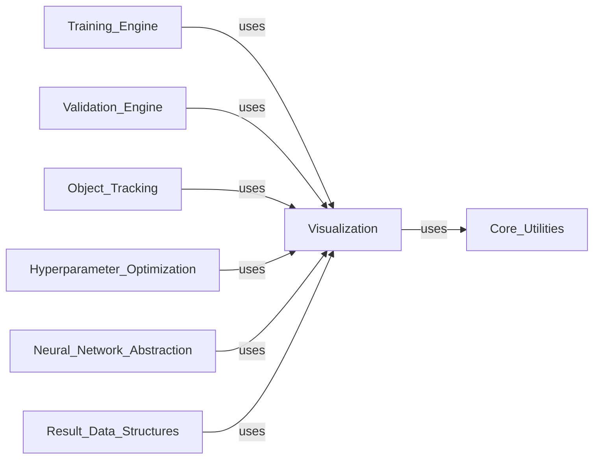

## Component Details

The Visualization component in Ultralytics provides a comprehensive set of tools for rendering and analyzing model outputs and training progress. It enables the visual inspection of bounding boxes, segmentation masks, keypoints, and other detection results, as well as the plotting of training and tuning curves. This component is crucial for debugging, performance analysis, and understanding the behavior of YOLO models.

### Visualization
Offers functionalities for visualizing model results, including bounding boxes, masks, keypoints, and training curves, to facilitate performance analysis and debugging.

**Related Classes/Methods**:

- <a href="https://github.com/ultralytics/ultralytics/blob/master/ultralytics/utils/plotting.py#L19-L162" target="_blank" rel="noopener noreferrer">`ultralytics.utils.plotting.Colors` (19:162)</a>
- <a href="https://github.com/ultralytics/ultralytics/blob/master/ultralytics/utils/plotting.py#L168-L549" target="_blank" rel="noopener noreferrer">`ultralytics.utils.plotting.Annotator` (168:549)</a>
- <a href="https://github.com/ultralytics/ultralytics/blob/master/ultralytics/utils/plotting.py#L554-L621" target="_blank" rel="noopener noreferrer">`ultralytics.utils.plotting.plot_labels` (554:621)</a>
- <a href="https://github.com/ultralytics/ultralytics/blob/master/ultralytics/utils/plotting.py#L624-L676" target="_blank" rel="noopener noreferrer">`ultralytics.utils.plotting.save_one_box` (624:676)</a>
- <a href="https://github.com/ultralytics/ultralytics/blob/master/ultralytics/utils/plotting.py#L680-L847" target="_blank" rel="noopener noreferrer">`ultralytics.utils.plotting.plot_images` (680:847)</a>
- <a href="https://github.com/ultralytics/ultralytics/blob/master/ultralytics/utils/plotting.py#L851-L915" target="_blank" rel="noopener noreferrer">`ultralytics.utils.plotting.plot_results` (851:915)</a>
- <a href="https://github.com/ultralytics/ultralytics/blob/master/ultralytics/utils/plotting.py#L951-L1004" target="_blank" rel="noopener noreferrer">`ultralytics.utils.plotting.plot_tune_results` (951:1004)</a>
- <a href="https://github.com/ultralytics/ultralytics/blob/master/ultralytics/utils/plotting.py#L1007-L1015" target="_blank" rel="noopener noreferrer">`ultralytics.utils.plotting.output_to_target` (1007:1015)</a>
- <a href="https://github.com/ultralytics/ultralytics/blob/master/ultralytics/utils/plotting.py#L1018-L1026" target="_blank" rel="noopener noreferrer">`ultralytics.utils.plotting.output_to_rotated_target` (1018:1026)</a>
- <a href="https://github.com/ultralytics/ultralytics/blob/master/ultralytics/utils/plotting.py#L918-L948" target="_blank" rel="noopener noreferrer">`ultralytics.utils.plotting.plt_color_scatter` (918:948)</a>
- `ultralytics.utils.plt_settings` (full file reference)
- <a href="https://github.com/ultralytics/ultralytics/blob/master/ultralytics/utils/plotting.py#L1029-L1062" target="_blank" rel="noopener noreferrer">`ultralytics.utils.plotting.feature_visualization` (1029:1062)</a>

### [FAQ](https://github.com/CodeBoarding/GeneratedOnBoardings/tree/main?tab=readme-ov-file#faq)