```mermaid
graph LR
    Core_Engine["Core Engine"]
    Model_Architecture_Implementations["Model Architecture & Implementations"]
    Data_Management_Primitives["Data Management & Primitives"]
    Training_Evaluation_Framework["Training & Evaluation Framework"]
    PyTorch_Utilities["PyTorch Utilities"]
    System_File_Utilities["System & File Utilities"]
    Visualization["Visualization"]
    Experiment_Management_Integrations["Experiment Management & Integrations"]
    Applied_Vision_Solutions["Applied Vision Solutions"]
    Documentation_Tools["Documentation Tools"]
    Core_Engine -- "orchestrates" --> Model_Architecture_Implementations
    Core_Engine -- "orchestrates" --> Data_Management_Primitives
    Core_Engine -- "orchestrates" --> Training_Evaluation_Framework
    Core_Engine -- "orchestrates" --> PyTorch_Utilities
    Core_Engine -- "orchestrates" --> Visualization
    Core_Engine -- "orchestrates" --> Experiment_Management_Integrations
    Core_Engine -- "orchestrates" --> Applied_Vision_Solutions
    Core_Engine -- "uses" --> System_File_Utilities
    Model_Architecture_Implementations -- "relies on" --> PyTorch_Utilities
    Model_Architecture_Implementations -- "leverages" --> Data_Management_Primitives
    Model_Architecture_Implementations -- "used by" --> Applied_Vision_Solutions
    Data_Management_Primitives -- "provides input to" --> Core_Engine
    Data_Management_Primitives -- "provides input to" --> Model_Architecture_Implementations
    Data_Management_Primitives -- "used by" --> Training_Evaluation_Framework
    Data_Management_Primitives -- "used by" --> Visualization
    Data_Management_Primitives -- "used by" --> Applied_Vision_Solutions
    Data_Management_Primitives -- "relies on" --> System_File_Utilities
    Training_Evaluation_Framework -- "used by" --> Core_Engine
    Training_Evaluation_Framework -- "relies on" --> PyTorch_Utilities
    Training_Evaluation_Framework -- "leverages" --> Data_Management_Primitives
    Training_Evaluation_Framework -- "provides data to" --> Visualization
    PyTorch_Utilities -- "provides fundamental operations to" --> Core_Engine
    PyTorch_Utilities -- "provides fundamental operations to" --> Model_Architecture_Implementations
    PyTorch_Utilities -- "provides fundamental operations to" --> Training_Evaluation_Framework
    PyTorch_Utilities -- "provides fundamental operations to" --> Experiment_Management_Integrations
    PyTorch_Utilities -- "provides fundamental operations to" --> Applied_Vision_Solutions
    PyTorch_Utilities -- "provides fundamental operations to" --> System_File_Utilities
    System_File_Utilities -- "used widely by" --> Core_Engine
    System_File_Utilities -- "used widely by" --> Data_Management_Primitives
    System_File_Utilities -- "used widely by" --> Experiment_Management_Integrations
    System_File_Utilities -- "used widely by" --> Applied_Vision_Solutions
    System_File_Utilities -- "used widely by" --> Model_Architecture_Implementations
    Visualization -- "used by" --> Core_Engine
    Visualization -- "used by" --> Training_Evaluation_Framework
    Visualization -- "used by" --> Applied_Vision_Solutions
    Visualization -- "relies on" --> Data_Management_Primitives
    Experiment_Management_Integrations -- "integrated into" --> Core_Engine
    Experiment_Management_Integrations -- "interacts with" --> System_File_Utilities
    Experiment_Management_Integrations -- "interacts with" --> PyTorch_Utilities
    Applied_Vision_Solutions -- "leverages" --> Model_Architecture_Implementations
    Applied_Vision_Solutions -- "leverages" --> Data_Management_Primitives
    Applied_Vision_Solutions -- "leverages" --> Visualization
    Applied_Vision_Solutions -- "leverages" --> System_File_Utilities
    Applied_Vision_Solutions -- "used by" --> Core_Engine
    click Core_Engine href "https://github.com/CodeBoarding/GeneratedOnBoardings/blob/main/ultralytics/Core Engine.md" "Details"
    click Model_Architecture_Implementations href "https://github.com/CodeBoarding/GeneratedOnBoardings/blob/main/ultralytics/Model Architecture & Implementations.md" "Details"
    click Data_Management_Primitives href "https://github.com/CodeBoarding/GeneratedOnBoardings/blob/main/ultralytics/Data Management & Primitives.md" "Details"
    click Training_Evaluation_Framework href "https://github.com/CodeBoarding/GeneratedOnBoardings/blob/main/ultralytics/Training & Evaluation Framework.md" "Details"
    click PyTorch_Utilities href "https://github.com/CodeBoarding/GeneratedOnBoardings/blob/main/ultralytics/PyTorch Utilities.md" "Details"
    click System_File_Utilities href "https://github.com/CodeBoarding/GeneratedOnBoardings/blob/main/ultralytics/System & File Utilities.md" "Details"
    click Visualization href "https://github.com/CodeBoarding/GeneratedOnBoardings/blob/main/ultralytics/Visualization.md" "Details"
    click Experiment_Management_Integrations href "https://github.com/CodeBoarding/GeneratedOnBoardings/blob/main/ultralytics/Experiment Management & Integrations.md" "Details"
    click Applied_Vision_Solutions href "https://github.com/CodeBoarding/GeneratedOnBoardings/blob/main/ultralytics/Applied Vision Solutions.md" "Details"
    click Documentation_Tools href "https://github.com/CodeBoarding/GeneratedOnBoardings/blob/main/ultralytics/Documentation Tools.md" "Details"
```

## Component Details

The Ultralytics framework provides a comprehensive suite for computer vision tasks, centered around a Core Engine that orchestrates model training, validation, prediction, and export. It integrates various specialized components for neural network architectures, data handling, performance evaluation, and application-specific solutions, all supported by robust PyTorch and system utilities, and extensible through experiment management integrations.

### Core Engine
Manages the overall lifecycle of models, including training, validation, prediction, and export. It acts as the central coordinator for various tasks within the Ultralytics framework.

**Related Classes/Methods**:

- `ultralytics.engine.model` (full file reference)
- `ultralytics.engine.trainer` (full file reference)
- `ultralytics.engine.validator` (full file reference)
- `ultralytics.engine.predictor` (full file reference)
- `ultralytics.engine.exporter` (full file reference)
- `ultralytics.engine.results` (full file reference)
- `ultralytics.engine.tuner` (full file reference)

### Model Architecture & Implementations
Encompasses the foundational neural network building blocks and the specific implementations of various computer vision models (e.g., YOLO, SAM, RTDETR) for tasks like detection, segmentation, and pose estimation.

**Related Classes/Methods**:

- `ultralytics.nn.autobackend` (full file reference)
- `ultralytics.nn.text_model` (full file reference)
- `ultralytics.nn.tasks` (full file reference)
- `ultralytics.nn.modules.transformer` (full file reference)
- `ultralytics.nn.modules.conv` (full file reference)
- `ultralytics.nn.modules.head` (full file reference)
- `ultralytics.nn.modules.block` (full file reference)
- `ultralytics.models.yolo.model` (full file reference)
- <a href="https://github.com/ultralytics/ultralytics/blob/master/ultralytics/models/yolo/classify/train.py#L17-L237" target="_blank" rel="noopener noreferrer">`ultralytics.models.yolo.classify.train.ClassificationTrainer` (17:237)</a>
- <a href="https://github.com/ultralytics/ultralytics/blob/master/ultralytics/models/yolo/classify/val.py#L12-L209" target="_blank" rel="noopener noreferrer">`ultralytics.models.yolo.classify.val.ClassificationValidator` (12:209)</a>
- <a href="https://github.com/ultralytics/ultralytics/blob/master/ultralytics/models/yolo/classify/predict.py#L13-L99" target="_blank" rel="noopener noreferrer">`ultralytics.models.yolo.classify.predict.ClassificationPredictor` (13:99)</a>
- <a href="https://github.com/ultralytics/ultralytics/blob/master/ultralytics/models/yolo/detect/train.py#L20-L218" target="_blank" rel="noopener noreferrer">`ultralytics.models.yolo.detect.train.DetectionTrainer` (20:218)</a>
- <a href="https://github.com/ultralytics/ultralytics/blob/master/ultralytics/models/yolo/detect/val.py#L18-L442" target="_blank" rel="noopener noreferrer">`ultralytics.models.yolo.detect.val.DetectionValidator` (18:442)</a>
- <a href="https://github.com/ultralytics/ultralytics/blob/master/ultralytics/models/yolo/detect/predict.py#L8-L125" target="_blank" rel="noopener noreferrer">`ultralytics.models.yolo.detect.predict.DetectionPredictor` (8:125)</a>
- <a href="https://github.com/ultralytics/ultralytics/blob/master/ultralytics/models/yolo/obb/train.py#L12-L89" target="_blank" rel="noopener noreferrer">`ultralytics.models.yolo.obb.train.OBBTrainer` (12:89)</a>
- <a href="https://github.com/ultralytics/ultralytics/blob/master/ultralytics/models/yolo/obb/val.py#L14-L295" target="_blank" rel="noopener noreferrer">`ultralytics.models.yolo.obb.val.OBBValidator` (14:295)</a>
- <a href="https://github.com/ultralytics/ultralytics/blob/master/ultralytics/models/yolo/obb/predict.py#L10-L65" target="_blank" rel="noopener noreferrer">`ultralytics.models.yolo.obb.predict.OBBPredictor` (10:65)</a>
- <a href="https://github.com/ultralytics/ultralytics/blob/master/ultralytics/models/yolo/pose/train.py#L13-L162" target="_blank" rel="noopener noreferrer">`ultralytics.models.yolo.pose.train.PoseTrainer` (13:162)</a>
- <a href="https://github.com/ultralytics/ultralytics/blob/master/ultralytics/models/yolo/pose/val.py#L16-L416" target="_blank" rel="noopener noreferrer">`ultralytics.models.yolo.pose.val.PoseValidator` (16:416)</a>
- <a href="https://github.com/ultralytics/ultralytics/blob/master/ultralytics/models/yolo/pose/predict.py#L7-L80" target="_blank" rel="noopener noreferrer">`ultralytics.models.yolo.pose.predict.PosePredictor` (7:80)</a>
- <a href="https://github.com/ultralytics/ultralytics/blob/master/ultralytics/models/yolo/segment/train.py#L13-L127" target="_blank" rel="noopener noreferrer">`ultralytics.models.yolo.segment.train.SegmentationTrainer` (13:127)</a>
- <a href="https://github.com/ultralytics/ultralytics/blob/master/ultralytics/models/yolo/segment/val.py#L18-L435" target="_blank" rel="noopener noreferrer">`ultralytics.models.yolo.segment.val.SegmentationValidator` (18:435)</a>
- <a href="https://github.com/ultralytics/ultralytics/blob/master/ultralytics/models/yolo/segment/predict.py#L8-L113" target="_blank" rel="noopener noreferrer">`ultralytics.models.yolo.segment.predict.SegmentationPredictor` (8:113)</a>
- <a href="https://github.com/ultralytics/ultralytics/blob/master/ultralytics/models/yolo/world/train.py#L24-L175" target="_blank" rel="noopener noreferrer">`ultralytics.models.yolo.world.train.WorldTrainer` (24:175)</a>
- <a href="https://github.com/ultralytics/ultralytics/blob/master/ultralytics/models/yolo/world/train_world.py#L10-L185" target="_blank" rel="noopener noreferrer">`ultralytics.models.yolo.world.train_world.WorldTrainerFromScratch` (10:185)</a>
- <a href="https://github.com/ultralytics/ultralytics/blob/master/ultralytics/models/yolo/yoloe/train.py#L21-L107" target="_blank" rel="noopener noreferrer">`ultralytics.models.yolo.yoloe.train.YOLOETrainer` (21:107)</a>
- <a href="https://github.com/ultralytics/ultralytics/blob/master/ultralytics/models/yolo/yoloe/train.py#L110-L161" target="_blank" rel="noopener noreferrer">`ultralytics.models.yolo.yoloe.train.YOLOEPETrainer` (110:161)</a>
- <a href="https://github.com/ultralytics/ultralytics/blob/master/ultralytics/models/yolo/yoloe/train.py#L164-L228" target="_blank" rel="noopener noreferrer">`ultralytics.models.yolo.yoloe.train.YOLOETrainerFromScratch` (164:228)</a>
- <a href="https://github.com/ultralytics/ultralytics/blob/master/ultralytics/models/yolo/yoloe/train.py#L231-L273" target="_blank" rel="noopener noreferrer">`ultralytics.models.yolo.yoloe.train.YOLOEPEFreeTrainer` (231:273)</a>
- <a href="https://github.com/ultralytics/ultralytics/blob/master/ultralytics/models/yolo/yoloe/train.py#L276-L321" target="_blank" rel="noopener noreferrer">`ultralytics.models.yolo.yoloe.train.YOLOEVPTrainer` (276:321)</a>
- <a href="https://github.com/ultralytics/ultralytics/blob/master/ultralytics/models/yolo/yoloe/train_seg.py#L13-L61" target="_blank" rel="noopener noreferrer">`ultralytics.models.yolo.yoloe.train_seg.YOLOESegTrainer` (13:61)</a>
- <a href="https://github.com/ultralytics/ultralytics/blob/master/ultralytics/models/yolo/yoloe/train_seg.py#L64-L115" target="_blank" rel="noopener noreferrer">`ultralytics.models.yolo.yoloe.train_seg.YOLOEPESegTrainer` (64:115)</a>
- <a href="https://github.com/ultralytics/ultralytics/blob/master/ultralytics/models/yolo/yoloe/val.py#L20-L209" target="_blank" rel="noopener noreferrer">`ultralytics.models.yolo.yoloe.val.YOLOEDetectValidator` (20:209)</a>
- <a href="https://github.com/ultralytics/ultralytics/blob/master/ultralytics/models/yolo/yoloe/val.py#L212-L215" target="_blank" rel="noopener noreferrer">`ultralytics.models.yolo.yoloe.val.YOLOESegValidator` (212:215)</a>
- <a href="https://github.com/ultralytics/ultralytics/blob/master/ultralytics/models/yolo/yoloe/predict.py#L11-L163" target="_blank" rel="noopener noreferrer">`ultralytics.models.yolo.yoloe.predict.YOLOEVPDetectPredictor` (11:163)</a>
- <a href="https://github.com/ultralytics/ultralytics/blob/master/ultralytics/models/rtdetr/train.py#L13-L91" target="_blank" rel="noopener noreferrer">`ultralytics.models.rtdetr.train.RTDETRTrainer` (13:91)</a>
- <a href="https://github.com/ultralytics/ultralytics/blob/master/ultralytics/models/rtdetr/model.py#L20-L64" target="_blank" rel="noopener noreferrer">`ultralytics.models.rtdetr.model.RTDETR` (20:64)</a>
- <a href="https://github.com/ultralytics/ultralytics/blob/master/ultralytics/models/rtdetr/val.py#L13-L99" target="_blank" rel="noopener noreferrer">`ultralytics.models.rtdetr.val.RTDETRDataset` (13:99)</a>
- <a href="https://github.com/ultralytics/ultralytics/blob/master/ultralytics/models/rtdetr/val.py#L102-L218" target="_blank" rel="noopener noreferrer">`ultralytics.models.rtdetr.val.RTDETRValidator` (102:218)</a>
- <a href="https://github.com/ultralytics/ultralytics/blob/master/ultralytics/models/rtdetr/predict.py#L11-L91" target="_blank" rel="noopener noreferrer">`ultralytics.models.rtdetr.predict.RTDETRPredictor` (11:91)</a>
- `ultralytics.models.sam.build` (full file reference)
- <a href="https://github.com/ultralytics/ultralytics/blob/master/ultralytics/models/sam/model.py#L26-L171" target="_blank" rel="noopener noreferrer">`ultralytics.models.sam.model.SAM` (26:171)</a>
- <a href="https://github.com/ultralytics/ultralytics/blob/master/ultralytics/models/sam/predict.py#L36-L621" target="_blank" rel="noopener noreferrer">`ultralytics.models.sam.predict.Predictor` (36:621)</a>
- <a href="https://github.com/ultralytics/ultralytics/blob/master/ultralytics/models/sam/predict.py#L624-L814" target="_blank" rel="noopener noreferrer">`ultralytics.models.sam.predict.SAM2Predictor` (624:814)</a>
- <a href="https://github.com/ultralytics/ultralytics/blob/master/ultralytics/models/sam/predict.py#L817-L1618" target="_blank" rel="noopener noreferrer">`ultralytics.models.sam.predict.SAM2VideoPredictor` (817:1618)</a>
- <a href="https://github.com/ultralytics/ultralytics/blob/master/ultralytics/models/fastsam/model.py#L12-L79" target="_blank" rel="noopener noreferrer">`ultralytics.models.fastsam.model.FastSAM` (12:79)</a>
- <a href="https://github.com/ultralytics/ultralytics/blob/master/ultralytics/models/fastsam/val.py#L7-L42" target="_blank" rel="noopener noreferrer">`ultralytics.models.fastsam.val.FastSAMValidator` (7:42)</a>
- <a href="https://github.com/ultralytics/ultralytics/blob/master/ultralytics/models/fastsam/predict.py#L14-L180" target="_blank" rel="noopener noreferrer">`ultralytics.models.fastsam.predict.FastSAMPredictor` (14:180)</a>
- <a href="https://github.com/ultralytics/ultralytics/blob/master/ultralytics/models/nas/model.py#L17-L98" target="_blank" rel="noopener noreferrer">`ultralytics.models.nas.model.NAS` (17:98)</a>
- <a href="https://github.com/ultralytics/ultralytics/blob/master/ultralytics/models/nas/val.py#L11-L39" target="_blank" rel="noopener noreferrer">`ultralytics.models.nas.val.NASValidator` (11:39)</a>
- <a href="https://github.com/ultralytics/ultralytics/blob/master/ultralytics/models/nas/predict.py#L9-L58" target="_blank" rel="noopener noreferrer">`ultralytics.models.nas.predict.NASPredictor` (9:58)</a>

### Data Management & Primitives
Handles all aspects of data processing, including dataset creation, loading, augmentation, and provides fundamental operations for manipulating images, bounding boxes, masks, and keypoints, along with defining relevant data structures.

**Related Classes/Methods**:

- `ultralytics.data.split_dota` (full file reference)
- `ultralytics.data.converter` (full file reference)
- `ultralytics.data.build` (full file reference)
- <a href="https://github.com/ultralytics/ultralytics/blob/master/ultralytics/data/base.py#L21-L441" target="_blank" rel="noopener noreferrer">`ultralytics.data.base.BaseDataset` (21:441)</a>
- `ultralytics.data.annotator` (full file reference)
- `ultralytics.data.split` (full file reference)
- <a href="https://github.com/ultralytics/ultralytics/blob/master/ultralytics/data/loaders.py#L52-L224" target="_blank" rel="noopener noreferrer">`ultralytics.data.loaders.LoadStreams` (52:224)</a>
- <a href="https://github.com/ultralytics/ultralytics/blob/master/ultralytics/data/loaders.py#L227-L304" target="_blank" rel="noopener noreferrer">`ultralytics.data.loaders.LoadScreenshots` (227:304)</a>
- <a href="https://github.com/ultralytics/ultralytics/blob/master/ultralytics/data/loaders.py#L307-L486" target="_blank" rel="noopener noreferrer">`ultralytics.data.loaders.LoadImagesAndVideos` (307:486)</a>
- <a href="https://github.com/ultralytics/ultralytics/blob/master/ultralytics/data/loaders.py#L489-L560" target="_blank" rel="noopener noreferrer">`ultralytics.data.loaders.LoadPilAndNumpy` (489:560)</a>
- <a href="https://github.com/ultralytics/ultralytics/blob/master/ultralytics/data/loaders.py#L563-L635" target="_blank" rel="noopener noreferrer">`ultralytics.data.loaders.LoadTensor` (563:635)</a>
- <a href="https://github.com/ultralytics/ultralytics/blob/master/ultralytics/data/loaders.py#L655-L704" target="_blank" rel="noopener noreferrer">`ultralytics.data.loaders.get_best_youtube_url` (655:704)</a>
- <a href="https://github.com/ultralytics/ultralytics/blob/master/ultralytics/data/augment.py#L26-L143" target="_blank" rel="noopener noreferrer">`ultralytics.data.augment.BaseTransform` (26:143)</a>
- <a href="https://github.com/ultralytics/ultralytics/blob/master/ultralytics/data/augment.py#L146-L316" target="_blank" rel="noopener noreferrer">`ultralytics.data.augment.Compose` (146:316)</a>
- <a href="https://github.com/ultralytics/ultralytics/blob/master/ultralytics/data/augment.py#L319-L488" target="_blank" rel="noopener noreferrer">`ultralytics.data.augment.BaseMixTransform` (319:488)</a>
- <a href="https://github.com/ultralytics/ultralytics/blob/master/ultralytics/data/augment.py#L491-L862" target="_blank" rel="noopener noreferrer">`ultralytics.data.augment.Mosaic` (491:862)</a>
- <a href="https://github.com/ultralytics/ultralytics/blob/master/ultralytics/data/augment.py#L865-L928" target="_blank" rel="noopener noreferrer">`ultralytics.data.augment.MixUp` (865:928)</a>
- <a href="https://github.com/ultralytics/ultralytics/blob/master/ultralytics/data/augment.py#L931-L1046" target="_blank" rel="noopener noreferrer">`ultralytics.data.augment.CutMix` (931:1046)</a>
- <a href="https://github.com/ultralytics/ultralytics/blob/master/ultralytics/data/augment.py#L1049-L1397" target="_blank" rel="noopener noreferrer">`ultralytics.data.augment.RandomPerspective` (1049:1397)</a>
- <a href="https://github.com/ultralytics/ultralytics/blob/master/ultralytics/data/augment.py#L1578-L1740" target="_blank" rel="noopener noreferrer">`ultralytics.data.augment.LetterBox` (1578:1740)</a>
- <a href="https://github.com/ultralytics/ultralytics/blob/master/ultralytics/data/augment.py#L1743-L1838" target="_blank" rel="noopener noreferrer">`ultralytics.data.augment.CopyPaste` (1743:1838)</a>
- <a href="https://github.com/ultralytics/ultralytics/blob/master/ultralytics/data/augment.py#L1841-L2035" target="_blank" rel="noopener noreferrer">`ultralytics.data.augment.Albumentations` (1841:2035)</a>
- <a href="https://github.com/ultralytics/ultralytics/blob/master/ultralytics/data/augment.py#L2038-L2250" target="_blank" rel="noopener noreferrer">`ultralytics.data.augment.Format` (2038:2250)</a>
- <a href="https://github.com/ultralytics/ultralytics/blob/master/ultralytics/data/augment.py#L2253-L2343" target="_blank" rel="noopener noreferrer">`ultralytics.data.augment.LoadVisualPrompt` (2253:2343)</a>
- <a href="https://github.com/ultralytics/ultralytics/blob/master/ultralytics/data/augment.py#L2485-L2550" target="_blank" rel="noopener noreferrer">`ultralytics.data.augment.v8_transforms` (2485:2550)</a>
- <a href="https://github.com/ultralytics/ultralytics/blob/master/ultralytics/data/augment.py#L2605-L2705" target="_blank" rel="noopener noreferrer">`ultralytics.data.augment.classify_augmentations` (2605:2705)</a>
- <a href="https://github.com/ultralytics/ultralytics/blob/master/ultralytics/data/augment.py#L2554-L2601" target="_blank" rel="noopener noreferrer">`ultralytics.data.augment.classify_transforms` (2554:2601)</a>
- <a href="https://github.com/ultralytics/ultralytics/blob/master/ultralytics/data/dataset.py#L47-L314" target="_blank" rel="noopener noreferrer">`ultralytics.data.dataset.YOLODataset` (47:314)</a>
- <a href="https://github.com/ultralytics/ultralytics/blob/master/ultralytics/data/dataset.py#L317-L414" target="_blank" rel="noopener noreferrer">`ultralytics.data.dataset.YOLOMultiModalDataset` (317:414)</a>
- <a href="https://github.com/ultralytics/ultralytics/blob/master/ultralytics/data/dataset.py#L417-L633" target="_blank" rel="noopener noreferrer">`ultralytics.data.dataset.GroundingDataset` (417:633)</a>
- <a href="https://github.com/ultralytics/ultralytics/blob/master/ultralytics/data/dataset.py#L636-L675" target="_blank" rel="noopener noreferrer">`ultralytics.data.dataset.YOLOConcatDataset` (636:675)</a>
- <a href="https://github.com/ultralytics/ultralytics/blob/master/ultralytics/data/dataset.py#L679-L684" target="_blank" rel="noopener noreferrer">`ultralytics.data.dataset.SemanticDataset` (679:684)</a>
- <a href="https://github.com/ultralytics/ultralytics/blob/master/ultralytics/data/dataset.py#L687-L835" target="_blank" rel="noopener noreferrer">`ultralytics.data.dataset.ClassificationDataset` (687:835)</a>
- <a href="https://github.com/ultralytics/ultralytics/blob/master/ultralytics/data/utils.py#L155-L177" target="_blank" rel="noopener noreferrer">`ultralytics.data.utils.verify_image` (155:177)</a>
- <a href="https://github.com/ultralytics/ultralytics/blob/master/ultralytics/data/utils.py#L180-L250" target="_blank" rel="noopener noreferrer">`ultralytics.data.utils.verify_image_label` (180:250)</a>
- <a href="https://github.com/ultralytics/ultralytics/blob/master/ultralytics/data/utils.py#L253-L294" target="_blank" rel="noopener noreferrer">`ultralytics.data.utils.visualize_image_annotations` (253:294)</a>
- <a href="https://github.com/ultralytics/ultralytics/blob/master/ultralytics/data/utils.py#L322-L338" target="_blank" rel="noopener noreferrer">`ultralytics.data.utils.polygons2masks` (322:338)</a>
- <a href="https://github.com/ultralytics/ultralytics/blob/master/ultralytics/data/utils.py#L341-L362" target="_blank" rel="noopener noreferrer">`ultralytics.data.utils.polygons2masks_overlap` (341:362)</a>
- <a href="https://github.com/ultralytics/ultralytics/blob/master/ultralytics/data/utils.py#L386-L478" target="_blank" rel="noopener noreferrer">`ultralytics.data.utils.check_det_dataset` (386:478)</a>
- <a href="https://github.com/ultralytics/ultralytics/blob/master/ultralytics/data/utils.py#L481-L570" target="_blank" rel="noopener noreferrer">`ultralytics.data.utils.check_cls_dataset` (481:570)</a>
- <a href="https://github.com/ultralytics/ultralytics/blob/master/ultralytics/data/utils.py#L573-L737" target="_blank" rel="noopener noreferrer">`ultralytics.data.utils.HUBDatasetStats` (573:737)</a>
- <a href="https://github.com/ultralytics/ultralytics/blob/master/ultralytics/data/utils.py#L787-L797" target="_blank" rel="noopener noreferrer">`ultralytics.data.utils.save_dataset_cache_file` (787:797)</a>
- <a href="https://github.com/ultralytics/ultralytics/blob/master/ultralytics/data/utils.py#L44-L47" target="_blank" rel="noopener noreferrer">`ultralytics.data.utils.img2label_paths` (44:47)</a>
- <a href="https://github.com/ultralytics/ultralytics/blob/master/ultralytics/data/utils.py#L141-L152" target="_blank" rel="noopener noreferrer">`ultralytics.data.utils.exif_size` (141:152)</a>
- <a href="https://github.com/ultralytics/ultralytics/blob/master/ultralytics/data/utils.py#L50-L125" target="_blank" rel="noopener noreferrer">`ultralytics.data.utils.check_file_speeds` (50:125)</a>
- <a href="https://github.com/ultralytics/ultralytics/blob/master/ultralytics/data/utils.py#L777-L784" target="_blank" rel="noopener noreferrer">`ultralytics.data.utils.load_dataset_cache_file` (777:784)</a>
- <a href="https://github.com/ultralytics/ultralytics/blob/master/ultralytics/data/utils.py#L128-L138" target="_blank" rel="noopener noreferrer">`ultralytics.data.utils.get_hash` (128:138)</a>
- <a href="https://github.com/ultralytics/ultralytics/blob/master/ultralytics/data/utils.py#L365-L383" target="_blank" rel="noopener noreferrer">`ultralytics.data.utils.find_dataset_yaml` (365:383)</a>
- <a href="https://github.com/ultralytics/ultralytics/blob/master/ultralytics/data/utils.py#L740-L774" target="_blank" rel="noopener noreferrer">`ultralytics.data.utils.compress_one_image` (740:774)</a>
- <a href="https://github.com/ultralytics/ultralytics/blob/master/ultralytics/utils/ops.py#L18-L72" target="_blank" rel="noopener noreferrer">`ultralytics.utils.ops.Profile` (18:72)</a>
- <a href="https://github.com/ultralytics/ultralytics/blob/master/ultralytics/utils/ops.py#L105-L140" target="_blank" rel="noopener noreferrer">`ultralytics.utils.ops.scale_boxes` (105:140)</a>
- <a href="https://github.com/ultralytics/ultralytics/blob/master/ultralytics/utils/ops.py#L159-L189" target="_blank" rel="noopener noreferrer">`ultralytics.utils.ops.nms_rotated` (159:189)</a>
- <a href="https://github.com/ultralytics/ultralytics/blob/master/ultralytics/utils/ops.py#L192-L338" target="_blank" rel="noopener noreferrer">`ultralytics.utils.ops.non_max_suppression` (192:338)</a>
- <a href="https://github.com/ultralytics/ultralytics/blob/master/ultralytics/utils/ops.py#L420-L437" target="_blank" rel="noopener noreferrer">`ultralytics.utils.ops.xyxy2xywh` (420:437)</a>
- <a href="https://github.com/ultralytics/ultralytics/blob/master/ultralytics/utils/ops.py#L440-L457" target="_blank" rel="noopener noreferrer">`ultralytics.utils.ops.xywh2xyxy` (440:457)</a>
- <a href="https://github.com/ultralytics/ultralytics/blob/master/ultralytics/utils/ops.py#L460-L481" target="_blank" rel="noopener noreferrer">`ultralytics.utils.ops.xywhn2xyxy` (460:481)</a>
- <a href="https://github.com/ultralytics/ultralytics/blob/master/ultralytics/utils/ops.py#L484-L507" target="_blank" rel="noopener noreferrer">`ultralytics.utils.ops.xyxy2xywhn` (484:507)</a>
- <a href="https://github.com/ultralytics/ultralytics/blob/master/ultralytics/utils/ops.py#L628-L642" target="_blank" rel="noopener noreferrer">`ultralytics.utils.ops.segments2boxes` (628:642)</a>
- <a href="https://github.com/ultralytics/ultralytics/blob/master/ultralytics/utils/ops.py#L688-L718" target="_blank" rel="noopener noreferrer">`ultralytics.utils.ops.process_mask` (688:718)</a>
- <a href="https://github.com/ultralytics/ultralytics/blob/master/ultralytics/utils/ops.py#L721-L738" target="_blank" rel="noopener noreferrer">`ultralytics.utils.ops.process_mask_native` (721:738)</a>
- <a href="https://github.com/ultralytics/ultralytics/blob/master/ultralytics/utils/ops.py#L767-L798" target="_blank" rel="noopener noreferrer">`ultralytics.utils.ops.scale_coords` (767:798)</a>
- <a href="https://github.com/ultralytics/ultralytics/blob/master/ultralytics/utils/ops.py#L820-L848" target="_blank" rel="noopener noreferrer">`ultralytics.utils.ops.masks2segments` (820:848)</a>
- <a href="https://github.com/ultralytics/ultralytics/blob/master/ultralytics/utils/ops.py#L341-L360" target="_blank" rel="noopener noreferrer">`ultralytics.utils.ops.clip_boxes` (341:360)</a>
- <a href="https://github.com/ultralytics/ultralytics/blob/master/ultralytics/utils/ops.py#L877-L881" target="_blank" rel="noopener noreferrer">`ultralytics.utils.ops.empty_like` (877:881)</a>
- <a href="https://github.com/ultralytics/ultralytics/blob/master/ultralytics/utils/ops.py#L143-L156" target="_blank" rel="noopener noreferrer">`ultralytics.utils.ops.make_divisible` (143:156)</a>
- <a href="https://github.com/ultralytics/ultralytics/blob/master/ultralytics/utils/ops.py#L510-L523" target="_blank" rel="noopener noreferrer">`ultralytics.utils.ops.xywh2ltwh` (510:523)</a>
- <a href="https://github.com/ultralytics/ultralytics/blob/master/ultralytics/utils/ops.py#L581-L609" target="_blank" rel="noopener noreferrer">`ultralytics.utils.ops.xywhr2xyxyxyxy` (581:609)</a>
- <a href="https://github.com/ultralytics/ultralytics/blob/master/ultralytics/utils/ops.py#L75-L102" target="_blank" rel="noopener noreferrer">`ultralytics.utils.ops.segment2box` (75:102)</a>
- <a href="https://github.com/ultralytics/ultralytics/blob/master/ultralytics/utils/ops.py#L669-L685" target="_blank" rel="noopener noreferrer">`ultralytics.utils.ops.crop_mask` (669:685)</a>
- <a href="https://github.com/ultralytics/ultralytics/blob/master/ultralytics/utils/ops.py#L741-L764" target="_blank" rel="noopener noreferrer">`ultralytics.utils.ops.scale_masks` (741:764)</a>
- <a href="https://github.com/ultralytics/ultralytics/blob/master/ultralytics/utils/ops.py#L851-L861" target="_blank" rel="noopener noreferrer">`ultralytics.utils.ops.convert_torch2numpy_batch` (851:861)</a>
- <a href="https://github.com/ultralytics/ultralytics/blob/master/ultralytics/utils/ops.py#L801-L817" target="_blank" rel="noopener noreferrer">`ultralytics.utils.ops.regularize_rboxes` (801:817)</a>
- <a href="https://github.com/ultralytics/ultralytics/blob/master/ultralytics/utils/ops.py#L645-L666" target="_blank" rel="noopener noreferrer">`ultralytics.utils.ops.resample_segments` (645:666)</a>
- <a href="https://github.com/ultralytics/ultralytics/blob/master/ultralytics/utils/instance.py#L34-L184" target="_blank" rel="noopener noreferrer">`ultralytics.utils.instance.Bboxes` (34:184)</a>
- <a href="https://github.com/ultralytics/ultralytics/blob/master/ultralytics/utils/instance.py#L187-L495" target="_blank" rel="noopener noreferrer">`ultralytics.utils.instance.Instances` (187:495)</a>
- <a href="https://github.com/ultralytics/ultralytics/blob/master/ultralytics/utils/instance.py#L16-L18" target="_blank" rel="noopener noreferrer">`ultralytics.utils.instance._ntuple.parse` (16:18)</a>

### Training & Evaluation Framework
Implements various metrics for evaluating model performance, loss functions used during training, and task-aligned assignment strategies crucial for optimizing deep learning models.

**Related Classes/Methods**:

- <a href="https://github.com/ultralytics/ultralytics/blob/master/ultralytics/utils/metrics.py#L210-L253" target="_blank" rel="noopener noreferrer">`ultralytics.utils.metrics.probiou` (210:253)</a>
- <a href="https://github.com/ultralytics/ultralytics/blob/master/ultralytics/utils/metrics.py#L256-L292" target="_blank" rel="noopener noreferrer">`ultralytics.utils.metrics.batch_probiou` (256:292)</a>
- <a href="https://github.com/ultralytics/ultralytics/blob/master/ultralytics/utils/metrics.py#L312-L542" target="_blank" rel="noopener noreferrer">`ultralytics.utils.metrics.ConfusionMatrix` (312:542)</a>
- <a href="https://github.com/ultralytics/ultralytics/blob/master/ultralytics/utils/metrics.py#L554-L594" target="_blank" rel="noopener noreferrer">`ultralytics.utils.metrics.plot_pr_curve` (554:594)</a>
- <a href="https://github.com/ultralytics/ultralytics/blob/master/ultralytics/utils/metrics.py#L598-L640" target="_blank" rel="noopener noreferrer">`ultralytics.utils.metrics.plot_mc_curve` (598:640)</a>
- <a href="https://github.com/ultralytics/ultralytics/blob/master/ultralytics/utils/metrics.py#L643-L673" target="_blank" rel="noopener noreferrer">`ultralytics.utils.metrics.compute_ap` (643:673)</a>
- <a href="https://github.com/ultralytics/ultralytics/blob/master/ultralytics/utils/metrics.py#L676-L770" target="_blank" rel="noopener noreferrer">`ultralytics.utils.metrics.ap_per_class` (676:770)</a>
- <a href="https://github.com/ultralytics/ultralytics/blob/master/ultralytics/utils/metrics.py#L773-L943" target="_blank" rel="noopener noreferrer">`ultralytics.utils.metrics.Metric` (773:943)</a>
- <a href="https://github.com/ultralytics/ultralytics/blob/master/ultralytics/utils/metrics.py#L946-L1072" target="_blank" rel="noopener noreferrer">`ultralytics.utils.metrics.DetMetrics` (946:1072)</a>
- <a href="https://github.com/ultralytics/ultralytics/blob/master/ultralytics/utils/metrics.py#L1075-L1250" target="_blank" rel="noopener noreferrer">`ultralytics.utils.metrics.SegmentMetrics` (1075:1250)</a>
- <a href="https://github.com/ultralytics/ultralytics/blob/master/ultralytics/utils/metrics.py#L1253-L1428" target="_blank" rel="noopener noreferrer">`ultralytics.utils.metrics.PoseMetrics` (1253:1428)</a>
- <a href="https://github.com/ultralytics/ultralytics/blob/master/ultralytics/utils/metrics.py#L1506-L1631" target="_blank" rel="noopener noreferrer">`ultralytics.utils.metrics.OBBMetrics` (1506:1631)</a>
- <a href="https://github.com/ultralytics/ultralytics/blob/master/ultralytics/utils/metrics.py#L1431-L1503" target="_blank" rel="noopener noreferrer">`ultralytics.utils.metrics.ClassifyMetrics` (1431:1503)</a>
- <a href="https://github.com/ultralytics/ultralytics/blob/master/ultralytics/utils/metrics.py#L20-L49" target="_blank" rel="noopener noreferrer">`ultralytics.utils.metrics.bbox_ioa` (20:49)</a>
- <a href="https://github.com/ultralytics/ultralytics/blob/master/ultralytics/utils/metrics.py#L52-L73" target="_blank" rel="noopener noreferrer">`ultralytics.utils.metrics.box_iou` (52:73)</a>
- <a href="https://github.com/ultralytics/ultralytics/blob/master/ultralytics/utils/metrics.py#L166-L187" target="_blank" rel="noopener noreferrer">`ultralytics.utils.metrics.kpt_iou` (166:187)</a>
- <a href="https://github.com/ultralytics/ultralytics/blob/master/ultralytics/utils/metrics.py#L147-L163" target="_blank" rel="noopener noreferrer">`ultralytics.utils.metrics.mask_iou` (147:163)</a>
- <a href="https://github.com/ultralytics/ultralytics/blob/master/ultralytics/utils/metrics.py#L545-L550" target="_blank" rel="noopener noreferrer">`ultralytics.utils.metrics.smooth` (545:550)</a>
- <a href="https://github.com/ultralytics/ultralytics/blob/master/ultralytics/utils/loss.py#L18-L48" target="_blank" rel="noopener noreferrer">`ultralytics.utils.loss.VarifocalLoss` (18:48)</a>
- <a href="https://github.com/ultralytics/ultralytics/blob/master/ultralytics/utils/loss.py#L108-L139" target="_blank" rel="noopener noreferrer">`ultralytics.utils.loss.BboxLoss` (108:139)</a>
- <a href="https://github.com/ultralytics/ultralytics/blob/master/ultralytics/utils/loss.py#L142-L172" target="_blank" rel="noopener noreferrer">`ultralytics.utils.loss.RotatedBboxLoss` (142:172)</a>
- <a href="https://github.com/ultralytics/ultralytics/blob/master/ultralytics/utils/loss.py#L194-L297" target="_blank" rel="noopener noreferrer">`ultralytics.utils.loss.v8DetectionLoss` (194:297)</a>
- <a href="https://github.com/ultralytics/ultralytics/blob/master/ultralytics/utils/loss.py#L300-L480" target="_blank" rel="noopener noreferrer">`ultralytics.utils.loss.v8SegmentationLoss` (300:480)</a>
- <a href="https://github.com/ultralytics/ultralytics/blob/master/ultralytics/utils/loss.py#L483-L642" target="_blank" rel="noopener noreferrer">`ultralytics.utils.loss.v8PoseLoss` (483:642)</a>
- <a href="https://github.com/ultralytics/ultralytics/blob/master/ultralytics/utils/loss.py#L655-L770" target="_blank" rel="noopener noreferrer">`ultralytics.utils.loss.v8OBBLoss` (655:770)</a>
- <a href="https://github.com/ultralytics/ultralytics/blob/master/ultralytics/utils/loss.py#L773-L788" target="_blank" rel="noopener noreferrer">`ultralytics.utils.loss.E2EDetectLoss` (773:788)</a>
- <a href="https://github.com/ultralytics/ultralytics/blob/master/ultralytics/utils/loss.py#L791-L827" target="_blank" rel="noopener noreferrer">`ultralytics.utils.loss.TVPDetectLoss` (791:827)</a>
- <a href="https://github.com/ultralytics/ultralytics/blob/master/ultralytics/utils/loss.py#L830-L850" target="_blank" rel="noopener noreferrer">`ultralytics.utils.loss.TVPSegmentLoss` (830:850)</a>
- <a href="https://github.com/ultralytics/ultralytics/blob/master/ultralytics/utils/loss.py#L87-L105" target="_blank" rel="noopener noreferrer">`ultralytics.utils.loss.DFLoss` (87:105)</a>
- <a href="https://github.com/ultralytics/ultralytics/blob/master/ultralytics/utils/loss.py#L175-L191" target="_blank" rel="noopener noreferrer">`ultralytics.utils.loss.KeypointLoss` (175:191)</a>
- <a href="https://github.com/ultralytics/ultralytics/blob/master/ultralytics/models/utils/loss.py#L15-L397" target="_blank" rel="noopener noreferrer">`ultralytics.models.utils.loss.DETRLoss` (15:397)</a>
- <a href="https://github.com/ultralytics/ultralytics/blob/master/ultralytics/models/utils/ops.py#L14-L156" target="_blank" rel="noopener noreferrer">`ultralytics.models.utils.ops.HungarianMatcher` (14:156)</a>
- <a href="https://github.com/ultralytics/ultralytics/blob/master/ultralytics/models/utils/ops.py#L189-L317" target="_blank" rel="noopener noreferrer">`ultralytics.models.utils.ops.get_cdn_group` (189:317)</a>
- <a href="https://github.com/ultralytics/ultralytics/blob/master/ultralytics/utils/tal.py#L14-L329" target="_blank" rel="noopener noreferrer">`ultralytics.utils.tal.TaskAlignedAssigner` (14:329)</a>
- <a href="https://github.com/ultralytics/ultralytics/blob/master/ultralytics/utils/tal.py#L332-L364" target="_blank" rel="noopener noreferrer">`ultralytics.utils.tal.RotatedTaskAlignedAssigner` (332:364)</a>
- <a href="https://github.com/ultralytics/ultralytics/blob/master/ultralytics/utils/tal.py#L367-L379" target="_blank" rel="noopener noreferrer">`ultralytics.utils.tal.make_anchors` (367:379)</a>
- <a href="https://github.com/ultralytics/ultralytics/blob/master/ultralytics/utils/tal.py#L382-L391" target="_blank" rel="noopener noreferrer">`ultralytics.utils.tal.dist2bbox` (382:391)</a>
- <a href="https://github.com/ultralytics/ultralytics/blob/master/ultralytics/utils/tal.py#L400-L419" target="_blank" rel="noopener noreferrer">`ultralytics.utils.tal.dist2rbox` (400:419)</a>

### PyTorch Utilities
Provides essential helper functions and classes specifically for PyTorch operations, such as device selection, model profiling, EMA, distributed training setup, and weight initialization.

**Related Classes/Methods**:

- <a href="https://github.com/ultralytics/ultralytics/blob/master/ultralytics/utils/torch_utils.py#L130-L241" target="_blank" rel="noopener noreferrer">`ultralytics.utils.torch_utils.select_device` (130:241)</a>
- <a href="https://github.com/ultralytics/ultralytics/blob/master/ultralytics/utils/torch_utils.py#L316-L358" target="_blank" rel="noopener noreferrer">`ultralytics.utils.torch_utils.model_info` (316:358)</a>
- <a href="https://github.com/ultralytics/ultralytics/blob/master/ultralytics/utils/torch_utils.py#L371-L402" target="_blank" rel="noopener noreferrer">`ultralytics.utils.torch_utils.model_info_for_loggers` (371:402)</a>
- <a href="https://github.com/ultralytics/ultralytics/blob/master/ultralytics/utils/torch_utils.py#L405-L444" target="_blank" rel="noopener noreferrer">`ultralytics.utils.torch_utils.get_flops` (405:444)</a>
- <a href="https://github.com/ultralytics/ultralytics/blob/master/ultralytics/utils/torch_utils.py#L447-L478" target="_blank" rel="noopener noreferrer">`ultralytics.utils.torch_utils.get_flops_with_torch_profiler` (447:478)</a>
- <a href="https://github.com/ultralytics/ultralytics/blob/master/ultralytics/utils/torch_utils.py#L577-L587" target="_blank" rel="noopener noreferrer">`ultralytics.utils.torch_utils.de_parallel` (577:587)</a>
- <a href="https://github.com/ultralytics/ultralytics/blob/master/ultralytics/utils/torch_utils.py#L605-L628" target="_blank" rel="noopener noreferrer">`ultralytics.utils.torch_utils.init_seeds` (605:628)</a>
- <a href="https://github.com/ultralytics/ultralytics/blob/master/ultralytics/utils/torch_utils.py#L639-L704" target="_blank" rel="noopener noreferrer">`ultralytics.utils.torch_utils.ModelEMA` (639:704)</a>
- <a href="https://github.com/ultralytics/ultralytics/blob/master/ultralytics/utils/torch_utils.py#L812-L895" target="_blank" rel="noopener noreferrer">`ultralytics.utils.torch_utils.profile_ops` (812:895)</a>
- <a href="https://github.com/ultralytics/ultralytics/blob/master/ultralytics/utils/torch_utils.py#L898-L949" target="_blank" rel="noopener noreferrer">`ultralytics.utils.torch_utils.EarlyStopping` (898:949)</a>
- <a href="https://github.com/ultralytics/ultralytics/blob/master/ultralytics/utils/torch_utils.py#L952-L996" target="_blank" rel="noopener noreferrer">`ultralytics.utils.torch_utils.FXModel` (952:996)</a>
- <a href="https://github.com/ultralytics/ultralytics/blob/master/ultralytics/utils/torch_utils.py#L76-L102" target="_blank" rel="noopener noreferrer">`ultralytics.utils.torch_utils.autocast` (76:102)</a>
- <a href="https://github.com/ultralytics/ultralytics/blob/master/ultralytics/utils/torch_utils.py#L244-L248" target="_blank" rel="noopener noreferrer">`ultralytics.utils.torch_utils.time_sync` (244:248)</a>
- <a href="https://github.com/ultralytics/ultralytics/blob/master/ultralytics/utils/torch_utils.py#L251-L282" target="_blank" rel="noopener noreferrer">`ultralytics.utils.torch_utils.fuse_conv_and_bn` (251:282)</a>
- <a href="https://github.com/ultralytics/ultralytics/blob/master/ultralytics/utils/torch_utils.py#L285-L313" target="_blank" rel="noopener noreferrer">`ultralytics.utils.torch_utils.fuse_deconv_and_bn` (285:313)</a>
- <a href="https://github.com/ultralytics/ultralytics/blob/master/ultralytics/utils/torch_utils.py#L549-L561" target="_blank" rel="noopener noreferrer">`ultralytics.utils.torch_utils.intersect_dicts` (549:561)</a>
- <a href="https://github.com/ultralytics/ultralytics/blob/master/ultralytics/utils/torch_utils.py#L481-L491" target="_blank" rel="noopener noreferrer">`ultralytics.utils.torch_utils.initialize_weights` (481:491)</a>
- <a href="https://github.com/ultralytics/ultralytics/blob/master/ultralytics/utils/torch_utils.py#L494-L514" target="_blank" rel="noopener noreferrer">`ultralytics.utils.torch_utils.scale_img` (494:514)</a>
- <a href="https://github.com/ultralytics/ultralytics/blob/master/ultralytics/utils/torch_utils.py#L106-L120" target="_blank" rel="noopener noreferrer">`ultralytics.utils.torch_utils.get_cpu_info` (106:120)</a>
- <a href="https://github.com/ultralytics/ultralytics/blob/master/ultralytics/utils/torch_utils.py#L124-L127" target="_blank" rel="noopener noreferrer">`ultralytics.utils.torch_utils.get_gpu_info` (124:127)</a>
- <a href="https://github.com/ultralytics/ultralytics/blob/master/ultralytics/utils/torch_utils.py#L361-L363" target="_blank" rel="noopener noreferrer">`ultralytics.utils.torch_utils.get_num_params` (361:363)</a>
- <a href="https://github.com/ultralytics/ultralytics/blob/master/ultralytics/utils/torch_utils.py#L366-L368" target="_blank" rel="noopener noreferrer">`ultralytics.utils.torch_utils.get_num_gradients` (366:368)</a>
- <a href="https://github.com/ultralytics/ultralytics/blob/master/ultralytics/utils/torch_utils.py#L564-L574" target="_blank" rel="noopener noreferrer">`ultralytics.utils.torch_utils.is_parallel` (564:574)</a>
- <a href="https://github.com/ultralytics/ultralytics/blob/master/ultralytics/utils/torch_utils.py#L631-L636" target="_blank" rel="noopener noreferrer">`ultralytics.utils.torch_utils.unset_deterministic` (631:636)</a>
- <a href="https://github.com/ultralytics/ultralytics/blob/master/ultralytics/utils/torch_utils.py#L517-L531" target="_blank" rel="noopener noreferrer">`ultralytics.utils.torch_utils.copy_attr` (517:531)</a>
- <a href="https://github.com/ultralytics/ultralytics/blob/master/ultralytics/utils/torch_utils.py#L787-L809" target="_blank" rel="noopener noreferrer">`ultralytics.utils.torch_utils.cuda_memory_usage` (787:809)</a>
- <a href="https://github.com/ultralytics/ultralytics/blob/master/ultralytics/utils/torch_utils.py#L51-L60" target="_blank" rel="noopener noreferrer">`ultralytics.utils.torch_utils.torch_distributed_zero_first` (51:60)</a>
- <a href="https://github.com/ultralytics/ultralytics/blob/master/ultralytics/utils/torch_utils.py#L590-L602" target="_blank" rel="noopener noreferrer">`ultralytics.utils.torch_utils.one_cycle` (590:602)</a>
- <a href="https://github.com/ultralytics/ultralytics/blob/master/ultralytics/utils/torch_utils.py#L768-L783" target="_blank" rel="noopener noreferrer">`ultralytics.utils.torch_utils.convert_optimizer_state_dict_to_fp16` (768:783)</a>
- <a href="https://github.com/ultralytics/ultralytics/blob/master/ultralytics/utils/torch_utils.py#L707-L765" target="_blank" rel="noopener noreferrer">`ultralytics.utils.torch_utils.strip_optimizer` (707:765)</a>
- <a href="https://github.com/ultralytics/ultralytics/blob/master/ultralytics/utils/torch_utils.py#L534-L546" target="_blank" rel="noopener noreferrer">`ultralytics.utils.torch_utils.get_latest_opset` (534:546)</a>

### System & File Utilities
A comprehensive collection of general-purpose utility functions for configuration management, system environment checks, file operations, and asset downloading, ensuring the smooth operation of the framework.

**Related Classes/Methods**:

- `ultralytics.cfg.cfg2dict` (full file reference)
- `ultralytics.cfg.get_cfg` (full file reference)
- `ultralytics.cfg.get_save_dir` (full file reference)
- `ultralytics.cfg._handle_deprecation` (full file reference)
- `ultralytics.cfg.check_dict_alignment` (full file reference)
- `ultralytics.cfg.handle_yolo_hub` (full file reference)
- `ultralytics.cfg.handle_yolo_settings` (full file reference)
- `ultralytics.cfg.handle_yolo_solutions` (full file reference)
- `ultralytics.cfg.parse_key_value_pair` (full file reference)
- `ultralytics.cfg.entrypoint` (full file reference)
- `ultralytics.utils.SimpleClass` (full file reference)
- `ultralytics.utils.YAML` (full file reference)
- `ultralytics.utils.JSONDict` (full file reference)
- `ultralytics.utils.SettingsManager` (full file reference)
- <a href="https://github.com/ultralytics/ultralytics/blob/master/ultralytics/utils/errors.py#L6-L43" target="_blank" rel="noopener noreferrer">`ultralytics.utils.errors.HUBModelError` (6:43)</a>
- <a href="https://github.com/ultralytics/ultralytics/blob/master/ultralytics/utils/autobatch.py#L15-L42" target="_blank" rel="noopener noreferrer">`ultralytics.utils.autobatch.check_train_batch_size` (15:42)</a>
- <a href="https://github.com/ultralytics/ultralytics/blob/master/ultralytics/utils/autobatch.py#L45-L119" target="_blank" rel="noopener noreferrer">`ultralytics.utils.autobatch.autobatch` (45:119)</a>
- <a href="https://github.com/ultralytics/ultralytics/blob/master/ultralytics/utils/autodevice.py#L9-L187" target="_blank" rel="noopener noreferrer">`ultralytics.utils.autodevice.GPUInfo` (9:187)</a>
- `ultralytics.utils.autodevice.select_idle_gpu` (full file reference)
- <a href="https://github.com/ultralytics/ultralytics/blob/master/ultralytics/utils/tuner.py#L7-L159" target="_blank" rel="noopener noreferrer">`ultralytics.utils.tuner.run_ray_tune` (7:159)</a>
- <a href="https://github.com/ultralytics/ultralytics/blob/master/ultralytics/utils/benchmarks.py#L52-L211" target="_blank" rel="noopener noreferrer">`ultralytics.utils.benchmarks.benchmark` (52:211)</a>
- <a href="https://github.com/ultralytics/ultralytics/blob/master/ultralytics/utils/benchmarks.py#L214-L357" target="_blank" rel="noopener noreferrer">`ultralytics.utils.benchmarks.RF100Benchmark` (214:357)</a>
- <a href="https://github.com/ultralytics/ultralytics/blob/master/ultralytics/utils/benchmarks.py#L360-L720" target="_blank" rel="noopener noreferrer">`ultralytics.utils.benchmarks.ProfileModels` (360:720)</a>
- `ultralytics.utils.get_ubuntu_version` (full file reference)
- `ultralytics.utils.get_user_config_dir` (full file reference)
- `ultralytics.utils.set_sentry` (full file reference)
- `ultralytics.utils.url2file` (full file reference)
- `ultralytics.utils.vscode_msg` (full file reference)
- `ultralytics.utils.is_ubuntu` (full file reference)
- `ultralytics.utils.is_dir_writeable` (full file reference)
- `ultralytics.utils.is_runpod` (full file reference)
- `ultralytics.utils.clean_url` (full file reference)
- `ultralytics.utils.emojis` (full file reference)
- `ultralytics.utils.TQDM` (full file reference)
- `ultralytics.utils.is_online` (full file reference)
- `ultralytics.utils.TryExcept` (full file reference)
- `ultralytics.utils.colorstr` (full file reference)
- `ultralytics.utils.remove_colorstr` (full file reference)
- `ultralytics.utils.get_default_args` (full file reference)
- `ultralytics.utils.ThreadingLocked` (full file reference)
- `ultralytics.utils.Retry` (full file reference)
- `ultralytics.utils.is_github_action_running` (full file reference)
- <a href="https://github.com/ultralytics/ultralytics/blob/master/ultralytics/utils/checks.py#L179-L264" target="_blank" rel="noopener noreferrer">`ultralytics.utils.checks.check_version` (179:264)</a>
- <a href="https://github.com/ultralytics/ultralytics/blob/master/ultralytics/utils/checks.py#L288-L308" target="_blank" rel="noopener noreferrer">`ultralytics.utils.checks.check_pip_update_available` (288:308)</a>
- <a href="https://github.com/ultralytics/ultralytics/blob/master/ultralytics/utils/checks.py#L313-L340" target="_blank" rel="noopener noreferrer">`ultralytics.utils.checks.check_font` (313:340)</a>
- <a href="https://github.com/ultralytics/ultralytics/blob/master/ultralytics/utils/checks.py#L343-L355" target="_blank" rel="noopener noreferrer">`ultralytics.utils.checks.check_python` (343:355)</a>
- <a href="https://github.com/ultralytics/ultralytics/blob/master/ultralytics/utils/checks.py#L359-L436" target="_blank" rel="noopener noreferrer">`ultralytics.utils.checks.check_requirements` (359:436)</a>
- <a href="https://github.com/ultralytics/ultralytics/blob/master/ultralytics/utils/checks.py#L534-L571" target="_blank" rel="noopener noreferrer">`ultralytics.utils.checks.check_file` (534:571)</a>
- <a href="https://github.com/ultralytics/ultralytics/blob/master/ultralytics/utils/checks.py#L574-L586" target="_blank" rel="noopener noreferrer">`ultralytics.utils.checks.check_yaml` (574:586)</a>
- <a href="https://github.com/ultralytics/ultralytics/blob/master/ultralytics/utils/checks.py#L632-L663" target="_blank" rel="noopener noreferrer">`ultralytics.utils.checks.check_yolo` (632:663)</a>
- <a href="https://github.com/ultralytics/ultralytics/blob/master/ultralytics/utils/checks.py#L666-L724" target="_blank" rel="noopener noreferrer">`ultralytics.utils.checks.collect_system_info` (666:724)</a>
- <a href="https://github.com/ultralytics/ultralytics/blob/master/ultralytics/utils/checks.py#L727-L797" target="_blank" rel="noopener noreferrer">`ultralytics.utils.checks.check_amp` (727:797)</a>
- <a href="https://github.com/ultralytics/ultralytics/blob/master/ultralytics/utils/checks.py#L816-L840" target="_blank" rel="noopener noreferrer">`ultralytics.utils.checks.print_args` (816:840)</a>
- <a href="https://github.com/ultralytics/ultralytics/blob/master/ultralytics/utils/checks.py#L869-L876" target="_blank" rel="noopener noreferrer">`ultralytics.utils.checks.cuda_is_available` (869:876)</a>
- <a href="https://github.com/ultralytics/ultralytics/blob/master/ultralytics/utils/checks.py#L85-L99" target="_blank" rel="noopener noreferrer">`ultralytics.utils.checks.parse_version` (85:99)</a>
- <a href="https://github.com/ultralytics/ultralytics/blob/master/ultralytics/utils/checks.py#L267-L285" target="_blank" rel="noopener noreferrer">`ultralytics.utils.checks.check_latest_pypi_version` (267:285)</a>
- <a href="https://github.com/ultralytics/ultralytics/blob/master/ultralytics/utils/checks.py#L52-L81" target="_blank" rel="noopener noreferrer">`ultralytics.utils.checks.parse_requirements` (52:81)</a>
- <a href="https://github.com/ultralytics/ultralytics/blob/master/ultralytics/utils/checks.py#L170-L175" target="_blank" rel="noopener noreferrer">`ultralytics.utils.checks.check_uv` (170:175)</a>
- <a href="https://github.com/ultralytics/ultralytics/blob/master/ultralytics/utils/checks.py#L473-L487" target="_blank" rel="noopener noreferrer">`ultralytics.utils.checks.check_suffix` (473:487)</a>
- <a href="https://github.com/ultralytics/ultralytics/blob/master/ultralytics/utils/checks.py#L490-L515" target="_blank" rel="noopener noreferrer">`ultralytics.utils.checks.check_yolov5u_filename` (490:515)</a>
- <a href="https://github.com/ultralytics/ultralytics/blob/master/ultralytics/utils/checks.py#L607-L629" target="_blank" rel="noopener noreferrer">`ultralytics.utils.checks.check_imshow` (607:629)</a>
- <a href="https://github.com/ultralytics/ultralytics/blob/master/ultralytics/utils/checks.py#L518-L531" target="_blank" rel="noopener noreferrer">`ultralytics.utils.checks.check_model_file_from_stem` (518:531)</a>
- <a href="https://github.com/ultralytics/ultralytics/blob/master/ultralytics/utils/checks.py#L879-L896" target="_blank" rel="noopener noreferrer">`ultralytics.utils.checks.is_rockchip` (879:896)</a>
- <a href="https://github.com/ultralytics/ultralytics/blob/master/ultralytics/utils/checks.py#L899-L909" target="_blank" rel="noopener noreferrer">`ultralytics.utils.checks.is_sudo_available` (899:909)</a>
- <a href="https://github.com/ultralytics/ultralytics/blob/master/ultralytics/utils/checks.py#L102-L112" target="_blank" rel="noopener noreferrer">`ultralytics.utils.checks.is_ascii` (102:112)</a>
- <a href="https://github.com/ultralytics/ultralytics/blob/master/ultralytics/utils/checks.py#L115-L166" target="_blank" rel="noopener noreferrer">`ultralytics.utils.checks.check_imgsz` (115:166)</a>
- <a href="https://github.com/ultralytics/ultralytics/blob/master/ultralytics/utils/files.py#L186-L222" target="_blank" rel="noopener noreferrer">`ultralytics.utils.files.update_models` (186:222)</a>
- <a href="https://github.com/ultralytics/ultralytics/blob/master/ultralytics/utils/files.py#L108-L153" target="_blank" rel="noopener noreferrer">`ultralytics.utils.files.increment_path` (108:153)</a>
- <a href="https://github.com/ultralytics/ultralytics/blob/master/ultralytics/utils/files.py#L168-L177" target="_blank" rel="noopener noreferrer">`ultralytics.utils.files.file_size` (168:177)</a>
- <a href="https://github.com/ultralytics/ultralytics/blob/master/ultralytics/utils/files.py#L57-L105" target="_blank" rel="noopener noreferrer">`ultralytics.utils.files.spaces_in_path` (57:105)</a>
- <a href="https://github.com/ultralytics/ultralytics/blob/master/ultralytics/utils/files.py#L180-L183" target="_blank" rel="noopener noreferrer">`ultralytics.utils.files.get_latest_run` (180:183)</a>
- <a href="https://github.com/ultralytics/ultralytics/blob/master/ultralytics/utils/downloads.py#L96-L130" target="_blank" rel="noopener noreferrer">`ultralytics.utils.downloads.zip_directory` (96:130)</a>
- <a href="https://github.com/ultralytics/ultralytics/blob/master/ultralytics/utils/downloads.py#L133-L199" target="_blank" rel="noopener noreferrer">`ultralytics.utils.downloads.unzip_file` (133:199)</a>
- <a href="https://github.com/ultralytics/ultralytics/blob/master/ultralytics/utils/downloads.py#L247-L284" target="_blank" rel="noopener noreferrer">`ultralytics.utils.downloads.get_google_drive_file_info` (247:284)</a>
- <a href="https://github.com/ultralytics/ultralytics/blob/master/ultralytics/utils/downloads.py#L287-L389" target="_blank" rel="noopener noreferrer">`ultralytics.utils.downloads.safe_download` (287:389)</a>
- <a href="https://github.com/ultralytics/ultralytics/blob/master/ultralytics/utils/downloads.py#L429-L477" target="_blank" rel="noopener noreferrer">`ultralytics.utils.downloads.attempt_download_asset` (429:477)</a>
- <a href="https://github.com/ultralytics/ultralytics/blob/master/ultralytics/utils/downloads.py#L480-L529" target="_blank" rel="noopener noreferrer">`ultralytics.utils.downloads.download` (480:529)</a>
- <a href="https://github.com/ultralytics/ultralytics/blob/master/ultralytics/utils/downloads.py#L73-L93" target="_blank" rel="noopener noreferrer">`ultralytics.utils.downloads.delete_dsstore` (73:93)</a>
- <a href="https://github.com/ultralytics/ultralytics/blob/master/ultralytics/utils/downloads.py#L202-L244" target="_blank" rel="noopener noreferrer">`ultralytics.utils.downloads.check_disk_space` (202:244)</a>
- <a href="https://github.com/ultralytics/ultralytics/blob/master/ultralytics/utils/downloads.py#L392-L426" target="_blank" rel="noopener noreferrer">`ultralytics.utils.downloads.get_github_assets` (392:426)</a>
- <a href="https://github.com/ultralytics/ultralytics/blob/master/ultralytics/utils/downloads.py#L46-L70" target="_blank" rel="noopener noreferrer">`ultralytics.utils.downloads.is_url` (46:70)</a>

### Visualization
Offers functionalities for visualizing model results, including bounding boxes, masks, keypoints, and training curves, to facilitate performance analysis and debugging.

**Related Classes/Methods**:

- <a href="https://github.com/ultralytics/ultralytics/blob/master/ultralytics/utils/plotting.py#L19-L162" target="_blank" rel="noopener noreferrer">`ultralytics.utils.plotting.Colors` (19:162)</a>
- <a href="https://github.com/ultralytics/ultralytics/blob/master/ultralytics/utils/plotting.py#L168-L549" target="_blank" rel="noopener noreferrer">`ultralytics.utils.plotting.Annotator` (168:549)</a>
- <a href="https://github.com/ultralytics/ultralytics/blob/master/ultralytics/utils/plotting.py#L554-L621" target="_blank" rel="noopener noreferrer">`ultralytics.utils.plotting.plot_labels` (554:621)</a>
- <a href="https://github.com/ultralytics/ultralytics/blob/master/ultralytics/utils/plotting.py#L624-L676" target="_blank" rel="noopener noreferrer">`ultralytics.utils.plotting.save_one_box` (624:676)</a>
- <a href="https://github.com/ultralytics/ultralytics/blob/master/ultralytics/utils/plotting.py#L680-L847" target="_blank" rel="noopener noreferrer">`ultralytics.utils.plotting.plot_images` (680:847)</a>
- <a href="https://github.com/ultralytics/ultralytics/blob/master/ultralytics/utils/plotting.py#L851-L915" target="_blank" rel="noopener noreferrer">`ultralytics.utils.plotting.plot_results` (851:915)</a>
- <a href="https://github.com/ultralytics/ultralytics/blob/master/ultralytics/utils/plotting.py#L951-L1004" target="_blank" rel="noopener noreferrer">`ultralytics.utils.plotting.plot_tune_results` (951:1004)</a>
- <a href="https://github.com/ultralytics/ultralytics/blob/master/ultralytics/utils/plotting.py#L1007-L1015" target="_blank" rel="noopener noreferrer">`ultralytics.utils.plotting.output_to_target` (1007:1015)</a>
- <a href="https://github.com/ultralytics/ultralytics/blob/master/ultralytics/utils/plotting.py#L1018-L1026" target="_blank" rel="noopener noreferrer">`ultralytics.utils.plotting.output_to_rotated_target` (1018:1026)</a>
- <a href="https://github.com/ultralytics/ultralytics/blob/master/ultralytics/utils/plotting.py#L918-L948" target="_blank" rel="noopener noreferrer">`ultralytics.utils.plotting.plt_color_scatter` (918:948)</a>
- `ultralytics.utils.plt_settings` (full file reference)
- <a href="https://github.com/ultralytics/ultralytics/blob/master/ultralytics/utils/plotting.py#L1029-L1062" target="_blank" rel="noopener noreferrer">`ultralytics.utils.plotting.feature_visualization` (1029:1062)</a>

### Experiment Management & Integrations
Provides a flexible callback system for integrating with various logging and experiment tracking platforms (e.g., Weights & Biases, TensorBoard, YOLO Hub) to monitor, manage, and deploy training processes and models.

**Related Classes/Methods**:

- <a href="https://github.com/ultralytics/ultralytics/blob/master/ultralytics/utils/callbacks/wb.py#L47-L98" target="_blank" rel="noopener noreferrer">`ultralytics.utils.callbacks.wb._plot_curve` (47:98)</a>
- <a href="https://github.com/ultralytics/ultralytics/blob/master/ultralytics/utils/callbacks/wb.py#L135-L141" target="_blank" rel="noopener noreferrer">`ultralytics.utils.callbacks.wb.on_fit_epoch_end` (135:141)</a>
- <a href="https://github.com/ultralytics/ultralytics/blob/master/ultralytics/utils/callbacks/wb.py#L144-L149" target="_blank" rel="noopener noreferrer">`ultralytics.utils.callbacks.wb.on_train_epoch_end` (144:149)</a>
- <a href="https://github.com/ultralytics/ultralytics/blob/master/ultralytics/utils/callbacks/wb.py#L152-L173" target="_blank" rel="noopener noreferrer">`ultralytics.utils.callbacks.wb.on_train_end` (152:173)</a>
- <a href="https://github.com/ultralytics/ultralytics/blob/master/ultralytics/utils/callbacks/wb.py#L101-L122" target="_blank" rel="noopener noreferrer">`ultralytics.utils.callbacks.wb._log_plots` (101:122)</a>
- <a href="https://github.com/ultralytics/ultralytics/blob/master/ultralytics/utils/callbacks/wb.py#L18-L44" target="_blank" rel="noopener noreferrer">`ultralytics.utils.callbacks.wb._custom_table` (18:44)</a>
- <a href="https://github.com/ultralytics/ultralytics/blob/master/ultralytics/utils/callbacks/hub.py#L10-L13" target="_blank" rel="noopener noreferrer">`ultralytics.utils.callbacks.hub.on_pretrain_routine_start` (10:13)</a>
- <a href="https://github.com/ultralytics/ultralytics/blob/master/ultralytics/utils/callbacks/hub.py#L23-L45" target="_blank" rel="noopener noreferrer">`ultralytics.utils.callbacks.hub.on_fit_epoch_end` (23:45)</a>
- <a href="https://github.com/ultralytics/ultralytics/blob/master/ultralytics/utils/callbacks/hub.py#L74-L76" target="_blank" rel="noopener noreferrer">`ultralytics.utils.callbacks.hub.on_train_start` (74:76)</a>
- <a href="https://github.com/ultralytics/ultralytics/blob/master/ultralytics/utils/callbacks/hub.py#L79-L82" target="_blank" rel="noopener noreferrer">`ultralytics.utils.callbacks.hub.on_val_start` (79:82)</a>
- <a href="https://github.com/ultralytics/ultralytics/blob/master/ultralytics/utils/callbacks/hub.py#L85-L87" target="_blank" rel="noopener noreferrer">`ultralytics.utils.callbacks.hub.on_predict_start` (85:87)</a>
- <a href="https://github.com/ultralytics/ultralytics/blob/master/ultralytics/utils/callbacks/hub.py#L90-L92" target="_blank" rel="noopener noreferrer">`ultralytics.utils.callbacks.hub.on_export_start` (90:92)</a>
- <a href="https://github.com/ultralytics/ultralytics/blob/master/ultralytics/utils/callbacks/tensorboard.py#L43-L91" target="_blank" rel="noopener noreferrer">`ultralytics.utils.callbacks.tensorboard._log_tensorboard_graph` (43:91)</a>
- <a href="https://github.com/ultralytics/ultralytics/blob/master/ultralytics/utils/callbacks/tensorboard.py#L105-L108" target="_blank" rel="noopener noreferrer">`ultralytics.utils.callbacks.tensorboard.on_train_start` (105:108)</a>
- <a href="https://github.com/ultralytics/ultralytics/blob/master/ultralytics/utils/callbacks/tensorboard.py#L111-L114" target="_blank" rel="noopener noreferrer">`ultralytics.utils.callbacks.tensorboard.on_train_epoch_end` (111:114)</a>
- <a href="https://github.com/ultralytics/ultralytics/blob/master/ultralytics/utils/callbacks/tensorboard.py#L117-L119" target="_blank" rel="noopener noreferrer">`ultralytics.utils.callbacks.tensorboard.on_fit_epoch_end` (117:119)</a>
- <a href="https://github.com/ultralytics/ultralytics/blob/master/ultralytics/utils/callbacks/tensorboard.py#L24-L40" target="_blank" rel="noopener noreferrer">`ultralytics.utils.callbacks.tensorboard._log_scalars` (24:40)</a>
- <a href="https://github.com/ultralytics/ultralytics/blob/master/ultralytics/utils/callbacks/comet.py#L85-L118" target="_blank" rel="noopener noreferrer">`ultralytics.utils.callbacks.comet._resume_or_create_experiment` (85:118)</a>
- <a href="https://github.com/ultralytics/ultralytics/blob/master/ultralytics/utils/callbacks/comet.py#L145-L175" target="_blank" rel="noopener noreferrer">`ultralytics.utils.callbacks.comet._scale_bounding_box_to_original_image_shape` (145:175)</a>
- <a href="https://github.com/ultralytics/ultralytics/blob/master/ultralytics/utils/callbacks/comet.py#L178-L230" target="_blank" rel="noopener noreferrer">`ultralytics.utils.callbacks.comet._format_ground_truth_annotations_for_detection` (178:230)</a>
- <a href="https://github.com/ultralytics/ultralytics/blob/master/ultralytics/utils/callbacks/comet.py#L233-L283" target="_blank" rel="noopener noreferrer">`ultralytics.utils.callbacks.comet._format_prediction_annotations` (233:283)</a>
- <a href="https://github.com/ultralytics/ultralytics/blob/master/ultralytics/utils/callbacks/comet.py#L307-L334" target="_blank" rel="noopener noreferrer">`ultralytics.utils.callbacks.comet._fetch_annotations` (307:334)</a>
- <a href="https://github.com/ultralytics/ultralytics/blob/master/ultralytics/utils/callbacks/comet.py#L379-L439" target="_blank" rel="noopener noreferrer">`ultralytics.utils.callbacks.comet._log_image_predictions` (379:439)</a>
- <a href="https://github.com/ultralytics/ultralytics/blob/master/ultralytics/utils/callbacks/comet.py#L442-L483" target="_blank" rel="noopener noreferrer">`ultralytics.utils.callbacks.comet._log_plots` (442:483)</a>
- <a href="https://github.com/ultralytics/ultralytics/blob/master/ultralytics/utils/callbacks/comet.py#L486-L489" target="_blank" rel="noopener noreferrer">`ultralytics.utils.callbacks.comet._log_model` (486:489)</a>
- <a href="https://github.com/ultralytics/ultralytics/blob/master/ultralytics/utils/callbacks/comet.py#L492-L495" target="_blank" rel="noopener noreferrer">`ultralytics.utils.callbacks.comet._log_image_batches` (492:495)</a>
- <a href="https://github.com/ultralytics/ultralytics/blob/master/ultralytics/utils/callbacks/comet.py#L498-L500" target="_blank" rel="noopener noreferrer">`ultralytics.utils.callbacks.comet.on_pretrain_routine_start` (498:500)</a>
- <a href="https://github.com/ultralytics/ultralytics/blob/master/ultralytics/utils/callbacks/comet.py#L503-L513" target="_blank" rel="noopener noreferrer">`ultralytics.utils.callbacks.comet.on_train_epoch_end` (503:513)</a>
- <a href="https://github.com/ultralytics/ultralytics/blob/master/ultralytics/utils/callbacks/comet.py#L516-L558" target="_blank" rel="noopener noreferrer">`ultralytics.utils.callbacks.comet.on_fit_epoch_end` (516:558)</a>
- <a href="https://github.com/ultralytics/ultralytics/blob/master/ultralytics/utils/callbacks/comet.py#L561-L582" target="_blank" rel="noopener noreferrer">`ultralytics.utils.callbacks.comet.on_train_end` (561:582)</a>
- <a href="https://github.com/ultralytics/ultralytics/blob/master/ultralytics/utils/callbacks/comet.py#L39-L51" target="_blank" rel="noopener noreferrer">`ultralytics.utils.callbacks.comet._get_comet_mode` (39:51)</a>
- <a href="https://github.com/ultralytics/ultralytics/blob/master/ultralytics/utils/callbacks/comet.py#L59-L61" target="_blank" rel="noopener noreferrer">`ultralytics.utils.callbacks.comet._get_eval_batch_logging_interval` (59:61)</a>
- <a href="https://github.com/ultralytics/ultralytics/blob/master/ultralytics/utils/callbacks/comet.py#L75-L77" target="_blank" rel="noopener noreferrer">`ultralytics.utils.callbacks.comet._should_log_confusion_matrix` (75:77)</a>
- <a href="https://github.com/ultralytics/ultralytics/blob/master/ultralytics/utils/callbacks/comet.py#L80-L82" target="_blank" rel="noopener noreferrer">`ultralytics.utils.callbacks.comet._should_log_image_predictions` (80:82)</a>
- <a href="https://github.com/ultralytics/ultralytics/blob/master/ultralytics/utils/callbacks/comet.py#L64-L66" target="_blank" rel="noopener noreferrer">`ultralytics.utils.callbacks.comet._get_max_image_predictions_to_log` (64:66)</a>
- <a href="https://github.com/ultralytics/ultralytics/blob/master/ultralytics/utils/callbacks/comet.py#L69-L72" target="_blank" rel="noopener noreferrer">`ultralytics.utils.callbacks.comet._scale_confidence_score` (69:72)</a>
- <a href="https://github.com/ultralytics/ultralytics/blob/master/ultralytics/utils/callbacks/comet.py#L286-L304" target="_blank" rel="noopener noreferrer">`ultralytics.utils.callbacks.comet._extract_segmentation_annotation` (286:304)</a>
- <a href="https://github.com/ultralytics/ultralytics/blob/master/ultralytics/utils/callbacks/comet.py#L337-L344" target="_blank" rel="noopener noreferrer">`ultralytics.utils.callbacks.comet._create_prediction_metadata_map` (337:344)</a>
- <a href="https://github.com/ultralytics/ultralytics/blob/master/ultralytics/utils/callbacks/comet.py#L356-L376" target="_blank" rel="noopener noreferrer">`ultralytics.utils.callbacks.comet._log_images` (356:376)</a>
- <a href="https://github.com/ultralytics/ultralytics/blob/master/ultralytics/utils/callbacks/comet.py#L54-L56" target="_blank" rel="noopener noreferrer">`ultralytics.utils.callbacks.comet._get_comet_model_name` (54:56)</a>
- <a href="https://github.com/ultralytics/ultralytics/blob/master/ultralytics/utils/callbacks/comet.py#L347-L353" target="_blank" rel="noopener noreferrer">`ultralytics.utils.callbacks.comet._log_confusion_matrix` (347:353)</a>
- <a href="https://github.com/ultralytics/ultralytics/blob/master/ultralytics/utils/callbacks/mlflow.py#L88-L97" target="_blank" rel="noopener noreferrer">`ultralytics.utils.callbacks.mlflow.on_train_epoch_end` (88:97)</a>
- <a href="https://github.com/ultralytics/ultralytics/blob/master/ultralytics/utils/callbacks/mlflow.py#L100-L103" target="_blank" rel="noopener noreferrer">`ultralytics.utils.callbacks.mlflow.on_fit_epoch_end` (100:103)</a>
- <a href="https://github.com/ultralytics/ultralytics/blob/master/ultralytics/utils/callbacks/mlflow.py#L42-L44" target="_blank" rel="noopener noreferrer">`ultralytics.utils.callbacks.mlflow.sanitize_dict` (42:44)</a>
- <a href="https://github.com/ultralytics/ultralytics/blob/master/ultralytics/utils/callbacks/clearml.py#L87-L97" target="_blank" rel="noopener noreferrer">`ultralytics.utils.callbacks.clearml.on_train_epoch_end` (87:97)</a>
- <a href="https://github.com/ultralytics/ultralytics/blob/master/ultralytics/utils/callbacks/clearml.py#L100-L113" target="_blank" rel="noopener noreferrer">`ultralytics.utils.callbacks.clearml.on_fit_epoch_end` (100:113)</a>
- <a href="https://github.com/ultralytics/ultralytics/blob/master/ultralytics/utils/callbacks/clearml.py#L116-L120" target="_blank" rel="noopener noreferrer">`ultralytics.utils.callbacks.clearml.on_val_end` (116:120)</a>
- <a href="https://github.com/ultralytics/ultralytics/blob/master/ultralytics/utils/callbacks/clearml.py#L123-L140" target="_blank" rel="noopener noreferrer">`ultralytics.utils.callbacks.clearml.on_train_end` (123:140)</a>
- <a href="https://github.com/ultralytics/ultralytics/blob/master/ultralytics/utils/callbacks/clearml.py#L17-L34" target="_blank" rel="noopener noreferrer">`ultralytics.utils.callbacks.clearml._log_debug_samples` (17:34)</a>
- <a href="https://github.com/ultralytics/ultralytics/blob/master/ultralytics/utils/callbacks/clearml.py#L37-L55" target="_blank" rel="noopener noreferrer">`ultralytics.utils.callbacks.clearml._log_plot` (37:55)</a>
- <a href="https://github.com/ultralytics/ultralytics/blob/master/ultralytics/utils/callbacks/dvc.py#L57-L69" target="_blank" rel="noopener noreferrer">`ultralytics.utils.callbacks.dvc._log_plots` (57:69)</a>
- <a href="https://github.com/ultralytics/ultralytics/blob/master/ultralytics/utils/callbacks/dvc.py#L108-L110" target="_blank" rel="noopener noreferrer">`ultralytics.utils.callbacks.dvc.on_pretrain_routine_end` (108:110)</a>
- <a href="https://github.com/ultralytics/ultralytics/blob/master/ultralytics/utils/callbacks/dvc.py#L125-L156" target="_blank" rel="noopener noreferrer">`ultralytics.utils.callbacks.dvc.on_fit_epoch_end` (125:156)</a>
- <a href="https://github.com/ultralytics/ultralytics/blob/master/ultralytics/utils/callbacks/dvc.py#L159-L188" target="_blank" rel="noopener noreferrer">`ultralytics.utils.callbacks.dvc.on_train_end` (159:188)</a>
- <a href="https://github.com/ultralytics/ultralytics/blob/master/ultralytics/utils/callbacks/dvc.py#L29-L54" target="_blank" rel="noopener noreferrer">`ultralytics.utils.callbacks.dvc._log_images` (29:54)</a>
- <a href="https://github.com/ultralytics/ultralytics/blob/master/ultralytics/utils/callbacks/dvc.py#L72-L95" target="_blank" rel="noopener noreferrer">`ultralytics.utils.callbacks.dvc._log_confusion_matrix` (72:95)</a>
- <a href="https://github.com/ultralytics/ultralytics/blob/master/ultralytics/utils/callbacks/neptune.py#L83-L88" target="_blank" rel="noopener noreferrer">`ultralytics.utils.callbacks.neptune.on_train_epoch_end` (83:88)</a>
- <a href="https://github.com/ultralytics/ultralytics/blob/master/ultralytics/utils/callbacks/neptune.py#L91-L97" target="_blank" rel="noopener noreferrer">`ultralytics.utils.callbacks.neptune.on_fit_epoch_end` (91:97)</a>
- <a href="https://github.com/ultralytics/ultralytics/blob/master/ultralytics/utils/callbacks/neptune.py#L100-L104" target="_blank" rel="noopener noreferrer">`ultralytics.utils.callbacks.neptune.on_val_end` (100:104)</a>
- <a href="https://github.com/ultralytics/ultralytics/blob/master/ultralytics/utils/callbacks/neptune.py#L107-L121" target="_blank" rel="noopener noreferrer">`ultralytics.utils.callbacks.neptune.on_train_end` (107:121)</a>
- <a href="https://github.com/ultralytics/ultralytics/blob/master/ultralytics/utils/callbacks/neptune.py#L20-L34" target="_blank" rel="noopener noreferrer">`ultralytics.utils.callbacks.neptune._log_scalars` (20:34)</a>
- <a href="https://github.com/ultralytics/ultralytics/blob/master/ultralytics/utils/callbacks/neptune.py#L37-L54" target="_blank" rel="noopener noreferrer">`ultralytics.utils.callbacks.neptune._log_images` (37:54)</a>
- <a href="https://github.com/ultralytics/ultralytics/blob/master/ultralytics/utils/callbacks/neptune.py#L57-L66" target="_blank" rel="noopener noreferrer">`ultralytics.utils.callbacks.neptune._log_plot` (57:66)</a>
- <a href="https://github.com/ultralytics/ultralytics/blob/master/ultralytics/utils/callbacks/base.py#L177-L191" target="_blank" rel="noopener noreferrer">`ultralytics.utils.callbacks.base.get_default_callbacks` (177:191)</a>
- <a href="https://github.com/ultralytics/ultralytics/blob/master/ultralytics/utils/callbacks/base.py#L194-L234" target="_blank" rel="noopener noreferrer">`ultralytics.utils.callbacks.base.add_integration_callbacks` (194:234)</a>
- <a href="https://github.com/ultralytics/ultralytics/blob/master/ultralytics/hub/session.py#L21-L432" target="_blank" rel="noopener noreferrer">`ultralytics.hub.session.HUBTrainingSession` (21:432)</a>
- <a href="https://github.com/ultralytics/ultralytics/blob/master/ultralytics/hub/auth.py#L11-L157" target="_blank" rel="noopener noreferrer">`ultralytics.hub.auth.Auth` (11:157)</a>
- `ultralytics.hub.login` (full file reference)
- `ultralytics.hub.logout` (full file reference)
- `ultralytics.hub.reset_model` (full file reference)
- `ultralytics.hub.export_fmts_hub` (full file reference)
- `ultralytics.hub.export_model` (full file reference)
- `ultralytics.hub.get_export` (full file reference)
- `ultralytics.hub.check_dataset` (full file reference)
- <a href="https://github.com/ultralytics/ultralytics/blob/master/ultralytics/hub/utils.py#L81-L110" target="_blank" rel="noopener noreferrer">`ultralytics.hub.utils.requests_with_progress` (81:110)</a>
- <a href="https://github.com/ultralytics/ultralytics/blob/master/ultralytics/hub/utils.py#L113-L180" target="_blank" rel="noopener noreferrer">`ultralytics.hub.utils.smart_request` (113:180)</a>
- <a href="https://github.com/ultralytics/ultralytics/blob/master/ultralytics/hub/utils.py#L183-L263" target="_blank" rel="noopener noreferrer">`ultralytics.hub.utils.Events` (183:263)</a>
- `ultralytics.hub.google.GCPRegions` (full file reference)
- <a href="https://github.com/ultralytics/ultralytics/blob/master/ultralytics/hub/utils.py#L40-L78" target="_blank" rel="noopener noreferrer">`ultralytics.hub.utils.request_with_credentials` (40:78)</a>

### Applied Vision Solutions
Delivers higher-level, application-specific solutions built upon the core computer vision capabilities, including object tracking algorithms, queue management, heatmap generation, and other AI gym applications.

**Related Classes/Methods**:

- <a href="https://github.com/ultralytics/ultralytics/blob/master/ultralytics/trackers/bot_sort.py#L19-L151" target="_blank" rel="noopener noreferrer">`ultralytics.trackers.bot_sort.BOTrack` (19:151)</a>
- <a href="https://github.com/ultralytics/ultralytics/blob/master/ultralytics/trackers/bot_sort.py#L154-L247" target="_blank" rel="noopener noreferrer">`ultralytics.trackers.bot_sort.BOTSORT` (154:247)</a>
- <a href="https://github.com/ultralytics/ultralytics/blob/master/ultralytics/trackers/bot_sort.py#L250-L272" target="_blank" rel="noopener noreferrer">`ultralytics.trackers.bot_sort.ReID` (250:272)</a>
- <a href="https://github.com/ultralytics/ultralytics/blob/master/ultralytics/trackers/track.py#L18-L69" target="_blank" rel="noopener noreferrer">`ultralytics.trackers.track.on_predict_start` (18:69)</a>
- <a href="https://github.com/ultralytics/ultralytics/blob/master/ultralytics/trackers/byte_tracker.py#L14-L235" target="_blank" rel="noopener noreferrer">`ultralytics.trackers.byte_tracker.STrack` (14:235)</a>
- <a href="https://github.com/ultralytics/ultralytics/blob/master/ultralytics/trackers/byte_tracker.py#L238-L486" target="_blank" rel="noopener noreferrer">`ultralytics.trackers.byte_tracker.BYTETracker` (238:486)</a>
- <a href="https://github.com/ultralytics/ultralytics/blob/master/ultralytics/trackers/utils/kalman_filter.py#L7-L286" target="_blank" rel="noopener noreferrer">`ultralytics.trackers.utils.kalman_filter.KalmanFilterXYAH` (7:286)</a>
- <a href="https://github.com/ultralytics/ultralytics/blob/master/ultralytics/trackers/utils/kalman_filter.py#L289-L493" target="_blank" rel="noopener noreferrer">`ultralytics.trackers.utils.kalman_filter.KalmanFilterXYWH` (289:493)</a>
- <a href="https://github.com/ultralytics/ultralytics/blob/master/ultralytics/trackers/utils/matching.py#L64-L101" target="_blank" rel="noopener noreferrer">`ultralytics.trackers.utils.matching.iou_distance` (64:101)</a>
- <a href="https://github.com/ultralytics/ultralytics/blob/master/ultralytics/trackers/utils/matching.py#L134-L157" target="_blank" rel="noopener noreferrer">`ultralytics.trackers.utils.matching.fuse_score` (134:157)</a>
- <a href="https://github.com/ultralytics/ultralytics/blob/master/ultralytics/trackers/utils/matching.py#L104-L131" target="_blank" rel="noopener noreferrer">`ultralytics.trackers.utils.matching.embedding_distance` (104:131)</a>
- <a href="https://github.com/ultralytics/ultralytics/blob/master/ultralytics/trackers/utils/matching.py#L20-L61" target="_blank" rel="noopener noreferrer">`ultralytics.trackers.utils.matching.linear_assignment` (20:61)</a>
- <a href="https://github.com/ultralytics/ultralytics/blob/master/ultralytics/trackers/utils/gmc.py#L12-L349" target="_blank" rel="noopener noreferrer">`ultralytics.trackers.utils.gmc.GMC` (12:349)</a>
- <a href="https://github.com/ultralytics/ultralytics/blob/master/ultralytics/trackers/basetrack.py#L32-L117" target="_blank" rel="noopener noreferrer">`ultralytics.trackers.basetrack.BaseTrack` (32:117)</a>
- <a href="https://github.com/ultralytics/ultralytics/blob/master/ultralytics/trackers/track.py#L105-L119" target="_blank" rel="noopener noreferrer">`ultralytics.trackers.track.register_tracker` (105:119)</a>
- <a href="https://github.com/ultralytics/ultralytics/blob/master/ultralytics/solutions/trackzone.py#L10-L89" target="_blank" rel="noopener noreferrer">`ultralytics.solutions.trackzone.TrackZone` (10:89)</a>
- <a href="https://github.com/ultralytics/ultralytics/blob/master/ultralytics/solutions/region_counter.py#L9-L127" target="_blank" rel="noopener noreferrer">`ultralytics.solutions.region_counter.RegionCounter` (9:127)</a>
- <a href="https://github.com/ultralytics/ultralytics/blob/master/ultralytics/solutions/queue_management.py#L7-L93" target="_blank" rel="noopener noreferrer">`ultralytics.solutions.queue_management.QueueManager` (7:93)</a>
- <a href="https://github.com/ultralytics/ultralytics/blob/master/ultralytics/solutions/object_blurrer.py#L10-L90" target="_blank" rel="noopener noreferrer">`ultralytics.solutions.object_blurrer.ObjectBlurrer` (10:90)</a>
- <a href="https://github.com/ultralytics/ultralytics/blob/master/ultralytics/solutions/parking_management.py#L14-L175" target="_blank" rel="noopener noreferrer">`ultralytics.solutions.parking_management.ParkingPtsSelection` (14:175)</a>
- <a href="https://github.com/ultralytics/ultralytics/blob/master/ultralytics/solutions/parking_management.py#L178-L276" target="_blank" rel="noopener noreferrer">`ultralytics.solutions.parking_management.ParkingManagement` (178:276)</a>
- <a href="https://github.com/ultralytics/ultralytics/blob/master/ultralytics/solutions/object_counter.py#L10-L195" target="_blank" rel="noopener noreferrer">`ultralytics.solutions.object_counter.ObjectCounter` (10:195)</a>
- <a href="https://github.com/ultralytics/ultralytics/blob/master/ultralytics/solutions/heatmap.py#L10-L127" target="_blank" rel="noopener noreferrer">`ultralytics.solutions.heatmap.Heatmap` (10:127)</a>
- <a href="https://github.com/ultralytics/ultralytics/blob/master/ultralytics/solutions/analytics.py#L12-L263" target="_blank" rel="noopener noreferrer">`ultralytics.solutions.analytics.Analytics` (12:263)</a>
- <a href="https://github.com/ultralytics/ultralytics/blob/master/ultralytics/solutions/vision_eye.py#L7-L68" target="_blank" rel="noopener noreferrer">`ultralytics.solutions.vision_eye.VisionEye` (7:68)</a>
- <a href="https://github.com/ultralytics/ultralytics/blob/master/ultralytics/solutions/instance_segmentation.py#L7-L87" target="_blank" rel="noopener noreferrer">`ultralytics.solutions.instance_segmentation.InstanceSegmentation` (7:87)</a>
- <a href="https://github.com/ultralytics/ultralytics/blob/master/ultralytics/solutions/security_alarm.py#L8-L154" target="_blank" rel="noopener noreferrer">`ultralytics.solutions.security_alarm.SecurityAlarm` (8:154)</a>
- <a href="https://github.com/ultralytics/ultralytics/blob/master/ultralytics/solutions/similarity_search.py#L19-L172" target="_blank" rel="noopener noreferrer">`ultralytics.solutions.similarity_search.VisualAISearch` (19:172)</a>
- <a href="https://github.com/ultralytics/ultralytics/blob/master/ultralytics/solutions/similarity_search.py#L175-L230" target="_blank" rel="noopener noreferrer">`ultralytics.solutions.similarity_search.SearchApp` (175:230)</a>
- <a href="https://github.com/ultralytics/ultralytics/blob/master/ultralytics/solutions/speed_estimation.py#L10-L116" target="_blank" rel="noopener noreferrer">`ultralytics.solutions.speed_estimation.SpeedEstimator` (10:116)</a>
- <a href="https://github.com/ultralytics/ultralytics/blob/master/ultralytics/solutions/distance_calculation.py#L12-L126" target="_blank" rel="noopener noreferrer">`ultralytics.solutions.distance_calculation.DistanceCalculation` (12:126)</a>
- <a href="https://github.com/ultralytics/ultralytics/blob/master/ultralytics/solutions/streamlit_inference.py#L14-L191" target="_blank" rel="noopener noreferrer">`ultralytics.solutions.streamlit_inference.Inference` (14:191)</a>
- <a href="https://github.com/ultralytics/ultralytics/blob/master/ultralytics/solutions/ai_gym.py#L8-L114" target="_blank" rel="noopener noreferrer">`ultralytics.solutions.ai_gym.AIGym` (8:114)</a>
- <a href="https://github.com/ultralytics/ultralytics/blob/master/ultralytics/solutions/object_cropper.py#L10-L91" target="_blank" rel="noopener noreferrer">`ultralytics.solutions.object_cropper.ObjectCropper` (10:91)</a>
- <a href="https://github.com/ultralytics/ultralytics/blob/master/ultralytics/solutions/solutions.py#L17-L259" target="_blank" rel="noopener noreferrer">`ultralytics.solutions.solutions.BaseSolution` (17:259)</a>
- <a href="https://github.com/ultralytics/ultralytics/blob/master/ultralytics/solutions/solutions.py#L262-L784" target="_blank" rel="noopener noreferrer">`ultralytics.solutions.solutions.SolutionAnnotator` (262:784)</a>
- <a href="https://github.com/ultralytics/ultralytics/blob/master/ultralytics/solutions/solutions.py#L787-L855" target="_blank" rel="noopener noreferrer">`ultralytics.solutions.solutions.SolutionResults` (787:855)</a>
- <a href="https://github.com/ultralytics/ultralytics/blob/master/ultralytics/solutions/config.py#L10-L106" target="_blank" rel="noopener noreferrer">`ultralytics.solutions.config.SolutionConfig` (10:106)</a>

### Documentation Tools
Contains scripts and utilities for building and updating the project's documentation, including markdown and reference generation. This component operates independently from the core runtime of the Ultralytics framework.

**Related Classes/Methods**:

- <a href="https://github.com/ultralytics/ultralytics/blob/master/docs/build_docs.py#L38-L65" target="_blank" rel="noopener noreferrer">`ultralytics.docs.build_docs.prepare_docs_markdown` (38:65)</a>
- <a href="https://github.com/ultralytics/ultralytics/blob/master/docs/build_docs.py#L155-L188" target="_blank" rel="noopener noreferrer">`ultralytics.docs.build_docs.update_docs_html` (155:188)</a>
- <a href="https://github.com/ultralytics/ultralytics/blob/master/docs/build_docs.py#L315-L347" target="_blank" rel="noopener noreferrer">`ultralytics.docs.build_docs.minify_files` (315:347)</a>
- <a href="https://github.com/ultralytics/ultralytics/blob/master/docs/build_docs.py#L350-L375" target="_blank" rel="noopener noreferrer">`ultralytics.docs.build_docs.main` (350:375)</a>
- <a href="https://github.com/ultralytics/ultralytics/blob/master/docs/build_docs.py#L118-L152" target="_blank" rel="noopener noreferrer">`ultralytics.docs.build_docs.update_markdown_files` (118:152)</a>
- <a href="https://github.com/ultralytics/ultralytics/blob/master/docs/build_docs.py#L68-L78" target="_blank" rel="noopener noreferrer">`ultralytics.docs.build_docs.update_page_title` (68:78)</a>
- <a href="https://github.com/ultralytics/ultralytics/blob/master/docs/build_docs.py#L99-L115" target="_blank" rel="noopener noreferrer">`ultralytics.docs.build_docs.update_subdir_edit_links` (99:115)</a>
- <a href="https://github.com/ultralytics/ultralytics/blob/master/docs/build_docs.py#L191-L227" target="_blank" rel="noopener noreferrer">`ultralytics.docs.build_docs.update_docs_soup` (191:227)</a>
- <a href="https://github.com/ultralytics/ultralytics/blob/master/docs/build_docs.py#L81-L96" target="_blank" rel="noopener noreferrer">`ultralytics.docs.build_docs.update_html_head` (81:96)</a>
- `ultralytics.docs.build_docs.minify_files.<lambda>` (full file reference)
- <a href="https://github.com/ultralytics/ultralytics/blob/master/docs/build_docs.py#L256-L312" target="_blank" rel="noopener noreferrer">`ultralytics.docs.build_docs.remove_comments_and_empty_lines` (256:312)</a>
- <a href="https://github.com/ultralytics/ultralytics/blob/master/docs/build_docs.py#L230-L253" target="_blank" rel="noopener noreferrer">`ultralytics.docs.build_docs.remove_macros` (230:253)</a>
- <a href="https://github.com/ultralytics/ultralytics/blob/master/docs/build_reference.py#L88-L90" target="_blank" rel="noopener noreferrer">`ultralytics.docs.build_reference.sort_nested_dict` (88:90)</a>
- <a href="https://github.com/ultralytics/ultralytics/blob/master/docs/build_reference.py#L93-L118" target="_blank" rel="noopener noreferrer">`ultralytics.docs.build_reference.create_nav_menu_yaml` (93:118)</a>
- <a href="https://github.com/ultralytics/ultralytics/blob/master/docs/build_reference.py#L134-L181" target="_blank" rel="noopener noreferrer">`ultralytics.docs.build_reference.update_mkdocs_file` (134:181)</a>
- <a href="https://github.com/ultralytics/ultralytics/blob/master/docs/build_reference.py#L184-L198" target="_blank" rel="noopener noreferrer">`ultralytics.docs.build_reference.main` (184:198)</a>
- <a href="https://github.com/ultralytics/ultralytics/blob/master/docs/build_reference.py#L83-L85" target="_blank" rel="noopener noreferrer">`ultralytics.docs.build_reference.nested_dict` (83:85)</a>
- <a href="https://github.com/ultralytics/ultralytics/blob/master/docs/build_reference.py#L105-L114" target="_blank" rel="noopener noreferrer">`ultralytics.docs.build_reference.create_nav_menu_yaml._dict_to_yaml` (105:114)</a>
- <a href="https://github.com/ultralytics/ultralytics/blob/master/docs/build_reference.py#L121-L131" target="_blank" rel="noopener noreferrer">`ultralytics.docs.build_reference.extract_document_paths` (121:131)</a>
- <a href="https://github.com/ultralytics/ultralytics/blob/master/docs/build_reference.py#L31-L34" target="_blank" rel="noopener noreferrer">`ultralytics.docs.build_reference.extract_classes_and_functions` (31:34)</a>
- <a href="https://github.com/ultralytics/ultralytics/blob/master/docs/build_reference.py#L37-L80" target="_blank" rel="noopener noreferrer">`ultralytics.docs.build_reference.create_markdown` (37:80)</a>

### [FAQ](https://github.com/CodeBoarding/GeneratedOnBoardings/tree/main?tab=readme-ov-file#faq)