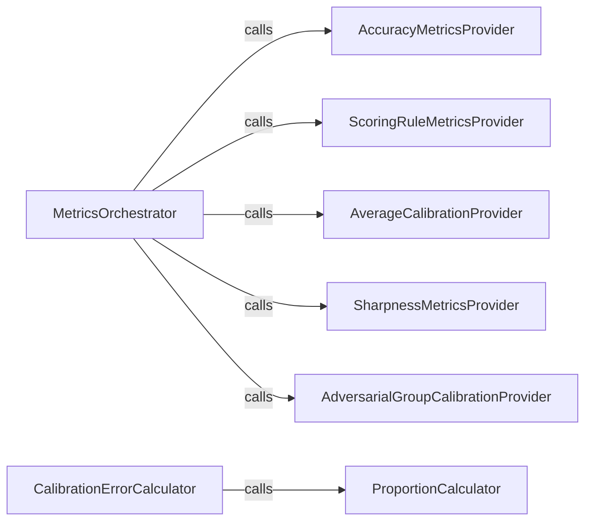

## Details

The metrics subsystem of `uncertainty-toolbox` is designed around a central `MetricsOrchestrator` that acts as a facade, coordinating the computation of various uncertainty quantification metrics. This orchestrator delegates specific metric calculations to a set of specialized "Provider" components: `AccuracyMetricsProvider`, `ScoringRuleMetricsProvider`, `AverageCalibrationProvider`, `SharpnessMetricsProvider`, and `AdversarialGroupCalibrationProvider`. Each provider is responsible for a distinct category of metrics, ensuring modularity and clear separation of concerns. The `CalibrationErrorCalculator` component focuses on quantifying different aspects of model calibration error, relying on the `ProportionCalculator` to compute fundamental proportions necessary for its calculations. This hierarchical structure allows for a comprehensive and organized approach to evaluating uncertainty in predictive models.

### MetricsOrchestrator
Serves as the primary entry point and facade for the entire metrics subsystem. It orchestrates the computation and aggregation of a comprehensive suite of uncertainty quantification metrics by delegating specific metric calculations to specialized provider components.

**Related Classes/Methods**:

- <a href="https://github.com/uncertainty-toolbox/uncertainty-toolbox/blob/main/uncertainty_toolbox/metrics_accuracy.py" target="_blank" rel="noopener noreferrer">`uncertainty_toolbox.metrics_accuracy`</a>
- <a href="https://github.com/uncertainty-toolbox/uncertainty-toolbox/blob/main/uncertainty_toolbox/metrics_scoring_rule.py" target="_blank" rel="noopener noreferrer">`uncertainty_toolbox.metrics_scoring_rule`</a>
- <a href="https://github.com/uncertainty-toolbox/uncertainty-toolbox/blob/main/uncertainty_toolbox/metrics.py#L66-L99" target="_blank" rel="noopener noreferrer">`uncertainty_toolbox.metrics`:66-99</a>
- <a href="https://github.com/uncertainty-toolbox/uncertainty-toolbox/blob/main/uncertainty_toolbox/metrics.py#L168-L187" target="_blank" rel="noopener noreferrer">`uncertainty_toolbox.metrics`:168-187</a>
- <a href="https://github.com/uncertainty-toolbox/uncertainty-toolbox/blob/main/uncertainty_toolbox/metrics.py#L102-L165" target="_blank" rel="noopener noreferrer">`uncertainty_toolbox.metrics`:102-165</a>

### AccuracyMetricsProvider
Encapsulates the logic for calculating various accuracy-related metrics, providing insights into the predictive performance of the model.

**Related Classes/Methods**:

- <a href="https://github.com/uncertainty-toolbox/uncertainty-toolbox/blob/main/uncertainty_toolbox/metrics_accuracy.py" target="_blank" rel="noopener noreferrer">`uncertainty_toolbox.metrics_accuracy`</a>

### ScoringRuleMetricsProvider
Handles the computation of various scoring rules, which are used to evaluate the quality of probabilistic forecasts by assessing both calibration and sharpness.

**Related Classes/Methods**:

- <a href="https://github.com/uncertainty-toolbox/uncertainty-toolbox/blob/main/uncertainty_toolbox/metrics_scoring_rule.py" target="_blank" rel="noopener noreferrer">`uncertainty_toolbox.metrics_scoring_rule`</a>

### AverageCalibrationProvider
Computes average calibration metrics, offering a general assessment of how well the predicted uncertainties align with observed frequencies across the entire dataset.

**Related Classes/Methods**:

- <a href="https://github.com/uncertainty-toolbox/uncertainty-toolbox/blob/main/uncertainty_toolbox/metrics.py#L66-L99" target="_blank" rel="noopener noreferrer">`uncertainty_toolbox.metrics`:66-99</a>

### SharpnessMetricsProvider
Determines the sharpness of the predictive distributions, indicating the concentration or narrowness of the predictions. Sharper predictions with good calibration are generally preferred.

**Related Classes/Methods**:

- <a href="https://github.com/uncertainty-toolbox/uncertainty-toolbox/blob/main/uncertainty_toolbox/metrics.py#L168-L187" target="_blank" rel="noopener noreferrer">`uncertainty_toolbox.metrics`:168-187</a>

### AdversarialGroupCalibrationProvider
Calculates and potentially reports calibration metrics specifically for adversarially chosen groups, addressing fairness and robustness aspects of uncertainty quantification.

**Related Classes/Methods**:

- <a href="https://github.com/uncertainty-toolbox/uncertainty-toolbox/blob/main/uncertainty_toolbox/metrics.py#L102-L165" target="_blank" rel="noopener noreferrer">`uncertainty_toolbox.metrics`:102-165</a>

### CalibrationErrorCalculator
Focuses on quantifying various aspects of model calibration error, such as root mean squared calibration error, mean absolute calibration error, and miscalibration area. It relies on underlying proportion calculations.

**Related Classes/Methods**:

- <a href="https://github.com/uncertainty-toolbox/uncertainty-toolbox/blob/main/uncertainty_toolbox/metrics_calibration.py#L332-L393" target="_blank" rel="noopener noreferrer">`uncertainty_toolbox.metrics_calibration`:332-393</a>
- <a href="https://github.com/uncertainty-toolbox/uncertainty-toolbox/blob/main/uncertainty_toolbox/metrics_calibration.py#L396-L448" target="_blank" rel="noopener noreferrer">`uncertainty_toolbox.metrics_calibration`:396-448</a>
- <a href="https://github.com/uncertainty-toolbox/uncertainty-toolbox/blob/main/uncertainty_toolbox/metrics_calibration.py#L303-L329" target="_blank" rel="noopener noreferrer">`uncertainty_toolbox.metrics_calibration`:303-329</a>

### ProportionCalculator
Computes the fundamental proportions (e.g., proportion in interval, proportion under quantile) that are essential for calculating various calibration errors. This component serves as a utility for calibration-related calculations.

**Related Classes/Methods**:

- <a href="https://github.com/uncertainty-toolbox/uncertainty-toolbox/blob/main/uncertainty_toolbox/metrics_calibration.py#L332-L393" target="_blank" rel="noopener noreferrer">`uncertainty_toolbox.metrics_calibration`:332-393</a>
- <a href="https://github.com/uncertainty-toolbox/uncertainty-toolbox/blob/main/uncertainty_toolbox/metrics_calibration.py#L396-L448" target="_blank" rel="noopener noreferrer">`uncertainty_toolbox.metrics_calibration`:396-448</a>

### [FAQ](https://github.com/CodeBoarding/GeneratedOnBoardings/tree/main?tab=readme-ov-file#faq)