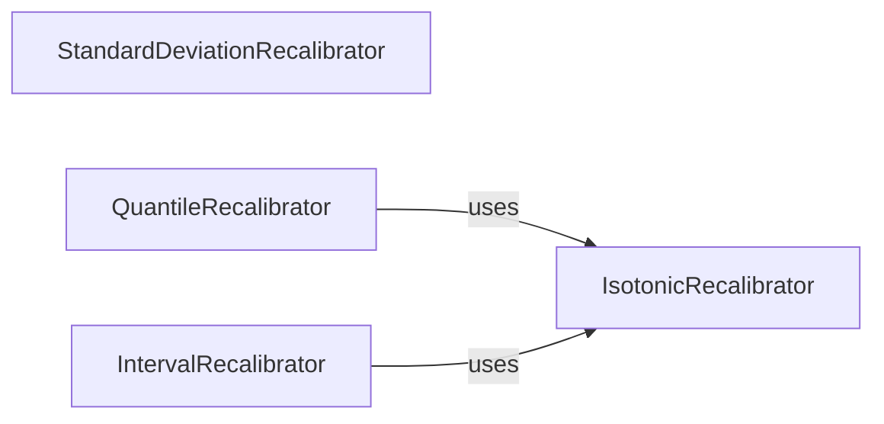

## Details

The `Recalibration Module` is a core subsystem within the `uncertainty-toolbox` project, dedicated to enhancing the reliability of uncertainty predictions. It aligns with the project's "ML Toolkit/Library" type and "Functional Decomposition" architectural bias by providing distinct, specialized recalibration algorithms.

### IsotonicRecalibrator
This component implements the core non-parametric isotonic regression algorithm, which learns a monotonic mapping to adjust predicted uncertainties. It is fundamental as it provides the underlying recalibration logic for other quantile and interval-based methods.

**Related Classes/Methods**:

- <a href="https://github.com/uncertainty-toolbox/uncertainty-toolbox/blob/main/uncertainty_toolbox/recalibration.py#L40-L129" target="_blank" rel="noopener noreferrer">`uncertainty_toolbox.recalibration.iso_recal`:40-129</a>
- <a href="https://github.com/uncertainty-toolbox/uncertainty-toolbox/blob/main/uncertainty_toolbox/recalibration.py#L12-L37" target="_blank" rel="noopener noreferrer">`uncertainty_toolbox.recalibration.get_q_idx`:12-37</a>

### StandardDeviationRecalibrator
Focuses on adjusting the scale of predicted standard deviations to improve their accuracy and alignment with observed outcomes. It provides a specific function for this purpose.

**Related Classes/Methods**:

- <a href="https://github.com/uncertainty-toolbox/uncertainty-toolbox/blob/main/uncertainty_toolbox/recalibration.py#L191-L222" target="_blank" rel="noopener noreferrer">`uncertainty_toolbox.recalibration.get_std_recalibrator`:191-222</a>
- <a href="https://github.com/uncertainty-toolbox/uncertainty-toolbox/blob/main/uncertainty_toolbox/recalibration.py#L132-L188" target="_blank" rel="noopener noreferrer">`uncertainty_toolbox.recalibration.optimize_recalibration_ratio`:132-188</a>

### QuantileRecalibrator
Generates a recalibration function that operates directly on prediction quantiles. Its architectural importance lies in extending the core isotonic regression to a quantile-specific context, making it suitable for various uncertainty metrics.

**Related Classes/Methods**:

- <a href="https://github.com/uncertainty-toolbox/uncertainty-toolbox/blob/main/uncertainty_toolbox/recalibration.py#L225-L255" target="_blank" rel="noopener noreferrer">`uncertainty_toolbox.recalibration.get_quantile_recalibrator`:225-255</a>
- <a href="https://github.com/uncertainty-toolbox/uncertainty-toolbox/blob/main/uncertainty_toolbox/recalibration.py#L40-L129" target="_blank" rel="noopener noreferrer">`uncertainty_toolbox.recalibration.iso_recal`:40-129</a>

### IntervalRecalibrator
Provides a recalibration function specifically designed for prediction intervals. This component is crucial for improving the coverage properties of intervals, leveraging the foundational isotonic regression for its recalibration logic.

**Related Classes/Methods**:

- <a href="https://github.com/uncertainty-toolbox/uncertainty-toolbox/blob/main/uncertainty_toolbox/recalibration.py#L258-L288" target="_blank" rel="noopener noreferrer">`uncertainty_toolbox.recalibration.get_interval_recalibrator`:258-288</a>
- <a href="https://github.com/uncertainty-toolbox/uncertainty-toolbox/blob/main/uncertainty_toolbox/recalibration.py#L40-L129" target="_blank" rel="noopener noreferrer">`uncertainty_toolbox.recalibration.iso_recal`:40-129</a>

### [FAQ](https://github.com/CodeBoarding/GeneratedOnBoardings/tree/main?tab=readme-ov-file#faq)