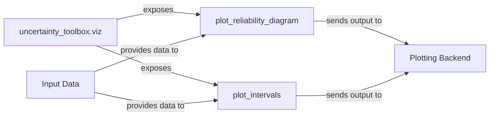

## Details

The `uncertainty_toolbox.viz` subsystem is central to visualizing model uncertainty and calibration. It acts as a high-level interface, exposing specialized plotting functions such as `plot_reliability_diagram` and `plot_intervals`. These functions are designed to consume `Input Data`, which includes model predictions, true values, and uncertainty estimates. After processing this data, the plotting functions generate visual representations by sending their output to a `Plotting Backend`, typically a graphics library like Matplotlib, which then renders the final diagrams and plots. This architecture ensures a clear separation between data input, visualization logic, and rendering, facilitating effective analysis and communication of model uncertainty.

### uncertainty_toolbox.viz
The primary module serving as an interface for all visualization functionalities within the `uncertainty-toolbox`. It aggregates and exposes various plotting functions to users.

**Related Classes/Methods**:

- <a href="https://github.com/uncertainty-toolbox/uncertainty-toolbox/blob/main/uncertainty_toolbox/viz.py#L1-L9999" target="_blank" rel="noopener noreferrer">`uncertainty_toolbox.viz`:1-9999</a>

### plot_reliability_diagram
A core plotting function responsible for generating reliability diagrams. These diagrams visually assess the calibration of predictive models by comparing predicted uncertainties with observed outcomes.

**Related Classes/Methods**:

- <a href="https://github.com/uncertainty-toolbox/uncertainty-toolbox/blob/main/uncertainty_toolbox/viz.py#L1-L9999" target="_blank" rel="noopener noreferrer">`uncertainty_toolbox.viz.plot_reliability_diagram`:1-9999</a>

### plot_intervals
A key plotting function that creates visual representations of prediction intervals. These plots illustrate the range within which future observations are expected to fall, providing insight into the spread of predictive uncertainty.

**Related Classes/Methods**:

- <a href="https://github.com/uncertainty-toolbox/uncertainty-toolbox/blob/main/uncertainty_toolbox/viz.py#L101-L173" target="_blank" rel="noopener noreferrer">`uncertainty_toolbox.viz.plot_intervals`:101-173</a>

### Input Data
Represents the essential numerical arrays (e.g., true values, predictions, uncertainties) that serve as input for the visualization functions. This data originates from model predictions, ground truth, or uncertainty quantification processes.

**Related Classes/Methods**: _None_

### Plotting Backend
Refers to the underlying graphics library (e.g., Matplotlib) utilized by the visualization functions to render and display the generated plots.

**Related Classes/Methods**: _None_

### [FAQ](https://github.com/CodeBoarding/GeneratedOnBoardings/tree/main?tab=readme-ov-file#faq)