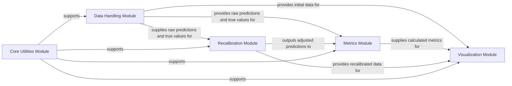

## Details

The `uncertainty-toolbox` is architected as a streamlined ML toolkit, primarily focused on the lifecycle of uncertainty quantification: data input, metric calculation, recalibration, and visualization. The **Data Handling Module** serves as the entry point for all data, feeding raw predictions and true values to the **Metrics Module** for evaluation and the **Recalibration Module** for adjustment. The **Recalibration Module** can then refine these predictions, which can be re-evaluated by the **Metrics Module**. Finally, both the original/recalibrated data and the computed metrics converge at the **Visualization Module** to generate comprehensive plots. This flow is consistently supported by the **Core Utilities Module**, which provides foundational helper functions, ensuring a clear, modular, and extensible design optimized for analyzing and improving uncertainty predictions.

### Data Handling Module
Manages the input and output of data, including loading, generating, and basic preprocessing of uncertainty-related datasets.

**Related Classes/Methods**:

- <a href="https://github.com/uncertainty-toolbox/uncertainty-toolbox/blob/main/uncertainty_toolbox/data.py" target="_blank" rel="noopener noreferrer">`uncertainty_toolbox.data`</a>

### Metrics Module [[Expand]](./Metrics_Module.md)
The central component for calculating a comprehensive suite of uncertainty quantification metrics, encompassing accuracy, calibration, and scoring rules.

**Related Classes/Methods**:

- <a href="https://github.com/uncertainty-toolbox/uncertainty-toolbox/blob/main/uncertainty_toolbox/metrics.py" target="_blank" rel="noopener noreferrer">`uncertainty_toolbox.metrics`</a>
- <a href="https://github.com/uncertainty-toolbox/uncertainty-toolbox/blob/main/uncertainty_toolbox/metrics_calibration.py" target="_blank" rel="noopener noreferrer">`uncertainty_toolbox.metrics_calibration`</a>
- <a href="https://github.com/uncertainty-toolbox/uncertainty-toolbox/blob/main/uncertainty_toolbox/metrics_accuracy.py" target="_blank" rel="noopener noreferrer">`uncertainty_toolbox.metrics_accuracy`</a>
- <a href="https://github.com/uncertainty-toolbox/uncertainty-toolbox/blob/main/uncertainty_toolbox/metrics_scoring_rule.py" target="_blank" rel="noopener noreferrer">`uncertainty_toolbox.metrics_scoring_rule`</a>

### Recalibration Module [[Expand]](./Recalibration_Module.md)
Provides various algorithms and methods to adjust or "recalibrate" uncertainty predictions, aiming to improve their reliability and alignment with observed outcomes.

**Related Classes/Methods**:

- <a href="https://github.com/uncertainty-toolbox/uncertainty-toolbox/blob/main/uncertainty_toolbox/recalibration.py" target="_blank" rel="noopener noreferrer">`uncertainty_toolbox.recalibration`</a>

### Visualization Module [[Expand]](./Visualization_Module.md)
Dedicated to generating insightful plots and visual representations of uncertainty data, calculated metrics, and the effects of recalibration.

**Related Classes/Methods**:

- <a href="https://github.com/uncertainty-toolbox/uncertainty-toolbox/blob/main/uncertainty_toolbox/viz.py" target="_blank" rel="noopener noreferrer">`uncertainty_toolbox.viz`</a>

### Core Utilities Module
Contains fundamental helper functions, mathematical operations, and general utilities leveraged across different modules of the library.

**Related Classes/Methods**:

- <a href="https://github.com/uncertainty-toolbox/uncertainty-toolbox/blob/main/uncertainty_toolbox/utils.py" target="_blank" rel="noopener noreferrer">`uncertainty_toolbox.utils`</a>

### [FAQ](https://github.com/CodeBoarding/GeneratedOnBoardings/tree/main?tab=readme-ov-file#faq)