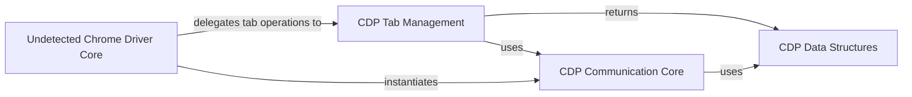

## Component Details

This subsystem facilitates robust communication with the Chrome DevTools Protocol (CDP) within the undetected_chromedriver project. It encompasses components for structuring CDP-related data, managing the core HTTP and WebSocket communication with the browser's debugging interface, and providing high-level functionalities for tab management. The overall purpose is to enable advanced control over browser operations, such as tab manipulation and direct command execution, which is crucial for the undetected browsing capabilities of the main Chrome driver.

### CDP Data Structures
This component defines the base structure for Chrome DevTools Protocol (CDP) objects and specific page elements, allowing dictionary-like data to be accessed as attributes. It facilitates easy manipulation and representation of data received from the CDP.

**Related Classes/Methods**:

- <a href="https://github.com/ultrafunkamsterdam/undetected-chromedriver/blob/master/undetected_chromedriver/cdp.py#L14-L28" target="_blank" rel="noopener noreferrer">`undetected_chromedriver.cdp.CDPObject` (14:28)</a>
- <a href="https://github.com/ultrafunkamsterdam/undetected-chromedriver/blob/master/undetected_chromedriver/cdp.py#L31-L32" target="_blank" rel="noopener noreferrer">`undetected_chromedriver.cdp.PageElement` (31:32)</a>

### CDP Communication Core
This component is responsible for establishing and managing the communication channels with the Chrome DevTools Protocol. It handles both HTTP GET/POST requests to the CDP server and WebSocket communication for sending and receiving CDP commands and events, encapsulating the core CDP client logic.

**Related Classes/Methods**:

- <a href="https://github.com/ultrafunkamsterdam/undetected-chromedriver/blob/master/undetected_chromedriver/cdp.py#L35-L112" target="_blank" rel="noopener noreferrer">`undetected_chromedriver.cdp.CDP` (35:112)</a>
- <a href="https://github.com/ultrafunkamsterdam/undetected-chromedriver/blob/master/undetected_chromedriver/cdp.py#L49-L59" target="_blank" rel="noopener noreferrer">`undetected_chromedriver.cdp.CDP:__init__` (49:59)</a>
- <a href="https://github.com/ultrafunkamsterdam/undetected-chromedriver/blob/master/undetected_chromedriver/cdp.py#L90-L98" target="_blank" rel="noopener noreferrer">`undetected_chromedriver.cdp.CDP.get` (90:98)</a>
- <a href="https://github.com/ultrafunkamsterdam/undetected-chromedriver/blob/master/undetected_chromedriver/cdp.py#L100-L108" target="_blank" rel="noopener noreferrer">`undetected_chromedriver.cdp.CDP.post` (100:108)</a>
- <a href="https://github.com/ultrafunkamsterdam/undetected-chromedriver/blob/master/undetected_chromedriver/cdp.py#L80-L88" target="_blank" rel="noopener noreferrer">`undetected_chromedriver.cdp.CDP.send` (80:88)</a>

### CDP Tab Management
This component provides functionalities to interact with and manage browser tabs through the Chrome DevTools Protocol. It includes operations such as listing existing tabs, activating a specific tab, opening new tabs, and closing the last opened tab.

**Related Classes/Methods**:

- <a href="https://github.com/ultrafunkamsterdam/undetected-chromedriver/blob/master/undetected_chromedriver/cdp.py#L61-L66" target="_blank" rel="noopener noreferrer">`undetected_chromedriver.cdp.CDP:tab_activate` (61:66)</a>
- <a href="https://github.com/ultrafunkamsterdam/undetected-chromedriver/blob/master/undetected_chromedriver/cdp.py#L68-L70" target="_blank" rel="noopener noreferrer">`undetected_chromedriver.cdp.CDP:tab_list` (68:70)</a>
- <a href="https://github.com/ultrafunkamsterdam/undetected-chromedriver/blob/master/undetected_chromedriver/cdp.py#L72-L73" target="_blank" rel="noopener noreferrer">`undetected_chromedriver.cdp.CDP:tab_new` (72:73)</a>
- <a href="https://github.com/ultrafunkamsterdam/undetected-chromedriver/blob/master/undetected_chromedriver/cdp.py#L75-L78" target="_blank" rel="noopener noreferrer">`undetected_chromedriver.cdp.CDP:tab_close_last_opened` (75:78)</a>

### Undetected Chrome Driver Core
This is the central component that extends the standard Selenium WebDriver to provide undetected browsing capabilities. It manages the ChromeDriver executable, applies necessary patches, handles browser options, and integrates with the CDP functionalities for advanced control and evasion techniques.

**Related Classes/Methods**:

- `undetected_chromedriver.undetected_chromedriver.Chrome` (full file reference)

### [FAQ](https://github.com/CodeBoarding/GeneratedOnBoardings/tree/main?tab=readme-ov-file#faq)