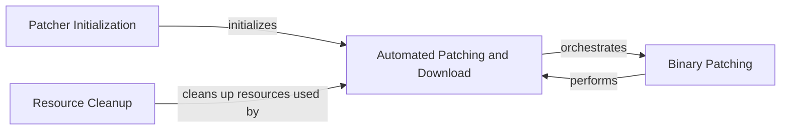

## Component Details

The ChromeDriver Patcher subsystem is responsible for managing the ChromeDriver executable, ensuring it is patched to bypass detection mechanisms. It handles the entire lifecycle from initialization, automated downloading and patching, to cleanup of resources. The core functionality revolves around modifying the ChromeDriver binary to prevent its detection, making it crucial for automated browser interactions that require stealth.

### Patcher Initialization
This component handles the initial setup of the Patcher object, including setting the platform-specific executable name and determining the data path for storing chromedriver binaries. It also initializes flags for custom executable paths and multi-process usage.

**Related Classes/Methods**:

- <a href="https://github.com/ultrafunkamsterdam/undetected-chromedriver/blob/master/undetected_chromedriver/patcher.py#L44-L101" target="_blank" rel="noopener noreferrer">`undetected_chromedriver.patcher.Patcher:__init__` (44:101)</a>
- <a href="https://github.com/ultrafunkamsterdam/undetected-chromedriver/blob/master/undetected_chromedriver/patcher.py#L103-L119" target="_blank" rel="noopener noreferrer">`undetected_chromedriver.patcher.Patcher._set_platform_name` (103:119)</a>

### Automated Patching and Download
This component orchestrates the automated patching and downloading of the chromedriver. It checks if the binary is already patched, handles force-killing of instances, fetches the correct release number, downloads the package, unzips it, and then applies the patch.

**Related Classes/Methods**:

- <a href="https://github.com/ultrafunkamsterdam/undetected-chromedriver/blob/master/undetected_chromedriver/patcher.py#L121-L179" target="_blank" rel="noopener noreferrer">`undetected_chromedriver.patcher.Patcher:auto` (121:179)</a>
- <a href="https://github.com/ultrafunkamsterdam/undetected-chromedriver/blob/master/undetected_chromedriver/patcher.py#L336-L342" target="_blank" rel="noopener noreferrer">`undetected_chromedriver.patcher.Patcher.is_binary_patched` (336:342)</a>
- <a href="https://github.com/ultrafunkamsterdam/undetected-chromedriver/blob/master/undetected_chromedriver/patcher.py#L344-L372" target="_blank" rel="noopener noreferrer">`undetected_chromedriver.patcher.Patcher.patch_exe` (344:372)</a>
- <a href="https://github.com/ultrafunkamsterdam/undetected-chromedriver/blob/master/undetected_chromedriver/patcher.py#L317-L329" target="_blank" rel="noopener noreferrer">`undetected_chromedriver.patcher.Patcher.force_kill_instances` (317:329)</a>
- <a href="https://github.com/ultrafunkamsterdam/undetected-chromedriver/blob/master/undetected_chromedriver/patcher.py#L232-L263" target="_blank" rel="noopener noreferrer">`undetected_chromedriver.patcher.Patcher.fetch_release_number` (232:263)</a>
- <a href="https://github.com/ultrafunkamsterdam/undetected-chromedriver/blob/master/undetected_chromedriver/patcher.py#L289-L314" target="_blank" rel="noopener noreferrer">`undetected_chromedriver.patcher.Patcher.unzip_package` (289:314)</a>
- <a href="https://github.com/ultrafunkamsterdam/undetected-chromedriver/blob/master/undetected_chromedriver/patcher.py#L272-L287" target="_blank" rel="noopener noreferrer">`undetected_chromedriver.patcher.Patcher.fetch_package` (272:287)</a>
- <a href="https://github.com/ultrafunkamsterdam/undetected-chromedriver/blob/master/undetected_chromedriver/patcher.py#L228-L230" target="_blank" rel="noopener noreferrer">`undetected_chromedriver.patcher.Patcher.patch` (228:230)</a>

### Binary Patching
This component is responsible for the core functionality of patching the chromedriver executable. It reads the binary content, searches for a specific code block, replaces it with a new one, and writes the modified content back to the file.

**Related Classes/Methods**:

- <a href="https://github.com/ultrafunkamsterdam/undetected-chromedriver/blob/master/undetected_chromedriver/patcher.py#L228-L230" target="_blank" rel="noopener noreferrer">`undetected_chromedriver.patcher.Patcher.patch` (228:230)</a>
- <a href="https://github.com/ultrafunkamsterdam/undetected-chromedriver/blob/master/undetected_chromedriver/patcher.py#L344-L372" target="_blank" rel="noopener noreferrer">`undetected_chromedriver.patcher.Patcher.patch_exe` (344:372)</a>
- <a href="https://github.com/ultrafunkamsterdam/undetected-chromedriver/blob/master/undetected_chromedriver/patcher.py#L336-L342" target="_blank" rel="noopener noreferrer">`undetected_chromedriver.patcher.Patcher.is_binary_patched` (336:342)</a>

### Resource Cleanup
This component handles the cleanup of resources, specifically attempting to unlink the chromedriver executable when the Patcher object is destroyed. It includes logic to handle potential permission errors and multi-process scenarios.

**Related Classes/Methods**:

- <a href="https://github.com/ultrafunkamsterdam/undetected-chromedriver/blob/master/undetected_chromedriver/patcher.py#L380-L401" target="_blank" rel="noopener noreferrer">`undetected_chromedriver.patcher.Patcher:__del__` (380:401)</a>

### [FAQ](https://github.com/CodeBoarding/GeneratedOnBoardings/tree/main?tab=readme-ov-file#faq)