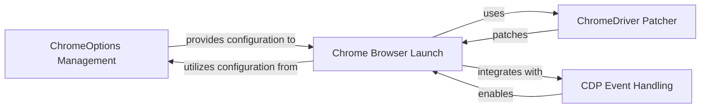

## Component Details

This system focuses on launching and managing a Chrome browser instance with specific configurations to avoid detection. The main flow involves the 'ChromeOptions Management' component preparing the desired browser settings, which are then consumed by the 'Chrome Browser Launch' component to initiate the browser. The 'ChromeDriver Patcher' ensures the ChromeDriver executable is modified for undetectability, and the 'CDP Event Handling' component allows for advanced interaction and monitoring of the browser's behavior.

### ChromeOptions Management
This component is responsible for managing and manipulating Chrome browser options, including user preferences and experimental options. It handles the conversion of dotted keys in preferences to nested dictionaries and merges preference dictionaries. It also provides a way to create a new ChromeOptions instance from an existing one.

**Related Classes/Methods**:

- <a href="https://github.com/ultrafunkamsterdam/undetected-chromedriver/blob/master/undetected_chromedriver/options.py#L11-L85" target="_blank" rel="noopener noreferrer">`undetected_chromedriver.options.ChromeOptions` (11:85)</a>
- <a href="https://github.com/ultrafunkamsterdam/undetected-chromedriver/blob/master/undetected_chromedriver/options.py#L35-L40" target="_blank" rel="noopener noreferrer">`undetected_chromedriver.options.ChromeOptions:_undot_key` (35:40)</a>
- <a href="https://github.com/ultrafunkamsterdam/undetected-chromedriver/blob/master/undetected_chromedriver/options.py#L43-L54" target="_blank" rel="noopener noreferrer">`undetected_chromedriver.options.ChromeOptions:_merge_nested` (43:54)</a>
- <a href="https://github.com/ultrafunkamsterdam/undetected-chromedriver/blob/master/undetected_chromedriver/options.py#L56-L79" target="_blank" rel="noopener noreferrer">`undetected_chromedriver.options.ChromeOptions:handle_prefs` (56:79)</a>
- <a href="https://github.com/ultrafunkamsterdam/undetected-chromedriver/blob/master/undetected_chromedriver/options.py#L82-L85" target="_blank" rel="noopener noreferrer">`undetected_chromedriver.options.ChromeOptions:from_options` (82:85)</a>

### Chrome Browser Launch
This component is responsible for initiating and managing the Chrome browser process, utilizing the provided configuration options from the ChromeOptions Management component. It handles the patching of the ChromeDriver executable, setting up the user data directory, configuring browser arguments, and managing the browser's lifecycle.

**Related Classes/Methods**:

- `undetected_chromedriver.Chrome` (49:440)
- `undetected_chromedriver.Chrome.__init__` (100:379)
- `undetected_chromedriver.Chrome.quit` (400:430)
- `undetected_chromedriver.find_chrome_executable` (443:479)

### ChromeDriver Patcher
This component is responsible for patching the ChromeDriver executable to avoid detection. It handles the download and modification of the ChromeDriver binary.

**Related Classes/Methods**:

- <a href="https://github.com/ultrafunkamsterdam/undetected-chromedriver/blob/master/undetected_chromedriver/patcher.py#L27-L401" target="_blank" rel="noopener noreferrer">`undetected_chromedriver.Patcher` (27:401)</a>

### CDP Event Handling
This component manages the handling of Chrome DevTools Protocol (CDP) events, allowing for subscription to and processing of browser-level events.

**Related Classes/Methods**:

- <a href="https://github.com/ultrafunkamsterdam/undetected-chromedriver/blob/master/undetected_chromedriver/cdp.py#L35-L112" target="_blank" rel="noopener noreferrer">`undetected_chromedriver.cdp.CDP` (35:112)</a>
- <a href="https://github.com/ultrafunkamsterdam/undetected-chromedriver/blob/master/undetected_chromedriver/reactor.py#L13-L99" target="_blank" rel="noopener noreferrer">`undetected_chromedriver.reactor.Reactor` (13:99)</a>
- `undetected_chromedriver.Chrome.add_cdp_listener` (381:387)
- `undetected_chromedriver.Chrome.clear_cdp_listeners` (389:391)

### [FAQ](https://github.com/CodeBoarding/GeneratedOnBoardings/tree/main?tab=readme-ov-file#faq)