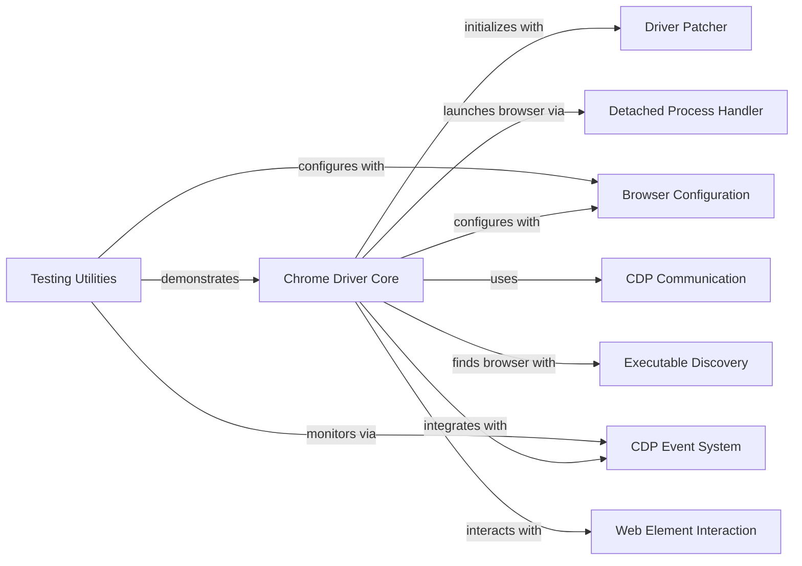

## Component Details

The Core Browser Automation subsystem is the primary interface for controlling the Chrome browser. It handles initialization, session management, and core interactions, orchestrating other internal modules for seamless automation. It integrates components for driver patching, browser configuration, detached process handling, CDP communication, and web element interaction to provide an undetected browsing experience.

### Chrome Driver Core
The main class that orchestrates the browser automation. It extends Selenium's WebDriver and integrates various functionalities to provide an undetected browsing experience, managing the browser's lifecycle and user interactions.

**Related Classes/Methods**:

- <a href="https://github.com/ultrafunkamsterdam/undetected-chromedriver/blob/master/undetected_chromedriver/__init__.py#L64-L854" target="_blank" rel="noopener noreferrer">`undetected_chromedriver.__init__.Chrome` (64:854)</a>
- <a href="https://github.com/ultrafunkamsterdam/undetected-chromedriver/blob/master/undetected_chromedriver/__init__.py#L105-L489" target="_blank" rel="noopener noreferrer">`undetected_chromedriver.__init__.Chrome.__init__` (105:489)</a>
- <a href="https://github.com/ultrafunkamsterdam/undetected-chromedriver/blob/master/undetected_chromedriver/__init__.py#L491-L631" target="_blank" rel="noopener noreferrer">`undetected_chromedriver.__init__.Chrome._configure_headless` (491:631)</a>
- <a href="https://github.com/ultrafunkamsterdam/undetected-chromedriver/blob/master/undetected_chromedriver/__init__.py#L667-L675" target="_blank" rel="noopener noreferrer">`undetected_chromedriver.__init__.Chrome.add_cdp_listener` (667:675)</a>
- <a href="https://github.com/ultrafunkamsterdam/undetected-chromedriver/blob/master/undetected_chromedriver/__init__.py#L686-L703" target="_blank" rel="noopener noreferrer">`undetected_chromedriver.__init__.Chrome.tab_new` (686:703)</a>
- <a href="https://github.com/ultrafunkamsterdam/undetected-chromedriver/blob/master/undetected_chromedriver/__init__.py#L705-L719" target="_blank" rel="noopener noreferrer">`undetected_chromedriver.__init__.Chrome.reconnect` (705:719)</a>
- <a href="https://github.com/ultrafunkamsterdam/undetected-chromedriver/blob/master/undetected_chromedriver/__init__.py#L729-L762" target="_blank" rel="noopener noreferrer">`undetected_chromedriver.__init__.Chrome.find_elements_recursive` (729:762)</a>
- <a href="https://github.com/ultrafunkamsterdam/undetected-chromedriver/blob/master/undetected_chromedriver/__init__.py#L764-L802" target="_blank" rel="noopener noreferrer">`undetected_chromedriver.__init__.Chrome.quit` (764:802)</a>
- <a href="https://github.com/ultrafunkamsterdam/undetected-chromedriver/blob/master/undetected_chromedriver/__init__.py#L721-L726" target="_blank" rel="noopener noreferrer">`undetected_chromedriver.__init__.Chrome.start_session` (721:726)</a>

### Driver Patcher
This component is responsible for downloading, managing, and patching the ChromeDriver executable. Its primary purpose is to modify the driver to bypass common detection mechanisms, ensuring the 'undetected' aspect of the library.

**Related Classes/Methods**:

- <a href="https://github.com/ultrafunkamsterdam/undetected-chromedriver/blob/master/undetected_chromedriver/patcher.py#L27-L401" target="_blank" rel="noopener noreferrer">`undetected_chromedriver.patcher.Patcher` (27:401)</a>
- <a href="https://github.com/ultrafunkamsterdam/undetected-chromedriver/blob/master/undetected_chromedriver/patcher.py#L121-L179" target="_blank" rel="noopener noreferrer">`undetected_chromedriver.patcher.Patcher.auto` (121:179)</a>

### Browser Configuration
This component extends Selenium's ChromiumOptions to provide specific configurations for the Chrome browser. It handles settings related to user profiles, headless mode, and other startup arguments, which are crucial for customizing the browser's behavior.

**Related Classes/Methods**:

- <a href="https://github.com/ultrafunkamsterdam/undetected-chromedriver/blob/master/undetected_chromedriver/options.py#L11-L85" target="_blank" rel="noopener noreferrer">`undetected_chromedriver.options.ChromeOptions` (11:85)</a>

### Detached Process Handler
This module provides functionality to launch the Chrome browser process in a detached manner. This ensures that the browser runs independently of the Python script, allowing for better process management and graceful shutdowns.

**Related Classes/Methods**:

- <a href="https://github.com/ultrafunkamsterdam/undetected-chromedriver/blob/master/undetected_chromedriver/dprocess.py#L18-L43" target="_blank" rel="noopener noreferrer">`undetected_chromedriver.dprocess.start_detached` (18:43)</a>

### CDP Event System
This component is an asynchronous system that listens for and dispatches events from the Chrome DevTools Protocol (CDP). It runs in a separate thread, collecting performance logs and notifying registered handlers of incoming CDP messages.

**Related Classes/Methods**:

- <a href="https://github.com/ultrafunkamsterdam/undetected-chromedriver/blob/master/undetected_chromedriver/reactor.py#L13-L99" target="_blank" rel="noopener noreferrer">`undetected_chromedriver.reactor.Reactor` (13:99)</a>
- <a href="https://github.com/ultrafunkamsterdam/undetected-chromedriver/blob/master/undetected_chromedriver/reactor.py#L25-L41" target="_blank" rel="noopener noreferrer">`undetected_chromedriver.reactor.Reactor.add_event_handler` (25:41)</a>

### CDP Communication
This class provides a high-level interface for direct interaction with the Chrome DevTools Protocol. It manages connections to the browser's debugging endpoint and allows sending specific CDP commands for advanced browser control, such as opening new tabs.

**Related Classes/Methods**:

- <a href="https://github.com/ultrafunkamsterdam/undetected-chromedriver/blob/master/undetected_chromedriver/cdp.py#L35-L112" target="_blank" rel="noopener noreferrer">`undetected_chromedriver.cdp.CDP` (35:112)</a>
- <a href="https://github.com/ultrafunkamsterdam/undetected-chromedriver/blob/master/undetected_chromedriver/cdp.py#L72-L73" target="_blank" rel="noopener noreferrer">`undetected_chromedriver.cdp.CDP.tab_new` (72:73)</a>

### Executable Discovery
This utility function is responsible for automatically locating the installed Chrome browser executable across different operating systems. It helps the main Chrome Driver Core component find the necessary browser binary if a path is not explicitly provided.

**Related Classes/Methods**:

- <a href="https://github.com/ultrafunkamsterdam/undetected-chromedriver/blob/master/undetected_chromedriver/__init__.py#L857-L899" target="_blank" rel="noopener noreferrer">`undetected_chromedriver.__init__.find_chrome_executable` (857:899)</a>

### Web Element Interaction
Handles interactions with web elements, extending Selenium's WebElement to provide additional functionalities specific to undetected-chromedriver.

**Related Classes/Methods**:

- <a href="https://github.com/ultrafunkamsterdam/undetected-chromedriver/blob/master/undetected_chromedriver/webelement.py#L27-L64" target="_blank" rel="noopener noreferrer">`undetected_chromedriver.webelement.UCWebElement` (27:64)</a>
- <a href="https://github.com/ultrafunkamsterdam/undetected-chromedriver/blob/master/undetected_chromedriver/webelement.py#L7-L24" target="_blank" rel="noopener noreferrer">`undetected_chromedriver.webelement.WebElement` (7:24)</a>

### Testing Utilities
This module contains various functions and classes primarily used for internal testing and demonstration of the undetected-chromedriver library's features. It includes tools for logging, event collection, and wrapping function calls for debugging purposes.

**Related Classes/Methods**:

- <a href="https://github.com/ultrafunkamsterdam/undetected-chromedriver/blob/master/undetected_chromedriver/devtool.py#L103-L190" target="_blank" rel="noopener noreferrer">`undetected_chromedriver.devtool.test` (103:190)</a>
- `undetected_chromedriver.devtool.test.collector.threaded._ensure_service_started` (full file reference)
- `undetected_chromedriver.devtool.test.collector.threaded.get_log_lines` (full file reference)
- `undetected_chromedriver.devtool.test.collector.threaded.looper` (full file reference)
- <a href="https://github.com/ultrafunkamsterdam/undetected-chromedriver/blob/master/undetected_chromedriver/devtool.py#L159-L170" target="_blank" rel="noopener noreferrer">`undetected_chromedriver.devtool.test.func_called` (159:170)</a>
- <a href="https://github.com/ultrafunkamsterdam/undetected-chromedriver/blob/master/undetected_chromedriver/devtool.py#L110-L153" target="_blank" rel="noopener noreferrer">`undetected_chromedriver.devtool.test.collector` (110:153)</a>

### [FAQ](https://github.com/CodeBoarding/GeneratedOnBoardings/tree/main?tab=readme-ov-file#faq)