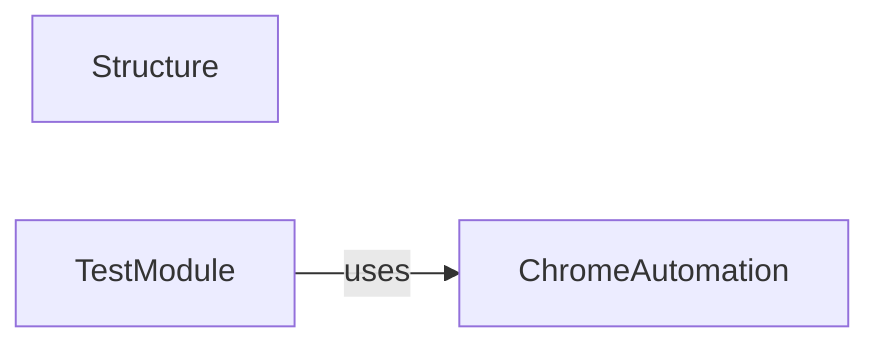

## Component Details

This graph illustrates the structure and interactions within the `DevTool & Testing Utilities` subsystem of `undetected_chromedriver`. It primarily focuses on the `Structure` class, which provides a flexible dictionary-like data structure, and the `TestModule` component, which contains a comprehensive test function demonstrating the use of `undetected_chromedriver` for automated browser testing, including logging and event collection. The `TestModule` interacts with the `ChromeAutomation` component to control the Chrome browser.

### Structure
The `Structure` component provides a dictionary-like object structure, allowing for nested dictionary and list initialization. It overrides `__init__`, `__getattr__`, `__getitem__`, `__setattr__`, `__setitem__`, `update`, `__eq__`, `__hash__`, `__init_subclass__`, and `_normalize_strings` to manage its internal state and provide a consistent interface for accessing and modifying data.

**Related Classes/Methods**:

- <a href="https://github.com/ultrafunkamsterdam/undetected-chromedriver/blob/master/undetected_chromedriver/devtool.py#L16-L75" target="_blank" rel="noopener noreferrer">`undetected_chromedriver.devtool.Structure` (16:75)</a>
- <a href="https://github.com/ultrafunkamsterdam/undetected-chromedriver/blob/master/undetected_chromedriver/devtool.py#L26-L45" target="_blank" rel="noopener noreferrer">`undetected_chromedriver.devtool.Structure:__init__` (26:45)</a>
- <a href="https://github.com/ultrafunkamsterdam/undetected-chromedriver/blob/master/undetected_chromedriver/devtool.py#L53-L54" target="_blank" rel="noopener noreferrer">`undetected_chromedriver.devtool.Structure:__setattr__` (53:54)</a>
- <a href="https://github.com/ultrafunkamsterdam/undetected-chromedriver/blob/master/undetected_chromedriver/devtool.py#L56-L57" target="_blank" rel="noopener noreferrer">`undetected_chromedriver.devtool.Structure:__setitem__` (56:57)</a>

### TestModule
The `TestModule` component contains a comprehensive test function (`test`) that demonstrates the usage of `undetected_chromedriver` with logging and event collection. It initializes a Chrome driver, configures logging preferences, and sets up a collector thread to gather browser, network, and performance logs. It also includes a `func_called` wrapper to log function calls and their results, and an `on_event` asynchronous function to process collected logs.

**Related Classes/Methods**:

- <a href="https://github.com/ultrafunkamsterdam/undetected-chromedriver/blob/master/undetected_chromedriver/devtool.py#L103-L190" target="_blank" rel="noopener noreferrer">`undetected_chromedriver.devtool.test` (103:190)</a>
- <a href="https://github.com/ultrafunkamsterdam/undetected-chromedriver/blob/master/undetected_chromedriver/devtool.py#L110-L153" target="_blank" rel="noopener noreferrer">`undetected_chromedriver.devtool.test.collector` (110:153)</a>
- `undetected_chromedriver.devtool.test.collector.threaded` (117:156)
- `undetected_chromedriver.devtool.test.collector.threaded._ensure_service_started` (120:126)
- `undetected_chromedriver.devtool.test.collector.threaded.get_log_lines` (128:130)
- `undetected_chromedriver.devtool.test.collector.threaded.looper` (132:147)
- <a href="https://github.com/ultrafunkamsterdam/undetected-chromedriver/blob/master/undetected_chromedriver/devtool.py#L159-L170" target="_blank" rel="noopener noreferrer">`undetected_chromedriver.devtool.test.func_called` (159:170)</a>
- <a href="https://github.com/ultrafunkamsterdam/undetected-chromedriver/blob/master/undetected_chromedriver/devtool.py#L155-L157" target="_blank" rel="noopener noreferrer">`undetected_chromedriver.devtool.test.on_event` (155:157)</a>

### ChromeAutomation
The `ChromeAutomation` component encapsulates the core functionality of `undetected_chromedriver`, including the `Chrome` driver and `ChromeOptions`. It is responsible for launching and managing the Chrome browser, configuring its options, and providing methods for interacting with web pages, such as `get` and `quit`. This component is primarily used by the `TestModule` to perform automated browser actions.

**Related Classes/Methods**:

- `undetected_chromedriver.Chrome` (full file reference)
- <a href="https://github.com/ultrafunkamsterdam/undetected-chromedriver/blob/master/undetected_chromedriver/options.py#L11-L85" target="_blank" rel="noopener noreferrer">`undetected_chromedriver.options.ChromeOptions` (11:85)</a>
- `undetected_chromedriver.Chrome.get` (full file reference)
- `undetected_chromedriver.Chrome.quit` (full file reference)

### [FAQ](https://github.com/CodeBoarding/GeneratedOnBoardings/tree/main?tab=readme-ov-file#faq)