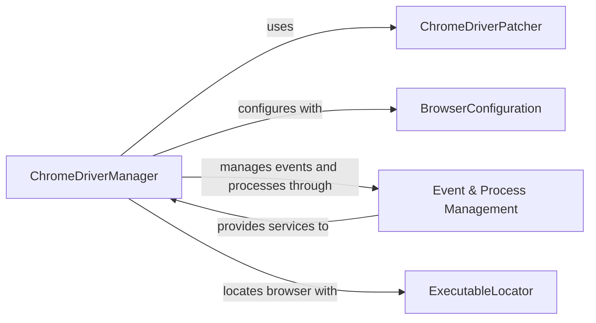

## Component Details

This architecture outlines the core components of the `undetected_chromedriver` library, focusing on how it manages the Chrome browser and ChromeDriver for undetectable automation. The `ChromeDriverManager` acts as the central orchestrator, leveraging `ChromeDriverPatcher` for driver preparation, `BrowserConfiguration` for browser settings, `Event & Process Management` for handling asynchronous events and launching detached browser processes, and `ExecutableLocator` for finding the Chrome executable.

### ChromeDriverManager
Manages the lifecycle of the Chrome browser and its associated ChromeDriver. It orchestrates the patching, configuration, and interaction with the browser instance, providing an undetectable browsing experience.

**Related Classes/Methods**:

- <a href="https://github.com/ultrafunkamsterdam/undetected-chromedriver/blob/master/undetected_chromedriver/__init__.py#L64-L854" target="_blank" rel="noopener noreferrer">`undetected_chromedriver.__init__.Chrome` (64:854)</a>
- <a href="https://github.com/ultrafunkamsterdam/undetected-chromedriver/blob/master/undetected_chromedriver/__init__.py#L105-L489" target="_blank" rel="noopener noreferrer">`undetected_chromedriver.__init__.Chrome.__init__` (105:489)</a>
- <a href="https://github.com/ultrafunkamsterdam/undetected-chromedriver/blob/master/undetected_chromedriver/__init__.py#L667-L675" target="_blank" rel="noopener noreferrer">`undetected_chromedriver.__init__.Chrome.add_cdp_listener` (667:675)</a>
- <a href="https://github.com/ultrafunkamsterdam/undetected-chromedriver/blob/master/undetected_chromedriver/__init__.py#L491-L631" target="_blank" rel="noopener noreferrer">`undetected_chromedriver.__init__.Chrome._configure_headless` (491:631)</a>
- <a href="https://github.com/ultrafunkamsterdam/undetected-chromedriver/blob/master/undetected_chromedriver/__init__.py#L662-L665" target="_blank" rel="noopener noreferrer">`undetected_chromedriver.__init__.Chrome.get` (662:665)</a>
- <a href="https://github.com/ultrafunkamsterdam/undetected-chromedriver/blob/master/undetected_chromedriver/__init__.py#L705-L719" target="_blank" rel="noopener noreferrer">`undetected_chromedriver.__init__.Chrome.reconnect` (705:719)</a>
- <a href="https://github.com/ultrafunkamsterdam/undetected-chromedriver/blob/master/undetected_chromedriver/__init__.py#L721-L726" target="_blank" rel="noopener noreferrer">`undetected_chromedriver.__init__.Chrome.start_session` (721:726)</a>
- <a href="https://github.com/ultrafunkamsterdam/undetected-chromedriver/blob/master/undetected_chromedriver/__init__.py#L764-L802" target="_blank" rel="noopener noreferrer">`undetected_chromedriver.__init__.Chrome.quit` (764:802)</a>

### ChromeDriverPatcher
Responsible for downloading, patching, and verifying the ChromeDriver executable to ensure it remains undetected. It handles platform-specific binary management and ensures the driver is ready for use.

**Related Classes/Methods**:

- <a href="https://github.com/ultrafunkamsterdam/undetected-chromedriver/blob/master/undetected_chromedriver/patcher.py#L27-L401" target="_blank" rel="noopener noreferrer">`undetected_chromedriver.patcher.Patcher` (27:401)</a>
- <a href="https://github.com/ultrafunkamsterdam/undetected-chromedriver/blob/master/undetected_chromedriver/patcher.py#L121-L179" target="_blank" rel="noopener noreferrer">`undetected_chromedriver.patcher.Patcher.auto` (121:179)</a>
- <a href="https://github.com/ultrafunkamsterdam/undetected-chromedriver/blob/master/undetected_chromedriver/patcher.py#L344-L372" target="_blank" rel="noopener noreferrer">`undetected_chromedriver.patcher.Patcher.patch_exe` (344:372)</a>
- <a href="https://github.com/ultrafunkamsterdam/undetected-chromedriver/blob/master/undetected_chromedriver/patcher.py#L336-L342" target="_blank" rel="noopener noreferrer">`undetected_chromedriver.patcher.Patcher.is_binary_patched` (336:342)</a>
- <a href="https://github.com/ultrafunkamsterdam/undetected-chromedriver/blob/master/undetected_chromedriver/patcher.py#L232-L263" target="_blank" rel="noopener noreferrer">`undetected_chromedriver.patcher.Patcher.fetch_release_number` (232:263)</a>
- <a href="https://github.com/ultrafunkamsterdam/undetected-chromedriver/blob/master/undetected_chromedriver/patcher.py#L272-L287" target="_blank" rel="noopener noreferrer">`undetected_chromedriver.patcher.Patcher.fetch_package` (272:287)</a>
- <a href="https://github.com/ultrafunkamsterdam/undetected-chromedriver/blob/master/undetected_chromedriver/patcher.py#L289-L314" target="_blank" rel="noopener noreferrer">`undetected_chromedriver.patcher.Patcher.unzip_package` (289:314)</a>
- <a href="https://github.com/ultrafunkamsterdam/undetected-chromedriver/blob/master/undetected_chromedriver/patcher.py#L317-L329" target="_blank" rel="noopener noreferrer">`undetected_chromedriver.patcher.Patcher.force_kill_instances` (317:329)</a>

### BrowserConfiguration
Provides a structured way to define and manage the various command-line arguments and preferences for the Chrome browser instance, influencing its behavior and startup.

**Related Classes/Methods**:

- <a href="https://github.com/ultrafunkamsterdam/undetected-chromedriver/blob/master/undetected_chromedriver/options.py#L11-L85" target="_blank" rel="noopener noreferrer">`undetected_chromedriver.options.ChromeOptions` (11:85)</a>

### Event & Process Management
Manages asynchronous events, particularly for CDP events, by providing an event loop and dispatching events to handlers. It also handles the launching and management of detached browser processes, ensuring independent operation.

**Related Classes/Methods**:

- <a href="https://github.com/ultrafunkamsterdam/undetected-chromedriver/blob/master/undetected_chromedriver/reactor.py#L13-L99" target="_blank" rel="noopener noreferrer">`undetected_chromedriver.reactor.Reactor` (13:99)</a>
- <a href="https://github.com/ultrafunkamsterdam/undetected-chromedriver/blob/master/undetected_chromedriver/reactor.py#L47-L52" target="_blank" rel="noopener noreferrer">`undetected_chromedriver.reactor.Reactor:run` (47:52)</a>
- <a href="https://github.com/ultrafunkamsterdam/undetected-chromedriver/blob/master/undetected_chromedriver/reactor.py#L66-L99" target="_blank" rel="noopener noreferrer">`undetected_chromedriver.reactor.Reactor:listen` (66:99)</a>
- <a href="https://github.com/ultrafunkamsterdam/undetected-chromedriver/blob/master/undetected_chromedriver/reactor.py#L25-L41" target="_blank" rel="noopener noreferrer">`undetected_chromedriver.reactor.Reactor.add_event_handler` (25:41)</a>
- <a href="https://github.com/ultrafunkamsterdam/undetected-chromedriver/blob/master/undetected_chromedriver/reactor.py#L54-L64" target="_blank" rel="noopener noreferrer">`undetected_chromedriver.reactor.Reactor._wait_service_started` (54:64)</a>
- <a href="https://github.com/ultrafunkamsterdam/undetected-chromedriver/blob/master/undetected_chromedriver/dprocess.py#L18-L43" target="_blank" rel="noopener noreferrer">`undetected_chromedriver.dprocess.start_detached` (18:43)</a>

### ExecutableLocator
A utility component responsible for automatically discovering the path to the installed Chrome browser executable on different operating systems.

**Related Classes/Methods**:

- <a href="https://github.com/ultrafunkamsterdam/undetected-chromedriver/blob/master/undetected_chromedriver/__init__.py#L857-L899" target="_blank" rel="noopener noreferrer">`undetected_chromedriver.__init__.find_chrome_executable` (857:899)</a>

### [FAQ](https://github.com/CodeBoarding/GeneratedOnBoardings/tree/main?tab=readme-ov-file#faq)