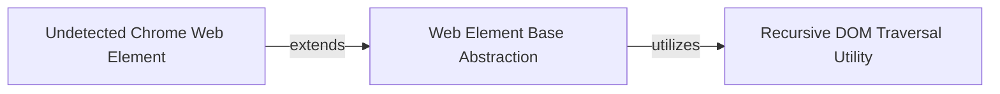

## Component Details

This component overview describes the structure and interactions within the Web Element Abstraction subsystem. It provides a foundational `Web Element Base Abstraction` for general web element interactions, which is extended by `Undetected Chrome Web Element` for specialized, undetectable browser interactions. The `Recursive DOM Traversal Utility` is a helper component used by the base abstraction to navigate and find child elements within the DOM.

### Web Element Base Abstraction
Provides the fundamental abstraction for interacting with web elements, including properties like `children` for accessing direct child elements. This component serves as the base for more specialized web element interactions.

**Related Classes/Methods**:

- <a href="https://github.com/ultrafunkamsterdam/undetected-chromedriver/blob/master/undetected_chromedriver/webelement.py#L7-L24" target="_blank" rel="noopener noreferrer">`undetected_chromedriver.webelement.WebElement` (7:24)</a>
- <a href="https://github.com/ultrafunkamsterdam/undetected-chromedriver/blob/master/undetected_chromedriver/webelement.py#L12-L24" target="_blank" rel="noopener noreferrer">`undetected_chromedriver.webelement.WebElement:children` (12:24)</a>

### Undetected Chrome Web Element
Extends the base web element abstraction to incorporate functionalities specific to `undetected_chromedriver`, allowing for interactions with web elements in a way that avoids detection.

**Related Classes/Methods**:

- <a href="https://github.com/ultrafunkamsterdam/undetected-chromedriver/blob/master/undetected_chromedriver/webelement.py#L27-L64" target="_blank" rel="noopener noreferrer">`undetected_chromedriver.webelement.UCWebElement` (27:64)</a>

### Recursive DOM Traversal Utility
A utility component responsible for recursively traversing the DOM structure to find child elements, potentially with filtering capabilities. It is likely used by the `Web Element Base Abstraction` to implement the `children` property or similar recursive search methods.

**Related Classes/Methods**:

- <a href="https://github.com/ultrafunkamsterdam/undetected-chromedriver/blob/master/undetected_chromedriver/webelement.py#L67-L86" target="_blank" rel="noopener noreferrer">`undetected_chromedriver.webelement._recursive_children` (67:86)</a>

### [FAQ](https://github.com/CodeBoarding/GeneratedOnBoardings/tree/main?tab=readme-ov-file#faq)