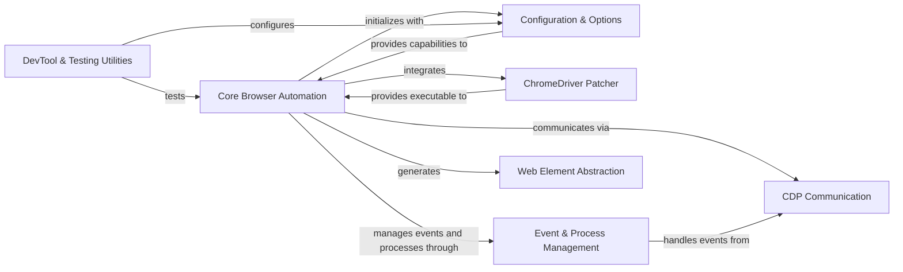

## Component Details

The `undetected-chromedriver` library provides a robust solution for automating Chrome browser interactions while bypassing common bot detection mechanisms. Its core functionality revolves around the `Core Browser Automation` component, which orchestrates browser initialization, session management, and interactions. This component heavily relies on the `ChromeDriver Patcher` to modify the ChromeDriver executable, making it 'undetectable'. Browser behavior is configured via the `Configuration & Options` component. Advanced control and real-time interaction are achieved through the `CDP Communication` component, which interfaces with the Chrome DevTools Protocol, and the `Event & Process Management` component, handling asynchronous events and detached browser processes. Web element interactions are simplified by the `Web Element Abstraction` component, while `DevTool & Testing Utilities` aid in development and testing.

### Core Browser Automation
The primary interface for controlling the Chrome browser. It handles initialization, session management, and core interactions, orchestrating other internal modules for seamless automation.

**Related Classes/Methods**:

- <a href="https://github.com/ultrafunkamsterdam/undetected-chromedriver/blob/master/undetected_chromedriver/__init__.py#L64-L854" target="_blank" rel="noopener noreferrer">`undetected_chromedriver.__init__.Chrome` (64:854)</a>
- <a href="https://github.com/ultrafunkamsterdam/undetected-chromedriver/blob/master/undetected_chromedriver/__init__.py#L105-L489" target="_blank" rel="noopener noreferrer">`undetected_chromedriver.__init__.Chrome.__init__` (105:489)</a>
- <a href="https://github.com/ultrafunkamsterdam/undetected-chromedriver/blob/master/undetected_chromedriver/__init__.py#L491-L631" target="_blank" rel="noopener noreferrer">`undetected_chromedriver.__init__.Chrome._configure_headless` (491:631)</a>
- <a href="https://github.com/ultrafunkamsterdam/undetected-chromedriver/blob/master/undetected_chromedriver/__init__.py#L667-L675" target="_blank" rel="noopener noreferrer">`undetected_chromedriver.__init__.Chrome.add_cdp_listener` (667:675)</a>
- <a href="https://github.com/ultrafunkamsterdam/undetected-chromedriver/blob/master/undetected_chromedriver/__init__.py#L686-L703" target="_blank" rel="noopener noreferrer">`undetected_chromedriver.__init__.Chrome.tab_new` (686:703)</a>
- <a href="https://github.com/ultrafunkamsterdam/undetected-chromedriver/blob/master/undetected_chromedriver/__init__.py#L705-L719" target="_blank" rel="noopener noreferrer">`undetected_chromedriver.__init__.Chrome.reconnect` (705:719)</a>
- <a href="https://github.com/ultrafunkamsterdam/undetected-chromedriver/blob/master/undetected_chromedriver/__init__.py#L729-L762" target="_blank" rel="noopener noreferrer">`undetected_chromedriver.__init__.Chrome.find_elements_recursive` (729:762)</a>
- <a href="https://github.com/ultrafunkamsterdam/undetected-chromedriver/blob/master/undetected_chromedriver/__init__.py#L764-L802" target="_blank" rel="noopener noreferrer">`undetected_chromedriver.__init__.Chrome.quit` (764:802)</a>
- <a href="https://github.com/ultrafunkamsterdam/undetected-chromedriver/blob/master/undetected_chromedriver/__init__.py#L721-L726" target="_blank" rel="noopener noreferrer">`undetected_chromedriver.__init__.Chrome.start_session` (721:726)</a>
- <a href="https://github.com/ultrafunkamsterdam/undetected-chromedriver/blob/master/undetected_chromedriver/__init__.py#L857-L899" target="_blank" rel="noopener noreferrer">`undetected_chromedriver.__init__.find_chrome_executable` (857:899)</a>

### Configuration & Options
Responsible for handling and merging Chrome browser options and preferences, ensuring the browser is launched with the desired configuration.

**Related Classes/Methods**:

- <a href="https://github.com/ultrafunkamsterdam/undetected-chromedriver/blob/master/undetected_chromedriver/options.py#L11-L85" target="_blank" rel="noopener noreferrer">`undetected_chromedriver.options.ChromeOptions` (11:85)</a>
- <a href="https://github.com/ultrafunkamsterdam/undetected-chromedriver/blob/master/undetected_chromedriver/options.py#L35-L40" target="_blank" rel="noopener noreferrer">`undetected_chromedriver.options.ChromeOptions:_undot_key` (35:40)</a>
- <a href="https://github.com/ultrafunkamsterdam/undetected-chromedriver/blob/master/undetected_chromedriver/options.py#L43-L54" target="_blank" rel="noopener noreferrer">`undetected_chromedriver.options.ChromeOptions:_merge_nested` (43:54)</a>
- <a href="https://github.com/ultrafunkamsterdam/undetected-chromedriver/blob/master/undetected_chromedriver/options.py#L56-L79" target="_blank" rel="noopener noreferrer">`undetected_chromedriver.options.ChromeOptions:handle_prefs` (56:79)</a>
- <a href="https://github.com/ultrafunkamsterdam/undetected-chromedriver/blob/master/undetected_chromedriver/options.py#L82-L85" target="_blank" rel="noopener noreferrer">`undetected_chromedriver.options.ChromeOptions:from_options` (82:85)</a>

### ChromeDriver Patcher
Crucial for bypassing detection mechanisms by patching the ChromeDriver executable. It handles checking patch status, downloading, unzipping, and applying patches.

**Related Classes/Methods**:

- <a href="https://github.com/ultrafunkamsterdam/undetected-chromedriver/blob/master/undetected_chromedriver/patcher.py#L27-L401" target="_blank" rel="noopener noreferrer">`undetected_chromedriver.patcher.Patcher` (27:401)</a>
- <a href="https://github.com/ultrafunkamsterdam/undetected-chromedriver/blob/master/undetected_chromedriver/patcher.py#L44-L101" target="_blank" rel="noopener noreferrer">`undetected_chromedriver.patcher.Patcher:__init__` (44:101)</a>
- <a href="https://github.com/ultrafunkamsterdam/undetected-chromedriver/blob/master/undetected_chromedriver/patcher.py#L121-L179" target="_blank" rel="noopener noreferrer">`undetected_chromedriver.patcher.Patcher:auto` (121:179)</a>
- <a href="https://github.com/ultrafunkamsterdam/undetected-chromedriver/blob/master/undetected_chromedriver/patcher.py#L228-L230" target="_blank" rel="noopener noreferrer">`undetected_chromedriver.patcher.Patcher:patch` (228:230)</a>
- <a href="https://github.com/ultrafunkamsterdam/undetected-chromedriver/blob/master/undetected_chromedriver/patcher.py#L336-L342" target="_blank" rel="noopener noreferrer">`undetected_chromedriver.patcher.Patcher.is_binary_patched` (336:342)</a>
- <a href="https://github.com/ultrafunkamsterdam/undetected-chromedriver/blob/master/undetected_chromedriver/patcher.py#L344-L372" target="_blank" rel="noopener noreferrer">`undetected_chromedriver.patcher.Patcher.patch_exe` (344:372)</a>
- <a href="https://github.com/ultrafunkamsterdam/undetected-chromedriver/blob/master/undetected_chromedriver/patcher.py#L232-L263" target="_blank" rel="noopener noreferrer">`undetected_chromedriver.patcher.Patcher.fetch_release_number` (232:263)</a>
- <a href="https://github.com/ultrafunkamsterdam/undetected-chromedriver/blob/master/undetected_chromedriver/patcher.py#L289-L314" target="_blank" rel="noopener noreferrer">`undetected_chromedriver.patcher.Patcher.unzip_package` (289:314)</a>
- <a href="https://github.com/ultrafunkamsterdam/undetected-chromedriver/blob/master/undetected_chromedriver/patcher.py#L272-L287" target="_blank" rel="noopener noreferrer">`undetected_chromedriver.patcher.Patcher.fetch_package` (272:287)</a>

### CDP Communication
Facilitates communication with the Chrome DevTools Protocol (CDP), enabling advanced control over browser tabs, pages, and elements by sending commands and receiving events.

**Related Classes/Methods**:

- <a href="https://github.com/ultrafunkamsterdam/undetected-chromedriver/blob/master/undetected_chromedriver/cdp.py#L35-L112" target="_blank" rel="noopener noreferrer">`undetected_chromedriver.cdp.CDP` (35:112)</a>
- <a href="https://github.com/ultrafunkamsterdam/undetected-chromedriver/blob/master/undetected_chromedriver/cdp.py#L14-L28" target="_blank" rel="noopener noreferrer">`undetected_chromedriver.cdp.CDPObject` (14:28)</a>
- <a href="https://github.com/ultrafunkamsterdam/undetected-chromedriver/blob/master/undetected_chromedriver/cdp.py#L49-L59" target="_blank" rel="noopener noreferrer">`undetected_chromedriver.cdp.CDP:__init__` (49:59)</a>
- <a href="https://github.com/ultrafunkamsterdam/undetected-chromedriver/blob/master/undetected_chromedriver/cdp.py#L90-L98" target="_blank" rel="noopener noreferrer">`undetected_chromedriver.cdp.CDP.get` (90:98)</a>
- <a href="https://github.com/ultrafunkamsterdam/undetected-chromedriver/blob/master/undetected_chromedriver/cdp.py#L100-L108" target="_blank" rel="noopener noreferrer">`undetected_chromedriver.cdp.CDP.post` (100:108)</a>
- <a href="https://github.com/ultrafunkamsterdam/undetected-chromedriver/blob/master/undetected_chromedriver/cdp.py#L61-L66" target="_blank" rel="noopener noreferrer">`undetected_chromedriver.cdp.CDP:tab_activate` (61:66)</a>
- <a href="https://github.com/ultrafunkamsterdam/undetected-chromedriver/blob/master/undetected_chromedriver/cdp.py#L68-L70" target="_blank" rel="noopener noreferrer">`undetected_chromedriver.cdp.CDP:tab_list` (68:70)</a>
- <a href="https://github.com/ultrafunkamsterdam/undetected-chromedriver/blob/master/undetected_chromedriver/cdp.py#L72-L73" target="_blank" rel="noopener noreferrer">`undetected_chromedriver.cdp.CDP:tab_new` (72:73)</a>
- <a href="https://github.com/ultrafunkamsterdam/undetected-chromedriver/blob/master/undetected_chromedriver/cdp.py#L75-L78" target="_blank" rel="noopener noreferrer">`undetected_chromedriver.cdp.CDP:tab_close_last_opened` (75:78)</a>

### Event & Process Management
Manages asynchronous events, particularly for CDP events, by providing an event loop and dispatching events to handlers. Also responsible for launching and managing detached browser processes.

**Related Classes/Methods**:

- <a href="https://github.com/ultrafunkamsterdam/undetected-chromedriver/blob/master/undetected_chromedriver/reactor.py#L13-L99" target="_blank" rel="noopener noreferrer">`undetected_chromedriver.reactor.Reactor` (13:99)</a>
- <a href="https://github.com/ultrafunkamsterdam/undetected-chromedriver/blob/master/undetected_chromedriver/reactor.py#L47-L52" target="_blank" rel="noopener noreferrer">`undetected_chromedriver.reactor.Reactor:run` (47:52)</a>
- <a href="https://github.com/ultrafunkamsterdam/undetected-chromedriver/blob/master/undetected_chromedriver/reactor.py#L66-L99" target="_blank" rel="noopener noreferrer">`undetected_chromedriver.reactor.Reactor:listen` (66:99)</a>
- <a href="https://github.com/ultrafunkamsterdam/undetected-chromedriver/blob/master/undetected_chromedriver/reactor.py#L25-L41" target="_blank" rel="noopener noreferrer">`undetected_chromedriver.reactor.Reactor.add_event_handler` (25:41)</a>
- <a href="https://github.com/ultrafunkamsterdam/undetected-chromedriver/blob/master/undetected_chromedriver/dprocess.py#L18-L43" target="_blank" rel="noopener noreferrer">`undetected_chromedriver.dprocess.start_detached` (18:43)</a>

### Web Element Abstraction
Provides an abstraction for interacting with web elements within the browser, including methods for navigating the DOM structure and finding child elements recursively.

**Related Classes/Methods**:

- <a href="https://github.com/ultrafunkamsterdam/undetected-chromedriver/blob/master/undetected_chromedriver/webelement.py#L7-L24" target="_blank" rel="noopener noreferrer">`undetected_chromedriver.webelement.WebElement` (7:24)</a>
- <a href="https://github.com/ultrafunkamsterdam/undetected-chromedriver/blob/master/undetected_chromedriver/webelement.py#L27-L64" target="_blank" rel="noopener noreferrer">`undetected_chromedriver.webelement.UCWebElement` (27:64)</a>
- <a href="https://github.com/ultrafunkamsterdam/undetected-chromedriver/blob/master/undetected_chromedriver/webelement.py#L12-L24" target="_blank" rel="noopener noreferrer">`undetected_chromedriver.webelement.WebElement:children` (12:24)</a>
- <a href="https://github.com/ultrafunkamsterdam/undetected-chromedriver/blob/master/undetected_chromedriver/webelement.py#L67-L86" target="_blank" rel="noopener noreferrer">`undetected_chromedriver.webelement._recursive_children` (67:86)</a>

### DevTool & Testing Utilities
Contains utility functions and structures primarily used for development and testing purposes related to Chrome DevTools, including data structuring and a comprehensive test function.

**Related Classes/Methods**:

- <a href="https://github.com/ultrafunkamsterdam/undetected-chromedriver/blob/master/undetected_chromedriver/devtool.py#L16-L75" target="_blank" rel="noopener noreferrer">`undetected_chromedriver.devtool.Structure` (16:75)</a>
- <a href="https://github.com/ultrafunkamsterdam/undetected-chromedriver/blob/master/undetected_chromedriver/devtool.py#L103-L190" target="_blank" rel="noopener noreferrer">`undetected_chromedriver.devtool.test` (103:190)</a>

### [FAQ](https://github.com/CodeBoarding/GeneratedOnBoardings/tree/main?tab=readme-ov-file#faq)