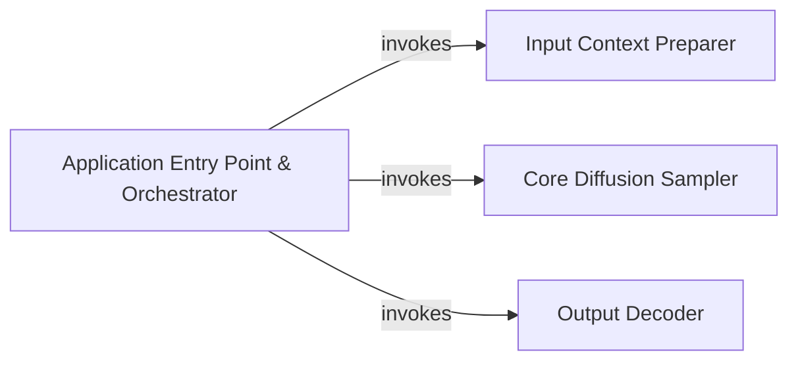

## Details

The multi-modal diffusion system is orchestrated by a central Application Entry Point & Orchestrator component, primarily embodied by the `evaluate` function in `sample_multi_v0.py`. This orchestrator initiates the process by invoking the Input Context Preparer, which leverages CLIP models and an autoencoder to transform raw inputs (text, images) into suitable latent contexts. Subsequently, the orchestrator passes these contexts to the Core Diffusion Sampler. This component, utilizing a neural network (`nnet`) and a DPM-Solver, iteratively refines latent representations through a series of diffusion steps, supporting various generative modes. Finally, the orchestrator directs the sampled latent outputs to the Output Decoder, which reconstructs them into visual formats using the autoencoder and handles post-processing and saving the final images. This architecture ensures a clear, sequential flow from input preparation to multi-modal generation and output delivery. The primary subsystem under analysis is defined by the `sample_multi_v0.py` script, which serves as the core orchestrator for the multi-modal diffusion process. This script integrates functionalities from external libraries such as `ml_collections`, `torch`, `dpm_solver_pp`, `libs.autoencoder`, `libs.clip`, and `libs.caption_decoder`. The central logic and flow control are encapsulated within the `evaluate` function and its associated helper functions.

### Application Entry Point & Orchestrator [[Expand]](./Application_Entry_Point_Orchestrator.md)
This component serves as the primary control module for the entire multi-modal diffusion system. It is responsible for initializing the application, loading necessary configurations, and orchestrating the complete multi-modal diffusion sampling process from input preparation through core sampling execution to final output post-processing. It acts as the central coordinator, managing the flow and interactions between various stages of the generative pipeline.

**Related Classes/Methods**:

- <a href="https://github.com/thu-ml/unidiffuser/blob/main/sample_multi_v0.py#L396-L405" target="_blank" rel="noopener noreferrer">`main`:396-405</a>
- <a href="https://github.com/thu-ml/unidiffuser/blob/main/sample_multi_v0.py#L81-L366" target="_blank" rel="noopener noreferrer">`evaluate`:81-366</a>
- <a href="https://github.com/thu-ml/unidiffuser/blob/main/sample_multi_v0.py#L308-L311" target="_blank" rel="noopener noreferrer">`watermarking`:308-311</a>
- <a href="https://github.com/thu-ml/unidiffuser/blob/main/sample_multi_v0.py#L68-L71" target="_blank" rel="noopener noreferrer">`unpreprocess`:68-71</a>

### Input Context Preparer
Prepares input data and context for the diffusion process, including handling text and image inputs and encoding them using CLIP models and an autoencoder.

**Related Classes/Methods**:

- <a href="https://github.com/thu-ml/unidiffuser/blob/main/sample_multi_v0.py#L25-L65" target="_blank" rel="noopener noreferrer">`prepare_contexts`:25-65</a>

### Core Diffusion Sampler
Executes the central diffusion sampling steps, utilizing a neural network (`nnet`) and a DPM-Solver to iteratively refine the latent representations based on the input context. It handles different sampling modes (e.g., text-to-image, image-to-text, joint).

**Related Classes/Methods**:

- <a href="https://github.com/thu-ml/unidiffuser/blob/main/sample_multi_v0.py#L264-L306" target="_blank" rel="noopener noreferrer">`sample_fn`:264-306</a>
- <a href="https://github.com/thu-ml/unidiffuser/blob/main/sample_multi_v0.py#L134-L165" target="_blank" rel="noopener noreferrer">`t2i_nnet`:134-165</a>
- <a href="https://github.com/thu-ml/unidiffuser/blob/main/sample_multi_v0.py#L182-L199" target="_blank" rel="noopener noreferrer">`i2t_nnet`:182-199</a>
- <a href="https://github.com/thu-ml/unidiffuser/blob/main/sample_multi_v0.py#L216-L233" target="_blank" rel="noopener noreferrer">`joint_nnet`:216-233</a>

### Output Decoder
Post-processes and decodes the sampled outputs from their latent representation back into a usable format, such as images, and handles saving them.

**Related Classes/Methods**:

- <a href="https://github.com/thu-ml/unidiffuser/blob/main/sample_multi_v0.py#L239-L241" target="_blank" rel="noopener noreferrer">`decode`:239-241</a>
- <a href="https://github.com/thu-ml/unidiffuser/blob/main/sample_multi_v0.py#L68-L71" target="_blank" rel="noopener noreferrer">`unpreprocess`:68-71</a>
- <a href="https://github.com/thu-ml/unidiffuser/blob/main/sample_multi_v0.py#L201-L208" target="_blank" rel="noopener noreferrer">`split_joint`:201-208</a>

### [FAQ](https://github.com/CodeBoarding/GeneratedOnBoardings/tree/main?tab=readme-ov-file#faq)