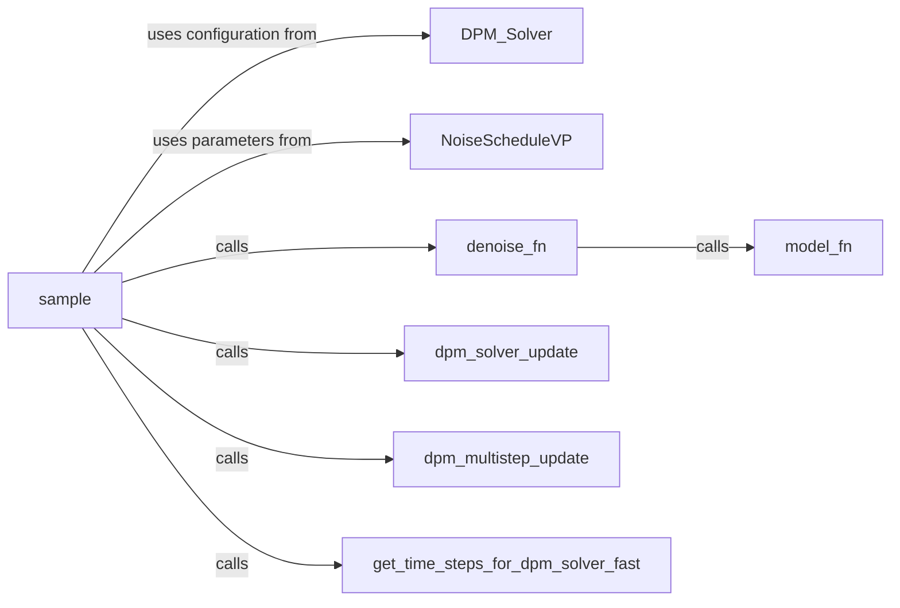

## Details

The Diffusion Sampler (DPM-Solver++) subsystem is a critical component within the unidiffuser project, specifically designed to implement the iterative denoising algorithm that transforms latent representations into meaningful data. Its boundaries are primarily defined by the dpm_solver_pp.py file, which encapsulates the core logic for the DPM-Solver++ algorithm.

### DPM_Solver
Serves as the high-level entry point and configuration container for the DPM-Solver++ algorithm. It encapsulates the solver's state and parameters, acting as the primary interface for external modules to initiate a sampling process. This component is crucial for setting up the solver's behavior.

**Related Classes/Methods**:

- <a href="https://github.com/thu-ml/unidiffuser/blob/main/sample_multi_v0.py" target="_blank" rel="noopener noreferrer">`DPM_Solver`</a>

### NoiseScheduleVP
Defines and provides the variance-preserving noise schedule parameters. These parameters are fundamental for guiding the diffusion and denoising process over time steps, ensuring the stability and correctness of the sampling.

**Related Classes/Methods**:

- <a href="https://github.com/thu-ml/unidiffuser/blob/main/dpm_solver_pp.py#L54-L168" target="_blank" rel="noopener noreferrer">`NoiseScheduleVP`:54-168</a>

### sample
This is the orchestrator of the entire iterative denoising process. It manages the flow of latent representations across time steps, coordinating the application of the model function and solver updates. It embodies the core sampling loop.

**Related Classes/Methods**:

- <a href="https://github.com/thu-ml/unidiffuser/blob/main/sample_multi_v0.py" target="_blank" rel="noopener noreferrer">`sample`</a>

### model_fn
Performs the fundamental model prediction or denoising calculation for a given latent state and time step. This is the interface where the underlying diffusion model (e.g., U-ViT) is invoked to estimate the noise or the denoised image.

**Related Classes/Methods**:

- <a href="https://github.com/thu-ml/unidiffuser/blob/main/sample_multi_v0.py#L277-L288" target="_blank" rel="noopener noreferrer">`model_fn`:277-288</a>

### denoise_fn
Executes a single denoising step by invoking the `model_fn` and potentially applying necessary transformations or scaling based on the noise schedule. It acts as an adapter between the general sampling logic and the specific model prediction.

**Related Classes/Methods**:

- <a href="https://github.com/thu-ml/unidiffuser/blob/main/dpm_solver_pp.py#L401-L412" target="_blank" rel="noopener noreferrer">`denoise_fn`:401-412</a>

### dpm_solver_update
Manages the single-step updates within the DPM-Solver++ algorithm. It takes the current latent state, time step, and model prediction to compute the next latent state according to the solver's rules.

**Related Classes/Methods**:

- <a href="https://github.com/thu-ml/unidiffuser/blob/main/dpm_solver_pp.py#L742-L761" target="_blank" rel="noopener noreferrer">`dpm_solver_update`:742-761</a>

### dpm_multistep_update
Handles multi-step updates for the DPM-Solver++ algorithm, coordinating multiple prediction steps to achieve higher accuracy or efficiency. It extends the single-step update logic for more complex scenarios.

**Related Classes/Methods**:

- <a href="https://github.com/thu-ml/unidiffuser/blob/main/dpm_solver_pp.py#L763-L782" target="_blank" rel="noopener noreferrer">`dpm_multistep_update`:763-782</a>

### get_time_steps_for_dpm_solver_fast
A utility function that optimizes the time steps used by the DPM-Solver++ algorithm, crucial for efficient and accurate sampling.

**Related Classes/Methods**:

- <a href="https://github.com/thu-ml/unidiffuser/blob/main/dpm_solver_pp.py#L359-L399" target="_blank" rel="noopener noreferrer">`get_time_steps_for_dpm_solver_fast`:359-399</a>

### [FAQ](https://github.com/CodeBoarding/GeneratedOnBoardings/tree/main?tab=readme-ov-file#faq)