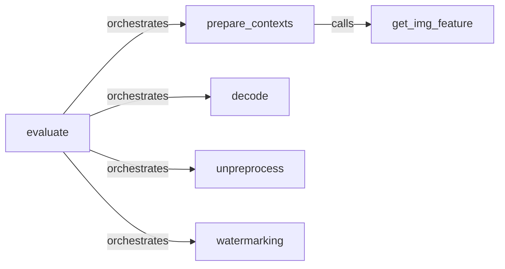

## Details

The Input/Output Data Pipeline subsystem is primarily encapsulated within the functionalities defined in sample_multi_v0.py and sample_multi_v1.py. These files contain the core methods responsible for preparing input data, orchestrating the generation process, and post-processing the generated outputs.

### evaluate
Acts as the primary control point for the entire input/output data pipeline. It orchestrates the sequence of operations, initiating input preparation, implicitly integrating with the core diffusion model, and then coordinating various post-processing steps for the generated output. This aligns with the "Sampling/Inference Engine" and "Pipeline Architecture" patterns, serving as the entry point for a complete generation run.

**Related Classes/Methods**:

- <a href="https://github.com/thu-ml/unidiffuser/blob/main/sample_multi_v0.py#L81-L366" target="_blank" rel="noopener noreferrer">`evaluate`:81-366</a>
- <a href="https://github.com/thu-ml/unidiffuser/blob/main/sample_multi_v0.py#L81-L366" target="_blank" rel="noopener noreferrer">`evaluate`:81-366</a>

### prepare_contexts
Prepares raw input data (e.g., text prompts, image features) for consumption by the diffusion model. This involves fetching, processing, or transforming features to the required format. It's a key part of the "Data Handling & Preprocessing" component.

**Related Classes/Methods**:

- <a href="https://github.com/thu-ml/unidiffuser/blob/main/sample_multi_v0.py#L25-L65" target="_blank" rel="noopener noreferrer">`prepare_contexts`:25-65</a>
- <a href="https://github.com/thu-ml/unidiffuser/blob/main/sample_multi_v0.py#L25-L65" target="_blank" rel="noopener noreferrer">`prepare_contexts`:25-65</a>

### get_img_feature
A specialized sub-component of input preparation, specifically focused on extracting or retrieving features from image inputs. This ensures visual data is correctly formatted for the multi-modal diffusion process.

**Related Classes/Methods**:

- <a href="https://github.com/thu-ml/unidiffuser/blob/main/sample_multi_v0.py#L42-L52" target="_blank" rel="noopener noreferrer">`get_img_feature`:42-52</a>
- <a href="https://github.com/thu-ml/unidiffuser/blob/main/sample_multi_v0.py#L42-L52" target="_blank" rel="noopener noreferrer">`get_img_feature`:42-52</a>

### decode
Handles the transformation of the diffusion model's latent output into a human-interpretable or usable format (e.g., converting latent representations back into images or text). This directly corresponds to the "Modality Decoders" expected component.

**Related Classes/Methods**:

- <a href="https://github.com/thu-ml/unidiffuser/blob/main/sample_multi_v0.py#L239-L241" target="_blank" rel="noopener noreferrer">`decode`:239-241</a>
- <a href="https://github.com/thu-ml/unidiffuser/blob/main/sample_multi_v0.py#L239-L241" target="_blank" rel="noopener noreferrer">`decode`:239-241</a>

### unpreprocess
Performs necessary post-processing on the generated output, often reversing initial preprocessing steps to ensure the output is in its final, desired format (e.g., denormalization, color space conversion).

**Related Classes/Methods**:

- <a href="https://github.com/thu-ml/unidiffuser/blob/main/sample_multi_v0.py#L68-L71" target="_blank" rel="noopener noreferrer">`unpreprocess`:68-71</a>
- <a href="https://github.com/thu-ml/unidiffuser/blob/main/sample_multi_v0.py#L68-L71" target="_blank" rel="noopener noreferrer">`unpreprocess`:68-71</a>

### watermarking
Applies watermarks or other final metadata/embellishments to the generated output, serving as a final step before delivery.

**Related Classes/Methods**:

- <a href="https://github.com/thu-ml/unidiffuser/blob/main/sample_multi_v0.py#L308-L311" target="_blank" rel="noopener noreferrer">`watermarking`:308-311</a>
- <a href="https://github.com/thu-ml/unidiffuser/blob/main/sample_multi_v0.py#L308-L311" target="_blank" rel="noopener noreferrer">`watermarking`:308-311</a>

### [FAQ](https://github.com/CodeBoarding/GeneratedOnBoardings/tree/main?tab=readme-ov-file#faq)