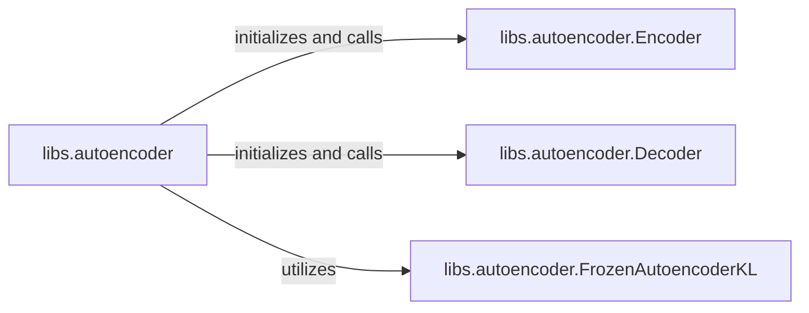

## Details

Subsystem: Latent Space Autoencoder (VAE)

### libs.autoencoder
The primary interface and orchestrator for the entire VAE. It manages the overall encoding, decoding, and forward pass operations, and is responsible for initializing and coordinating its sub-components. This component is central as it defines the overall VAE functionality and integrates its parts.

**Related Classes/Methods**:

- <a href="https://github.com/thu-ml/unidiffuser/blob/main/libs/autoencoder.py" target="_blank" rel="noopener noreferrer">`libs.autoencoder`</a>

### libs.autoencoder.Encoder
Responsible for transforming high-dimensional input data (e.g., images) into a compact latent representation. It is a fundamental functional block within the VAE pipeline, essential for dimensionality reduction.

**Related Classes/Methods**:

- <a href="https://github.com/thu-ml/unidiffuser/blob/main/libs/autoencoder.py" target="_blank" rel="noopener noreferrer">`libs.autoencoder.Encoder`</a>

### libs.autoencoder.Decoder
Responsible for reconstructing high-dimensional data from the latent representation. It works in conjunction with the Encoder to complete the autoencoding process, enabling the generation of new data from the latent space.

**Related Classes/Methods**:

- <a href="https://github.com/thu-ml/unidiffuser/blob/main/libs/autoencoder.py" target="_blank" rel="noopener noreferrer">`libs.autoencoder.Decoder`</a>

### libs.autoencoder.FrozenAutoencoderKL
A specialized, potentially pre-trained or fixed, autoencoder implementation. Its presence suggests modularity and the ability to leverage existing models or specific configurations within the unidiffuser framework, aligning with the 'ML Toolkit / Research Project' nature by allowing interchangeable VAE backbones.

**Related Classes/Methods**:

- <a href="https://github.com/thu-ml/unidiffuser/blob/main/libs/autoencoder.py#L412-L460" target="_blank" rel="noopener noreferrer">`libs.autoencoder.FrozenAutoencoderKL`:412-460</a>

### [FAQ](https://github.com/CodeBoarding/GeneratedOnBoardings/tree/main?tab=readme-ov-file#faq)