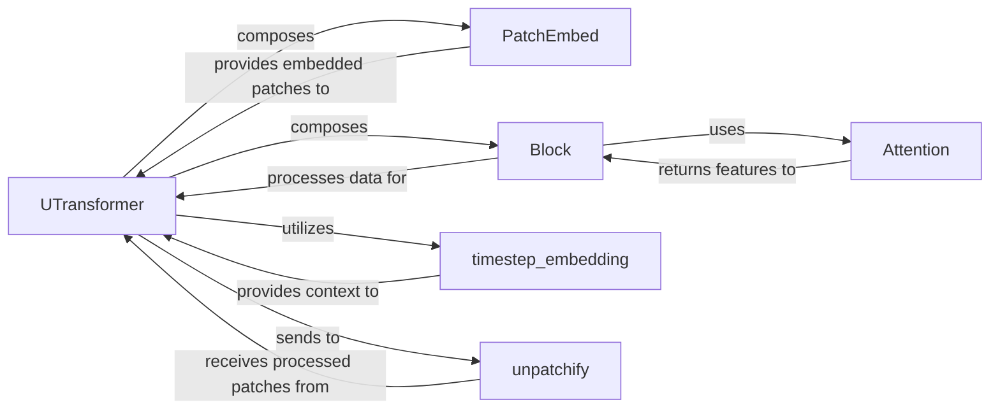

## Details

The `Multi-modal U-ViT Diffusion Model (Core Generative Engine)` subsystem is primarily defined by the implementations found in `libs/uvit_multi_post_ln.py` and `libs/uvit_multi_post_ln_v1.py`. These files encapsulate the core logic for the U-ViT architecture, responsible for predicting noise in the latent space and integrating various input modalities.

### UTransformer
The orchestrator of the entire multi-modal U-ViT diffusion process. It initializes the network, manages the flow of data through its internal components, and performs the core noise prediction in the latent space by integrating various input modalities and temporal information.

**Related Classes/Methods**:

- <a href="https://github.com/thu-ml/unidiffuser/blob/main/libs/uvit_multi_post_ln.py" target="_blank" rel="noopener noreferrer">`UTransformer`</a>
- <a href="https://github.com/thu-ml/unidiffuser/blob/main/libs/uvit_multi_post_ln_v1.py" target="_blank" rel="noopener noreferrer">`UTransformer`</a>

### PatchEmbed
Transforms diverse raw input data (e.g., image patches, text features) into a unified sequence of embedded patches, preparing them for processing by the transformer blocks. This acts as the initial input processing stage.

**Related Classes/Methods**:

- <a href="https://github.com/thu-ml/unidiffuser/blob/main/libs/uvit_multi_post_ln.py#L140-L152" target="_blank" rel="noopener noreferrer">`PatchEmbed`:140-152</a>
- <a href="https://github.com/thu-ml/unidiffuser/blob/main/libs/uvit_multi_post_ln.py#L140-L152" target="_blank" rel="noopener noreferrer">`PatchEmbed`:140-152</a>

### Block
Represents a single transformer block, performing self-attention and feed-forward operations on the embedded patches to extract and transform features. Multiple instances of `Block` form the deep processing layers of the `UTransformer`.

**Related Classes/Methods**:

- <a href="https://github.com/thu-ml/unidiffuser/blob/main/libs/autoencoder.py#L75-L134" target="_blank" rel="noopener noreferrer">`Block`:75-134</a>
- <a href="https://github.com/thu-ml/unidiffuser/blob/main/libs/autoencoder.py#L75-L134" target="_blank" rel="noopener noreferrer">`Block`:75-134</a>

### Attention
Implements the self-attention mechanism within each `Block`, allowing the model to dynamically weigh the importance of different parts of the input sequence for effective feature integration across modalities.

**Related Classes/Methods**:

- <a href="https://github.com/thu-ml/unidiffuser/blob/main/libs/autoencoder.py#L7-L23" target="_blank" rel="noopener noreferrer">`Attention`:7-23</a>
- <a href="https://github.com/thu-ml/unidiffuser/blob/main/libs/autoencoder.py#L7-L23" target="_blank" rel="noopener noreferrer">`Attention`:7-23</a>

### timestep_embedding
Generates unique embeddings for diffusion timesteps, providing crucial temporal context to guide the noise prediction process within the `UTransformer`.

**Related Classes/Methods**:

- <a href="https://github.com/thu-ml/unidiffuser/blob/main/libs/uvit_multi_post_ln.py#L21-L39" target="_blank" rel="noopener noreferrer">`timestep_embedding`:21-39</a>
- <a href="https://github.com/thu-ml/unidiffuser/blob/main/libs/uvit_multi_post_ln.py#L21-L39" target="_blank" rel="noopener noreferrer">`timestep_embedding`:21-39</a>

### unpatchify
Reconstructs the final output (e.g., predicted noise or denoised latent representation) from the processed patches back into a coherent data format, serving as the final output stage.

**Related Classes/Methods**:

- <a href="https://github.com/thu-ml/unidiffuser/blob/main/libs/uvit_multi_post_ln.py#L47-L52" target="_blank" rel="noopener noreferrer">`unpatchify`:47-52</a>
- <a href="https://github.com/thu-ml/unidiffuser/blob/main/libs/uvit_multi_post_ln.py#L47-L52" target="_blank" rel="noopener noreferrer">`unpatchify`:47-52</a>

### [FAQ](https://github.com/CodeBoarding/GeneratedOnBoardings/tree/main?tab=readme-ov-file#faq)