```mermaid
graph LR
    Application_Entry_Point_Orchestrator["Application Entry Point & Orchestrator"]
    Configuration_Management["Configuration Management"]
    Input_Output_Data_Pipeline["Input/Output Data Pipeline"]
    Latent_Space_Autoencoder_VAE_["Latent Space Autoencoder (VAE)"]
    Multi_modal_U_ViT_Diffusion_Model_Core_Generative_Engine_["Multi-modal U-ViT Diffusion Model (Core Generative Engine)"]
    Diffusion_Sampler_DPM_Solver_["Diffusion Sampler (DPM-Solver++)"]
    Caption_Generation_Module["Caption Generation Module"]
    Application_Entry_Point_Orchestrator -- "Loads Configuration From" --> Configuration_Management
    Configuration_Management -- "Provides Settings To" --> Application_Entry_Point_Orchestrator
    Application_Entry_Point_Orchestrator -- "Initializes/Calls" --> Input_Output_Data_Pipeline
    Input_Output_Data_Pipeline -- "Sends Input Images To" --> Latent_Space_Autoencoder_VAE_
    Input_Output_Data_Pipeline -- "Sends Conditioning To" --> Multi_modal_U_ViT_Diffusion_Model_Core_Generative_Engine_
    Latent_Space_Autoencoder_VAE_ -- "Sends Latent Representations To" --> Multi_modal_U_ViT_Diffusion_Model_Core_Generative_Engine_
    Multi_modal_U_ViT_Diffusion_Model_Core_Generative_Engine_ -- "Sends Noise Predictions To" --> Diffusion_Sampler_DPM_Solver_
    Diffusion_Sampler_DPM_Solver_ -- "Sends Denoised Latent Samples To" --> Latent_Space_Autoencoder_VAE_
    Latent_Space_Autoencoder_VAE_ -- "Sends Decoded Images To" --> Input_Output_Data_Pipeline
    Input_Output_Data_Pipeline -- "Sends Final Images To" --> Caption_Generation_Module
    click Application_Entry_Point_Orchestrator href "https://github.com/CodeBoarding/GeneratedOnBoardings/blob/main/unidiffuser/Application_Entry_Point_Orchestrator.md" "Details"
    click Input_Output_Data_Pipeline href "https://github.com/CodeBoarding/GeneratedOnBoardings/blob/main/unidiffuser/Input_Output_Data_Pipeline.md" "Details"
    click Latent_Space_Autoencoder_VAE_ href "https://github.com/CodeBoarding/GeneratedOnBoardings/blob/main/unidiffuser/Latent_Space_Autoencoder_VAE_.md" "Details"
    click Multi_modal_U_ViT_Diffusion_Model_Core_Generative_Engine_ href "https://github.com/CodeBoarding/GeneratedOnBoardings/blob/main/unidiffuser/Multi_modal_U_ViT_Diffusion_Model_Core_Generative_Engine_.md" "Details"
    click Diffusion_Sampler_DPM_Solver_ href "https://github.com/CodeBoarding/GeneratedOnBoardings/blob/main/unidiffuser/Diffusion_Sampler_DPM_Solver_.md" "Details"
```

## Details

The unidiffuser architecture is a pipeline-driven generative system designed for multi-modal diffusion. It orchestrates the flow of data from raw inputs through a series of specialized components to produce high-quality multi-modal outputs. The Application Entry Point & Orchestrator initiates the process, leveraging Configuration Management to set up the pipeline. The Input/Output Data Pipeline prepares and manages data, interfacing with the Latent Space Autoencoder (VAE) for image encoding/decoding. The core generative process resides within the Multi-modal U-ViT Diffusion Model, which interacts with the Diffusion Sampler to iteratively refine latent representations. Finally, generated outputs are post-processed by the Input/Output Data Pipeline and can be further analyzed by the Caption Generation Module. This modular design allows for clear data flow, component interchangeability, and a robust framework for multi-modal generative AI research.

### Application Entry Point & Orchestrator [[Expand]](./Application_Entry_Point_Orchestrator.md)
The primary control module, responsible for initializing the entire system, loading configurations, and orchestrating the multi-modal diffusion sampling process.

**Related Classes/Methods**:

- <a href="https://github.com/thu-ml/unidiffuser/blob/main/sample_multi_v0.py" target="_blank" rel="noopener noreferrer">`sample_multi_v0.py`</a>
- <a href="https://github.com/thu-ml/unidiffuser/blob/main/sample_multi_v1.py" target="_blank" rel="noopener noreferrer">`sample_multi_v1.py`</a>

### Configuration Management
Centralized module for loading, parsing, and providing configuration settings to all other components, ensuring consistent behavior.

**Related Classes/Methods**:

- <a href="https://github.com/thu-ml/unidiffuser/blob/main/configs/sample_unidiffuser_v0.py" target="_blank" rel="noopener noreferrer">`configs/sample_unidiffuser_v0.py`</a>
- <a href="https://github.com/thu-ml/unidiffuser/blob/main/configs/sample_unidiffuser_v1.py" target="_blank" rel="noopener noreferrer">`configs/sample_unidiffuser_v1.py`</a>

### Input/Output Data Pipeline [[Expand]](./Input_Output_Data_Pipeline.md)
Manages the preparation of raw input data (e.g., text, images) for the diffusion process and handles post-processing and delivery of generated outputs.

**Related Classes/Methods**:

- <a href="https://github.com/thu-ml/unidiffuser/blob/main/sample_multi_v0.py" target="_blank" rel="noopener noreferrer">`sample_multi_v0.py`</a>
- <a href="https://github.com/thu-ml/unidiffuser/blob/main/sample_multi_v1.py" target="_blank" rel="noopener noreferrer">`sample_multi_v1.py`</a>

### Latent Space Autoencoder (VAE) [[Expand]](./Latent_Space_Autoencoder_VAE_.md)
Encodes high-dimensional image data into a compact latent representation for efficient processing by the diffusion model and decodes latent samples back into images.

**Related Classes/Methods**:

- <a href="https://github.com/thu-ml/unidiffuser/blob/main/libs/autoencoder.py" target="_blank" rel="noopener noreferrer">`libs/autoencoder.py`</a>

### Multi-modal U-ViT Diffusion Model (Core Generative Engine) [[Expand]](./Multi_modal_U_ViT_Diffusion_Model_Core_Generative_Engine_.md)
The central generative model that predicts noise in the latent space, capable of integrating and processing various input modalities (text, image, joint).

**Related Classes/Methods**:

- <a href="https://github.com/thu-ml/unidiffuser/blob/main/libs/uvit_multi_post_ln.py" target="_blank" rel="noopener noreferrer">`libs/uvit_multi_post_ln.py`</a>
- <a href="https://github.com/thu-ml/unidiffuser/blob/main/libs/uvit_multi_post_ln_v1.py" target="_blank" rel="noopener noreferrer">`libs/uvit_multi_post_ln_v1.py`</a>

### Diffusion Sampler (DPM-Solver++) [[Expand]](./Diffusion_Sampler_DPM_Solver_.md)
Implements the iterative algorithm to progressively denoise the latent representation, transforming random noise into meaningful data.

**Related Classes/Methods**:

- <a href="https://github.com/thu-ml/unidiffuser/blob/main/dpm_solver_pp.py" target="_blank" rel="noopener noreferrer">`dpm_solver_pp.py`</a>

### Caption Generation Module
Generates descriptive text captions based on the final processed image outputs, providing a textual understanding of the generated visual content.

**Related Classes/Methods**:

- <a href="https://github.com/thu-ml/unidiffuser/blob/main/libs/caption_decoder.py" target="_blank" rel="noopener noreferrer">`libs/caption_decoder.py`</a>

### [FAQ](https://github.com/CodeBoarding/GeneratedOnBoardings/tree/main?tab=readme-ov-file#faq)