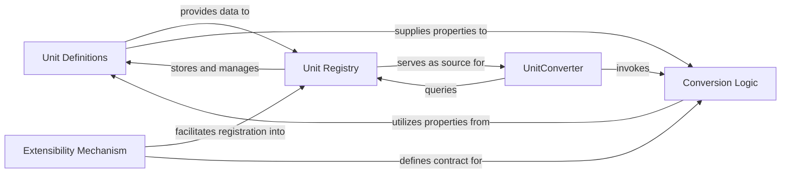

## Details

The UnitConverter project is designed as a modular utility library, emphasizing clear interfaces and extensibility. The core subsystem focuses on accurate unit conversions, leveraging Object-Oriented Design principles, particularly the Strategy and Registry patterns.

### Unit Definitions
This component is responsible for formally defining all supported units. It includes their properties (e.g., name, symbol, dimension), relationships to base units, and any necessary conversion factors or offsets. It serves as the foundational data layer for the conversion process.

**Related Classes/Methods**:

- `UnitDefinition` (1:1)

### Unit Registry
Acts as a central repository for all Unit Definitions and their associated conversion rules. It provides efficient lookup mechanisms to retrieve unit information and identify potential conversion paths between different units. This component embodies the Registry Pattern.

**Related Classes/Methods**:

- `UnitRegistry` (1:1)

### Conversion Logic [[Expand]](./Conversion_Logic.md)
Encapsulates the specific algorithms and mathematical rules required to convert values between different units. This component provides various strategies for conversion (e.g., linear transformations, offset-based conversions), applying the Strategy Pattern for modularity and extensibility.

**Related Classes/Methods**:

- `BinaryCalculator` (1:1)

### UnitConverter
This is the primary public-facing component of the library, serving as the orchestrator for all conversion operations. It takes user input (value, source unit, target unit), consults the Unit Registry to validate units and find conversion paths, and then delegates the actual calculation to the appropriate Conversion Logic strategy.

**Related Classes/Methods**:

- `UnitConverter` (1:1)

### Extensibility Mechanism [[Expand]](./Extensibility_Mechanism.md)
This component provides the architectural hooks (e.g., interfaces, abstract classes, registration methods) that allow developers to extend the library's capabilities. This includes adding new custom units, defining new conversion rules, or implementing alternative conversion strategies without altering the core codebase.

**Related Classes/Methods**:

- `UnitInterface` (1:1)
- `ConversionStrategyInterface` (1:1)

### [FAQ](https://github.com/CodeBoarding/GeneratedOnBoardings/tree/main?tab=readme-ov-file#faq)