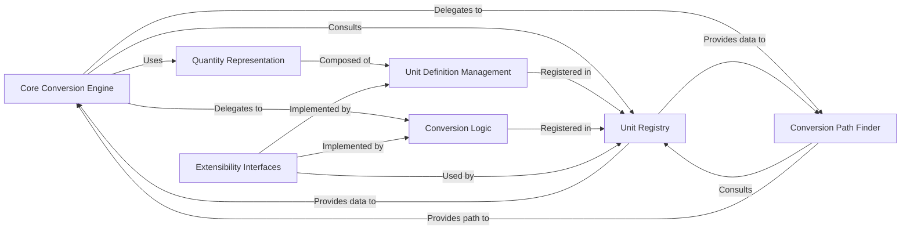

## Details

Project Type: Library/Component
Domain: Utility Library
Architectural Patterns: Object-Oriented Design (OOD), Strategy Pattern, Registry Pattern, Builder Pattern, Extensibility/Plugin Architecture

### Core Conversion Engine [[Expand]](./Core_Conversion_Engine.md)
This is the central orchestrator of the unit conversion process. It takes a quantity (value + unit), determines the necessary conversion path using the Conversion Path Finder, applies the appropriate Conversion Logic to produce the converted quantity, and leverages the Unit Registry for unit information. It may also include mechanisms for building complex conversion sequences.

**Related Classes/Methods**:

- `UnitConverter.UnitConverter` (1:1)

### Quantity Representation
Defines the fundamental data structure for representing a measurable quantity, encapsulating both a numerical value and its associated unit. This ensures consistent data handling throughout the conversion process.

**Related Classes/Methods**:

- `UnitConverter.Quantity` (1:1)

### Unit Definition Management [[Expand]](./Unit_Definition_Management.md)
Manages the properties and relationships of individual units (e.g., 'meter', 'foot', 'kilogram'). It defines how units are identified, their base units, and their dimensional characteristics, providing the foundational metadata for conversions.

**Related Classes/Methods**:

- `UnitConverter.Unit.UnitDefinition` (1:1)
- `UnitConverter.Unit.AbstractUnit` (1:1)

### Unit Registry
Acts as a central, searchable repository for all known `Unit Definition Management` instances and potentially registered `Conversion Logic` rules. It allows the `Core Conversion Engine` and `Conversion Path Finder` to efficiently look up unit properties and available conversion methods.

**Related Classes/Methods**:

- `UnitConverter.UnitRegistry` (1:1)

### Conversion Logic [[Expand]](./Conversion_Logic.md)
Encapsulates the specific mathematical algorithms and formulas required to convert a value from one unit to another. Each instance typically handles a direct conversion between two related units or a conversion to/from a base unit, adhering to the Strategy Pattern.

**Related Classes/Methods**:

- `UnitConverter.Conversion.ConverterInterface` (1:1)
- `UnitConverter.Conversion.BaseConverter` (1:1)
- `UnitConverter.Conversion.LengthConverter` (1:1)

### Conversion Path Finder
Responsible for determining the optimal sequence of `Conversion Logic` steps required to convert a `Quantity` from its initial unit to a target unit, especially when a direct conversion is not available. It leverages the `Unit Registry` to navigate relationships between units, embodying the Builder Pattern for complex sequences.

**Related Classes/Methods**:

- `UnitConverter.Path.ConversionPathFinder` (1:1)
- `UnitConverter.Path.ConversionPath` (1:1)

### Extensibility Interfaces
Defines the contracts (interfaces) that external developers must implement to introduce new units or custom conversion logic into the library without modifying its core. This promotes modularity and adherence to the Strategy and Plugin architectural patterns.

**Related Classes/Methods**:

- `UnitConverter.Interfaces.UnitInterface` (1:1)
- `UnitConverter.Interfaces.ConverterInterface` (1:1)
- `UnitConverter.Interfaces.RegistryInterface` (1:1)

### [FAQ](https://github.com/CodeBoarding/GeneratedOnBoardings/tree/main?tab=readme-ov-file#faq)