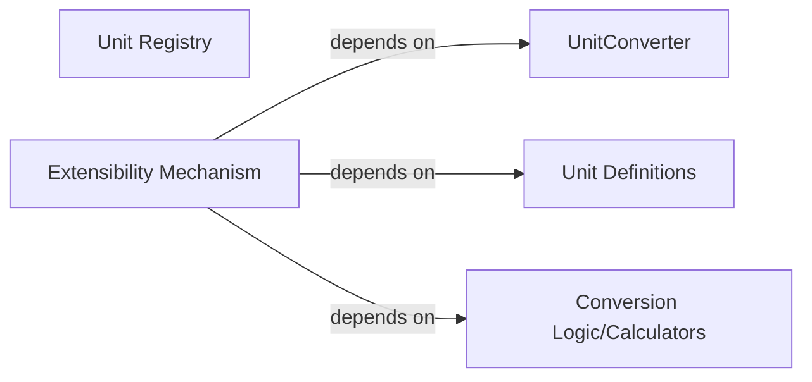

## Details

Abstract Components Overview of a unit conversion library.

### Unit Definitions
Manages the definition and properties of various units (e.g., meters, feet, kilograms, etc.).

**Related Classes/Methods**: _None_

### Conversion Logic/Calculators
Encapsulates the algorithms and rules for performing unit conversions between different units.

**Related Classes/Methods**: _None_

### Unit Registry
Acts as a central repository for registering and retrieving available units and their associated conversion rules.

**Related Classes/Methods**: _None_

### UnitConverter
The primary facade component that orchestrates the conversion process, utilizing the Unit Registry and Conversion Logic.

**Related Classes/Methods**: _None_

### Extensibility Mechanism [[Expand]](./Extensibility_Mechanism.md)
This component provides the necessary interfaces and abstract classes that allow users or developers to extend the library's capabilities. This includes defining new custom units, adding new conversion rules, or implementing entirely new conversion strategies. It ensures the library is adaptable and future-proof by establishing clear contracts for custom implementations.

**Related Classes/Methods**: _None_

### [FAQ](https://github.com/CodeBoarding/GeneratedOnBoardings/tree/main?tab=readme-ov-file#faq)