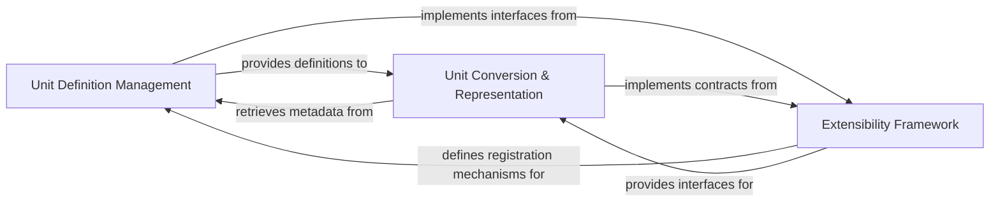

## Details

One paragraph explaining the functionality which is represented by this graph. What the main flow is and what is its purpose.

### Unit Definition Management [[Expand]](./Unit_Definition_Management.md)
This component acts as the central repository for defining, loading, and persistently storing all available units, their properties, and their relationships (e.g., base units, derived units). It implements the Registry Pattern, ensuring a single, consistent source of truth for unit metadata.

**Related Classes/Methods**:

- `UnitConverter.Unit.Registry` (1:1)

### Unit Conversion & Representation
This component encapsulates both the definition of an individual unit (its properties like name, symbol, and value) and the core logic for performing conversions from this unit to other units. It serves as the primary interface for initiating and executing unit transformations, leveraging the definitions provided by the Unit Definition Management component.

**Related Classes/Methods**:

- `UnitConverter.Unit.Unit` (1:1)

### Extensibility Framework
This component provides the necessary interfaces, abstract classes, and architectural patterns (such as Strategy or Builder) to allow users and developers to extend the library's capabilities. This includes adding new custom units, defining new conversion rules, or integrating with external unit sources without modifying the core library code.

**Related Classes/Methods**: _None_

### [FAQ](https://github.com/CodeBoarding/GeneratedOnBoardings/tree/main?tab=readme-ov-file#faq)