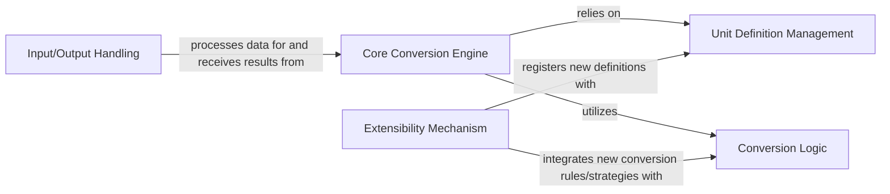

## Details

One paragraph explaining the functionality which is represented by this graph. What the main flow is and what is its purpose.

### Unit Definition Management [[Expand]](./Unit_Definition_Management.md)
This component is responsible for defining, loading, and persistently storing all available units, their properties, and their relationships (e.g., base units, derived units). It acts as the central repository for unit metadata.

**Related Classes/Methods**:

- `src/UnitConverter/Unit/Registry.php` (1:1)

### Conversion Logic [[Expand]](./Conversion_Logic.md)
Encapsulates the specific algorithms and mathematical rules required to convert values between different units. This component provides various strategies for conversion, such as linear transformations or offset-based conversions.

**Related Classes/Methods**:

- `src/UnitConverter/Calculator/BinaryCalculator.php` (1:1)

### Core Conversion Engine [[Expand]](./Core_Conversion_Engine.md)
This is the central orchestrator of the unit conversion process. It takes a quantity (value + unit), determines the necessary conversion path using the Unit Definition Management and applies the appropriate Conversion Logic to produce the converted quantity. It may also include mechanisms for building complex conversion sequences.

**Related Classes/Methods**:

- `src/UnitConverter/UnitConverter.php` (1:1)

### Extensibility Mechanism [[Expand]](./Extensibility_Mechanism.md)
Provides the necessary interfaces and abstract classes that allow users or developers to extend the library's capabilities. This includes defining new custom units, adding new conversion rules, or implementing entirely new conversion strategies. It ensures the library is adaptable and future-proof.

**Related Classes/Methods**:

- `src/UnitConverter/UnitConverterInterface.php` (1:1)

### Input/Output Handling
Manages the interaction with external data representations. This component is responsible for parsing input strings into structured Quantity objects that the Core Conversion Engine can process, and for formatting converted Quantity objects back into human-readable or machine-readable output strings.

**Related Classes/Methods**:

- `src/UnitConverter/Parser/DefaultParser.php` (1:1)
- `src/UnitConverter/Formatter/DefaultFormatter.php` (1:1)

### [FAQ](https://github.com/CodeBoarding/GeneratedOnBoardings/tree/main?tab=readme-ov-file#faq)