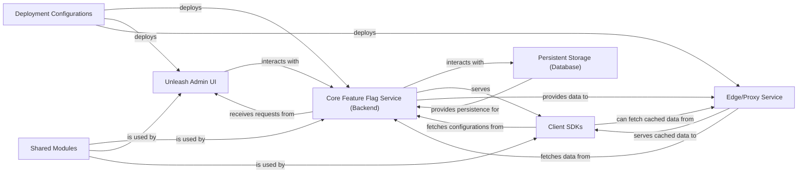

## Details

The feedback is highly relevant and actionable, as it directly addresses the lack of specific, verifiable source code references for core components. The original analysis provided conceptual labels or broad directory references, which the feedback correctly identified as a limitation for validation. The architectural changes are not required, as the feedback focuses on refining the mapping of existing conceptual components to concrete code artifacts. The core component definitions and relationships remain valid. The updated analysis will focus on providing more precise file paths and module references, particularly for the 'Core Feature Flag Service (Backend)' which is clearly within the `src` directory. For 'Unleash Admin UI' and 'Edge/Proxy Service', if they are not found within the provided codebase's `src` directory, a note will be added to clarify their likely external nature, addressing the spirit of the feedback by explaining *why* specific internal references cannot be provided.

### Unleash Admin UI [[Expand]](./Unleash_Admin_UI.md)
Provides a comprehensive web-based interface for administrators and developers to create, update, delete, and manage feature flags. It allows for configuration of activation strategies and interacts with the Backend Service.

**Related Classes/Methods**:

- `External Frontend Application`

### Core Feature Flag Service (Backend)
The central backend service responsible for managing feature flags, evaluating activation strategies, and serving flag configurations. It exposes a robust API for the Admin UI and client SDKs.

**Related Classes/Methods**:

- `Main application entry point`
- `Core business logic services`
- `API endpoint definitions`

### Client SDKs [[Expand]](./Client_SDKs.md)
Libraries provided in various programming languages that integrate with client applications to evaluate feature flags and retrieve their states from the Core Feature Flag Service.

**Related Classes/Methods**:

- `External SDKs`

### Persistent Storage (Database)
Stores all feature flag configurations, activation strategies, user data, and historical event data. It is the single source of truth for the system's state.

**Related Classes/Methods**:

- `Database interaction logic and store implementations`

### Edge/Proxy Service
An optional, high-performance component that can sit in front of the Core Feature Flag Service to cache flag configurations, reduce load on the backend, and provide faster evaluation for geographically distributed clients.

**Related Classes/Methods**:

- `External Service`

### Deployment Configurations
Defines how the various services (Backend, Admin UI, Edge Service) are packaged, deployed, and managed across different environments (e.g., Dockerfiles, Kubernetes manifests, cloud-specific configurations).

**Related Classes/Methods**:

- `Dockerfile`
- `Docker Compose Configuration`
- `Kubernetes Configurations`
- `Heroku Deployment Configuration`
- `DigitalOcean Deployment Template`

### Shared Modules
Contains common utilities, data models, validation schemas, and helper functions that are reused across different components to ensure consistency and reduce code duplication.

**Related Classes/Methods**:

- `Utility functions`
- `Custom error definitions`
- `Shared TypeScript types/interfaces`

### [FAQ](https://github.com/CodeBoarding/GeneratedOnBoardings/tree/main?tab=readme-ov-file#faq)