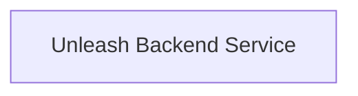

## Details

One paragraph explaining the functionality which is represented by this graph. What the main flow is and what is its purpose.

### Unleash Backend Service [[Expand]](./Unleash_Backend_Service.md)
The core service that handles backend logic for Unleash.

**Related Classes/Methods**: _None_

### [FAQ](https://github.com/CodeBoarding/GeneratedOnBoardings/tree/main?tab=readme-ov-file#faq)