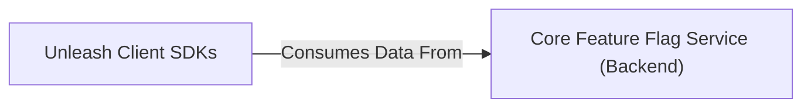

## Details

One paragraph explaining the functionality which is represented by this graph. What the main flow is and what is its purpose.

### Unleash Client SDKs [[Expand]](./Unleash_Client_SDKs.md)
A set of language-specific libraries (e.g., for Python, Java, Node.js, Go) designed to be embedded within diverse client applications. These SDKs are responsible for enabling applications to query and evaluate feature flags.

**Related Classes/Methods**: _None_

### Core Feature Flag Service (Backend)
The backend service that provides feature flag definitions and associated strategies to client SDKs.

**Related Classes/Methods**: _None_

### [FAQ](https://github.com/CodeBoarding/GeneratedOnBoardings/tree/main?tab=readme-ov-file#faq)