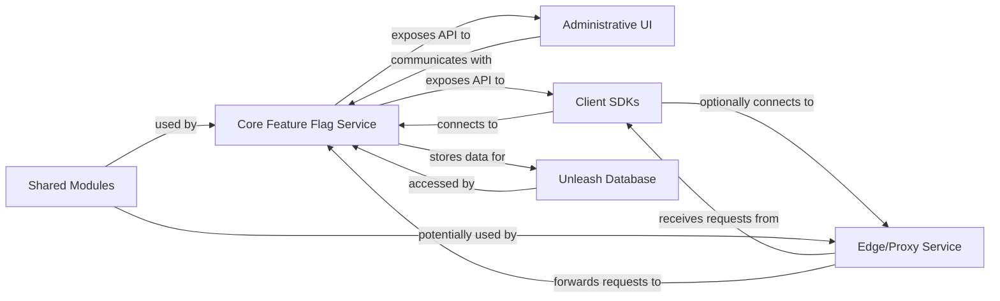

## Details

One paragraph explaining the functionality which is represented by this graph. What the main flow is and what is its purpose.

### Core Feature Flag Service
The central backend service responsible for managing, evaluating, and serving feature flags. It handles API requests from the Administrative UI and Client SDKs, applying business logic for flag evaluation and interacting with the database for persistence.

**Related Classes/Methods**: _None_

### Administrative UI
A web-based user interface that allows administrators to configure, manage, and monitor feature flags, users, and system settings. It provides a graphical interface for interacting with the Core Feature Flag Service.

**Related Classes/Methods**: _None_

### Client SDKs [[Expand]](./Client_SDKs.md)
Libraries provided in various programming languages (e.g., Java, Node.js, Python) that integrate into client applications. These SDKs communicate with the Core Feature Flag Service to fetch and evaluate feature flags, enabling dynamic feature toggling within client applications.

**Related Classes/Methods**: _None_

### Unleash Database [[Expand]](./Unleash_Database.md)
An external persistent data store, primarily used by the Core Feature Flag Service to store feature flag definitions, strategies, user data, and other configuration-related information.

**Related Classes/Methods**: _None_

### Edge/Proxy Service
An optional intermediary service that can sit in front of the Core Feature Flag Service. It might handle concerns like caching, rate limiting, load balancing, or routing requests from Client SDKs, improving performance and scalability.

**Related Classes/Methods**: _None_

### Shared Modules
A collection of common code, utilities, data models, interfaces, and configurations that are reused across multiple components (e.g., Core Feature Flag Service, Edge/Proxy Service). This promotes consistency, reduces redundancy, and simplifies maintenance.

**Related Classes/Methods**: _None_

### [FAQ](https://github.com/CodeBoarding/GeneratedOnBoardings/tree/main?tab=readme-ov-file#faq)