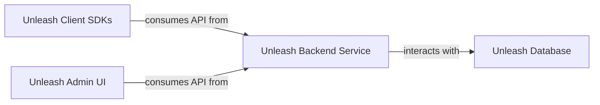

## Details

One paragraph explaining the functionality which is represented by this graph. What the main flow is and what is its purpose.

### Unleash Backend Service [[Expand]](./Unleash_Backend_Service.md)
This is the central component responsible for managing feature flag definitions, evaluating flag states based on various strategies, and providing a robust API for both client applications (via SDKs) and the administrative user interface. It handles persistence of feature flag data.

**Related Classes/Methods**:

- `src/lib/app.ts` (1:1)

### Unleash Admin UI [[Expand]](./Unleash_Admin_UI.md)
Provides a comprehensive web-based interface for administrators and developers to create, update, delete, and manage feature flags. It allows for configuration of activation strategies and interacts with the Backend Service.

**Related Classes/Methods**:

- `frontend/` (1:1)

### Unleash Client SDKs [[Expand]](./Unleash_Client_SDKs.md)
A collection of language-specific libraries that integrate into client applications to enable them to query and evaluate feature flags provided by the Unleash Backend Service.

**Related Classes/Methods**: _None_

### Unleash Database [[Expand]](./Unleash_Database.md)
An external database for data storage, primarily for feature flag definitions and related data, which the Unleash Backend Service interacts with.

**Related Classes/Methods**:

- `src/lib/db/` (1:1)

### [FAQ](https://github.com/CodeBoarding/GeneratedOnBoardings/tree/main?tab=readme-ov-file#faq)